# File Overview

This file contains unit tests for the incremental wiki generation functionality. It tests the models and helper methods used in determining whether wiki pages need to be regenerated based on changes in source files.

# Classes

## TestWikiPageStatus

Test class for the [WikiPageStatus](../src/local_deepwiki/models.md) model.

### Methods

- **test_create_page_status**: Tests creating a [WikiPageStatus](../src/local_deepwiki/models.md) instance with various attributes.

## TestWikiGenerationStatus

Test class for the [WikiGenerationStatus](../src/local_deepwiki/models.md) model.

### Methods

- **test_create_generation_status**: Tests creating a [WikiGenerationStatus](../src/local_deepwiki/models.md) instance with basic attributes.
- **test_generation_status_with_pages**: Tests generation status with page statuses (incomplete in provided code).

## TestWikiGeneratorHelpers

Test class for helper methods in the [WikiGenerator](../src/local_deepwiki/generators/wiki.md) class.

### Methods

- **mock_wiki_generator**: Creates a mock [WikiGenerator](../src/local_deepwiki/generators/wiki.md) instance for testing.
- **test_compute_content_hash**: Tests computing content hash for a page.
- **test_needs_regeneration_no_previous_status**: Tests regeneration needs when no previous status exists.
- **test_needs_regeneration_page_not_in_status**: Tests regeneration needs when page is not in previous status.
- **test_needs_regeneration_source_hash_changed**: Tests regeneration needs when source file hash has changed.
- **test_needs_regeneration_no_changes**: Tests regeneration needs when nothing has changed.
- **test_needs_regeneration_source_files_changed**: Tests regeneration needs when source files list has changed.
- **test_record_page_status**: Tests recording page status in the generator.

## TestWikiStatusPersistence

Test class for wiki status file persistence functionality.

### Methods

- **test_save_and_load_wiki_status**: Tests saving and loading wiki status to/from file.

## TestLoadExistingPage

Test class for loading existing wiki pages from disk.

### Methods

- **test_load_existing_page**: Tests loading an existing page from disk.

# Functions

## mock_wiki_generator

Creates and returns a mock [WikiGenerator](../src/local_deepwiki/generators/wiki.md) instance with predefined test data.

### Parameters

- None

### Returns

- A mock [WikiGenerator](../src/local_deepwiki/generators/wiki.md) instance with:
  - `wiki_path` set to `/tmp/test_wiki`
  - `_file_hashes` containing test file hashes
  - `_previous_status` set to None
  - `_page_statuses` as an empty dictionary

## test_compute_content_hash

Tests the content hash computation for a [WikiPage](../src/local_deepwiki/models.md).

### Parameters

- `mock_wiki_generator`: A mock [WikiGenerator](../src/local_deepwiki/generators/wiki.md) instance

### Returns

- None (asserts hash computation result)

## test_needs_regeneration_no_previous_status

Tests the `_needs_regeneration` method when no previous status exists.

### Parameters

- `mock_wiki_generator`: A mock [WikiGenerator](../src/local_deepwiki/generators/wiki.md) instance

### Returns

- None (asserts that regeneration is needed)

## test_needs_regeneration_page_not_in_status

Tests the `_needs_regeneration` method when a page is not in the previous status.

### Parameters

- `mock_wiki_generator`: A mock [WikiGenerator](../src/local_deepwiki/generators/wiki.md) instance

### Returns

- None (asserts that regeneration is needed)

## test_needs_regeneration_source_hash_changed

Tests the `_needs_regeneration` method when a source file hash has changed.

### Parameters

- `mock_wiki_generator`: A mock [WikiGenerator](../src/local_deepwiki/generators/wiki.md) instance

### Returns

- None (asserts that regeneration is needed)

## test_needs_regeneration_no_changes

Tests the `_needs_regeneration` method when nothing has changed.

### Parameters

- `mock_wiki_generator`: A mock [WikiGenerator](../src/local_deepwiki/generators/wiki.md) instance

### Returns

- None (asserts that regeneration is not needed)

## test_needs_regeneration_source_files_changed

Tests the `_needs_regeneration` method when source files list has changed.

### Parameters

- `mock_wiki_generator`: A mock [WikiGenerator](../src/local_deepwiki/generators/wiki.md) instance

### Returns

- None (asserts that regeneration is needed)

## test_record_page_status

Tests the `_record_page_status` method for recording page status.

### Parameters

- `mock_wiki_generator`: A mock [WikiGenerator](../src/local_deepwiki/generators/wiki.md) instance

### Returns

- None (asserts status recording and values)

## test_save_and_load_wiki_status

Tests saving and loading wiki status to/from file.

### Parameters

- `tmp_path`: A temporary path for testing

### Returns

- None (asserts status persistence)

## test_load_existing_page

Tests loading an existing page from disk.

### Parameters

- `tmp_path`: A temporary path for testing

### Returns

- None (asserts page loading and content)

# Usage Examples

## Testing WikiPageStatus Creation

```python
def test_create_page_status(self):
    status = WikiPageStatus(
        path="files/test.md",
        source_files=["src/test.py"],
        source_hashes={"src/test.py": "abc123"},
        content_hash="def456",
        generated_at=time.time(),
    )
    assert status.path == "files/test.md"
```

## Testing Generation Status with Pages

```python
def test_generation_status_with_pages(self):
    page_status = WikiPageStatus(
        path="index.md",
        source_files=["src/test.py"],
        source_hashes={"src/test.py": "current_hash"},
        content_hash="contenthash",
        generated_at=time.time(),
    )
    status = WikiGenerationStatus(
        repo_path="/path/to/repo",
        generated_at=time.time(),
        total_pages=5,
        index_status_hash="abc123",
        pages={"index.md": page_status},
    )
    assert "index.md" in status.pages
```

## Testing Page Status Recording

```python
def test_record_page_status(self, mock_wiki_generator):
    page = WikiPage(
        path="test.md",
        title="Test",
        content="# Test\nContent here",
        generated_at=time.time(),
    )
    mock_wiki_generator._record_page_status(page, ["src/test.py"])
    assert "test.md" in mock_wiki_generator._page_statuses
```

# Related Components

This file works with the following components:

- **[WikiGenerator](../src/local_deepwiki/generators/wiki.md)**: The [main](../src/local_deepwiki/web/app.md) class being tested for incremental wiki generation
- **[WikiPageStatus](../src/local_deepwiki/models.md)**: Model representing status of individual wiki pages
- **[WikiGenerationStatus](../src/local_deepwiki/models.md)**: Model representing overall wiki generation status
- **[WikiPage](../src/local_deepwiki/models.md)**: Model representing individual wiki pages
- **[FileInfo](../src/local_deepwiki/models.md)**: Model for file information
- **[IndexStatus](../src/local_deepwiki/models.md)**: Model for index status
- **[Language](../src/local_deepwiki/models.md)**: Enum for language definitions

The tests use mocks and patches to isolate the functionality being tested, particularly around file system operations and status management.

## API Reference

### class `TestWikiPageStatus`

Test [WikiPageStatus](../src/local_deepwiki/models.md) model.

**Methods:**

#### `test_create_page_status`

```python
def test_create_page_status()
```

Test creating a [WikiPageStatus](../src/local_deepwiki/models.md).

#### `test_page_status_multiple_sources`

```python
def test_page_status_multiple_sources()
```

Test page status with multiple source files.


### class `TestWikiGenerationStatus`

Test [WikiGenerationStatus](../src/local_deepwiki/models.md) model.

**Methods:**

#### `test_create_generation_status`

```python
def test_create_generation_status()
```

Test creating a [WikiGenerationStatus](../src/local_deepwiki/models.md).

#### `test_generation_status_with_pages`

```python
def test_generation_status_with_pages()
```

Test generation status with page statuses.


### class `TestWikiGeneratorHelpers`

Test [WikiGenerator](../src/local_deepwiki/generators/wiki.md) helper methods.

**Methods:**

#### `mock_wiki_generator`

```python
def mock_wiki_generator()
```

Create a mock [WikiGenerator](../src/local_deepwiki/generators/wiki.md).

#### `test_compute_content_hash`

```python
def test_compute_content_hash(mock_wiki_generator)
```

Test content hash computation.


| [Parameter](../src/local_deepwiki/generators/api_docs.md) | Type | Default | Description |
|-----------|------|---------|-------------|
| `mock_wiki_generator` | - | - | - |

#### `test_needs_regeneration_no_previous_status`

```python
def test_needs_regeneration_no_previous_status(mock_wiki_generator)
```

Test needs_regeneration when no previous status exists.


| [Parameter](../src/local_deepwiki/generators/api_docs.md) | Type | Default | Description |
|-----------|------|---------|-------------|
| `mock_wiki_generator` | - | - | - |

#### `test_needs_regeneration_page_not_in_status`

```python
def test_needs_regeneration_page_not_in_status(mock_wiki_generator)
```

Test needs_regeneration when page not in previous status.


| [Parameter](../src/local_deepwiki/generators/api_docs.md) | Type | Default | Description |
|-----------|------|---------|-------------|
| `mock_wiki_generator` | - | - | - |

#### `test_needs_regeneration_source_hash_changed`

```python
def test_needs_regeneration_source_hash_changed(mock_wiki_generator)
```

Test needs_regeneration when source file hash changed.


| [Parameter](../src/local_deepwiki/generators/api_docs.md) | Type | Default | Description |
|-----------|------|---------|-------------|
| `mock_wiki_generator` | - | - | - |

#### `test_needs_regeneration_no_changes`

```python
def test_needs_regeneration_no_changes(mock_wiki_generator)
```

Test needs_regeneration when nothing changed.


| [Parameter](../src/local_deepwiki/generators/api_docs.md) | Type | Default | Description |
|-----------|------|---------|-------------|
| `mock_wiki_generator` | - | - | - |

#### `test_needs_regeneration_source_files_changed`

```python
def test_needs_regeneration_source_files_changed(mock_wiki_generator)
```

Test needs_regeneration when source files list changed.


| [Parameter](../src/local_deepwiki/generators/api_docs.md) | Type | Default | Description |
|-----------|------|---------|-------------|
| `mock_wiki_generator` | - | - | - |

#### `test_record_page_status`

```python
def test_record_page_status(mock_wiki_generator)
```

Test recording page status.


| [Parameter](../src/local_deepwiki/generators/api_docs.md) | Type | Default | Description |
|-----------|------|---------|-------------|
| `mock_wiki_generator` | - | - | - |


### class `TestWikiStatusPersistence`

Test wiki status file persistence.

**Methods:**

#### `test_save_and_load_wiki_status`

```python
def test_save_and_load_wiki_status(tmp_path)
```

Test saving and loading wiki status.


| [Parameter](../src/local_deepwiki/generators/api_docs.md) | Type | Default | Description |
|-----------|------|---------|-------------|
| `tmp_path` | - | - | - |

#### `test_load_missing_status`

```python
def test_load_missing_status(tmp_path)
```

Test loading when status file doesn't exist.


| [Parameter](../src/local_deepwiki/generators/api_docs.md) | Type | Default | Description |
|-----------|------|---------|-------------|
| `tmp_path` | - | - | - |

#### `test_load_corrupted_status`

```python
def test_load_corrupted_status(tmp_path)
```

Test loading when status file is corrupted.


| [Parameter](../src/local_deepwiki/generators/api_docs.md) | Type | Default | Description |
|-----------|------|---------|-------------|
| `tmp_path` | - | - | - |


### class `TestLoadExistingPage`

Test loading existing wiki pages.

**Methods:**

#### `test_load_existing_page`

```python
def test_load_existing_page(tmp_path)
```

Test loading an existing page from disk.


| [Parameter](../src/local_deepwiki/generators/api_docs.md) | Type | Default | Description |
|-----------|------|---------|-------------|
| `tmp_path` | - | - | - |

#### `test_load_missing_page`

```python
def test_load_missing_page(tmp_path)
```

Test loading a page that doesn't exist.


| [Parameter](../src/local_deepwiki/generators/api_docs.md) | Type | Default | Description |
|-----------|------|---------|-------------|
| `tmp_path` | - | - | - |

#### `test_load_page_uses_previous_timestamp`

```python
def test_load_page_uses_previous_timestamp(tmp_path)
```

Test that loaded page uses timestamp from previous status.


| [Parameter](../src/local_deepwiki/generators/api_docs.md) | Type | Default | Description |
|-----------|------|---------|-------------|
| `tmp_path` | - | - | - |


## Class Diagram


## Call Graph

```mermaid
flowchart TD
    N0[Path]
    N1[TestLoadExistingPage.test_l...]
    N2[TestLoadExistingPage.test_l...]
    N3[TestLoadExistingPage.test_l...]
    N4[TestWikiGenerationStatus.te...]
    N5[TestWikiGenerationStatus.te...]
    N6[TestWikiGeneratorHelpers.mo...]
    N7[TestWikiGeneratorHelpers.te...]
    N8[TestWikiGeneratorHelpers.te...]
    N9[TestWikiGeneratorHelpers.te...]
    N10[TestWikiGeneratorHelpers.te...]
    N11[TestWikiGeneratorHelpers.te...]
    N12[TestWikiGeneratorHelpers.te...]
    N13[TestWikiGeneratorHelpers.te...]
    N14[TestWikiPageStatus.test_cre...]
    N15[TestWikiPageStatus.test_pag...]
    N16[TestWikiStatusPersistence.t...]
    N17[TestWikiStatusPersistence.t...]
    N18[TestWikiStatusPersistence.t...]
    N19[WikiGenerationStatus]
    N20[WikiPage]
    N21[WikiPageStatus]
    N22[__new__]
    N23[_compute_content_hash]
    N24[_load_existing_page]
    N25[_load_wiki_status]
    N26[_needs_regeneration]
    N27[object]
    N28[time]
    N29[write_text]
    N14 --> N21
    N14 --> N28
    N15 --> N21
    N15 --> N28
    N4 --> N19
    N4 --> N28
    N5 --> N21
    N5 --> N28
    N5 --> N19
    N6 --> N27
    N6 --> N22
    N6 --> N0
    N7 --> N23
    N9 --> N26
    N10 --> N19
    N10 --> N28
    N10 --> N26
    N12 --> N19
    N12 --> N28
    N12 --> N21
    N12 --> N26
    N8 --> N19
    N8 --> N28
    N8 --> N21
    N8 --> N26
    N11 --> N19
    N11 --> N28
    N11 --> N21
    N11 --> N26
    N13 --> N20
    N13 --> N28
    N18 --> N27
    N18 --> N22
    N18 --> N21
    N18 --> N28
    N18 --> N19
    N18 --> N25
    N17 --> N27
    N17 --> N22
    N17 --> N25
    N16 --> N27
    N16 --> N22
    N16 --> N29
    N16 --> N25
    N1 --> N27
    N1 --> N22
    N1 --> N29
    N1 --> N24
    N2 --> N27
    N2 --> N22
    N2 --> N24
    N3 --> N27
    N3 --> N22
    N3 --> N19
    N3 --> N28
    N3 --> N21
    N3 --> N29
    N3 --> N24
    classDef func fill:#e1f5fe
    class N0,N19,N20,N21,N22,N23,N24,N25,N26,N27,N28,N29 func
    classDef method fill:#fff3e0
    class N1,N2,N3,N4,N5,N6,N7,N8,N9,N10,N11,N12,N13,N14,N15,N16,N17,N18 method
```



## Relevant Source Files

- `tests/test_incremental_wiki.py`

## See Also

- [models](../src/local_deepwiki/models.md) - dependency
- [wiki](../src/local_deepwiki/generators/wiki.md) - dependency
