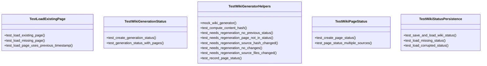

# File: tests/test_incremental_wiki.py

## File Overview

This file contains unit tests for the incremental wiki generation functionality. It tests the behavior of the [WikiGenerator](../src/local_deepwiki/generators/wiki.md) class when determining whether wiki pages need regeneration based on source file changes, and verifies the persistence of wiki status information.

The tests cover:
- Creation and validation of [WikiGenerationStatus](../src/local_deepwiki/models.md) and [WikiPageStatus](../src/local_deepwiki/models.md) models
- Logic for determining when wiki pages require regeneration
- Persistence of wiki status to and from disk
- Handling of existing wiki pages during generation

This file works with the [WikiGenerator](../src/local_deepwiki/generators/wiki.md), [WikiGenerationStatus](../src/local_deepwiki/models.md), and [WikiPageStatus](../src/local_deepwiki/models.md) classes to ensure that incremental wiki generation works correctly.

## Classes

### TestWikiPageStatus

Tests the [WikiPageStatus](../src/local_deepwiki/models.md) model.

**Methods:**
- `test_create_page_status`: Verifies creation and attribute assignment of [WikiPageStatus](../src/local_deepwiki/models.md) objects.

### TestWikiGenerationStatus

Tests the [WikiGenerationStatus](../src/local_deepwiki/models.md) model.

**Methods:**
- `test_create_generation_status`: Tests creation of a [WikiGenerationStatus](../src/local_deepwiki/models.md) with basic attributes.
- `test_generation_status_with_pages`: Tests generation status when page statuses are included (incomplete in provided code).

### TestWikiGeneratorHelpers

Tests helper methods in the [WikiGenerator](../src/local_deepwiki/generators/wiki.md) class related to incremental regeneration logic.

**Methods:**
- `mock_wiki_generator`: Creates a mock [WikiGenerator](../src/local_deepwiki/generators/wiki.md) instance for testing.
- `test_compute_content_hash`: Tests content hash computation for wiki pages.
- `test_needs_regeneration_no_previous_status`: Tests regeneration logic when no previous status exists.
- `test_needs_regeneration_page_not_in_status`: Tests regeneration logic when a page is not in the previous status.
- `test_needs_regeneration_source_hash_changed`: Tests regeneration logic when a source file's hash has changed.
- `test_needs_regeneration_no_changes`: Tests regeneration logic when nothing has changed.
- `test_needs_regeneration_source_files_changed`: Tests regeneration logic when source file lists have changed.
- `test_record_page_status`: Tests recording of page status information.

### TestWikiStatusPersistence

Tests persistence of wiki status information to and from disk.

**Methods:**
- `test_save_and_load_wiki_status`: Tests saving and loading wiki status from a file.

### TestLoadExistingPage

Tests loading existing wiki pages from disk during generation.

**Methods:**
- `test_load_existing_page`: Tests loading an existing page from disk.

## Functions

### mock_wiki_generator

Creates and returns a mock [WikiGenerator](../src/local_deepwiki/generators/wiki.md) instance with predefined test data.

**Parameters:**
- None

**Returns:**
- A mock [WikiGenerator](../src/local_deepwiki/generators/wiki.md) instance with:
  - `wiki_path` set to a temporary path
  - `_file_hashes` populated with test file hashes
  - `_previous_status` set to None
  - `_page_statuses` initialized as an empty dictionary

### test_compute_content_hash

Tests the content hash computation logic for wiki pages.

**Parameters:**
- None

**Returns:**
- None (asserts hash computation results)

### test_needs_regeneration_no_previous_status

Tests the regeneration logic when no previous status exists.

**Parameters:**
- mock_wiki_generator: A mock [WikiGenerator](../src/local_deepwiki/generators/wiki.md) instance

**Returns:**
- None (asserts that regeneration is needed)

### test_needs_regeneration_page_not_in_status

Tests the regeneration logic when a page is not present in the previous status.

**Parameters:**
- mock_wiki_generator: A mock [WikiGenerator](../src/local_deepwiki/generators/wiki.md) instance

**Returns:**
- None (asserts that regeneration is needed)

### test_needs_regeneration_source_hash_changed

Tests the regeneration logic when a source file's hash has changed.

**Parameters:**
- mock_wiki_generator: A mock [WikiGenerator](../src/local_deepwiki/generators/wiki.md) instance

**Returns:**
- None (asserts that regeneration is needed)

### test_needs_regeneration_no_changes

Tests the regeneration logic when nothing has changed.

**Parameters:**
- mock_wiki_generator: A mock [WikiGenerator](../src/local_deepwiki/generators/wiki.md) instance

**Returns:**
- None (asserts that regeneration is not needed)

### test_needs_regeneration_source_files_changed

Tests the regeneration logic when source file lists have changed.

**Parameters:**
- mock_wiki_generator: A mock [WikiGenerator](../src/local_deepwiki/generators/wiki.md) instance

**Returns:**
- None (asserts that regeneration is needed)

### test_record_page_status

Tests recording of page status information.

**Parameters:**
- mock_wiki_generator: A mock [WikiGenerator](../src/local_deepwiki/generators/wiki.md) instance

**Returns:**
- None (asserts that page status is recorded correctly)

### test_save_and_load_wiki_status

Tests saving and loading wiki status to and from disk.

**Parameters:**
- tmp_path: A temporary path for test files

**Returns:**
- None (asserts that status is saved and loaded correctly)

### test_load_existing_page

Tests loading an existing wiki page from disk.

**Parameters:**
- tmp_path: A temporary path for test files

**Returns:**
- None (asserts that existing page is loaded correctly)

## Usage Examples

### Testing Wiki Page Status Creation

```python
def test_create_page_status(self):
    status = WikiPageStatus(
        path="files/test.md",
        source_files=["src/test.py"],
        source_hashes={"src/test.py": "abc123"},
        content_hash="def456",
        generated_at=time.time(),
    )
    assert status.path == "files/test.md"
    assert status.source_files == ["src/test.py"]
    assert status.source_hashes["src/test.py"] == "abc123"
    assert status.content_hash == "def456"
```

### Testing Regeneration Logic

```python
def test_needs_regeneration_no_changes(self, mock_wiki_generator):
    mock_wiki_generator._previous_status = WikiGenerationStatus(
        repo_path="/repo",
        generated_at=time.time(),
        total_pages=1,
        pages={
            "index.md": WikiPageStatus(
                path="index.md",
                source_files=["src/test.py"],
                source_hashes={"src/test.py": "current_hash"},
                content_hash="contenthash",
                generated_at=time.time(),
            )
        },
    )
    result = mock_wiki_generator._needs_regeneration("index.md", ["src/test.py"])
    assert result is False  # No changes, no regeneration needed
```

### Testing Status Persistence

```python
def test_save_and_load_wiki_status(self, tmp_path):
    from local_deepwiki.generators.wiki import WikiGenerator

    with patch.object(WikiGenerator, "__init__", lambda x, *args, **kwargs: None):
        generator = WikiGenerator.__new__(WikiGenerator)
        generator.wiki_path = tmp_path

        # Create a status to save
        page_status = WikiPageStatus(
            path="index.md",
            source_files=["src/main.py"],
            source_hashes={"src/main.py": "hash123"},
            content_hash="content123",
            generated_at=time.time(),
        )
        generator._page_statuses = {"index.md": page_status}

        # Save status
        generator._save_wiki_status()

        # Load status
        loaded_status = generator._load_wiki_status()

        assert "index.md" in loaded_status.pages
        assert loaded_status.pages["index.md"].source_files == ["src/main.py"]
```

## Related Components

This file works with the [WikiGenerator](../src/local_deepwiki/generators/wiki.md) class to test incremental wiki generation logic. It also interacts with [WikiGenerationStatus](../src/local_deepwiki/models.md) and [WikiPageStatus](../src/local_deepwiki/models.md) models to validate status management and persistence. The tests use mocks to isolate the behavior of the [WikiGenerator](../src/local_deepwiki/generators/wiki.md) class and verify its regeneration logic without requiring full initialization of the generator or file system operations.

## API Reference

### class `TestWikiPageStatus`

Test [WikiPageStatus](../src/local_deepwiki/models.md) model.

**Methods:**

#### `test_create_page_status`

```python
def test_create_page_status()
```

Test creating a [WikiPageStatus](../src/local_deepwiki/models.md).

#### `test_page_status_multiple_sources`

```python
def test_page_status_multiple_sources()
```

Test page status with multiple source files.


### class `TestWikiGenerationStatus`

Test [WikiGenerationStatus](../src/local_deepwiki/models.md) model.

**Methods:**

#### `test_create_generation_status`

```python
def test_create_generation_status()
```

Test creating a [WikiGenerationStatus](../src/local_deepwiki/models.md).

#### `test_generation_status_with_pages`

```python
def test_generation_status_with_pages()
```

Test generation status with page statuses.


### class `TestWikiGeneratorHelpers`

Test [WikiGenerator](../src/local_deepwiki/generators/wiki.md) helper methods.

**Methods:**

#### `mock_wiki_generator`

```python
def mock_wiki_generator()
```

Create a mock [WikiGenerator](../src/local_deepwiki/generators/wiki.md).

#### `test_compute_content_hash`

```python
def test_compute_content_hash(mock_wiki_generator)
```

Test content hash computation.


| [Parameter](../src/local_deepwiki/generators/api_docs.md) | Type | Default | Description |
|-----------|------|---------|-------------|
| `mock_wiki_generator` | - | - | - |

#### `test_needs_regeneration_no_previous_status`

```python
def test_needs_regeneration_no_previous_status(mock_wiki_generator)
```

Test needs_regeneration when no previous status exists.


| [Parameter](../src/local_deepwiki/generators/api_docs.md) | Type | Default | Description |
|-----------|------|---------|-------------|
| `mock_wiki_generator` | - | - | - |

#### `test_needs_regeneration_page_not_in_status`

```python
def test_needs_regeneration_page_not_in_status(mock_wiki_generator)
```

Test needs_regeneration when page not in previous status.


| [Parameter](../src/local_deepwiki/generators/api_docs.md) | Type | Default | Description |
|-----------|------|---------|-------------|
| `mock_wiki_generator` | - | - | - |

#### `test_needs_regeneration_source_hash_changed`

```python
def test_needs_regeneration_source_hash_changed(mock_wiki_generator)
```

Test needs_regeneration when source file hash changed.


| [Parameter](../src/local_deepwiki/generators/api_docs.md) | Type | Default | Description |
|-----------|------|---------|-------------|
| `mock_wiki_generator` | - | - | - |

#### `test_needs_regeneration_no_changes`

```python
def test_needs_regeneration_no_changes(mock_wiki_generator)
```

Test needs_regeneration when nothing changed.


| [Parameter](../src/local_deepwiki/generators/api_docs.md) | Type | Default | Description |
|-----------|------|---------|-------------|
| `mock_wiki_generator` | - | - | - |

#### `test_needs_regeneration_source_files_changed`

```python
def test_needs_regeneration_source_files_changed(mock_wiki_generator)
```

Test needs_regeneration when source files list changed.


| [Parameter](../src/local_deepwiki/generators/api_docs.md) | Type | Default | Description |
|-----------|------|---------|-------------|
| `mock_wiki_generator` | - | - | - |

#### `test_record_page_status`

```python
def test_record_page_status(mock_wiki_generator)
```

Test recording page status.


| [Parameter](../src/local_deepwiki/generators/api_docs.md) | Type | Default | Description |
|-----------|------|---------|-------------|
| `mock_wiki_generator` | - | - | - |


### class `TestWikiStatusPersistence`

Test wiki status file persistence.

**Methods:**

#### `test_save_and_load_wiki_status`

```python
def test_save_and_load_wiki_status(tmp_path)
```

Test saving and loading wiki status.


| [Parameter](../src/local_deepwiki/generators/api_docs.md) | Type | Default | Description |
|-----------|------|---------|-------------|
| `tmp_path` | - | - | - |

#### `test_load_missing_status`

```python
def test_load_missing_status(tmp_path)
```

Test loading when status file doesn't exist.


| [Parameter](../src/local_deepwiki/generators/api_docs.md) | Type | Default | Description |
|-----------|------|---------|-------------|
| `tmp_path` | - | - | - |

#### `test_load_corrupted_status`

```python
def test_load_corrupted_status(tmp_path)
```

Test loading when status file is corrupted.


| [Parameter](../src/local_deepwiki/generators/api_docs.md) | Type | Default | Description |
|-----------|------|---------|-------------|
| `tmp_path` | - | - | - |


### class `TestLoadExistingPage`

Test loading existing wiki pages.

**Methods:**

#### `test_load_existing_page`

```python
def test_load_existing_page(tmp_path)
```

Test loading an existing page from disk.


| [Parameter](../src/local_deepwiki/generators/api_docs.md) | Type | Default | Description |
|-----------|------|---------|-------------|
| `tmp_path` | - | - | - |

#### `test_load_missing_page`

```python
def test_load_missing_page(tmp_path)
```

Test loading a page that doesn't exist.


| [Parameter](../src/local_deepwiki/generators/api_docs.md) | Type | Default | Description |
|-----------|------|---------|-------------|
| `tmp_path` | - | - | - |

#### `test_load_page_uses_previous_timestamp`

```python
def test_load_page_uses_previous_timestamp(tmp_path)
```

Test that loaded page uses timestamp from previous status.


| [Parameter](../src/local_deepwiki/generators/api_docs.md) | Type | Default | Description |
|-----------|------|---------|-------------|
| `tmp_path` | - | - | - |


## Class Diagram



## Call Graph

```mermaid
flowchart TD
    N0[Path]
    N1[TestLoadExistingPage.test_l...]
    N2[TestLoadExistingPage.test_l...]
    N3[TestLoadExistingPage.test_l...]
    N4[TestWikiGenerationStatus.te...]
    N5[TestWikiGenerationStatus.te...]
    N6[TestWikiGeneratorHelpers.mo...]
    N7[TestWikiGeneratorHelpers.te...]
    N8[TestWikiGeneratorHelpers.te...]
    N9[TestWikiGeneratorHelpers.te...]
    N10[TestWikiGeneratorHelpers.te...]
    N11[TestWikiGeneratorHelpers.te...]
    N12[TestWikiGeneratorHelpers.te...]
    N13[TestWikiGeneratorHelpers.te...]
    N14[TestWikiPageStatus.test_cre...]
    N15[TestWikiPageStatus.test_pag...]
    N16[TestWikiStatusPersistence.t...]
    N17[TestWikiStatusPersistence.t...]
    N18[TestWikiStatusPersistence.t...]
    N19[WikiGenerationStatus]
    N20[WikiPage]
    N21[WikiPageStatus]
    N22[__new__]
    N23[_compute_content_hash]
    N24[_load_existing_page]
    N25[_load_wiki_status]
    N26[_needs_regeneration]
    N27[object]
    N28[time]
    N29[write_text]
    N14 --> N21
    N14 --> N28
    N15 --> N21
    N15 --> N28
    N4 --> N19
    N4 --> N28
    N5 --> N21
    N5 --> N28
    N5 --> N19
    N6 --> N27
    N6 --> N22
    N6 --> N0
    N7 --> N23
    N9 --> N26
    N10 --> N19
    N10 --> N28
    N10 --> N26
    N12 --> N19
    N12 --> N28
    N12 --> N21
    N12 --> N26
    N8 --> N19
    N8 --> N28
    N8 --> N21
    N8 --> N26
    N11 --> N19
    N11 --> N28
    N11 --> N21
    N11 --> N26
    N13 --> N20
    N13 --> N28
    N18 --> N27
    N18 --> N22
    N18 --> N21
    N18 --> N28
    N18 --> N19
    N18 --> N25
    N17 --> N27
    N17 --> N22
    N17 --> N25
    N16 --> N27
    N16 --> N22
    N16 --> N29
    N16 --> N25
    N1 --> N27
    N1 --> N22
    N1 --> N29
    N1 --> N24
    N2 --> N27
    N2 --> N22
    N2 --> N24
    N3 --> N27
    N3 --> N22
    N3 --> N19
    N3 --> N28
    N3 --> N21
    N3 --> N29
    N3 --> N24
    classDef func fill:#e1f5fe
    class N0,N19,N20,N21,N22,N23,N24,N25,N26,N27,N28,N29 func
    classDef method fill:#fff3e0
    class N1,N2,N3,N4,N5,N6,N7,N8,N9,N10,N11,N12,N13,N14,N15,N16,N17,N18 method
```



## See Also

- [wiki](../src/local_deepwiki/generators/wiki.md) - dependency
- [models](../src/local_deepwiki/models.md) - dependency
- [indexer](../src/local_deepwiki/core/indexer.md) - shares 4 dependencies
- [test_search](test_search.md) - shares 4 dependencies
- [server](../src/local_deepwiki/server.md) - shares 4 dependencies
