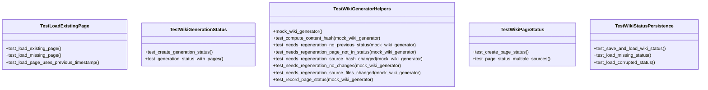

# test_incremental_wiki.py

## File Overview

This test file validates the incremental wiki generation functionality, focusing on tracking page generation status, detecting when pages need regeneration, and persisting wiki generation state. The tests cover the data models for tracking wiki generation status and the helper methods used by the [WikiGenerator](../src/local_deepwiki/generators/wiki.md) class to determine when pages should be regenerated.

## Classes

### TestWikiPageStatus

Tests the [WikiPageStatus](../src/local_deepwiki/models.md) model which tracks metadata for individual wiki pages.

**Key Methods:**
- `test_create_page_status()` - Validates creation of [WikiPageStatus](../src/local_deepwiki/models.md) instances with path, source files, source hashes, content hash, and generation timestamp

### TestWikiGenerationStatus  

Tests the [WikiGenerationStatus](../src/local_deepwiki/models.md) model which tracks the overall state of wiki generation.

**Key Methods:**
- `test_create_generation_status()` - Tests creating [WikiGenerationStatus](../src/local_deepwiki/models.md) with repository path, generation timestamp, total pages count, index status hash, and pages dictionary
- `test_generation_status_with_pages()` - Tests generation status that includes page status information

### TestWikiGeneratorHelpers

Tests helper methods of the [WikiGenerator](../src/local_deepwiki/generators/wiki.md) class related to incremental generation.

**Key Methods:**
- `mock_wiki_generator()` - Fixture that creates a mock [WikiGenerator](../src/local_deepwiki/generators/wiki.md) instance with predefined file hashes and empty previous status
- `test_compute_content_hash()` - Tests content hash computation functionality  
- `test_needs_regeneration_no_previous_status()` - Verifies that pages need regeneration when no previous status exists
- `test_needs_regeneration_page_not_in_status()` - Tests regeneration when a page is not in the previous status
- `test_needs_regeneration_source_hash_changed()` - Validates regeneration detection when source file hashes change
- `test_needs_regeneration_no_changes()` - Tests that pages don't need regeneration when nothing has changed
- `test_needs_regeneration_source_files_changed()` - Tests regeneration when the list of source files changes
- `test_record_page_status()` - Tests recording page status with source files and hashes

### TestWikiStatusPersistence

Tests saving and loading wiki generation status to/from disk.

**Key Methods:**
- `test_save_and_load_wiki_status()` - Tests the complete cycle of saving wiki status to disk and loading it back

### TestLoadExistingPage

Tests loading existing wiki pages from the filesystem.

**Key Methods:**
- `test_load_existing_page()` - Tests loading an existing markdown page from disk

## Functions

### mock_wiki_generator (fixture)

```python
def mock_wiki_generator(self):
```

Creates a mock [WikiGenerator](../src/local_deepwiki/generators/wiki.md) instance for testing with:
- Wiki path set to `/tmp/test_wiki`
- Predefined file hashes for `src/test.py` and `src/other.py`
- Empty previous status and page statuses

## Usage Examples

### Testing Page Status Creation

```python
status = WikiPageStatus(
    path="files/test.md",
    source_files=["src/test.py"],
    source_hashes={"src/test.py": "abc123"},
    content_hash="def456",
    generated_at=time.time(),
)
```

### Testing Generation Status

```python
status = WikiGenerationStatus(
    repo_path="/path/to/repo",
    generated_at=time.time(),
    total_pages=5,
    index_status_hash="abc123",
    pages={},
)
```

### Testing Regeneration Logic

```python
# Test when no previous status exists
result = mock_wiki_generator._needs_regeneration("index.md", ["src/test.py"])
assert result is True

# Test when source hash changed
mock_wiki_generator._previous_status = WikiGenerationStatus(...)
result = mock_wiki_generator._needs_regeneration("index.md", ["src/test.py"])
```

## Related Components

This test file works with several key components:

- **[WikiGenerator](../src/local_deepwiki/generators/wiki.md)** - The [main](../src/local_deepwiki/export/html.md) class being tested, imported from `local_deepwiki.generators.wiki`
- **[WikiPageStatus](../src/local_deepwiki/models.md)** - Model for tracking individual page generation status
- **[WikiGenerationStatus](../src/local_deepwiki/models.md)** - Model for tracking overall wiki generation state  
- **[WikiPage](../src/local_deepwiki/models.md)** - Model representing a generated wiki page
- **[FileInfo](../src/local_deepwiki/models.md)** - Model for file information
- **[IndexStatus](../src/local_deepwiki/models.md)** - Model for index status tracking
- **[Language](../src/local_deepwiki/models.md)** - Enumeration for programming languages

The tests use standard testing utilities including `pytest`, `unittest.mock`, and `pathlib` for file system operations.

## API Reference

### class `TestWikiPageStatus`

Test [WikiPageStatus](../src/local_deepwiki/models.md) model.

**Methods:**

#### `test_create_page_status`

```python
def test_create_page_status()
```

Test creating a [WikiPageStatus](../src/local_deepwiki/models.md).

#### `test_page_status_multiple_sources`

```python
def test_page_status_multiple_sources()
```

Test page status with multiple source files.


### class `TestWikiGenerationStatus`

Test [WikiGenerationStatus](../src/local_deepwiki/models.md) model.

**Methods:**

#### `test_create_generation_status`

```python
def test_create_generation_status()
```

Test creating a [WikiGenerationStatus](../src/local_deepwiki/models.md).

#### `test_generation_status_with_pages`

```python
def test_generation_status_with_pages()
```

Test generation status with page statuses.


### class `TestWikiGeneratorHelpers`

Test [WikiGenerator](../src/local_deepwiki/generators/wiki.md) helper methods.

**Methods:**

#### `mock_wiki_generator`

```python
def mock_wiki_generator()
```

Create a mock [WikiGenerator](../src/local_deepwiki/generators/wiki.md).

#### `test_compute_content_hash`

```python
def test_compute_content_hash(mock_wiki_generator)
```

Test content hash computation.


| [Parameter](../src/local_deepwiki/generators/api_docs.md) | Type | Default | Description |
|-----------|------|---------|-------------|
| `mock_wiki_generator` | - | - | - |

#### `test_needs_regeneration_no_previous_status`

```python
def test_needs_regeneration_no_previous_status(mock_wiki_generator)
```

Test needs_regeneration when no previous status exists.


| [Parameter](../src/local_deepwiki/generators/api_docs.md) | Type | Default | Description |
|-----------|------|---------|-------------|
| `mock_wiki_generator` | - | - | - |

#### `test_needs_regeneration_page_not_in_status`

```python
def test_needs_regeneration_page_not_in_status(mock_wiki_generator)
```

Test needs_regeneration when page not in previous status.


| [Parameter](../src/local_deepwiki/generators/api_docs.md) | Type | Default | Description |
|-----------|------|---------|-------------|
| `mock_wiki_generator` | - | - | - |

#### `test_needs_regeneration_source_hash_changed`

```python
def test_needs_regeneration_source_hash_changed(mock_wiki_generator)
```

Test needs_regeneration when source file hash changed.


| [Parameter](../src/local_deepwiki/generators/api_docs.md) | Type | Default | Description |
|-----------|------|---------|-------------|
| `mock_wiki_generator` | - | - | - |

#### `test_needs_regeneration_no_changes`

```python
def test_needs_regeneration_no_changes(mock_wiki_generator)
```

Test needs_regeneration when nothing changed.


| [Parameter](../src/local_deepwiki/generators/api_docs.md) | Type | Default | Description |
|-----------|------|---------|-------------|
| `mock_wiki_generator` | - | - | - |

#### `test_needs_regeneration_source_files_changed`

```python
def test_needs_regeneration_source_files_changed(mock_wiki_generator)
```

Test needs_regeneration when source files list changed.


| [Parameter](../src/local_deepwiki/generators/api_docs.md) | Type | Default | Description |
|-----------|------|---------|-------------|
| `mock_wiki_generator` | - | - | - |

#### `test_record_page_status`

```python
def test_record_page_status(mock_wiki_generator)
```

Test recording page status.


| [Parameter](../src/local_deepwiki/generators/api_docs.md) | Type | Default | Description |
|-----------|------|---------|-------------|
| `mock_wiki_generator` | - | - | - |


### class `TestWikiStatusPersistence`

Test wiki status file persistence.

**Methods:**

#### `test_save_and_load_wiki_status`

```python
async def test_save_and_load_wiki_status(tmp_path)
```

Test saving and loading wiki status.


| [Parameter](../src/local_deepwiki/generators/api_docs.md) | Type | Default | Description |
|-----------|------|---------|-------------|
| `tmp_path` | - | - | - |

#### `test_load_missing_status`

```python
async def test_load_missing_status(tmp_path)
```

Test loading when status file doesn't exist.


| [Parameter](../src/local_deepwiki/generators/api_docs.md) | Type | Default | Description |
|-----------|------|---------|-------------|
| `tmp_path` | - | - | - |

#### `test_load_corrupted_status`

```python
async def test_load_corrupted_status(tmp_path)
```

Test loading when status file is corrupted.


| [Parameter](../src/local_deepwiki/generators/api_docs.md) | Type | Default | Description |
|-----------|------|---------|-------------|
| `tmp_path` | - | - | - |


### class `TestLoadExistingPage`

Test loading existing wiki pages.

**Methods:**

#### `test_load_existing_page`

```python
async def test_load_existing_page(tmp_path)
```

Test loading an existing page from disk.


| [Parameter](../src/local_deepwiki/generators/api_docs.md) | Type | Default | Description |
|-----------|------|---------|-------------|
| `tmp_path` | - | - | - |

#### `test_load_missing_page`

```python
async def test_load_missing_page(tmp_path)
```

Test loading a page that doesn't exist.


| [Parameter](../src/local_deepwiki/generators/api_docs.md) | Type | Default | Description |
|-----------|------|---------|-------------|
| `tmp_path` | - | - | - |

#### `test_load_page_uses_previous_timestamp`

```python
async def test_load_page_uses_previous_timestamp(tmp_path)
```

Test that loaded page uses timestamp from previous status.


| [Parameter](../src/local_deepwiki/generators/api_docs.md) | Type | Default | Description |
|-----------|------|---------|-------------|
| `tmp_path` | - | - | - |


## Class Diagram



## Call Graph


## Relevant Source Files

- `tests/test_incremental_wiki.py:20-47`

## See Also

- [models](../src/local_deepwiki/models.md) - dependency
- [wiki](../src/local_deepwiki/generators/wiki.md) - dependency
- [test_indexer](test_indexer.md) - shares 5 dependencies
- [test_pdf_export](test_pdf_export.md) - shares 4 dependencies
- [test_search](test_search.md) - shares 4 dependencies
