# Test Indexer Module Documentation

## File Overview

The `test_indexer.py` file contains comprehensive test suites for the repository indexer functionality. It focuses on testing chunking configuration, batched processing operations, and schema migration capabilities of the [RepositoryIndexer](../src/local_deepwiki/core/indexer.md) system.

## Test Classes

### TestChunkingConfigBatchSize

This test class validates the batch size configuration functionality for chunking operations. Based on the imports and class name, it tests how [ChunkingConfig](../src/local_deepwiki/config.md) handles batch size settings.

### TestBatchedProcessing

The TestBatchedProcessing class tests the batched processing capabilities of the indexer system. It includes the following test methods:

- **test_processes_chunks_in_batches**: Validates that chunks are processed in appropriately sized batches
- **test_incremental_update_with_batching**: Tests incremental updates using batched operations
- **test_empty_batch_handling**: Ensures proper handling of empty batch scenarios

The class uses mock objects including:
- `mock_create_or_update_table`: Mocks table creation/update operations
- `mock_add_chunks`: Mocks chunk addition operations  
- `mock_delete_chunks_by_file`: Mocks file-based chunk deletion

### TestBatchSizeConfiguration

This test class focuses on validating batch size configuration settings and their impact on processing behavior.

### TestSchemaMigration

The TestSchemaMigration class provides comprehensive testing for database schema migration functionality. It includes the following test methods:

- **test_current_schema_version_exists**: Verifies that the current schema version constant is properly defined
- **test_needs_migration_old_version**: Tests migration detection for older schema versions
- **test_needs_migration_current_version**: Validates that current versions don't trigger unnecessary migrations
- **test_migrate_status_updates_version**: Ensures the migration process correctly updates version numbers
- **test_migrate_status_preserves_data**: Verifies that existing data is preserved during migration
- **test_load_status_handles_legacy_files**: Tests loading of legacy status files without schema versions
- **test_save_status_includes_schema_version**: Validates that saved status includes proper schema version
- **test_migration_triggered_on_load**: Tests automatic migration triggering during status loading

## Test Functions

### test_index_status_model_default_schema_version

```python
async def test_index_status_model_default_schema_version(self):
    """Test that IndexStatus defaults to schema_version=1."""
    status = IndexStatus(
        repo_path="/test",
        indexed_at=1.0,
        total_files=0,
        total_chunks=0,
    )
    assert status.schema_version == 1
```

This async test function validates that the [IndexStatus](../src/local_deepwiki/models.md) model correctly defaults to schema version 1 when created with basic parameters.

**Parameters**: None (self reference only)
**Returns**: None (assertion-based test)

## Usage Examples

### Testing IndexStatus Creation

```python
# Create an IndexStatus instance for testing
status = IndexStatus(
    repo_path="/test",
    indexed_at=1.0,
    total_files=0,
    total_chunks=0,
)
# Verify default schema version
assert status.schema_version == 1
```

### Running Schema Migration Tests

The test classes can be executed using pytest to validate migration functionality:

```python
# Example of how the test class structure supports pytest execution
class TestSchemaMigration:
    async def test_needs_migration_old_version(self):
        # Test implementation validates migration detection
        pass
```

## Related Components

This test file works with several core components from the local_deepwiki system:

- **[Config](../src/local_deepwiki/config.md) and [ChunkingConfig](../src/local_deepwiki/config.md)**: Configuration classes that manage indexing parameters
- **[RepositoryIndexer](../src/local_deepwiki/core/indexer.md)**: The [main](../src/local_deepwiki/export/html.md) indexer class being tested
- **[IndexStatus](../src/local_deepwiki/models.md)**: Model representing the current indexing status
- **[CodeChunk](../src/local_deepwiki/models.md)**: Model representing individual code chunks
- **[Language](../src/local_deepwiki/models.md) and [ChunkType](../src/local_deepwiki/models.md)**: Enumeration types for code classification
- **Migration functions**: `_migrate_status` and `_needs_migration` utility functions
- **CURRENT_SCHEMA_VERSION**: Constant defining the current schema version

The tests use standard Python testing libraries including pytest for test execution, unittest.mock for mocking dependencies, and tempfile/pathlib for file system operations during testing.

## API Reference

### class `TestChunkingConfigBatchSize`

Tests for batch_size configuration.

**Methods:**

#### `test_default_batch_size`

```python
def test_default_batch_size()
```

Test that default batch size is 500.

#### `test_custom_batch_size`

```python
def test_custom_batch_size()
```

Test that batch size can be customized.


### class `TestBatchedProcessing`

Tests for batched chunk processing in the indexer.

**Methods:**

#### `test_processes_chunks_in_batches`

```python
async def test_processes_chunks_in_batches(tmp_path)
```

Test that chunks are processed in batches to limit memory usage.


| [Parameter](../src/local_deepwiki/generators/api_docs.md) | Type | Default | Description |
|-----------|------|---------|-------------|
| `tmp_path` | - | - | - |

#### `mock_create_or_update_table`

```python
async def mock_create_or_update_table(chunks)
```


| [Parameter](../src/local_deepwiki/generators/api_docs.md) | Type | Default | Description |
|-----------|------|---------|-------------|
| `chunks` | - | - | - |

#### `mock_add_chunks`

```python
async def mock_add_chunks(chunks)
```


| [Parameter](../src/local_deepwiki/generators/api_docs.md) | Type | Default | Description |
|-----------|------|---------|-------------|
| `chunks` | - | - | - |

#### `mock_delete_chunks_by_file`

```python
async def mock_delete_chunks_by_file(file_path)
```


| [Parameter](../src/local_deepwiki/generators/api_docs.md) | Type | Default | Description |
|-----------|------|---------|-------------|
| `file_path` | - | - | - |

#### `test_incremental_update_with_batching`

```python
async def test_incremental_update_with_batching(tmp_path)
```

Test that incremental updates work with batched processing.


| [Parameter](../src/local_deepwiki/generators/api_docs.md) | Type | Default | Description |
|-----------|------|---------|-------------|
| `tmp_path` | - | - | - |

#### `mock_add_chunks`

```python
async def mock_add_chunks(chunks)
```


| [Parameter](../src/local_deepwiki/generators/api_docs.md) | Type | Default | Description |
|-----------|------|---------|-------------|
| `chunks` | - | - | - |

#### `mock_delete_chunks_by_file`

```python
async def mock_delete_chunks_by_file(file_path)
```


| [Parameter](../src/local_deepwiki/generators/api_docs.md) | Type | Default | Description |
|-----------|------|---------|-------------|
| `file_path` | - | - | - |

#### `mock_create_or_update_table`

```python
async def mock_create_or_update_table(chunks)
```


| [Parameter](../src/local_deepwiki/generators/api_docs.md) | Type | Default | Description |
|-----------|------|---------|-------------|
| `chunks` | - | - | - |

#### `test_empty_batch_handling`

```python
async def test_empty_batch_handling(tmp_path)
```

Test that empty repositories are handled correctly.


| [Parameter](../src/local_deepwiki/generators/api_docs.md) | Type | Default | Description |
|-----------|------|---------|-------------|
| `tmp_path` | - | - | - |


### class `TestBatchSizeConfiguration`

Tests for batch size in config.

**Methods:**

#### `test_batch_size_in_full_config`

```python
def test_batch_size_in_full_config()
```

Test that batch size is accessible in full config.

#### `test_batch_size_validation`

```python
def test_batch_size_validation()
```

Test that batch size accepts positive integers.


### class `TestSchemaMigration`

Tests for schema version migration.

**Methods:**

#### `test_current_schema_version_exists`

```python
def test_current_schema_version_exists()
```

Test that CURRENT_SCHEMA_VERSION is defined.

#### `test_needs_migration_old_version`

```python
def test_needs_migration_old_version()
```

Test that old schema versions need migration.

#### `test_needs_migration_current_version`

```python
def test_needs_migration_current_version()
```

Test that current schema version doesn't need migration.

#### `test_migrate_status_updates_version`

```python
def test_migrate_status_updates_version()
```

Test that migration updates the schema version.

#### `test_migrate_status_preserves_data`

```python
def test_migrate_status_preserves_data()
```

Test that migration preserves existing data.

#### `test_load_status_handles_legacy_files`

```python
async def test_load_status_handles_legacy_files(tmp_path)
```

Test that loading status handles legacy files without schema_version.


| [Parameter](../src/local_deepwiki/generators/api_docs.md) | Type | Default | Description |
|-----------|------|---------|-------------|
| `tmp_path` | - | - | - |

#### `test_save_status_includes_schema_version`

```python
async def test_save_status_includes_schema_version(tmp_path)
```

Test that saved status includes the current schema version.


| [Parameter](../src/local_deepwiki/generators/api_docs.md) | Type | Default | Description |
|-----------|------|---------|-------------|
| `tmp_path` | - | - | - |

#### `test_index_status_model_default_schema_version`

```python
async def test_index_status_model_default_schema_version()
```

Test that [IndexStatus](../src/local_deepwiki/models.md) defaults to schema_version=1.

#### `test_migration_triggered_on_load`

```python
async def test_migration_triggered_on_load(tmp_path)
```

Test that migration is triggered when loading old schema version.


| [Parameter](../src/local_deepwiki/generators/api_docs.md) | Type | Default | Description |
|-----------|------|---------|-------------|
| `tmp_path` | - | - | - |


## Class Diagram


## Call Graph

```mermaid
flowchart TD
    N0[AsyncMock]
    N1[ChunkingConfig]
    N2[Config]
    N3[IndexStatus]
    N4[MagicMock]
    N5[RepositoryIndexer]
    N6[TestBatchSizeConfiguration....]
    N7[TestBatchSizeConfiguration....]
    N8[TestBatchedProcessing.test_...]
    N9[TestBatchedProcessing.test_...]
    N10[TestBatchedProcessing.test_...]
    N11[TestChunkingConfigBatchSize...]
    N12[TestChunkingConfigBatchSize...]
    N13[TestSchemaMigration.test_in...]
    N14[TestSchemaMigration.test_lo...]
    N15[TestSchemaMigration.test_mi...]
    N16[TestSchemaMigration.test_mi...]
    N17[TestSchemaMigration.test_mi...]
    N18[TestSchemaMigration.test_ne...]
    N19[TestSchemaMigration.test_ne...]
    N20[TestSchemaMigration.test_sa...]
    N21[_load_status]
    N22[_migrate_status]
    N23[_needs_migration]
    N24[dumps]
    N25[load]
    N26[mkdir]
    N27[patch]
    N28[write_text]
    N12 --> N1
    N11 --> N1
    N10 --> N26
    N10 --> N28
    N10 --> N2
    N10 --> N27
    N10 --> N4
    N10 --> N0
    N10 --> N5
    N9 --> N26
    N9 --> N28
    N9 --> N2
    N9 --> N27
    N9 --> N4
    N9 --> N0
    N9 --> N5
    N8 --> N26
    N8 --> N2
    N8 --> N27
    N8 --> N4
    N8 --> N0
    N8 --> N5
    N6 --> N2
    N7 --> N1
    N19 --> N3
    N19 --> N23
    N18 --> N3
    N18 --> N23
    N16 --> N3
    N16 --> N22
    N15 --> N3
    N15 --> N22
    N14 --> N26
    N14 --> N2
    N14 --> N27
    N14 --> N4
    N14 --> N5
    N14 --> N28
    N14 --> N24
    N14 --> N21
    N20 --> N26
    N20 --> N28
    N20 --> N2
    N20 --> N27
    N20 --> N4
    N20 --> N0
    N20 --> N5
    N20 --> N25
    N13 --> N3
    N17 --> N26
    N17 --> N2
    N17 --> N27
    N17 --> N4
    N17 --> N5
    N17 --> N28
    N17 --> N24
    N17 --> N21
    N17 --> N25
    classDef func fill:#e1f5fe
    class N0,N1,N2,N3,N4,N5,N21,N22,N23,N24,N25,N26,N27,N28 func
    classDef method fill:#fff3e0
    class N6,N7,N8,N9,N10,N11,N12,N13,N14,N15,N16,N17,N18,N19,N20 method
```



## Relevant Source Files

- `tests/test_indexer.py:20-31`

## See Also

- [models](../src/local_deepwiki/models.md) - dependency
- [config](../src/local_deepwiki/config.md) - dependency
- [test_search](test_search.md) - shares 5 dependencies
- [test_incremental_wiki](test_incremental_wiki.md) - shares 5 dependencies
- [test_parser](test_parser.md) - shares 4 dependencies
