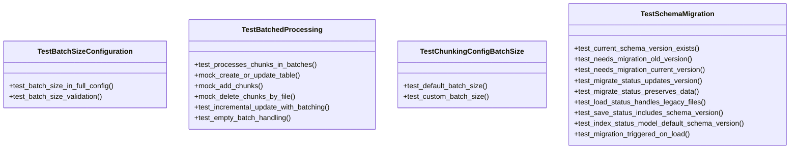

# File Overview

This file, `tests/test_indexer.py`, contains unit tests for the `RepositoryIndexer` class and related functionality in the `local_deepwiki.core.indexer` module. It tests batched processing of code chunks, schema version handling, and migration logic for index status data.

# Classes

## TestBatchedProcessing

This class contains tests for the batched processing functionality of the indexer, ensuring that chunks are correctly processed in batches and that incremental updates work as expected.

### Methods

#### test_processes_chunks_in_batches
Tests that chunks are correctly processed in batches.

#### test_incremental_update_with_batching
Tests incremental update functionality with batching enabled.

#### test_empty_batch_handling
Tests handling of empty batches during processing.

## TestSchemaMigration

This class contains tests for schema migration logic, ensuring that index status data can be properly migrated between schema versions.

### Methods

#### test_current_schema_version_exists
Verifies that the current schema version constant is defined correctly.

#### test_needs_migration_old_version
Tests that migration is triggered for old schema versions.

#### test_needs_migration_current_version
Tests that migration is not triggered for current schema versions.

#### test_migrate_status_updates_version
Tests that migration updates the schema version correctly.

#### test_migrate_status_preserves_data
Tests that migration preserves existing data.

#### test_load_status_handles_legacy_files
Tests that loading status handles legacy files correctly.

#### test_save_status_includes_schema_version
Tests that saving status includes the schema version.

#### test_index_status_model_default_schema_version
Tests that the IndexStatus model defaults to schema_version=1.

#### test_migration_triggered_on_load
Tests that migration is triggered when loading legacy status files.

# Functions

## _migrate_status

Migrates an IndexStatus object to the current schema version.

### Parameters
- `status` (IndexStatus): The status object to migrate.

### Returns
- `tuple`: A tuple containing the migrated status and a boolean indicating if migration occurred.

## _needs_migration

Determines if an IndexStatus object needs migration to the current schema version.

### Parameters
- `status` (IndexStatus): The status object to check.

### Returns
- `bool`: True if migration is needed, False otherwise.

# Usage Examples

## Testing Batched Processing

```python
# Test that chunks are processed in batches
def test_processes_chunks_in_batches():
    # This test would mock the relevant methods and verify batch behavior
    pass
```

## Testing Schema Migration

```python
# Test that migration preserves existing data
def test_migrate_status_preserves_data():
    status = IndexStatus(
        repo_path="/test/repo",
        indexed_at=1234567890.0,
        total_files=10,
        total_chunks=100,
        languages={"python": 8, "javascript": 2},
        schema_version=1,
    )
    migrated, _ = _migrate_status(status)
    
    assert migrated.repo_path == "/test/repo"
    assert migrated.indexed_at == 1234567890.0
    assert migrated.total_files == 10
    assert migrated.total_chunks == 100
```

# Related Components

This file works with the following components:

- `RepositoryIndexer` from `local_deepwiki.core.indexer`
- `IndexStatus` from `local_deepwiki.models`
- [`ChunkingConfig`](../src/local_deepwiki/config.md) from `local_deepwiki.config`
- `CodeChunk` from `local_deepwiki.models`
- `Language` from `local_deepwiki.models`
- `ChunkType` from `local_deepwiki.models`

## API Reference

### class `TestChunkingConfigBatchSize`

Tests for batch_size configuration.

**Methods:**

#### `test_default_batch_size`

```python
def test_default_batch_size()
```

Test that default batch size is 500.

#### `test_custom_batch_size`

```python
def test_custom_batch_size()
```

Test that batch size can be customized.


### class `TestBatchedProcessing`

Tests for batched chunk processing in the indexer.

**Methods:**

#### `test_processes_chunks_in_batches`

```python
async def test_processes_chunks_in_batches(tmp_path)
```

Test that chunks are processed in batches to limit memory usage.


| [Parameter](../src/local_deepwiki/generators/api_docs.md) | Type | Default | Description |
|-----------|------|---------|-------------|
| `tmp_path` | - | - | - |

#### `mock_create_or_update_table`

```python
async def mock_create_or_update_table(chunks)
```


| [Parameter](../src/local_deepwiki/generators/api_docs.md) | Type | Default | Description |
|-----------|------|---------|-------------|
| `chunks` | - | - | - |

#### `mock_add_chunks`

```python
async def mock_add_chunks(chunks)
```


| [Parameter](../src/local_deepwiki/generators/api_docs.md) | Type | Default | Description |
|-----------|------|---------|-------------|
| `chunks` | - | - | - |

#### `mock_delete_chunks_by_file`

```python
async def mock_delete_chunks_by_file(file_path)
```


| [Parameter](../src/local_deepwiki/generators/api_docs.md) | Type | Default | Description |
|-----------|------|---------|-------------|
| `file_path` | - | - | - |

#### `test_incremental_update_with_batching`

```python
async def test_incremental_update_with_batching(tmp_path)
```

Test that incremental updates work with batched processing.


| [Parameter](../src/local_deepwiki/generators/api_docs.md) | Type | Default | Description |
|-----------|------|---------|-------------|
| `tmp_path` | - | - | - |

#### `mock_add_chunks`

```python
async def mock_add_chunks(chunks)
```


| [Parameter](../src/local_deepwiki/generators/api_docs.md) | Type | Default | Description |
|-----------|------|---------|-------------|
| `chunks` | - | - | - |

#### `mock_delete_chunks_by_file`

```python
async def mock_delete_chunks_by_file(file_path)
```


| [Parameter](../src/local_deepwiki/generators/api_docs.md) | Type | Default | Description |
|-----------|------|---------|-------------|
| `file_path` | - | - | - |

#### `mock_create_or_update_table`

```python
async def mock_create_or_update_table(chunks)
```


| [Parameter](../src/local_deepwiki/generators/api_docs.md) | Type | Default | Description |
|-----------|------|---------|-------------|
| `chunks` | - | - | - |

#### `test_empty_batch_handling`

```python
async def test_empty_batch_handling(tmp_path)
```

Test that empty repositories are handled correctly.


| [Parameter](../src/local_deepwiki/generators/api_docs.md) | Type | Default | Description |
|-----------|------|---------|-------------|
| `tmp_path` | - | - | - |


### class `TestBatchSizeConfiguration`

Tests for batch size in config.

**Methods:**

#### `test_batch_size_in_full_config`

```python
def test_batch_size_in_full_config()
```

Test that batch size is accessible in full config.

#### `test_batch_size_validation`

```python
def test_batch_size_validation()
```

Test that batch size accepts positive integers.


### class `TestSchemaMigration`

Tests for schema version migration.

**Methods:**

#### `test_current_schema_version_exists`

```python
def test_current_schema_version_exists()
```

Test that CURRENT_SCHEMA_VERSION is defined.

#### `test_needs_migration_old_version`

```python
def test_needs_migration_old_version()
```

Test that old schema versions need migration.

#### `test_needs_migration_current_version`

```python
def test_needs_migration_current_version()
```

Test that current schema version doesn't need migration.

#### `test_migrate_status_updates_version`

```python
def test_migrate_status_updates_version()
```

Test that migration updates the schema version.

#### `test_migrate_status_preserves_data`

```python
def test_migrate_status_preserves_data()
```

Test that migration preserves existing data.

#### `test_load_status_handles_legacy_files`

```python
async def test_load_status_handles_legacy_files(tmp_path)
```

Test that loading status handles legacy files without schema_version.


| [Parameter](../src/local_deepwiki/generators/api_docs.md) | Type | Default | Description |
|-----------|------|---------|-------------|
| `tmp_path` | - | - | - |

#### `test_save_status_includes_schema_version`

```python
async def test_save_status_includes_schema_version(tmp_path)
```

Test that saved status includes the current schema version.


| [Parameter](../src/local_deepwiki/generators/api_docs.md) | Type | Default | Description |
|-----------|------|---------|-------------|
| `tmp_path` | - | - | - |

#### `test_index_status_model_default_schema_version`

```python
async def test_index_status_model_default_schema_version()
```

Test that IndexStatus defaults to schema_version=1.

#### `test_migration_triggered_on_load`

```python
async def test_migration_triggered_on_load(tmp_path)
```

Test that migration is triggered when loading old schema version.


| [Parameter](../src/local_deepwiki/generators/api_docs.md) | Type | Default | Description |
|-----------|------|---------|-------------|
| `tmp_path` | - | - | - |


## Class Diagram



## Call Graph


## Relevant Source Files

- `tests/test_indexer.py:20-31`

## See Also

- [config](../src/local_deepwiki/config.md) - dependency
- [server](../src/local_deepwiki/server.md) - shares 5 dependencies
- [test_incremental_wiki](test_incremental_wiki.md) - shares 5 dependencies
