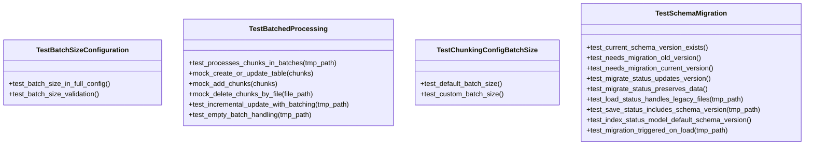

# test_indexer.py

## File Overview

This test file contains comprehensive unit tests for the indexer functionality in the local_deepwiki system. It focuses on testing batched processing capabilities, schema migration features, and the RepositoryIndexer class behavior.

## Test Classes

### TestChunkingConfigBatchSize

Tests configuration aspects related to batch size settings for chunking operations.

### TestBatchedProcessing

Tests the batched processing functionality of the indexer system. This class verifies that chunks are processed in batches correctly and handles various batch-related scenarios.

**Key Test Methods:**
- `test_processes_chunks_in_batches` - Verifies chunks are processed in appropriate batch sizes
- `test_incremental_update_with_batching` - Tests incremental updates with batch processing
- `test_empty_batch_handling` - Ensures proper handling of empty batches

**Mock Methods:**
- `mock_create_or_update_table` - Mocks table creation/update operations
- `mock_add_chunks` - Mocks chunk addition operations
- `mock_delete_chunks_by_file` - Mocks file-based chunk deletion

### TestBatchSizeConfiguration

Tests configuration settings specifically related to batch size parameters.

### TestSchemaMigration

Comprehensive test class for schema migration functionality, ensuring backward compatibility and proper version handling.

**Key Test Methods:**
- `test_current_schema_version_exists` - Verifies the current schema version constant exists
- `test_needs_migration_old_version` - Tests migration detection for older versions
- `test_needs_migration_current_version` - Tests migration detection for current version
- `test_migrate_status_updates_version` - Verifies status migration updates version correctly
- `test_migrate_status_preserves_data` - Ensures data preservation during migration
- `test_load_status_handles_legacy_files` - Tests loading of legacy status files
- `test_save_status_includes_schema_version` - Verifies schema version inclusion in saved status
- `test_migration_triggered_on_load` - Tests automatic migration triggering on load

## Test Functions

### test_index_status_model_default_schema_version

```python
async def test_index_status_model_default_schema_version(self):
    """Test that IndexStatus defaults to schema_version=1."""
    status = IndexStatus(
        repo_path="/test",
        indexed_at=1.0,
        total_files=0,
        total_chunks=0,
    )
    assert status.schema_version == 1
```

Tests that the IndexStatus model correctly defaults to schema version 1 when created with basic parameters.

## Usage Examples

### Testing Schema Migration

```python
# Create an IndexStatus instance with default schema version
status = IndexStatus(
    repo_path="/test",
    indexed_at=1.0,
    total_files=0,
    total_chunks=0,
)
# Verify default schema version
assert status.schema_version == 1
```

### Testing with Mocks

The test file extensively uses unittest.mock components:

```python
from unittest.mock import AsyncMock, MagicMock, patch
```

These mocks are used to isolate functionality and test specific behaviors without dependencies on external systems.

## Related Components

This test file works with several core components:

- **RepositoryIndexer** - The [main](../src/local_deepwiki/web/app.md) indexer class being tested
- **IndexStatus** - Model for tracking indexing status and schema versions
- **CodeChunk** - Model representing code chunks
- **[ChunkingConfig](../src/local_deepwiki/config.md)** and **[Config](../src/local_deepwiki/config.md)** - Configuration classes
- **Language** and **ChunkType** - Enumeration types for code classification

The tests also reference migration utilities:
- `_migrate_status` - Function for migrating status data
- `_needs_migration` - Function for determining if migration is needed
- `CURRENT_SCHEMA_VERSION` - Constant defining the current schema version

## Test Dependencies

The tests use:
- `pytest` for the testing framework
- `tempfile` and `pathlib.Path` for file system operations
- `json` for data serialization
- `unittest.mock` for mocking external dependencies

## API Reference

### class `TestChunkingConfigBatchSize`

Tests for batch_size configuration.

**Methods:**

#### `test_default_batch_size`

```python
def test_default_batch_size()
```

Test that default batch size is 500.

#### `test_custom_batch_size`

```python
def test_custom_batch_size()
```

Test that batch size can be customized.


### class `TestBatchedProcessing`

Tests for batched chunk processing in the indexer.

**Methods:**

#### `test_processes_chunks_in_batches`

```python
async def test_processes_chunks_in_batches(tmp_path)
```

Test that chunks are processed in batches to limit memory usage.


| Parameter | Type | Default | Description |
|-----------|------|---------|-------------|
| `tmp_path` | - | - | - |

#### `mock_create_or_update_table`

```python
async def mock_create_or_update_table(chunks)
```


| Parameter | Type | Default | Description |
|-----------|------|---------|-------------|
| `chunks` | - | - | - |

#### `mock_add_chunks`

```python
async def mock_add_chunks(chunks)
```


| Parameter | Type | Default | Description |
|-----------|------|---------|-------------|
| `chunks` | - | - | - |

#### `mock_delete_chunks_by_file`

```python
async def mock_delete_chunks_by_file(file_path)
```


| Parameter | Type | Default | Description |
|-----------|------|---------|-------------|
| `file_path` | - | - | - |

#### `test_incremental_update_with_batching`

```python
async def test_incremental_update_with_batching(tmp_path)
```

Test that incremental updates work with batched processing.


| Parameter | Type | Default | Description |
|-----------|------|---------|-------------|
| `tmp_path` | - | - | - |

#### `mock_add_chunks`

```python
async def mock_add_chunks(chunks)
```


| Parameter | Type | Default | Description |
|-----------|------|---------|-------------|
| `chunks` | - | - | - |

#### `mock_delete_chunks_by_file`

```python
async def mock_delete_chunks_by_file(file_path)
```


| Parameter | Type | Default | Description |
|-----------|------|---------|-------------|
| `file_path` | - | - | - |

#### `mock_create_or_update_table`

```python
async def mock_create_or_update_table(chunks)
```


| Parameter | Type | Default | Description |
|-----------|------|---------|-------------|
| `chunks` | - | - | - |

#### `test_empty_batch_handling`

```python
async def test_empty_batch_handling(tmp_path)
```

Test that empty repositories are handled correctly.


| Parameter | Type | Default | Description |
|-----------|------|---------|-------------|
| `tmp_path` | - | - | - |


### class `TestBatchSizeConfiguration`

Tests for batch size in config.

**Methods:**

#### `test_batch_size_in_full_config`

```python
def test_batch_size_in_full_config()
```

Test that batch size is accessible in full config.

#### `test_batch_size_validation`

```python
def test_batch_size_validation()
```

Test that batch size accepts positive integers.


### class `TestSchemaMigration`

Tests for schema version migration.

**Methods:**

#### `test_current_schema_version_exists`

```python
def test_current_schema_version_exists()
```

Test that CURRENT_SCHEMA_VERSION is defined.

#### `test_needs_migration_old_version`

```python
def test_needs_migration_old_version()
```

Test that old schema versions need migration.

#### `test_needs_migration_current_version`

```python
def test_needs_migration_current_version()
```

Test that current schema version doesn't need migration.

#### `test_migrate_status_updates_version`

```python
def test_migrate_status_updates_version()
```

Test that migration updates the schema version.

#### `test_migrate_status_preserves_data`

```python
def test_migrate_status_preserves_data()
```

Test that migration preserves existing data.

#### `test_load_status_handles_legacy_files`

```python
async def test_load_status_handles_legacy_files(tmp_path)
```

Test that loading status handles legacy files without schema_version.


| Parameter | Type | Default | Description |
|-----------|------|---------|-------------|
| `tmp_path` | - | - | - |

#### `test_save_status_includes_schema_version`

```python
async def test_save_status_includes_schema_version(tmp_path)
```

Test that saved status includes the current schema version.


| Parameter | Type | Default | Description |
|-----------|------|---------|-------------|
| `tmp_path` | - | - | - |

#### `test_index_status_model_default_schema_version`

```python
async def test_index_status_model_default_schema_version()
```

Test that IndexStatus defaults to schema_version=1.

#### `test_migration_triggered_on_load`

```python
async def test_migration_triggered_on_load(tmp_path)
```

Test that migration is triggered when loading old schema version.


| Parameter | Type | Default | Description |
|-----------|------|---------|-------------|
| `tmp_path` | - | - | - |


## Class Diagram



## Call Graph


## Relevant Source Files

- [`tests/test_indexer.py:20-31`](https://github.com/UrbanDiver/local-deepwiki-mcp/blob/main/tests/test_indexer.py#L20-L31)

## See Also

- [test_parser](test_parser.md) - shares 4 dependencies
