# test_llm_cache.py

## File Overview

This file contains comprehensive test suites for the LLM caching functionality, testing both the core [LLMCache](../src/local_deepwiki/core/llm_cache.md) class and the [CachingLLMProvider](../src/local_deepwiki/providers/llm/cached.md) [wrapper](../src/local_deepwiki/providers/base.md). It verifies cache behavior including storage, retrieval, temperature-based caching rules, and cache statistics.

## Classes

### MockEmbeddingProvider

A mock implementation of an embedding provider used for testing purposes.

### MockLLMProvider

A mock implementation of an LLM provider used for testing the [CachingLLMProvider](../src/local_deepwiki/providers/llm/cached.md) functionality.

### TestLLMCache

Main test class for testing the [LLMCache](../src/local_deepwiki/core/llm_cache.md) functionality directly.

**Key Test Methods:**
- `test_cache_miss_on_empty_cache` - Verifies that empty cache returns None and increments miss counter
- `test_cache_set_and_get_exact_match` - Tests storing and retrieving exact prompt matches
- `test_high_temperature_not_cached` - Ensures high temperature requests are not cached
- `test_high_temperature_get_skipped` - Verifies high temperature requests skip cache lookup
- `test_different_system_prompts_different_cache_entries` - Tests that different system prompts create separate cache entries
- `test_clear_cache` - Tests cache clearing functionality
- `test_cache_stats` - Verifies cache statistics tracking

**Fixtures:**
- `cache_path` - Creates temporary cache path for testing
- `config` - Provides default [LLMCacheConfig](../src/local_deepwiki/config.md) for tests
- `cache` - Creates [LLMCache](../src/local_deepwiki/core/llm_cache.md) instance with test configuration

### TestCachingLLMProvider

Test class for the [CachingLLMProvider](../src/local_deepwiki/providers/llm/cached.md) [wrapper](../src/local_deepwiki/providers/base.md) that adds caching capabilities to any LLM provider.

**Key Test Methods:**
- `test_name_includes_cache_prefix` - Verifies provider name includes "cached:" prefix
- `test_first_call_goes_to_provider` - Tests that initial calls go to underlying provider
- `test_second_call_uses_cache` - Verifies subsequent identical calls use cache
- `test_high_temperature_bypasses_cache` - Ensures high temperature requests bypass cache
- `test_stats_accessible` - Tests cache statistics accessibility
- `test_stream_first_call_caches` - Tests streaming response caching
- `test_different_prompts_different_cache_entries` - Verifies different prompts create separate entries

**Fixtures:**
- `cache_path` - Creates temporary cache path
- `mock_llm` - Provides MockLLMProvider instance
- `cache` - Creates [LLMCache](../src/local_deepwiki/core/llm_cache.md) with predefined configuration
- `cached_provider` - Creates [CachingLLMProvider](../src/local_deepwiki/providers/llm/cached.md) wrapping mock LLM

### TestLLMCacheConfig

Test class for LLM cache configuration validation and behavior.

## Key Functions

### cache_path (TestLLMCache)

```python
def cache_path(self, tmp_path: Path) -> Path:
```

Creates a temporary cache path for testing.

**Parameters:**
- `tmp_path` - Pytest temporary path fixture

**Returns:**
- `Path` - Path to test cache file

### config

```python
def config(self) -> LLMCacheConfig:
```

Creates a cache configuration with default test settings.

**Returns:**
- [`LLMCacheConfig`](../src/local_deepwiki/config.md) - Configuration with enabled=True, ttl_seconds=3600, max_entries=1000, similarity_threshold=0.95, max_cacheable_temperature=0.3

### cache (TestLLMCache)

```python
def cache(self, cache_path: Path, embedding_provider: MockEmbeddingProvider, config: LLMCacheConfig) -> LLMCache:
```

Creates an [LLMCache](../src/local_deepwiki/core/llm_cache.md) instance for testing.

**Parameters:**
- `cache_path` - Path for cache storage
- `embedding_provider` - Mock embedding provider
- `config` - Cache configuration

**Returns:**
- [`LLMCache`](../src/local_deepwiki/core/llm_cache.md) - Configured cache instance

### cached_provider

```python
def cached_provider(self, mock_llm: MockLLMProvider, cache: LLMCache) -> CachingLLMProvider:
```

Creates a [CachingLLMProvider](../src/local_deepwiki/providers/llm/cached.md) instance for testing.

**Parameters:**
- `mock_llm` - Mock LLM provider to wrap
- `cache` - Cache instance to use

**Returns:**
- [`CachingLLMProvider`](../src/local_deepwiki/providers/llm/cached.md) - Caching [wrapper](../src/local_deepwiki/providers/base.md) around the mock provider

## Usage Examples

### Testing Cache Behavior

```python
# Test cache miss
result = await cache.get(
    prompt="test prompt",
    system_prompt="test system",
    temperature=0.1,
    model_name="test-model",
)
assert result is None

# Test cache set and get
await cache.set(
    prompt=prompt,
    response=response,
    system_prompt=system_prompt,
    temperature=0.1,
    model_name="test-model",
)
```

### Testing Cached Provider

```python
# Create cached provider
cached_provider = CachingLLMProvider(mock_llm, cache)

# Verify name includes cache prefix
assert cached_provider.name == "cached:mock-llm"
```

## Related Components

This test file works with several core components:

- **[LLMCache](../src/local_deepwiki/core/llm_cache.md)** - The [main](../src/local_deepwiki/export/html.md) caching implementation being tested
- **[CachingLLMProvider](../src/local_deepwiki/providers/llm/cached.md)** - Wrapper that adds caching to any LLM provider
- **[LLMCacheConfig](../src/local_deepwiki/config.md)** - Configuration class for cache settings
- **[LLMProvider](../src/local_deepwiki/providers/base.md)** - Base provider interface that cached providers implement

The tests use mocking extensively through `unittest.mock` to isolate the caching functionality from actual LLM and embedding provider implementations.

## API Reference

### class `MockEmbeddingProvider`

Mock embedding provider for testing.

**Methods:**

#### `__init__`

```python
def __init__(dimension: int = 384)
```


| [Parameter](../src/local_deepwiki/generators/api_docs.md) | Type | Default | Description |
|-----------|------|---------|-------------|
| `dimension` | `int` | `384` | - |

#### `embed`

```python
async def embed(texts: list[str]) -> list[list[float]]
```

Return deterministic embeddings based on text hash.


| [Parameter](../src/local_deepwiki/generators/api_docs.md) | Type | Default | Description |
|-----------|------|---------|-------------|
| `texts` | `list[str]` | - | - |

#### `get_dimension`

```python
def get_dimension() -> int
```

#### `name`

```python
def name() -> str
```


### class `MockLLMProvider`

**Inherits from:** [`LLMProvider`](../src/local_deepwiki/providers/base.md)

Mock LLM provider for testing.

**Methods:**

#### `__init__`

```python
def __init__()
```

#### `generate`

```python
async def generate(prompt: str, system_prompt: str | None = None, max_tokens: int = 4096, temperature: float = 0.7) -> str
```


| [Parameter](../src/local_deepwiki/generators/api_docs.md) | Type | Default | Description |
|-----------|------|---------|-------------|
| `prompt` | `str` | - | - |
| `system_prompt` | `str | None` | `None` | - |
| `max_tokens` | `int` | `4096` | - |
| `temperature` | `float` | `0.7` | - |

#### `generate_stream`

```python
async def generate_stream(prompt: str, system_prompt: str | None = None, max_tokens: int = 4096, temperature: float = 0.7)
```


| [Parameter](../src/local_deepwiki/generators/api_docs.md) | Type | Default | Description |
|-----------|------|---------|-------------|
| `prompt` | `str` | - | - |
| `system_prompt` | `str | None` | `None` | - |
| `max_tokens` | `int` | `4096` | - |
| `temperature` | `float` | `0.7` | - |

#### `name`

```python
def name() -> str
```


### class `TestLLMCache`

Tests for the [LLMCache](../src/local_deepwiki/core/llm_cache.md) class.

**Methods:**

#### `cache_path`

```python
def cache_path(tmp_path: Path) -> Path
```

Create a temporary cache path.


| [Parameter](../src/local_deepwiki/generators/api_docs.md) | Type | Default | Description |
|-----------|------|---------|-------------|
| `tmp_path` | `Path` | - | - |

#### `embedding_provider`

```python
def embedding_provider() -> MockEmbeddingProvider
```

Create a mock embedding provider.

#### `config`

```python
def config() -> LLMCacheConfig
```

Create a cache config with default settings.

#### `cache`

```python
def cache(cache_path: Path, embedding_provider: MockEmbeddingProvider, config: LLMCacheConfig) -> LLMCache
```

Create an [LLMCache](../src/local_deepwiki/core/llm_cache.md) instance.


| [Parameter](../src/local_deepwiki/generators/api_docs.md) | Type | Default | Description |
|-----------|------|---------|-------------|
| `cache_path` | `Path` | - | - |
| `embedding_provider` | `MockEmbeddingProvider` | - | - |
| `config` | [`LLMCacheConfig`](../src/local_deepwiki/config.md) | - | - |

#### `test_cache_miss_on_empty_cache`

```python
async def test_cache_miss_on_empty_cache(cache: LLMCache)
```

Test that empty cache returns None.


| [Parameter](../src/local_deepwiki/generators/api_docs.md) | Type | Default | Description |
|-----------|------|---------|-------------|
| `cache` | [`LLMCache`](../src/local_deepwiki/core/llm_cache.md) | - | - |

#### `test_cache_set_and_get_exact_match`

```python
async def test_cache_set_and_get_exact_match(cache: LLMCache)
```

Test that exact same prompt returns cached response.


| [Parameter](../src/local_deepwiki/generators/api_docs.md) | Type | Default | Description |
|-----------|------|---------|-------------|
| `cache` | [`LLMCache`](../src/local_deepwiki/core/llm_cache.md) | - | - |

#### `test_high_temperature_not_cached`

```python
async def test_high_temperature_not_cached(cache: LLMCache)
```

Test that high temperature responses are not cached.


| [Parameter](../src/local_deepwiki/generators/api_docs.md) | Type | Default | Description |
|-----------|------|---------|-------------|
| `cache` | [`LLMCache`](../src/local_deepwiki/core/llm_cache.md) | - | - |

#### `test_high_temperature_get_skipped`

```python
async def test_high_temperature_get_skipped(cache: LLMCache)
```

Test that cache lookup is skipped for high temperature requests.


| [Parameter](../src/local_deepwiki/generators/api_docs.md) | Type | Default | Description |
|-----------|------|---------|-------------|
| `cache` | [`LLMCache`](../src/local_deepwiki/core/llm_cache.md) | - | - |

#### `test_different_system_prompts_different_cache_entries`

```python
async def test_different_system_prompts_different_cache_entries(cache: LLMCache)
```

Test that different system prompts result in different cache entries.


| [Parameter](../src/local_deepwiki/generators/api_docs.md) | Type | Default | Description |
|-----------|------|---------|-------------|
| `cache` | [`LLMCache`](../src/local_deepwiki/core/llm_cache.md) | - | - |

#### `test_clear_cache`

```python
async def test_clear_cache(cache: LLMCache)
```

Test clearing the cache.


| [Parameter](../src/local_deepwiki/generators/api_docs.md) | Type | Default | Description |
|-----------|------|---------|-------------|
| `cache` | [`LLMCache`](../src/local_deepwiki/core/llm_cache.md) | - | - |

#### `test_cache_stats`

```python
async def test_cache_stats(cache: LLMCache)
```

Test that cache statistics are tracked correctly.


| [Parameter](../src/local_deepwiki/generators/api_docs.md) | Type | Default | Description |
|-----------|------|---------|-------------|
| `cache` | [`LLMCache`](../src/local_deepwiki/core/llm_cache.md) | - | - |


### class `TestCachingLLMProvider`

Tests for the [CachingLLMProvider](../src/local_deepwiki/providers/llm/cached.md) class.

**Methods:**

#### `cache_path`

```python
def cache_path(tmp_path: Path) -> Path
```

Create a temporary cache path.


| [Parameter](../src/local_deepwiki/generators/api_docs.md) | Type | Default | Description |
|-----------|------|---------|-------------|
| `tmp_path` | `Path` | - | - |

#### `mock_llm`

```python
def mock_llm() -> MockLLMProvider
```

Create a mock LLM provider.

#### `cache`

```python
def cache(cache_path: Path) -> LLMCache
```

Create an [LLMCache](../src/local_deepwiki/core/llm_cache.md) instance.


| [Parameter](../src/local_deepwiki/generators/api_docs.md) | Type | Default | Description |
|-----------|------|---------|-------------|
| `cache_path` | `Path` | - | - |

#### `cached_provider`

```python
def cached_provider(mock_llm: MockLLMProvider, cache: LLMCache) -> CachingLLMProvider
```

Create a [CachingLLMProvider](../src/local_deepwiki/providers/llm/cached.md) instance.


| [Parameter](../src/local_deepwiki/generators/api_docs.md) | Type | Default | Description |
|-----------|------|---------|-------------|
| `mock_llm` | `MockLLMProvider` | - | - |
| `cache` | [`LLMCache`](../src/local_deepwiki/core/llm_cache.md) | - | - |

#### `test_name_includes_cache_prefix`

```python
def test_name_includes_cache_prefix(cached_provider: CachingLLMProvider)
```

Test that provider name includes cache prefix.


| [Parameter](../src/local_deepwiki/generators/api_docs.md) | Type | Default | Description |
|-----------|------|---------|-------------|
| `cached_provider` | [`CachingLLMProvider`](../src/local_deepwiki/providers/llm/cached.md) | - | - |

#### `test_first_call_goes_to_provider`

```python
async def test_first_call_goes_to_provider(cached_provider: CachingLLMProvider, mock_llm: MockLLMProvider)
```

Test that first call goes to underlying provider.


| [Parameter](../src/local_deepwiki/generators/api_docs.md) | Type | Default | Description |
|-----------|------|---------|-------------|
| `cached_provider` | [`CachingLLMProvider`](../src/local_deepwiki/providers/llm/cached.md) | - | - |
| `mock_llm` | `MockLLMProvider` | - | - |

#### `test_second_call_uses_cache`

```python
async def test_second_call_uses_cache(cached_provider: CachingLLMProvider, mock_llm: MockLLMProvider)
```

Test that second identical call uses cache.


| [Parameter](../src/local_deepwiki/generators/api_docs.md) | Type | Default | Description |
|-----------|------|---------|-------------|
| `cached_provider` | [`CachingLLMProvider`](../src/local_deepwiki/providers/llm/cached.md) | - | - |
| `mock_llm` | `MockLLMProvider` | - | - |

#### `test_high_temperature_bypasses_cache`

```python
async def test_high_temperature_bypasses_cache(cached_provider: CachingLLMProvider, mock_llm: MockLLMProvider)
```

Test that high temperature calls don't use cache.


| [Parameter](../src/local_deepwiki/generators/api_docs.md) | Type | Default | Description |
|-----------|------|---------|-------------|
| `cached_provider` | [`CachingLLMProvider`](../src/local_deepwiki/providers/llm/cached.md) | - | - |
| `mock_llm` | `MockLLMProvider` | - | - |

#### `test_stats_accessible`

```python
async def test_stats_accessible(cached_provider: CachingLLMProvider, mock_llm: MockLLMProvider)
```

Test that cache stats are accessible through provider.


| [Parameter](../src/local_deepwiki/generators/api_docs.md) | Type | Default | Description |
|-----------|------|---------|-------------|
| `cached_provider` | [`CachingLLMProvider`](../src/local_deepwiki/providers/llm/cached.md) | - | - |
| `mock_llm` | `MockLLMProvider` | - | - |

#### `test_stream_first_call_caches`

```python
async def test_stream_first_call_caches(cached_provider: CachingLLMProvider, mock_llm: MockLLMProvider)
```

Test that streaming call caches the complete response.


| [Parameter](../src/local_deepwiki/generators/api_docs.md) | Type | Default | Description |
|-----------|------|---------|-------------|
| `cached_provider` | [`CachingLLMProvider`](../src/local_deepwiki/providers/llm/cached.md) | - | - |
| `mock_llm` | `MockLLMProvider` | - | - |

#### `test_different_prompts_different_cache_entries`

```python
async def test_different_prompts_different_cache_entries(cached_provider: CachingLLMProvider, mock_llm: MockLLMProvider)
```

Test that different prompts get different cache entries.


| [Parameter](../src/local_deepwiki/generators/api_docs.md) | Type | Default | Description |
|-----------|------|---------|-------------|
| `cached_provider` | [`CachingLLMProvider`](../src/local_deepwiki/providers/llm/cached.md) | - | - |
| `mock_llm` | `MockLLMProvider` | - | - |


### class `TestLLMCacheConfig`

Tests for [LLMCacheConfig](../src/local_deepwiki/config.md) validation.

**Methods:**

#### `test_default_values`

```python
def test_default_values()
```

Test default configuration values.

#### `test_ttl_validation_min`

```python
def test_ttl_validation_min()
```

Test that TTL has minimum bound.

#### `test_ttl_validation_max`

```python
def test_ttl_validation_max()
```

Test that TTL has maximum bound.

#### `test_similarity_threshold_bounds`

```python
def test_similarity_threshold_bounds()
```

Test similarity threshold bounds.

#### `test_max_entries_bounds`

```python
def test_max_entries_bounds()
```

Test max_entries bounds.


## Class Diagram

```mermaid
classDiagram
    class MockEmbeddingProvider {
        -_dimension
        -__init__()
        +embed() -> list[list[float]]
        +get_dimension() -> int
        +name() -> str
    }
    class MockLLMProvider {
        +calls: list[dict]
        -__init__()
        +generate() -> str
        +generate_stream()
        +name() -> str
    }
    class TestCachingLLMProvider {
        +cache_path(tmp_path: Path) Path
        +mock_llm() MockLLMProvider
        +cache(cache_path: Path) LLMCache
        +cached_provider(mock_llm: MockLLMProvider, cache: LLMCache) CachingLLMProvider
        +test_name_includes_cache_prefix(cached_provider: CachingLLMProvider)
        +test_first_call_goes_to_provider(cached_provider: CachingLLMProvider, mock_llm: MockLLMProvider)
        +test_second_call_uses_cache(cached_provider: CachingLLMProvider, mock_llm: MockLLMProvider)
        +test_high_temperature_bypasses_cache(cached_provider: CachingLLMProvider, mock_llm: MockLLMProvider)
        +test_stats_accessible(cached_provider: CachingLLMProvider, mock_llm: MockLLMProvider)
        +test_stream_first_call_caches(cached_provider: CachingLLMProvider, mock_llm: MockLLMProvider)
        +test_different_prompts_different_cache_entries(cached_provider: CachingLLMProvider, mock_llm: MockLLMProvider)
    }
    class TestLLMCache {
        +cache_path(tmp_path: Path) Path
        +embedding_provider() MockEmbeddingProvider
        +config() LLMCacheConfig
        +cache(cache_path: Path, embedding_provider: MockEmbeddingProvider, config: LLMCacheConfig) LLMCache
        +test_cache_miss_on_empty_cache(cache: LLMCache)
        +test_cache_set_and_get_exact_match(cache: LLMCache)
        +test_high_temperature_not_cached(cache: LLMCache)
        +test_high_temperature_get_skipped(cache: LLMCache)
        +test_different_system_prompts_different_cache_entries(cache: LLMCache)
        +test_clear_cache(cache: LLMCache)
        +test_cache_stats(cache: LLMCache)
    }
    class TestLLMCacheConfig {
        +test_default_values()
        +test_ttl_validation_min()
        +test_ttl_validation_max()
        +test_similarity_threshold_bounds()
        +test_max_entries_bounds()
    }
    MockLLMProvider --|> LLMProvider
```



## Call Graph

```mermaid
flowchart TD
    N0[CachingLLMProvider]
    N1[LLMCache]
    N2[LLMCacheConfig]
    N3[MockEmbeddingProvider]
    N4[MockEmbeddingProvider.embed]
    N5[MockLLMProvider]
    N6[TestCachingLLMProvider.cache]
    N7[TestCachingLLMProvider.cach...]
    N8[TestCachingLLMProvider.mock...]
    N9[TestCachingLLMProvider.test...]
    N10[TestCachingLLMProvider.test...]
    N11[TestCachingLLMProvider.test...]
    N12[TestCachingLLMProvider.test...]
    N13[TestCachingLLMProvider.test...]
    N14[TestCachingLLMProvider.test...]
    N15[TestLLMCache.cache]
    N16[TestLLMCache.config]
    N17[TestLLMCache.embedding_prov...]
    N18[TestLLMCache.test_clear_cache]
    N19[TestLLMCacheConfig.test_max...]
    N20[TestLLMCacheConfig.test_sim...]
    N21[TestLLMCacheConfig.test_ttl...]
    N22[TestLLMCacheConfig.test_ttl...]
    N23[digest]
    N24[encode]
    N25[generate]
    N26[generate_stream]
    N27[get_entry_count]
    N28[md5]
    N29[raises]
    N4 --> N23
    N4 --> N28
    N4 --> N24
    N17 --> N3
    N16 --> N2
    N15 --> N1
    N18 --> N27
    N8 --> N5
    N6 --> N2
    N6 --> N3
    N6 --> N1
    N7 --> N0
    N10 --> N25
    N12 --> N25
    N11 --> N25
    N13 --> N25
    N14 --> N26
    N9 --> N25
    N22 --> N29
    N22 --> N2
    N21 --> N29
    N21 --> N2
    N20 --> N2
    N20 --> N29
    N19 --> N29
    N19 --> N2
    classDef func fill:#e1f5fe
    class N0,N1,N2,N3,N5,N23,N24,N25,N26,N27,N28,N29 func
    classDef method fill:#fff3e0
    class N4,N6,N7,N8,N9,N10,N11,N12,N13,N14,N15,N16,N17,N18,N19,N20,N21,N22 method
```



## Relevant Source Files

- `tests/test_llm_cache.py:16-41`
