# test_manifest.py

## File Overview

This file contains comprehensive test suites for the manifest parsing and caching functionality in the local_deepwiki project. It tests the ability to parse various project manifest files (pyproject.toml, package.json, requirements.txt, go.mod, Cargo.toml) and includes a sophisticated caching system to improve performance by avoiding re-parsing unchanged files.

## Classes

### TestProjectManifest

Tests for the [ProjectManifest](../src/local_deepwiki/generators/manifest.md) dataclass functionality.

**Key Methods:**
- `test_has_data_empty()` - Verifies that an empty manifest correctly reports having no data
- `test_has_data_with_name()` - Tests that a manifest with a name is detected as having data  
- `test_has_data_with_dependencies()` - Confirms that a manifest with dependencies is recognized as having data

### TestParsePyprojectToml

Tests for parsing pyproject.toml files, which are Python project configuration files.

**Key Methods:**
- `test_parse_basic_pyproject()` - Tests parsing of a complete pyproject.toml file including project metadata, dependencies, optional dependencies, and scripts

### TestParsePackageJson

Tests for parsing package.json files (Node.js/JavaScript projects).

### TestParseRequirementsTxt

Tests for parsing requirements.txt files, which are Python dependency specification files.

**Key Methods:**
- `test_parse_basic_requirements()` - Tests parsing of a requirements.txt file with version specifiers and comments

### TestParseCargoToml

Tests for parsing Cargo.toml files (Rust projects).

### TestParseGoMod

Tests for parsing go.mod files (Go projects).

**Key Methods:**
- `test_parse_basic_go_mod()` - Tests parsing of a go.mod file with module name and dependencies

### TestGetDirectoryTree

Tests for directory tree generation functionality.

### TestMultipleManifests

Tests for handling projects that contain multiple manifest files.

**Key Methods:**
- `test_pyproject_takes_precedence()` - Verifies that pyproject.toml takes priority over requirements.txt when both are present

### TestManifestCaching

Comprehensive tests for the manifest caching system that improves performance by avoiding re-parsing unchanged files.

**Key Methods:**
- `test_get_manifest_mtimes_empty_repo()` - Tests behavior with no manifest files present
- `test_get_manifest_mtimes_with_files()` - Tests modification time retrieval for existing manifest files
- `test_cache_entry_serialization()` - Tests serialization and deserialization of cache entries
- `test_cache_valid_when_unchanged()` - Verifies cache validity when files haven't changed
- `test_cache_invalid_when_file_modified()` - Tests cache invalidation when files are modified
- `test_cache_invalid_when_file_added()` - Tests cache invalidation when new manifest files are added
- `test_cache_invalid_when_file_removed()` - Tests cache invalidation when manifest files are removed
- `test_get_cached_manifest_creates_cache()` - Tests initial cache creation
- `test_get_cached_manifest_uses_cache()` - Tests cache utilization on subsequent calls
- `test_get_cached_manifest_invalidates_on_change()` - Tests cache invalidation and re-parsing when files change
- `test_get_cached_manifest_default_cache_dir()` - Tests default cache directory behavior (`.deepwiki` in the repository root)

## Functions

The tests exercise several functions imported from the manifest module:

- `_get_manifest_mtimes()` - Retrieves modification times for manifest files
- `_is_cache_valid()` - Determines if cached data is still valid based on file modification times
- `get_cached_manifest()` - Main function for retrieving manifests with caching support
- `get_directory_tree()` - Generates directory tree structures
- `parse_manifest()` - Parses manifest files from a directory

## Usage Examples

### Basic Manifest Parsing

```python
from pathlib import Path
from local_deepwiki.generators.manifest import parse_manifest

# Parse manifest from a directory
manifest = parse_manifest(Path("/path/to/project"))
print(f"Project: {manifest.name}")
print(f"Language: {manifest.language}")
```

### Using Cached Manifest Parsing

```python
from pathlib import Path
from local_deepwiki.generators.manifest import get_cached_manifest

# Get manifest with caching (uses .deepwiki directory by default)
manifest = get_cached_manifest(Path("/path/to/project"))

# Or specify custom cache directory
manifest = get_cached_manifest(
    Path("/path/to/project"), 
    cache_dir=Path("/custom/cache/dir")
)
```

### Cache Entry Management

```python
from local_deepwiki.generators.manifest import ManifestCacheEntry

# Create cache entry
entry = ManifestCacheEntry(
    manifest_data={"name": "my-project", "dependencies": {"flask": "^2.0"}},
    file_mtimes={"pyproject.toml": 1234567890.0}
)

# Serialize for storage
data = entry.to_dict()

# Restore from storage
restored_entry = ManifestCacheEntry.from_dict(data)
```

## Related Components

This test file works with several key components:

- **[ProjectManifest](../src/local_deepwiki/generators/manifest.md)** - The [main](../src/local_deepwiki/web/app.md) data structure for storing parsed manifest information
- **[ManifestCacheEntry](../src/local_deepwiki/generators/manifest.md)** - Data structure for caching parsed manifests with file modification times
- **[parse_manifest](../src/local_deepwiki/generators/manifest.md) function** - Core parsing functionality for various manifest file types
- **[get_cached_manifest](../src/local_deepwiki/generators/manifest.md) function** - Caching [wrapper](../src/local_deepwiki/handlers.md) around manifest parsing
- **[get_directory_tree](../src/local_deepwiki/generators/manifest.md) function** - Directory structure analysis functionality

The caching system uses a `.deepwiki` directory in the project root by default to store cached manifest data as JSON files, significantly improving performance for repeated operations on unchanged projects.

## API Reference

### class `TestProjectManifest`

Tests for [ProjectManifest](../src/local_deepwiki/generators/manifest.md) dataclass.

**Methods:**

#### `test_has_data_empty`

```python
def test_has_data_empty()
```

Empty manifest has no data.

#### `test_has_data_with_name`

```python
def test_has_data_with_name()
```

Manifest with name has data.

#### `test_has_data_with_dependencies`

```python
def test_has_data_with_dependencies()
```

Manifest with dependencies has data.

#### `test_get_tech_stack_summary_empty`

```python
def test_get_tech_stack_summary_empty()
```

Empty manifest returns default message.

#### `test_get_tech_stack_summary_with_language`

```python
def test_get_tech_stack_summary_with_language()
```

Manifest with language shows it in summary.

#### `test_get_dependency_list_formatted`

```python
def test_get_dependency_list_formatted()
```

Dependencies are formatted correctly.


### class `TestParsePyprojectToml`

Tests for parsing pyproject.toml files.

**Methods:**

#### `test_parse_basic_pyproject`

```python
def test_parse_basic_pyproject()
```

Parse a basic pyproject.toml.


### class `TestParsePackageJson`

Tests for parsing package.json files.

**Methods:**

#### `test_parse_basic_package_json`

```python
def test_parse_basic_package_json()
```

Parse a basic package.json.


### class `TestParseRequirementsTxt`

Tests for parsing requirements.txt files.

**Methods:**

#### `test_parse_basic_requirements`

```python
def test_parse_basic_requirements()
```

Parse a basic requirements.txt.


### class `TestParseCargoToml`

Tests for parsing Cargo.toml files.

**Methods:**

#### `test_parse_basic_cargo`

```python
def test_parse_basic_cargo()
```

Parse a basic Cargo.toml.


### class `TestParseGoMod`

Tests for parsing go.mod files.

**Methods:**

#### `test_parse_basic_go_mod`

```python
def test_parse_basic_go_mod()
```

Parse a basic go.mod.


### class `TestGetDirectoryTree`

Tests for directory tree generation.

**Methods:**

#### `test_basic_tree`

```python
def test_basic_tree()
```

Generate a basic directory tree.

#### `test_skips_hidden_dirs`

```python
def test_skips_hidden_dirs()
```

Hidden directories are skipped.

#### `test_skips_node_modules`

```python
def test_skips_node_modules()
```

node_modules is skipped.

#### `test_respects_max_items`

```python
def test_respects_max_items()
```

Respects max_items limit.


### class `TestMultipleManifests`

Tests for handling multiple manifest files.

**Methods:**

#### `test_pyproject_takes_precedence`

```python
def test_pyproject_takes_precedence()
```

pyproject.toml takes precedence over requirements.txt.


### class `TestManifestCaching`

Tests for manifest caching functionality.

**Methods:**

#### `test_get_manifest_mtimes_empty_repo`

```python
def test_get_manifest_mtimes_empty_repo()
```

Empty repo returns no mtimes.

#### `test_get_manifest_mtimes_with_files`

```python
def test_get_manifest_mtimes_with_files()
```

Returns mtimes for existing manifest files.

#### `test_cache_entry_serialization`

```python
def test_cache_entry_serialization()
```

Cache entry can be serialized and deserialized.

#### `test_cache_valid_when_unchanged`

```python
def test_cache_valid_when_unchanged()
```

Cache is valid when files haven't changed.

#### `test_cache_invalid_when_file_modified`

```python
def test_cache_invalid_when_file_modified()
```

Cache is invalid when a file is modified.

#### `test_cache_invalid_when_file_added`

```python
def test_cache_invalid_when_file_added()
```

Cache is invalid when a new manifest file is added.

#### `test_cache_invalid_when_file_removed`

```python
def test_cache_invalid_when_file_removed()
```

Cache is invalid when a manifest file is removed.

#### `test_get_cached_manifest_creates_cache`

```python
def test_get_cached_manifest_creates_cache()
```

[get_cached_manifest](../src/local_deepwiki/generators/manifest.md) creates cache file on first call.

#### `test_get_cached_manifest_uses_cache`

```python
def test_get_cached_manifest_uses_cache()
```

[get_cached_manifest](../src/local_deepwiki/generators/manifest.md) uses cache on subsequent calls.

#### `test_get_cached_manifest_invalidates_on_change`

```python
def test_get_cached_manifest_invalidates_on_change()
```

[get_cached_manifest](../src/local_deepwiki/generators/manifest.md) re-parses when file changes.

#### `test_get_cached_manifest_default_cache_dir`

```python
def test_get_cached_manifest_default_cache_dir()
```

[get_cached_manifest](../src/local_deepwiki/generators/manifest.md) uses .deepwiki in repo by default.


## Class Diagram

```mermaid
classDiagram
    class TestGetDirectoryTree {
        +test_basic_tree()
        +test_skips_hidden_dirs()
        +test_skips_node_modules()
        +test_respects_max_items()
    }
    class TestManifestCaching {
        +test_get_manifest_mtimes_empty_repo()
        +test_get_manifest_mtimes_with_files()
        +test_cache_entry_serialization()
        +test_cache_valid_when_unchanged()
        +test_cache_invalid_when_file_modified()
        +test_cache_invalid_when_file_added()
        +test_cache_invalid_when_file_removed()
        +test_get_cached_manifest_creates_cache()
        +test_get_cached_manifest_uses_cache()
        +test_get_cached_manifest_invalidates_on_change()
        +test_get_cached_manifest_default_cache_dir()
    }
    class TestMultipleManifests {
        +test_pyproject_takes_precedence()
    }
    class TestParseCargoToml {
        +test_parse_basic_cargo()
    }
    class TestParseGoMod {
        +test_parse_basic_go_mod()
    }
    class TestParsePackageJson {
        +test_parse_basic_package_json()
    }
    class TestParsePyprojectToml {
        +test_parse_basic_pyproject()
    }
    class TestParseRequirementsTxt {
        +test_parse_basic_requirements()
    }
    class TestProjectManifest {
        +test_has_data_empty()
        +test_has_data_with_name()
        +test_has_data_with_dependencies()
        +test_get_tech_stack_summary_empty()
        +test_get_tech_stack_summary_with_language()
        +test_get_dependency_list_formatted()
    }
```



## Call Graph


## Relevant Source Files

- [`tests/test_manifest.py:19-61`](https://github.com/UrbanDiver/local-deepwiki-mcp/blob/main/tests/test_manifest.py#L19-L61)

## See Also

- [test_indexer](test_indexer.md) - shares 3 dependencies
