# test_manifest.py

## File Overview

This file contains unit tests for the manifest parsing functionality in the local_deepwiki.generators.manifest module. It tests the ability to parse various project manifest files (like pyproject.toml, package.json, requirements.txt, etc.) and extract project metadata such as name, language, version, and dependencies. The tests ensure that the manifest parser correctly identifies project information from different package management formats and handles precedence when multiple manifest files are present.

## Classes

### TestProjectManifest

Tests for [ProjectManifest](../src/local_deepwiki/generators/manifest.md) dataclass.

This class tests the basic functionality of the [ProjectManifest](../src/local_deepwiki/generators/manifest.md) dataclass, specifically the `has_data()` method that determines whether a manifest contains meaningful project information.

Key methods:
- `test_has_data_empty`: Tests that an empty manifest returns False for has_data()
- `test_has_data_with_name`: Tests that a manifest with a name returns True for has_data()
- `test_has_data_with_dependencies`: Tests that a manifest with dependencies returns True for has_data()

### TestParsePyprojectToml

Tests for parsing pyproject.toml files.

This class tests parsing of Python project manifest files using the pyproject.toml format, which is the modern standard for Python package metadata.

Key methods:
- `test_parse_basic_pyproject`: Tests parsing a basic pyproject.toml file with name, version, description, dependencies, optional dependencies, and scripts

### TestParsePackageJson

Tests for parsing package.json files.

This class tests parsing of Node.js package manifest files, which contain project metadata and dependencies.

Key methods:
- `test_parse_basic_package_json`: Tests parsing a basic package.json file with name, version, description, dependencies, and devDependencies

### TestParseRequirementsTxt

Tests for parsing requirements.txt files.

This class tests parsing of Python requirements files, which list project dependencies in a simple text format.

Key methods:
- `test_parse_basic_requirements`: Tests parsing a basic requirements.txt file with dependencies and comments

### TestParseCargoToml

Tests for parsing Cargo.toml files.

This class tests parsing of Rust project manifest files, which contain package metadata and dependencies.

Key methods:
- `test_parse_basic_cargo`: Tests parsing a basic Cargo.toml file with package information and dependencies

### TestParseGoMod

Tests for parsing go.mod files.

This class tests parsing of Go module manifest files, which contain module information and dependencies.

Key methods:
- `test_parse_basic_go_mod`: Tests parsing a basic go.mod file with module name and required packages

### TestGetDirectoryTree

Tests for directory tree generation.

This class tests the [get_directory_tree](../src/local_deepwiki/generators/manifest.md) function which generates a textual representation of a directory structure.

Key methods:
- `test_basic_tree`: Tests generating a basic directory tree with nested directories and files

### TestMultipleManifests

Tests for handling multiple manifest files.

This class tests the precedence logic when multiple manifest files are present in the same directory, ensuring that pyproject.toml takes precedence over requirements.txt.

Key methods:
- `test_pyproject_takes_precedence`: Tests that pyproject.toml takes precedence over requirements.txt when both are present

## Functions

### parse_manifest

Parses a manifest file from a given directory path and returns a [ProjectManifest](../src/local_deepwiki/generators/manifest.md) object.

**Parameters:**
- `path` (Path): The directory path containing manifest files

**Returns:**
- [ProjectManifest](../src/local_deepwiki/generators/manifest.md): An object containing parsed project metadata

### get_directory_tree

Generates a textual representation of a directory tree structure.

**Parameters:**
- `path` (Path): The root directory path
- `max_depth` (int): Maximum depth to [traverse](../src/local_deepwiki/generators/manifest.md) (default: 3)

**Returns:**
- str: A formatted string representation of the directory tree

## Usage Examples

### Parsing a Python project manifest

```python
from pathlib import Path
from local_deepwiki.generators.manifest import parse_manifest

# Create a temporary directory with a pyproject.toml file
with tempfile.TemporaryDirectory() as tmpdir:
    pyproject = Path(tmpdir) / "pyproject.toml"
    pyproject.write_text("""
[project]
name = "test-project"
version = "1.0.0"
dependencies = ["requests>=2.0"]
""")
    
    manifest = parse_manifest(Path(tmpdir))
    print(manifest.name)  # Output: test-project
    print(manifest.language)  # Output: Python
```

### Generating a directory tree

```python
from pathlib import Path
from local_deepwiki.generators.manifest import get_directory_tree

with tempfile.TemporaryDirectory() as tmpdir:
    root = Path(tmpdir)
    (root / "src").mkdir()
    (root / "src" / "main.py").touch()
    (root / "README.md").touch()
    
    tree = get_directory_tree(root, max_depth=2)
    print(tree)
```

## Related Components

This test file works with the [ProjectManifest](../src/local_deepwiki/generators/manifest.md) class to validate manifest parsing functionality. It also interacts with the [get_directory_tree](../src/local_deepwiki/generators/manifest.md) function to test directory structure generation. The tests validate the behavior of the manifest parsing logic that is used by other components in the generators module to extract project metadata for documentation generation.

## API Reference

### class `TestProjectManifest`

Tests for [ProjectManifest](../src/local_deepwiki/generators/manifest.md) dataclass.

**Methods:**

#### `test_has_data_empty`

```python
def test_has_data_empty()
```

Empty manifest has no data.

#### `test_has_data_with_name`

```python
def test_has_data_with_name()
```

Manifest with name has data.

#### `test_has_data_with_dependencies`

```python
def test_has_data_with_dependencies()
```

Manifest with dependencies has data.

#### `test_get_tech_stack_summary_empty`

```python
def test_get_tech_stack_summary_empty()
```

Empty manifest returns default message.

#### `test_get_tech_stack_summary_with_language`

```python
def test_get_tech_stack_summary_with_language()
```

Manifest with language shows it in summary.

#### `test_get_dependency_list_formatted`

```python
def test_get_dependency_list_formatted()
```

Dependencies are formatted correctly.


### class `TestParsePyprojectToml`

Tests for parsing pyproject.toml files.

**Methods:**

#### `test_parse_basic_pyproject`

```python
def test_parse_basic_pyproject()
```

Parse a basic pyproject.toml.


### class `TestParsePackageJson`

Tests for parsing package.json files.

**Methods:**

#### `test_parse_basic_package_json`

```python
def test_parse_basic_package_json()
```

Parse a basic package.json.


### class `TestParseRequirementsTxt`

Tests for parsing requirements.txt files.

**Methods:**

#### `test_parse_basic_requirements`

```python
def test_parse_basic_requirements()
```

Parse a basic requirements.txt.


### class `TestParseCargoToml`

Tests for parsing Cargo.toml files.

**Methods:**

#### `test_parse_basic_cargo`

```python
def test_parse_basic_cargo()
```

Parse a basic Cargo.toml.


### class `TestParseGoMod`

Tests for parsing go.mod files.

**Methods:**

#### `test_parse_basic_go_mod`

```python
def test_parse_basic_go_mod()
```

Parse a basic go.mod.


### class `TestGetDirectoryTree`

Tests for directory tree generation.

**Methods:**

#### `test_basic_tree`

```python
def test_basic_tree()
```

Generate a basic directory tree.

#### `test_skips_hidden_dirs`

```python
def test_skips_hidden_dirs()
```

Hidden directories are skipped.

#### `test_skips_node_modules`

```python
def test_skips_node_modules()
```

node_modules is skipped.

#### `test_respects_max_items`

```python
def test_respects_max_items()
```

Respects max_items limit.


### class `TestMultipleManifests`

Tests for handling multiple manifest files.

**Methods:**

#### `test_pyproject_takes_precedence`

```python
def test_pyproject_takes_precedence()
```

pyproject.toml takes precedence over requirements.txt.


## Class Diagram

```mermaid
classDiagram
    class TestGetDirectoryTree {
        +test_basic_tree()
        +test_skips_hidden_dirs()
        +test_skips_node_modules()
        +test_respects_max_items()
    }
    class TestMultipleManifests {
        +test_pyproject_takes_precedence()
    }
    class TestParseCargoToml {
        +test_parse_basic_cargo()
    }
    class TestParseGoMod {
        +test_parse_basic_go_mod()
    }
    class TestParsePackageJson {
        +test_parse_basic_package_json()
    }
    class TestParsePyprojectToml {
        +test_parse_basic_pyproject()
    }
    class TestParseRequirementsTxt {
        +test_parse_basic_requirements()
    }
    class TestProjectManifest {
        +test_has_data_empty()
        +test_has_data_with_name()
        +test_has_data_with_dependencies()
        +test_get_tech_stack_summary_empty()
        +test_get_tech_stack_summary_with_language()
        +test_get_dependency_list_formatted()
    }
```



## Call Graph


## See Also

- [manifest](../src/local_deepwiki/generators/manifest.md) - dependency
- [wiki](../src/local_deepwiki/generators/wiki.md) - shares 3 dependencies
