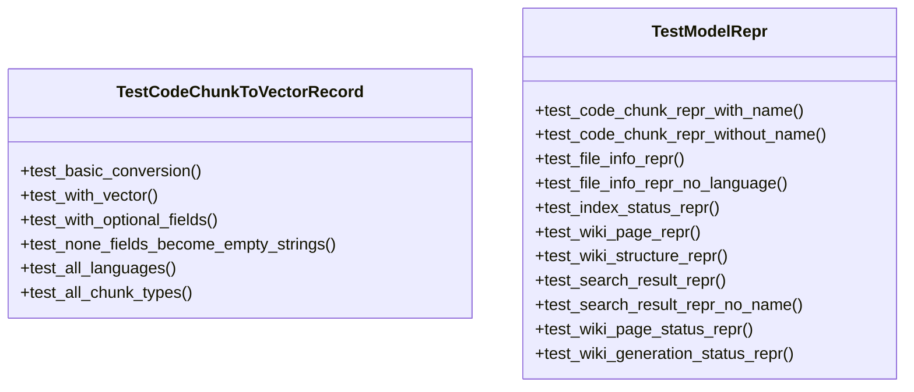

# test_models.py

## File Overview

This file contains unit tests for the string representation (`__repr__`) methods of model classes in the local_deepwiki package. The tests verify that model objects display meaningful and properly formatted string representations.

## Classes

### TestModelRepr

A test class that contains methods to verify the string representation of various model objects from the local_deepwiki.models module.

**Methods:**
- `test_code_chunk_repr_with_name` - Tests CodeChunk repr for named chunks
- `test_code_chunk_repr_without_name` - Tests CodeChunk repr for unnamed chunks  
- `test_file_info_repr` - Tests FileInfo repr
- `test_file_info_repr_no_language` - Tests FileInfo repr without language
- `test_index_status_repr` - Tests IndexStatus repr
- `test_wiki_page_repr` - Tests WikiPage repr
- `test_wiki_structure_repr` - Tests WikiStructure repr
- `test_search_result_repr` - Tests SearchResult repr
- `test_search_result_repr_no_name` - Tests SearchResult repr without name
- `test_wiki_page_status_repr` - Tests WikiPageStatus repr
- `test_wiki_generation_status_repr` - Tests WikiGenerationStatus repr

### TestCodeChunkToVectorRecord

A test class for testing conversion of CodeChunk objects to vector records (implementation not shown in provided code).

## Test Methods

### test_code_chunk_repr_with_name

Tests the string representation of a CodeChunk object that has a name.

```python
def test_code_chunk_repr_with_name(self):
    chunk = CodeChunk(
        id="test_id",
        file_path="src/main.py",
        language=Language.PYTHON,
        chunk_type=ChunkType.FUNCTION,
        name="my_function",
        content="def my_function(): pass",
        start_line=10,
        end_line=15,
    )
    result = repr(chunk)
    # Verifies result contains "CodeChunk", "function", "my_function", "src/main.py:10-15"
```

### test_code_chunk_repr_without_name

Tests the string representation of a CodeChunk object without a name.

```python
def test_code_chunk_repr_without_name(self):
    chunk = CodeChunk(
        id="test_id",
        file_path="src/module.py",
        language=Language.PYTHON,
        chunk_type=ChunkType.MODULE,
        content="# module",
        start_line=1,
        end_line=5,
    )
    result = repr(chunk)
    # Verifies result contains "CodeChunk", "module", "src/module.py:1-5"
```

### test_file_info_repr

Tests the string representation of a FileInfo object.

```python
def test_file_info_repr(self):
    info = FileInfo(
        path="src/utils.py",
        language=Language.PYTHON,
        size_bytes=1024,
        last_modified=1234567890.0,
        hash="abc123",
        chunk_count=5,
    )
    result = repr(info)
    # Verifies result contains "FileInfo", "src/utils.py", "python", "5 chunks"
```

### test_index_status_repr

Tests the string representation of an IndexStatus object.

```python
def test_index_status_repr(self):
    status = IndexStatus(
        repo_path="/home/user/project",
        indexed_at=1234567890.0,
        total_files=25,
        total_chunks=150,
    )
    result = repr(status)
    # Verifies result contains "IndexStatus", "/home/user/project", "25 files", "150 chunks"
```

### test_wiki_page_repr

Tests the string representation of a WikiPage object.

```python
def test_wiki_page_repr(self):
    page = WikiPage(
        path="modules/core.md",
        title="Core Module",
        content="# Core Module\n\nContent here.",
        generated_at=1234567890.0,
    )
    result = repr(page)
    # Verifies result contains "WikiPage", "modules/core.md", "Core Module"
```

## Related Components

This test file works with the following model classes from `local_deepwiki.models`:

- **ChunkType** - Enumeration for code chunk types
- **CodeChunk** - Represents a chunk of code with metadata
- **FileInfo** - Contains file metadata and statistics
- **IndexStatus** - Tracks repository indexing status
- **Language** - Enumeration for programming languages
- **SearchResult** - Represents search results
- **WikiGenerationStatus** - Tracks wiki generation progress
- **WikiPage** - Represents a generated wiki page
- **WikiPageStatus** - Tracks wiki page status
- **WikiStructure** - Represents wiki organization structure

The tests use pytest framework for test execution and assertions.

## API Reference

### class `TestCodeChunkToVectorRecord`

Tests for CodeChunk.to_vector_record method.

**Methods:**

#### `test_basic_conversion`

```python
def test_basic_conversion()
```

Test basic chunk to vector record conversion.

#### `test_with_vector`

```python
def test_with_vector()
```

Test conversion with vector embedding.

#### `test_with_optional_fields`

```python
def test_with_optional_fields()
```

Test conversion with optional fields populated.

#### `test_none_fields_become_empty_strings`

```python
def test_none_fields_become_empty_strings()
```

Test that None fields are converted to empty strings.

#### `test_all_languages`

```python
def test_all_languages()
```

Test conversion works for all supported languages.

#### `test_all_chunk_types`

```python
def test_all_chunk_types()
```

Test conversion works for all chunk types.


### class `TestModelRepr`

Tests for model __repr__ methods.

**Methods:**

#### `test_code_chunk_repr_with_name`

```python
def test_code_chunk_repr_with_name()
```

Test CodeChunk repr with a named chunk.

#### `test_code_chunk_repr_without_name`

```python
def test_code_chunk_repr_without_name()
```

Test CodeChunk repr without a name.

#### `test_file_info_repr`

```python
def test_file_info_repr()
```

Test FileInfo repr.

#### `test_file_info_repr_no_language`

```python
def test_file_info_repr_no_language()
```

Test FileInfo repr with no detected language.

#### `test_index_status_repr`

```python
def test_index_status_repr()
```

Test IndexStatus repr.

#### `test_wiki_page_repr`

```python
def test_wiki_page_repr()
```

Test WikiPage repr.

#### `test_wiki_structure_repr`

```python
def test_wiki_structure_repr()
```

Test WikiStructure repr.

#### `test_search_result_repr`

```python
def test_search_result_repr()
```

Test SearchResult repr.

#### `test_search_result_repr_no_name`

```python
def test_search_result_repr_no_name()
```

Test SearchResult repr when chunk has no name.

#### `test_wiki_page_status_repr`

```python
def test_wiki_page_status_repr()
```

Test WikiPageStatus repr.

#### `test_wiki_generation_status_repr`

```python
def test_wiki_generation_status_repr()
```

Test WikiGenerationStatus repr.


## Class Diagram



## Call Graph

```mermaid
flowchart TD
    N0[CodeChunk]
    N1[FileInfo]
    N2[IndexStatus]
    N3[SearchResult]
    N4[TestCodeChunkToVectorRecord...]
    N5[TestCodeChunkToVectorRecord...]
    N6[TestCodeChunkToVectorRecord...]
    N7[TestCodeChunkToVectorRecord...]
    N8[TestCodeChunkToVectorRecord...]
    N9[TestCodeChunkToVectorRecord...]
    N10[TestModelRepr.test_code_chu...]
    N11[TestModelRepr.test_code_chu...]
    N12[TestModelRepr.test_file_inf...]
    N13[TestModelRepr.test_file_inf...]
    N14[TestModelRepr.test_index_st...]
    N15[TestModelRepr.test_search_r...]
    N16[TestModelRepr.test_search_r...]
    N17[TestModelRepr.test_wiki_gen...]
    N18[TestModelRepr.test_wiki_pag...]
    N19[TestModelRepr.test_wiki_pag...]
    N20[TestModelRepr.test_wiki_str...]
    N21[WikiGenerationStatus]
    N22[WikiPage]
    N23[WikiPageStatus]
    N24[WikiStructure]
    N25[loads]
    N26[to_vector_record]
    N6 --> N0
    N6 --> N26
    N9 --> N0
    N9 --> N26
    N8 --> N0
    N8 --> N26
    N8 --> N25
    N7 --> N0
    N7 --> N26
    N5 --> N0
    N5 --> N26
    N4 --> N0
    N4 --> N26
    N10 --> N0
    N11 --> N0
    N12 --> N1
    N13 --> N1
    N14 --> N2
    N18 --> N22
    N20 --> N24
    N20 --> N22
    N15 --> N0
    N15 --> N3
    N16 --> N0
    N16 --> N3
    N19 --> N23
    N17 --> N21
    classDef func fill:#e1f5fe
    class N0,N1,N2,N3,N21,N22,N23,N24,N25,N26 func
    classDef method fill:#fff3e0
    class N4,N5,N6,N7,N8,N9,N10,N11,N12,N13,N14,N15,N16,N17,N18,N19,N20 method
```



## Relevant Source Files

- `tests/test_models.py:21-144`

## See Also

- [test_indexer](test_indexer.md) - shares 3 dependencies
