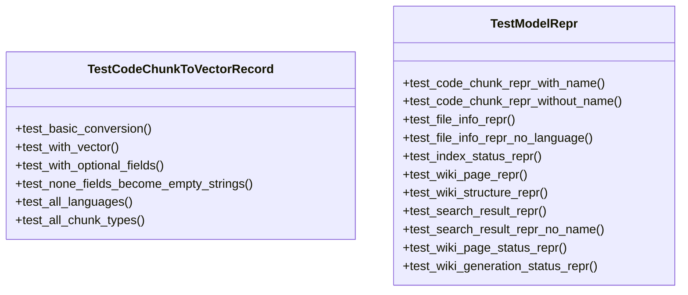

# test_models.py

## File Overview

This file contains comprehensive unit tests for model representation methods in the local_deepwiki package. It focuses on testing the `__repr__` methods of various model classes to ensure they provide meaningful string representations for debugging and logging purposes.

## Classes

### TestModelRepr

A test class that contains methods for testing the string representation (`__repr__`) methods of various model classes in the local_deepwiki package.

**Methods:**
- `test_code_chunk_repr_with_name` - Tests [CodeChunk](../src/local_deepwiki/models.md) representation when a name is present
- `test_code_chunk_repr_without_name` - Tests [CodeChunk](../src/local_deepwiki/models.md) representation without a name
- `test_file_info_repr` - Tests [FileInfo](../src/local_deepwiki/models.md) string representation
- `test_file_info_repr_no_language` - Tests [FileInfo](../src/local_deepwiki/models.md) representation when language is not specified
- `test_index_status_repr` - Tests [IndexStatus](../src/local_deepwiki/models.md) string representation
- `test_wiki_page_repr` - Tests [WikiPage](../src/local_deepwiki/models.md) string representation
- `test_wiki_structure_repr` - Tests [WikiStructure](../src/local_deepwiki/models.md) string representation
- `test_search_result_repr` - Tests [SearchResult](../src/local_deepwiki/models.md) representation with name
- `test_search_result_repr_no_name` - Tests [SearchResult](../src/local_deepwiki/models.md) representation without name
- `test_wiki_page_status_repr` - Tests [WikiPageStatus](../src/local_deepwiki/models.md) string representation
- `test_wiki_generation_status_repr` - Tests [WikiGenerationStatus](../src/local_deepwiki/models.md) string representation

### TestCodeChunkToVectorRecord

A test class for testing the conversion of [CodeChunk](../src/local_deepwiki/models.md) objects to vector records (implementation details not shown in the provided code).

## Test Methods

### test_code_chunk_repr_without_name

Tests the string representation of a [CodeChunk](../src/local_deepwiki/models.md) object when no name is provided.

```python
def test_code_chunk_repr_without_name(self):
    chunk = CodeChunk(
        id="test_id",
        file_path="src/module.py",
        language=Language.PYTHON,
        chunk_type=ChunkType.MODULE,
        content="# module",
        start_line=1,
        end_line=5,
    )
    result = repr(chunk)
    assert "CodeChunk" in result
    assert "module" in result
    assert "src/module.py:1-5" in result
```

**Purpose:** Verifies that [CodeChunk](../src/local_deepwiki/models.md) objects display appropriate information including the chunk type, file path, and line range in their string representation.

### test_file_info_repr

Tests the string representation of a [FileInfo](../src/local_deepwiki/models.md) object.

```python
def test_file_info_repr(self):
    info = FileInfo(
        path="src/utils.py",
        language=Language.PYTHON,
        size_bytes=1024,
        last_modified=1234567890.0,
        hash="abc123",
        chunk_count=5,
    )
    result = repr(info)
    assert "FileInfo" in result
    assert "src/utils.py" in result
    assert "python" in result
    assert "5 chunks" in result
```

**Purpose:** Ensures [FileInfo](../src/local_deepwiki/models.md) objects display essential file information including path, language, and chunk count in their string representation.

### test_wiki_page_repr

Tests the string representation of a [WikiPage](../src/local_deepwiki/models.md) object.

```python
def test_wiki_page_repr(self):
    page = WikiPage(
        path="modules/core.md",
        title="Core Module",
        content="# Core Module\n\nContent here.",
        generated_at=1234567890.0,
    )
    result = repr(page)
    assert "WikiPage" in result
    assert "modules/core.md" in result
    assert "Core Module" in result
```

**Purpose:** Verifies that [WikiPage](../src/local_deepwiki/models.md) objects include the class name, file path, and title in their string representation.

## Related Components

This test file works with several model classes from the `local_deepwiki.models` module:

- **[CodeChunk](../src/local_deepwiki/models.md)** - Represents a chunk of code with metadata
- **[FileInfo](../src/local_deepwiki/models.md)** - Contains information about indexed files
- **[WikiPage](../src/local_deepwiki/models.md)** - Represents generated wiki pages
- **[IndexStatus](../src/local_deepwiki/models.md)** - Tracks indexing status
- **[SearchResult](../src/local_deepwiki/models.md)** - Contains search result data
- **[WikiPageStatus](../src/local_deepwiki/models.md)** - Tracks wiki page generation status
- **[WikiGenerationStatus](../src/local_deepwiki/models.md)** - Tracks overall wiki generation status
- **[WikiStructure](../src/local_deepwiki/models.md)** - Represents the structure of the wiki

The tests also use enums:
- **[Language](../src/local_deepwiki/models.md)** - Programming language enumeration (PYTHON shown)
- **[ChunkType](../src/local_deepwiki/models.md)** - Type of code chunk (MODULE shown)

## Usage Example

To run these tests, use pytest:

```python
import pytest
from tests.test_models import TestModelRepr

# Run all repr tests
test_instance = TestModelRepr()
test_instance.test_file_info_repr()
test_instance.test_wiki_page_repr()
```

## API Reference

### class `TestCodeChunkToVectorRecord`

Tests for [CodeChunk](../src/local_deepwiki/models.md).to_vector_record method.

**Methods:**

#### `test_basic_conversion`

```python
def test_basic_conversion()
```

Test basic chunk to vector record conversion.

#### `test_with_vector`

```python
def test_with_vector()
```

Test conversion with vector embedding.

#### `test_with_optional_fields`

```python
def test_with_optional_fields()
```

Test conversion with optional fields populated.

#### `test_none_fields_become_empty_strings`

```python
def test_none_fields_become_empty_strings()
```

Test that None fields are converted to empty strings.

#### `test_all_languages`

```python
def test_all_languages()
```

Test conversion works for all supported languages.

#### `test_all_chunk_types`

```python
def test_all_chunk_types()
```

Test conversion works for all chunk types.


### class `TestModelRepr`

Tests for model __repr__ methods.

**Methods:**

#### `test_code_chunk_repr_with_name`

```python
def test_code_chunk_repr_with_name()
```

Test [CodeChunk](../src/local_deepwiki/models.md) repr with a named chunk.

#### `test_code_chunk_repr_without_name`

```python
def test_code_chunk_repr_without_name()
```

Test [CodeChunk](../src/local_deepwiki/models.md) repr without a name.

#### `test_file_info_repr`

```python
def test_file_info_repr()
```

Test [FileInfo](../src/local_deepwiki/models.md) repr.

#### `test_file_info_repr_no_language`

```python
def test_file_info_repr_no_language()
```

Test [FileInfo](../src/local_deepwiki/models.md) repr with no detected language.

#### `test_index_status_repr`

```python
def test_index_status_repr()
```

Test [IndexStatus](../src/local_deepwiki/models.md) repr.

#### `test_wiki_page_repr`

```python
def test_wiki_page_repr()
```

Test [WikiPage](../src/local_deepwiki/models.md) repr.

#### `test_wiki_structure_repr`

```python
def test_wiki_structure_repr()
```

Test [WikiStructure](../src/local_deepwiki/models.md) repr.

#### `test_search_result_repr`

```python
def test_search_result_repr()
```

Test [SearchResult](../src/local_deepwiki/models.md) repr.

#### `test_search_result_repr_no_name`

```python
def test_search_result_repr_no_name()
```

Test [SearchResult](../src/local_deepwiki/models.md) repr when chunk has no name.

#### `test_wiki_page_status_repr`

```python
def test_wiki_page_status_repr()
```

Test [WikiPageStatus](../src/local_deepwiki/models.md) repr.

#### `test_wiki_generation_status_repr`

```python
def test_wiki_generation_status_repr()
```

Test [WikiGenerationStatus](../src/local_deepwiki/models.md) repr.


## Class Diagram



## Call Graph

```mermaid
flowchart TD
    N0[CodeChunk]
    N1[FileInfo]
    N2[IndexStatus]
    N3[SearchResult]
    N4[TestCodeChunkToVectorRecord...]
    N5[TestCodeChunkToVectorRecord...]
    N6[TestCodeChunkToVectorRecord...]
    N7[TestCodeChunkToVectorRecord...]
    N8[TestCodeChunkToVectorRecord...]
    N9[TestCodeChunkToVectorRecord...]
    N10[TestModelRepr.test_code_chu...]
    N11[TestModelRepr.test_code_chu...]
    N12[TestModelRepr.test_file_inf...]
    N13[TestModelRepr.test_file_inf...]
    N14[TestModelRepr.test_index_st...]
    N15[TestModelRepr.test_search_r...]
    N16[TestModelRepr.test_search_r...]
    N17[TestModelRepr.test_wiki_gen...]
    N18[TestModelRepr.test_wiki_pag...]
    N19[TestModelRepr.test_wiki_pag...]
    N20[TestModelRepr.test_wiki_str...]
    N21[WikiGenerationStatus]
    N22[WikiPage]
    N23[WikiPageStatus]
    N24[WikiStructure]
    N25[loads]
    N26[to_vector_record]
    N6 --> N0
    N6 --> N26
    N9 --> N0
    N9 --> N26
    N8 --> N0
    N8 --> N26
    N8 --> N25
    N7 --> N0
    N7 --> N26
    N5 --> N0
    N5 --> N26
    N4 --> N0
    N4 --> N26
    N10 --> N0
    N11 --> N0
    N12 --> N1
    N13 --> N1
    N14 --> N2
    N18 --> N22
    N20 --> N24
    N20 --> N22
    N15 --> N0
    N15 --> N3
    N16 --> N0
    N16 --> N3
    N19 --> N23
    N17 --> N21
    classDef func fill:#e1f5fe
    class N0,N1,N2,N3,N21,N22,N23,N24,N25,N26 func
    classDef method fill:#fff3e0
    class N4,N5,N6,N7,N8,N9,N10,N11,N12,N13,N14,N15,N16,N17,N18,N19,N20 method
```



## Relevant Source Files

- `tests/test_models.py:21-144`

## See Also

- [models](../src/local_deepwiki/models.md) - dependency
- [test_indexer](test_indexer.md) - shares 3 dependencies
- [test_search](test_search.md) - shares 3 dependencies
- [test_incremental_wiki](test_incremental_wiki.md) - shares 3 dependencies
