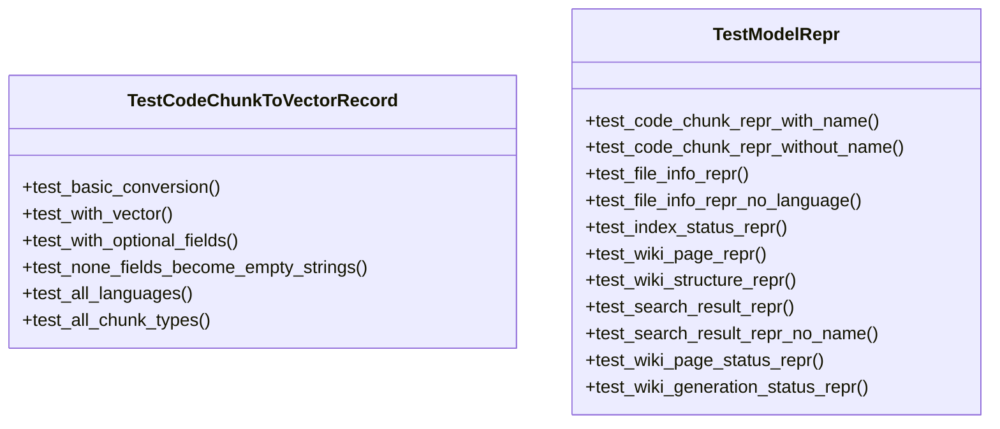

# test_models.py

## File Overview

This file contains unit tests for the data model classes in the local_deepwiki.models module. It focuses on testing the string representation (`__repr__`) methods of various model classes and data conversion functionality.

## Classes

### TestModelRepr

A test class that verifies the string representation methods of various model classes from the local_deepwiki.models module.

**Key Methods:**
- `test_code_chunk_repr_with_name` - Tests [CodeChunk](../src/local_deepwiki/models.md) repr when the chunk has a name
- `test_code_chunk_repr_without_name` - Tests [CodeChunk](../src/local_deepwiki/models.md) repr when the chunk has no name  
- `test_file_info_repr` - Tests [FileInfo](../src/local_deepwiki/models.md) repr functionality
- `test_file_info_repr_no_language` - Tests [FileInfo](../src/local_deepwiki/models.md) repr without language specified
- `test_index_status_repr` - Tests [IndexStatus](../src/local_deepwiki/models.md) repr functionality
- `test_wiki_page_repr` - Tests [WikiPage](../src/local_deepwiki/models.md) repr functionality
- `test_wiki_structure_repr` - Tests [WikiStructure](../src/local_deepwiki/models.md) repr functionality
- `test_search_result_repr` - Tests [SearchResult](../src/local_deepwiki/models.md) repr with name
- `test_search_result_repr_no_name` - Tests [SearchResult](../src/local_deepwiki/models.md) repr without name
- `test_wiki_page_status_repr` - Tests [WikiPageStatus](../src/local_deepwiki/models.md) repr functionality
- `test_wiki_generation_status_repr` - Tests [WikiGenerationStatus](../src/local_deepwiki/models.md) repr functionality

### TestCodeChunkToVectorRecord

A test class for testing data conversion functionality related to [CodeChunk](../src/local_deepwiki/models.md) objects, though the specific methods are not visible in the provided code.

## Test Methods

### test_code_chunk_repr_with_name

Tests the string representation of a [CodeChunk](../src/local_deepwiki/models.md) object that has a name attribute.

**Test Setup:**
- Creates a [CodeChunk](../src/local_deepwiki/models.md) with function type
- Sets name to "my_function"
- Specifies file path "src/[main](../src/local_deepwiki/web/app.md).py" and lines 10-15

**Assertions:**
- Verifies "[CodeChunk](../src/local_deepwiki/models.md)" appears in repr
- Verifies "function" appears in repr
- Verifies function name "my_function" appears in repr
- Verifies file location "src/[main](../src/local_deepwiki/web/app.md).py:10-15" appears in repr

### test_code_chunk_repr_without_name

Tests the string representation of a [CodeChunk](../src/local_deepwiki/models.md) object without a name attribute.

**Test Setup:**
- Creates a [CodeChunk](../src/local_deepwiki/models.md) with module type
- No name specified
- File path "src/module.py" and lines 1-5

**Assertions:**
- Verifies "[CodeChunk](../src/local_deepwiki/models.md)" appears in repr
- Verifies "module" appears in repr
- Verifies file location "src/module.py:1-5" appears in repr

### test_file_info_repr

Tests the string representation of a [FileInfo](../src/local_deepwiki/models.md) object.

**Test Setup:**
- Creates [FileInfo](../src/local_deepwiki/models.md) with path "src/utils.py"
- [Language](../src/local_deepwiki/models.md) set to Python
- Size of 1024 bytes, 5 chunks

**Assertions:**
- Verifies "[FileInfo](../src/local_deepwiki/models.md)" appears in repr
- Verifies file path "src/utils.py" appears in repr
- Verifies language "python" appears in repr
- Verifies chunk count "5 chunks" appears in repr

### test_wiki_page_repr

Tests the string representation of a [WikiPage](../src/local_deepwiki/models.md) object.

**Test Setup:**
- Creates [WikiPage](../src/local_deepwiki/models.md) with path "modules/core.md"
- Title "Core Module"
- Sample markdown content

**Assertions:**
- Verifies "[WikiPage](../src/local_deepwiki/models.md)" appears in repr
- Verifies file path "modules/core.md" appears in repr
- Verifies title "Core Module" appears in repr

## Usage Examples

```python
# Example of how the tested models would be used
from local_deepwiki.models import CodeChunk, FileInfo, WikiPage, Language, ChunkType

# Creating a CodeChunk for testing
chunk = CodeChunk(
    id="test_id",
    file_path="src/main.py",
    language=Language.PYTHON,
    chunk_type=ChunkType.FUNCTION,
    name="my_function",
    content="def my_function(): pass",
    start_line=10,
    end_line=15,
)

# Creating a FileInfo for testing
info = FileInfo(
    path="src/utils.py",
    language=Language.PYTHON,
    size_bytes=1024,
    last_modified=1234567890.0,
    hash="abc123",
    chunk_count=5,
)

# Creating a WikiPage for testing
page = WikiPage(
    path="modules/core.md",
    title="Core Module",
    content="# Core Module\n\nContent here.",
    generated_at=1234567890.0,
)
```

## Related Components

This test file imports and tests the following model classes:
- [ChunkType](../src/local_deepwiki/models.md) - Enumeration for different types of code chunks
- [CodeChunk](../src/local_deepwiki/models.md) - Represents a chunk of code with metadata
- [FileInfo](../src/local_deepwiki/models.md) - Contains information about source files
- [IndexStatus](../src/local_deepwiki/models.md) - Status information for indexing operations
- [Language](../src/local_deepwiki/models.md) - Enumeration for programming languages
- [SearchResult](../src/local_deepwiki/models.md) - Results from search operations
- [WikiGenerationStatus](../src/local_deepwiki/models.md) - Status of wiki generation processes
- [WikiPage](../src/local_deepwiki/models.md) - Represents a generated wiki page
- [WikiPageStatus](../src/local_deepwiki/models.md) - Status information for wiki pages
- [WikiStructure](../src/local_deepwiki/models.md) - Structure information for wiki organization

## API Reference

### class `TestCodeChunkToVectorRecord`

Tests for [CodeChunk](../src/local_deepwiki/models.md).to_vector_record method.

**Methods:**

#### `test_basic_conversion`

```python
def test_basic_conversion()
```

Test basic chunk to vector record conversion.

#### `test_with_vector`

```python
def test_with_vector()
```

Test conversion with vector embedding.

#### `test_with_optional_fields`

```python
def test_with_optional_fields()
```

Test conversion with optional fields populated.

#### `test_none_fields_become_empty_strings`

```python
def test_none_fields_become_empty_strings()
```

Test that None fields are converted to empty strings.

#### `test_all_languages`

```python
def test_all_languages()
```

Test conversion works for all supported languages.

#### `test_all_chunk_types`

```python
def test_all_chunk_types()
```

Test conversion works for all chunk types.


### class `TestModelRepr`

Tests for model __repr__ methods.

**Methods:**

#### `test_code_chunk_repr_with_name`

```python
def test_code_chunk_repr_with_name()
```

Test [CodeChunk](../src/local_deepwiki/models.md) repr with a named chunk.

#### `test_code_chunk_repr_without_name`

```python
def test_code_chunk_repr_without_name()
```

Test [CodeChunk](../src/local_deepwiki/models.md) repr without a name.

#### `test_file_info_repr`

```python
def test_file_info_repr()
```

Test [FileInfo](../src/local_deepwiki/models.md) repr.

#### `test_file_info_repr_no_language`

```python
def test_file_info_repr_no_language()
```

Test [FileInfo](../src/local_deepwiki/models.md) repr with no detected language.

#### `test_index_status_repr`

```python
def test_index_status_repr()
```

Test [IndexStatus](../src/local_deepwiki/models.md) repr.

#### `test_wiki_page_repr`

```python
def test_wiki_page_repr()
```

Test [WikiPage](../src/local_deepwiki/models.md) repr.

#### `test_wiki_structure_repr`

```python
def test_wiki_structure_repr()
```

Test [WikiStructure](../src/local_deepwiki/models.md) repr.

#### `test_search_result_repr`

```python
def test_search_result_repr()
```

Test [SearchResult](../src/local_deepwiki/models.md) repr.

#### `test_search_result_repr_no_name`

```python
def test_search_result_repr_no_name()
```

Test [SearchResult](../src/local_deepwiki/models.md) repr when chunk has no name.

#### `test_wiki_page_status_repr`

```python
def test_wiki_page_status_repr()
```

Test [WikiPageStatus](../src/local_deepwiki/models.md) repr.

#### `test_wiki_generation_status_repr`

```python
def test_wiki_generation_status_repr()
```

Test [WikiGenerationStatus](../src/local_deepwiki/models.md) repr.


## Class Diagram



## Call Graph

```mermaid
flowchart TD
    N0[CodeChunk]
    N1[FileInfo]
    N2[IndexStatus]
    N3[SearchResult]
    N4[TestCodeChunkToVectorRecord...]
    N5[TestCodeChunkToVectorRecord...]
    N6[TestCodeChunkToVectorRecord...]
    N7[TestCodeChunkToVectorRecord...]
    N8[TestCodeChunkToVectorRecord...]
    N9[TestCodeChunkToVectorRecord...]
    N10[TestModelRepr.test_code_chu...]
    N11[TestModelRepr.test_code_chu...]
    N12[TestModelRepr.test_file_inf...]
    N13[TestModelRepr.test_file_inf...]
    N14[TestModelRepr.test_index_st...]
    N15[TestModelRepr.test_search_r...]
    N16[TestModelRepr.test_search_r...]
    N17[TestModelRepr.test_wiki_gen...]
    N18[TestModelRepr.test_wiki_pag...]
    N19[TestModelRepr.test_wiki_pag...]
    N20[TestModelRepr.test_wiki_str...]
    N21[WikiGenerationStatus]
    N22[WikiPage]
    N23[WikiPageStatus]
    N24[WikiStructure]
    N25[loads]
    N26[to_vector_record]
    N6 --> N0
    N6 --> N26
    N9 --> N0
    N9 --> N26
    N8 --> N0
    N8 --> N26
    N8 --> N25
    N7 --> N0
    N7 --> N26
    N5 --> N0
    N5 --> N26
    N4 --> N0
    N4 --> N26
    N10 --> N0
    N11 --> N0
    N12 --> N1
    N13 --> N1
    N14 --> N2
    N18 --> N22
    N20 --> N24
    N20 --> N22
    N15 --> N0
    N15 --> N3
    N16 --> N0
    N16 --> N3
    N19 --> N23
    N17 --> N21
    classDef func fill:#e1f5fe
    class N0,N1,N2,N3,N21,N22,N23,N24,N25,N26 func
    classDef method fill:#fff3e0
    class N4,N5,N6,N7,N8,N9,N10,N11,N12,N13,N14,N15,N16,N17,N18,N19,N20 method
```



## Relevant Source Files

- `tests/test_models.py:21-144`

## See Also

- [models](../src/local_deepwiki/models.md) - dependency
- [test_indexer](test_indexer.md) - shares 3 dependencies
