# test_ollama_health.py

## File Overview

This test file contains comprehensive unit tests for the Ollama provider's health checking functionality and error handling. It tests the [OllamaProvider](../src/local_deepwiki/providers/llm/ollama.md) class's ability to check service availability, handle connection errors, and validate model availability before performing generation operations.

## Classes

### MockModel
A simple mock class representing an Ollama model object for testing purposes.

**Attributes:**
- `model`: String identifier for the model

### MockListResponse
A mock class representing the response from Ollama's list models API.

**Attributes:**
- `models`: List of MockModel objects

### TestOllamaConnectionError
Test class for validating [OllamaConnectionError](../src/local_deepwiki/providers/llm/ollama.md) behavior.

**Methods:**
- `test_error_message_includes_url()`: Verifies that connection error messages include the base URL
- `test_error_message_includes_instructions()`: Ensures error messages contain helpful instructions like "ollama serve" and "Install Ollama"

### TestOllamaModelNotFoundError
Test class for validating [OllamaModelNotFoundError](../src/local_deepwiki/providers/llm/ollama.md) behavior.

**Methods:**
- `test_error_message_includes_model_name()`: Verifies the error message includes the requested model name
- `test_error_message_includes_pull_command()`: Ensures the error message includes the appropriate `ollama pull` command
- `test_error_message_lists_available_models()`: Tests that available models are listed in the error message

### TestOllamaProviderHealthCheck
Test class for the [OllamaProvider](../src/local_deepwiki/providers/llm/ollama.md) health checking functionality.

**Fixtures:**
- `provider()`: Creates an [OllamaProvider](../src/local_deepwiki/providers/llm/ollama.md) instance with model "llama3.2" and base URL "http://localhost:11434"

**Methods:**
- `test_health_check_passes_when_model_available()`: Tests that health checks pass when Ollama is running and the requested model exists

### TestOllamaProviderGenerate
Test class for the [OllamaProvider](../src/local_deepwiki/providers/llm/ollama.md) generate method with health checking integration.

**Fixtures:**
- `provider()`: Creates an [OllamaProvider](../src/local_deepwiki/providers/llm/ollama.md) instance with model "llama3.2" and base URL "http://localhost:11434"

**Methods:**
- `test_generate_checks_health_on_first_call()`: Verifies that the generate method performs a health check on the first invocation

### TestOllamaProviderGenerateStream
Test class for the [OllamaProvider](../src/local_deepwiki/providers/llm/ollama.md) generate_stream method with health checking integration.

**Fixtures:**
- `provider()`: Creates an [OllamaProvider](../src/local_deepwiki/providers/llm/ollama.md) instance with model "llama3.2" and base URL "http://localhost:11434"

**Methods:**
- `test_generate_stream_checks_health_on_first_call()`: Verifies that the generate_stream method performs a health check on the first invocation

## Functions

### make_list_response
A utility function for creating mock list responses in tests.

**Parameters:**
- Takes a list of model names as input

**Returns:**
- Returns a MockListResponse object containing MockModel instances

## Usage Examples

### Running Health Check Tests
```python
# Create a provider instance for testing
provider = OllamaProvider(model="llama3.2", base_url="http://localhost:11434")

# The tests verify health checking behavior using mocked responses
mock_response = make_list_response(["llama3.2:latest", "mistral:latest"])
```

### Testing Error Handling
```python
# Test connection error messaging
error = OllamaConnectionError("http://localhost:11434")
assert "http://localhost:11434" in str(error)
assert "ollama serve" in str(error)

# Test model not found error messaging  
error = OllamaModelNotFoundError("llama3.2")
assert "llama3.2" in str(error)
assert "ollama pull llama3.2" in str(error)
```

## Related Components

This test file works with the following components from the `local_deepwiki.providers.llm.ollama` module:

- **[OllamaProvider](../src/local_deepwiki/providers/llm/ollama.md)**: The [main](../src/local_deepwiki/export/html.md) provider class being tested
- **[OllamaConnectionError](../src/local_deepwiki/providers/llm/ollama.md)**: Exception raised when connection to Ollama fails
- **[OllamaModelNotFoundError](../src/local_deepwiki/providers/llm/ollama.md)**: Exception raised when a requested model is not available

The tests use pytest fixtures and async testing capabilities to validate the provider's health checking, error handling, and generation method behaviors.

## API Reference

### class `MockModel`

Mock ollama Model object.

### class `MockListResponse`

Mock ollama ListResponse object.

### class `TestOllamaConnectionError`

Tests for [OllamaConnectionError](../src/local_deepwiki/providers/llm/ollama.md).

**Methods:**

#### `test_error_message_includes_url`

```python
def test_error_message_includes_url()
```

Error message should include the base URL.

#### `test_error_message_includes_instructions`

```python
def test_error_message_includes_instructions()
```

Error message should include helpful instructions.

#### `test_stores_original_error`

```python
def test_stores_original_error()
```

Should store the original exception.


### class `TestOllamaModelNotFoundError`

Tests for [OllamaModelNotFoundError](../src/local_deepwiki/providers/llm/ollama.md).

**Methods:**

#### `test_error_message_includes_model_name`

```python
def test_error_message_includes_model_name()
```

Error message should include the model name.

#### `test_error_message_includes_pull_command`

```python
def test_error_message_includes_pull_command()
```

Error message should include the pull command.

#### `test_error_message_lists_available_models`

```python
def test_error_message_lists_available_models()
```

Error message should list available models if provided.

#### `test_truncates_long_model_list`

```python
def test_truncates_long_model_list()
```

Should truncate very long model lists.


### class `TestOllamaProviderHealthCheck`

Tests for [OllamaProvider](../src/local_deepwiki/providers/llm/ollama.md).check_health().

**Methods:**

#### `provider`

```python
def provider()
```

Create an [OllamaProvider](../src/local_deepwiki/providers/llm/ollama.md) instance.

#### `test_health_check_passes_when_model_available`

```python
async def test_health_check_passes_when_model_available(provider)
```

Health check should pass when Ollama is running and model exists.


| [Parameter](../src/local_deepwiki/generators/api_docs.md) | Type | Default | Description |
|-----------|------|---------|-------------|
| `provider` | - | - | - |

#### `test_health_check_passes_with_exact_model_match`

```python
async def test_health_check_passes_with_exact_model_match(provider)
```

Health check should pass with exact model name match.


| [Parameter](../src/local_deepwiki/generators/api_docs.md) | Type | Default | Description |
|-----------|------|---------|-------------|
| `provider` | - | - | - |

#### `test_health_check_passes_with_tagged_model`

```python
async def test_health_check_passes_with_tagged_model(provider)
```

Health check should pass when model has a tag suffix.


| [Parameter](../src/local_deepwiki/generators/api_docs.md) | Type | Default | Description |
|-----------|------|---------|-------------|
| `provider` | - | - | - |

#### `test_health_check_raises_when_model_not_found`

```python
async def test_health_check_raises_when_model_not_found(provider)
```

Health check should raise [OllamaModelNotFoundError](../src/local_deepwiki/providers/llm/ollama.md) when model doesn't exist.


| [Parameter](../src/local_deepwiki/generators/api_docs.md) | Type | Default | Description |
|-----------|------|---------|-------------|
| `provider` | - | - | - |

#### `test_health_check_raises_on_connection_error`

```python
async def test_health_check_raises_on_connection_error(provider)
```

Health check should raise [OllamaConnectionError](../src/local_deepwiki/providers/llm/ollama.md) on connection failure.


| [Parameter](../src/local_deepwiki/generators/api_docs.md) | Type | Default | Description |
|-----------|------|---------|-------------|
| `provider` | - | - | - |

#### `test_health_check_raises_on_timeout`

```python
async def test_health_check_raises_on_timeout(provider)
```

Health check should raise [OllamaConnectionError](../src/local_deepwiki/providers/llm/ollama.md) on timeout.


| [Parameter](../src/local_deepwiki/generators/api_docs.md) | Type | Default | Description |
|-----------|------|---------|-------------|
| `provider` | - | - | - |


### class `TestOllamaProviderGenerate`

Tests for [OllamaProvider](../src/local_deepwiki/providers/llm/ollama.md).generate() with health checking.

**Methods:**

#### `provider`

```python
def provider()
```

Create an [OllamaProvider](../src/local_deepwiki/providers/llm/ollama.md) instance.

#### `test_generate_checks_health_on_first_call`

```python
async def test_generate_checks_health_on_first_call(provider)
```

Generate should check health on the first call.


| [Parameter](../src/local_deepwiki/generators/api_docs.md) | Type | Default | Description |
|-----------|------|---------|-------------|
| `provider` | - | - | - |

#### `test_generate_skips_health_check_after_first_call`

```python
async def test_generate_skips_health_check_after_first_call(provider)
```

Generate should skip health check on subsequent calls.


| [Parameter](../src/local_deepwiki/generators/api_docs.md) | Type | Default | Description |
|-----------|------|---------|-------------|
| `provider` | - | - | - |

#### `test_generate_raises_connection_error_with_helpful_message`

```python
async def test_generate_raises_connection_error_with_helpful_message(provider)
```

Generate should raise helpful error when Ollama is unavailable.


| [Parameter](../src/local_deepwiki/generators/api_docs.md) | Type | Default | Description |
|-----------|------|---------|-------------|
| `provider` | - | - | - |

#### `test_generate_raises_model_not_found_with_suggestions`

```python
async def test_generate_raises_model_not_found_with_suggestions(provider)
```

Generate should raise helpful error when model doesn't exist.


| [Parameter](../src/local_deepwiki/generators/api_docs.md) | Type | Default | Description |
|-----------|------|---------|-------------|
| `provider` | - | - | - |


### class `TestOllamaProviderGenerateStream`

Tests for [OllamaProvider](../src/local_deepwiki/providers/llm/ollama.md).generate_stream() with health checking.

**Methods:**

#### `provider`

```python
def provider()
```

Create an [OllamaProvider](../src/local_deepwiki/providers/llm/ollama.md) instance.

#### `test_generate_stream_checks_health_on_first_call`

```python
async def test_generate_stream_checks_health_on_first_call(provider)
```

Generate stream should check health on the first call.


| [Parameter](../src/local_deepwiki/generators/api_docs.md) | Type | Default | Description |
|-----------|------|---------|-------------|
| `provider` | - | - | - |

#### `mock_stream`

```python
async def mock_stream()
```

#### `test_generate_stream_raises_connection_error`

```python
async def test_generate_stream_raises_connection_error(provider)
```

Generate stream should raise helpful error when Ollama is unavailable.


| [Parameter](../src/local_deepwiki/generators/api_docs.md) | Type | Default | Description |
|-----------|------|---------|-------------|
| `provider` | - | - | - |


---

### Functions

#### `make_list_response`

```python
def make_list_response(model_names: list[str]) -> MockListResponse
```

Create a mock list response with the given model names.


| [Parameter](../src/local_deepwiki/generators/api_docs.md) | Type | Default | Description |
|-----------|------|---------|-------------|
| `model_names` | `list[str]` | - | - |

**Returns:** `MockListResponse`


## Class Diagram

```mermaid
classDiagram
    class MockListResponse {
        +models: list[MockModel]
    }
    class MockModel {
        +model: str
    }
    class TestOllamaConnectionError {
        +test_error_message_includes_url()
        +test_error_message_includes_instructions()
        +test_stores_original_error()
    }
    class TestOllamaModelNotFoundError {
        +test_error_message_includes_model_name()
        +test_error_message_includes_pull_command()
        +test_error_message_lists_available_models()
        +test_truncates_long_model_list()
    }
    class TestOllamaProviderGenerate {
        +provider()
        +test_generate_checks_health_on_first_call()
        +test_generate_skips_health_check_after_first_call()
        +test_generate_raises_connection_error_with_helpful_message()
        +test_generate_raises_model_not_found_with_suggestions()
    }
    class TestOllamaProviderGenerateStream {
        +provider()
        +test_generate_stream_checks_health_on_first_call()
        +mock_stream()
        +test_generate_stream_raises_connection_error()
    }
    class TestOllamaProviderHealthCheck {
        +provider()
        +test_health_check_passes_when_model_available()
        +test_health_check_passes_with_exact_model_match()
        +test_health_check_passes_with_tagged_model()
        +test_health_check_raises_when_model_not_found()
        +test_health_check_raises_on_connection_error()
        +test_health_check_raises_on_timeout()
    }
```



## Call Graph


## Relevant Source Files

- `tests/test_ollama_health.py:16-19`
