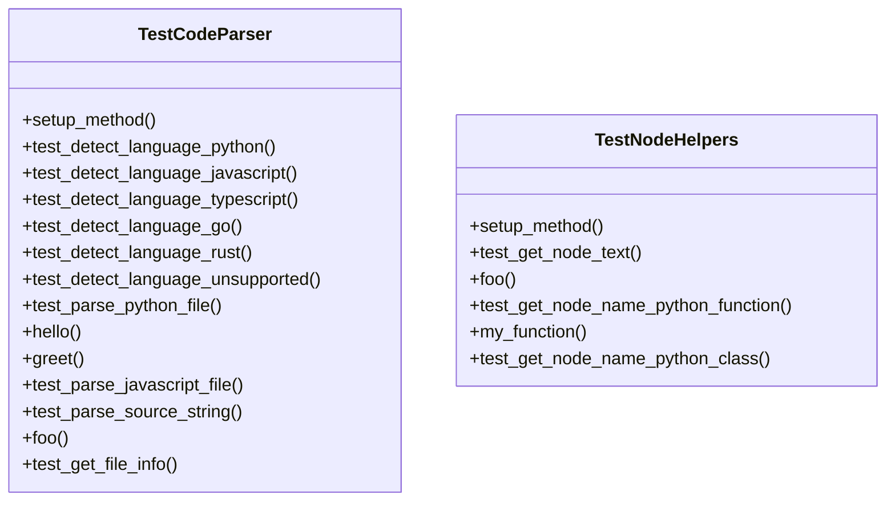

# Test Parser Documentation

## File Overview

This file contains the test suite for the `CodeParser` class and related node helper functions. It verifies the correct functionality of code parsing, language detection, and node text/name extraction capabilities within the local_deepwiki project.

## Classes

### `TestCodeParser`

Test suite for the `CodeParser` class, which handles code parsing and language detection.

#### Key Methods

- `setup_method()`: Initializes a `CodeParser` instance for each test
- `test_detect_language_python()`: Tests Python language detection for `.py` and `.pyi` files
- `test_detect_language_javascript()`: Tests JavaScript language detection for `.js` files

#### Usage

```python
# Run tests using pytest
pytest tests/test_parser.py::TestCodeParser
```

### `TestNodeHelpers`

Test suite for node helper functions that extract information from parsed code trees.

#### Key Methods

- `setup_method()`: Initializes a `CodeParser` instance for each test
- `test_get_node_text()`: Tests extracting text content from AST nodes
- `test_get_node_name_python_function()`: Tests extracting function names from Python code

#### Usage

```python
# Run tests using pytest
pytest tests/test_parser.py::TestNodeHelpers
```

## Functions

### `get_node_text(node, source_code)`

Extracts the text content from a tree-sitter AST node.

**Parameters:**
- `node`: Tree-sitter AST node
- `source_code`: Raw source code as bytes

**Returns:**
- `str`: Text content of the node

### `get_node_name(node)`

Extracts the name from a tree-sitter AST node.

**Parameters:**
- `node`: Tree-sitter AST node

**Returns:**
- `str`: Name of the node (function name, variable name, etc.)

## Usage Examples

### Testing Language Detection

```python
def test_language_detection():
    parser = CodeParser()
    assert parser.detect_language(Path("example.py")) == Language.PYTHON
    assert parser.detect_language(Path("example.js")) == Language.JAVASCRIPT
```

### Testing Node Text Extraction

```python
def test_node_text_extraction():
    parser = CodeParser()
    code = b"def foo(): pass"
    root = parser.parse_source(code, Language.PYTHON)
    func_node = root.children[0]
    text = get_node_text(func_node, code)
    assert text == "def foo(): pass"
```

### Testing Node Name Extraction

```python
def test_node_name_extraction():
    parser = CodeParser()
    code = b"def my_function(): pass"
    root = parser.parse_source(code, Language.PYTHON)
    func_node = root.children[0]
    name = get_node_name(func_node)
    assert name == "my_function"
```

## Dependencies

This file imports:

- `tempfile`: For temporary file handling
- `pathlib.Path`: For path manipulation
- `pytest`: Testing framework
- `local_deepwiki.core.parser`: 
  - `CodeParser`: Main parser class
  - `get_node_text`: Function to extract node text
  - `get_node_name`: Function to extract node names
- `local_deepwiki.models.Language`: Enum for language identification

## Class Diagram



## See Also

- [models](../src/local_deepwiki/models.md) - dependency
- [parser](../src/local_deepwiki/core/parser.md) - dependency
- [test_search](test_search.md) - shares 4 dependencies
- [test_chunker](test_chunker.md) - shares 3 dependencies
- [chunker](../src/local_deepwiki/core/chunker.md) - shares 3 dependencies
