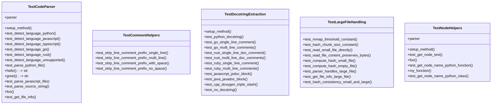

# test_parser.py

## File Overview

This file contains comprehensive test suites for the code parsing functionality in the local_deepwiki system. It tests the [CodeParser](../src/local_deepwiki/core/parser.md) class and various helper functions for parsing source code, extracting metadata, and handling different programming languages.

## Classes

### TestCodeParser

Test suite for the [CodeParser](../src/local_deepwiki/core/parser.md) class that handles source code parsing and language detection.

**Key Methods:**
- `setup_method()` - Initializes a [CodeParser](../src/local_deepwiki/core/parser.md) instance for testing
- `test_detect_language_python()` - Tests Python file detection based on file extensions (.py, .pyi)
- `test_detect_language_javascript()` - Tests JavaScript file detection based on file extensions

### TestNodeHelpers

Test suite for node helper functions that extract information from parsed syntax tree nodes.

**Key Methods:**
- `setup_method()` - Sets up test fixtures with a [CodeParser](../src/local_deepwiki/core/parser.md) instance
- `test_get_node_text()` - Tests extracting source code text from syntax tree nodes
- `test_get_node_name_python_function()` - Tests extracting function names from Python syntax nodes

### TestCommentHelpers

Test suite for comment-related helper functions (referenced but implementation not shown in provided code).

### TestDocstringExtraction

Comprehensive test suite for extracting documentation strings from various programming languages.

**Key Methods:**
- `setup_method()` - Initializes parser for docstring extraction tests
- `test_python_docstring()` - Tests Python docstring extraction from function definitions
- `test_go_single_line_comment()` - Tests Go single-line comment extraction
- `test_go_multi_line_comments()` - Tests Go multi-line comment extraction
- `test_rust_single_line_doc_comment()` - Tests Rust single-line documentation comment extraction
- `test_rust_multi_line_doc_comments()` - Tests Rust multi-line documentation comment extraction
- `test_ruby_single_line_comment()` - Tests Ruby single-line comment extraction
- `test_ruby_multi_line_comments()` - Tests Ruby multi-line comment extraction
- `test_javascript_jsdoc_block()` - Tests JavaScript JSDoc block extraction
- `test_java_javadoc_block()` - Tests Java Javadoc block extraction
- `test_cpp_doxygen_triple_slash()` - Tests C++ Doxygen triple-slash comment extraction
- `test_no_docstring()` - Tests handling of code without documentation

### TestLargeFileHandling

Test suite for handling large source code files (referenced but implementation not shown in provided code).

## Functions

The tests verify various imported helper functions:

- `_collect_preceding_comments()` - Collects comments that precede code elements
- `_compute_file_hash()` - Computes hash values for files
- `_read_file_content()` - Reads file content with appropriate handling
- `_strip_line_comment_prefix()` - Removes comment prefixes from lines
- `find_nodes_by_type()` - Finds syntax tree nodes by their type
- `get_docstring()` - Extracts documentation strings from code
- `get_node_name()` - Gets the name identifier from syntax tree nodes
- `get_node_text()` - Extracts source text from syntax tree nodes

## Usage Examples

### Testing Language Detection

```python
parser = CodeParser()
assert parser.detect_language(Path("test.py")) == Language.PYTHON
assert parser.detect_language(Path("test.js")) == Language.JAVASCRIPT
```

### Testing Docstring Extraction

```python
code = b'''def hello():
    """This is a docstring."""
    pass'''
root = parser.parse_source(code, Language.PYTHON)
func_node = root.children[0]
docstring = get_docstring(func_node, code, Language.PYTHON)
assert docstring == "This is a docstring."
```

### Testing Node Text Extraction

```python
code = b"def foo(): pass"
root = parser.parse_source(code, Language.PYTHON)
func_node = root.children[0]
text = get_node_text(func_node, code)
assert text == "def foo(): pass"
```

## Related Components

This test file works with several core components:

- **[CodeParser](../src/local_deepwiki/core/parser.md)** - The [main](../src/local_deepwiki/watcher.md) parser class being tested
- **Language** - Enumeration of supported programming languages
- Various helper functions from the `local_deepwiki.core.parser` module
- Constants like `HASH_CHUNK_SIZE` and `MMAP_THRESHOLD_BYTES` for file processing configuration

The tests use pytest fixtures and temporary files for isolated testing of parsing functionality across multiple programming languages.

## API Reference

### class `TestCodeParser`

Test suite for [CodeParser](../src/local_deepwiki/core/parser.md).

**Methods:**

#### `setup_method`

```python
def setup_method()
```

Set up test fixtures.

#### `test_detect_language_python`

```python
def test_detect_language_python()
```

Test Python language detection.

#### `test_detect_language_javascript`

```python
def test_detect_language_javascript()
```

Test JavaScript language detection.

#### `test_detect_language_typescript`

```python
def test_detect_language_typescript()
```

Test TypeScript language detection.

#### `test_detect_language_go`

```python
def test_detect_language_go()
```

Test Go language detection.

#### `test_detect_language_rust`

```python
def test_detect_language_rust()
```

Test Rust language detection.

#### `test_detect_language_unsupported`

```python
def test_detect_language_unsupported()
```

Test unsupported file extensions.

#### `test_parse_python_file`

```python
def test_parse_python_file(tmp_path)
```

Test parsing a Python file.


| [Parameter](../src/local_deepwiki/generators/api_docs.md) | Type | Default | Description |
|-----------|------|---------|-------------|
| `tmp_path` | - | - | - |

#### `test_parse_javascript_file`

```python
def test_parse_javascript_file(tmp_path)
```

Test parsing a JavaScript file.


| [Parameter](../src/local_deepwiki/generators/api_docs.md) | Type | Default | Description |
|-----------|------|---------|-------------|
| `tmp_path` | - | - | - |

#### `test_parse_source_string`

```python
def test_parse_source_string()
```

Test parsing source code from a string.

#### `test_get_file_info`

```python
def test_get_file_info(tmp_path)
```

Test getting file info.


| [Parameter](../src/local_deepwiki/generators/api_docs.md) | Type | Default | Description |
|-----------|------|---------|-------------|
| `tmp_path` | - | - | - |


### class `TestNodeHelpers`

Test node helper functions.

**Methods:**

#### `setup_method`

```python
def setup_method()
```

Set up test fixtures.

#### `test_get_node_text`

```python
def test_get_node_text()
```

Test extracting text from nodes.

#### `test_get_node_name_python_function`

```python
def test_get_node_name_python_function()
```

Test getting name from Python function.

#### `test_get_node_name_python_class`

```python
def test_get_node_name_python_class()
```

Test getting name from Python class.


### class `TestCommentHelpers`

Tests for comment collection helper functions.

**Methods:**

#### `test_strip_line_comment_prefix_single_line`

```python
def test_strip_line_comment_prefix_single_line()
```

Test stripping prefix from single comment.

#### `test_strip_line_comment_prefix_multi_line`

```python
def test_strip_line_comment_prefix_multi_line()
```

Test stripping prefix from multiple comments.

#### `test_strip_line_comment_prefix_with_space`

```python
def test_strip_line_comment_prefix_with_space()
```

Test stripping prefix preserves content after space.

#### `test_strip_line_comment_prefix_no_space`

```python
def test_strip_line_comment_prefix_no_space()
```

Test stripping prefix without space after prefix.


### class `TestDocstringExtraction`

Tests for docstring extraction from various languages.

**Methods:**

#### `setup_method`

```python
def setup_method()
```

Set up test fixtures.

#### `test_python_docstring`

```python
def test_python_docstring()
```

Test extracting Python docstring.

#### `test_go_single_line_comment`

```python
def test_go_single_line_comment()
```

Test Go single-line doc comment.

#### `test_go_multi_line_comments`

```python
def test_go_multi_line_comments()
```

Test Go multi-line doc comments.

#### `test_rust_single_line_doc_comment`

```python
def test_rust_single_line_doc_comment()
```

Test Rust single-line doc comment.

#### `test_rust_multi_line_doc_comments`

```python
def test_rust_multi_line_doc_comments()
```

Test Rust multi-line doc comments.

#### `test_ruby_single_line_comment`

```python
def test_ruby_single_line_comment()
```

Test Ruby single-line doc comment.

#### `test_ruby_multi_line_comments`

```python
def test_ruby_multi_line_comments()
```

Test Ruby multi-line doc comments.

#### `test_javascript_jsdoc_block`

```python
def test_javascript_jsdoc_block()
```

Test JavaScript JSDoc block comment.

#### `test_java_javadoc_block`

```python
def test_java_javadoc_block()
```

Test Java Javadoc block comment.

#### `test_cpp_doxygen_triple_slash`

```python
def test_cpp_doxygen_triple_slash()
```

Test C++ Doxygen triple-slash comments.

#### `test_no_docstring`

```python
def test_no_docstring()
```

Test function without docstring.


### class `TestLargeFileHandling`

Tests for memory-efficient large file handling.

**Methods:**

#### `test_mmap_threshold_constant`

```python
def test_mmap_threshold_constant()
```

Test that MMAP threshold is set to 1 MB.

#### `test_hash_chunk_size_constant`

```python
def test_hash_chunk_size_constant()
```

Test that hash chunk size is set to 64 KB.

#### `test_read_small_file_directly`

```python
def test_read_small_file_directly()
```

Test that small files are read directly.

#### `test_read_file_content_preserves_bytes`

```python
def test_read_file_content_preserves_bytes()
```

Test that file content is preserved exactly.

#### `test_compute_hash_small_file`

```python
def test_compute_hash_small_file()
```

Test hash computation for small file.

#### `test_compute_hash_empty_file`

```python
def test_compute_hash_empty_file()
```

Test hash computation for empty file.

#### `test_parser_handles_large_file`

```python
def test_parser_handles_large_file()
```

Test that parser can handle files above mmap threshold.

#### `test_get_file_info_large_file`

```python
def test_get_file_info_large_file()
```

Test get_file_info uses chunked hashing for large files.

#### `test_hash_consistency_small_and_large`

```python
def test_hash_consistency_small_and_large()
```

Test that hash is consistent regardless of file size.


## Class Diagram



## Call Graph

```mermaid
flowchart TD
    N0[CodeParser]
    N1[NamedTemporaryFile]
    N2[Path]
    N3[TestDocstringExtraction.tes...]
    N4[TestDocstringExtraction.tes...]
    N5[TestDocstringExtraction.tes...]
    N6[TestDocstringExtraction.tes...]
    N7[TestDocstringExtraction.tes...]
    N8[TestDocstringExtraction.tes...]
    N9[TestDocstringExtraction.tes...]
    N10[TestDocstringExtraction.tes...]
    N11[TestDocstringExtraction.tes...]
    N12[TestLargeFileHandling.test_...]
    N13[TestLargeFileHandling.test_...]
    N14[TestLargeFileHandling.test_...]
    N15[TestLargeFileHandling.test_...]
    N16[TestLargeFileHandling.test_...]
    N17[TestLargeFileHandling.test_...]
    N18[TestLargeFileHandling.test_...]
    N19[_strip_line_comment_prefix]
    N20[detect_language]
    N21[find_nodes_by_type]
    N22[flush]
    N23[get_docstring]
    N24[hexdigest]
    N25[parse_file]
    N26[parse_source]
    N27[sha256]
    N28[write]
    N29[write_text]
    N5 --> N26
    N5 --> N21
    N5 --> N23
    N4 --> N26
    N4 --> N21
    N4 --> N23
    N11 --> N26
    N11 --> N21
    N11 --> N23
    N10 --> N26
    N10 --> N21
    N10 --> N23
    N9 --> N26
    N9 --> N21
    N9 --> N23
    N8 --> N26
    N8 --> N21
    N8 --> N23
    N7 --> N26
    N7 --> N21
    N7 --> N23
    N6 --> N26
    N6 --> N21
    N6 --> N23
    N3 --> N26
    N3 --> N21
    N3 --> N23
    N18 --> N1
    N18 --> N28
    N18 --> N22
    N18 --> N2
    N17 --> N1
    N17 --> N28
    N17 --> N22
    N17 --> N2
    N13 --> N1
    N13 --> N28
    N13 --> N22
    N13 --> N2
    N13 --> N24
    N13 --> N27
    N12 --> N1
    N12 --> N22
    N12 --> N2
    N12 --> N24
    N12 --> N27
    N16 --> N0
    N16 --> N1
    N16 --> N28
    N16 --> N22
    N16 --> N25
    N16 --> N2
    N14 --> N0
    N14 --> N2
    N14 --> N24
    N14 --> N27
    N15 --> N1
    N15 --> N28
    N15 --> N22
    N15 --> N2
    N15 --> N24
    N15 --> N27
    classDef func fill:#e1f5fe
    class N0,N1,N2,N19,N20,N21,N22,N23,N24,N25,N26,N27,N28,N29 func
    classDef method fill:#fff3e0
    class N3,N4,N5,N6,N7,N8,N9,N10,N11,N12,N13,N14,N15,N16,N17,N18 method
```



## Relevant Source Files

- `tests/test_parser.py:24-123`

## See Also

- [test_api_docs](test_api_docs.md) - shares 4 dependencies
- [test_indexer](test_indexer.md) - shares 4 dependencies
