# test_pdf_export.py

## File Overview

This test file contains comprehensive unit tests for the PDF export functionality in the local_deepwiki package. It tests various components including the [PdfExporter](../src/local_deepwiki/export/pdf.md) class, mermaid diagram handling, markdown rendering for PDF output, and the [export_to_pdf](../src/local_deepwiki/export/pdf.md) convenience function.

## Test Classes

### TestRenderMarkdownForPdf

Tests PDF-specific markdown rendering functionality.

**Methods:**
- `test_basic_markdown()` - Verifies basic markdown to HTML conversion
- `test_code_blocks()` - Tests fenced code block rendering
- `test_table()` - Tests table rendering (method signature visible but implementation truncated)

### TestPdfExporter

Main test class for the [PdfExporter](../src/local_deepwiki/export/pdf.md) functionality.

**Fixtures:**
- `sample_wiki(tmp_path)` - Creates a sample wiki structure for testing

**Methods:**
- `test_collect_pages_in_order()` - Verifies pages are collected according to TOC order
- `test_extract_paths_from_toc()` - Tests TOC path extraction (method visible but implementation not shown)
- `test_build_toc_html()` - Tests HTML generation for table of contents
- `test_export_single_creates_pdf()` - Verifies single PDF export functionality
- `test_export_single_with_directory_output()` - Tests export when output is a directory
- `test_export_separate_creates_multiple_pdfs()` - Tests creation of multiple PDF files
- `test_export_separate_preserves_directory_structure()` - Verifies directory structure preservation

### TestExportToPdf

Tests for the [export_to_pdf](../src/local_deepwiki/export/pdf.md) convenience function.

**Fixtures:**
- `simple_wiki(tmp_path)` - Creates a minimal wiki structure for testing

**Methods:**
- `test_raises_for_nonexistent_wiki()` - Tests error handling for invalid wiki paths (implementation truncated)

### TestMermaidHandling

Tests mermaid diagram handling when CLI is not available.

**Methods:**
- `test_mermaid_replaced_with_note()` - Verifies mermaid diagrams are replaced with informational notes
- `test_regular_code_blocks_preserved()` - Ensures regular code blocks remain unchanged (implementation truncated)

### TestIsMmdcAvailable

Tests the mermaid CLI availability detection.

**Methods:**
- `test_mmdc_available()` - Tests when mmdc CLI tool is available
- `test_mmdc_not_av()` - Tests when mmdc CLI tool is not available (implementation truncated)

### TestRenderMermaidToPng

Tests PNG rendering functionality for mermaid diagrams.

**Methods:**
- `test_returns_none_when_mmdc_unavailable()` - Verifies None return when mmdc is unavailable
- `test_returns_none_on_cli_error()` - Tests error handling for CLI failures (implementation truncated)

### TestMermaidCliRendering

Tests mermaid rendering when CLI is available.

**Methods:**
- `test_renders_mermaid_when_cli_available()` - Tests PNG rendering when mmdc CLI is present

## Imported Components

The test file imports and tests the following components from `local_deepwiki.export.pdf`:

- [`PdfExporter`](../src/local_deepwiki/export/pdf.md) - Main class for PDF export operations
- [`export_to_pdf`](../src/local_deepwiki/export/pdf.md) - Convenience function for PDF export
- [`extract_mermaid_blocks`](../src/local_deepwiki/export/pdf.md) - Function to extract mermaid diagram blocks
- [`extract_title`](../src/local_deepwiki/export/pdf.md) - Function to extract document titles
- [`is_mmdc_available`](../src/local_deepwiki/export/pdf.md) - Function to check mermaid CLI availability
- [`render_markdown_for_pdf`](../src/local_deepwiki/export/pdf.md) - Function for PDF-specific markdown rendering
- [`render_mermaid_to_png`](../src/local_deepwiki/export/pdf.md) - Function to render mermaid diagrams as PNG
- [`render_mermaid_to_svg`](../src/local_deepwiki/export/pdf.md) - Function to render mermaid diagrams as SVG
- `PRINT_CSS` - CSS constants for PDF styling

## Usage Examples

### Testing PDF Export

```python
# Create a PdfExporter instance
exporter = PdfExporter(sample_wiki, output_path)

# Export as single PDF
result = exporter.export_single()

# Export as separate PDFs
results = exporter.export_separate()
```

### Testing Markdown Rendering

```python
# Render markdown for PDF
html = render_markdown_for_pdf(markdown_content)

# Render with mermaid handling disabled
html = render_markdown_for_pdf(markdown_content, render_mermaid=False)
```

### Testing Mermaid CLI Availability

```python
# Check if mermaid CLI is available
available = is_mmdc_available()

# Render mermaid to PNG (returns None if unavailable)
png_data = render_mermaid_to_png("graph TD\nA-->B")
```

The tests use mocking extensively to isolate functionality and avoid dependencies on external tools like WeasyPrint and the mermaid CLI during testing.

## API Reference

### class `TestRenderMarkdownForPdf`

Tests for PDF-specific markdown rendering.

**Methods:**

#### `test_basic_markdown`

```python
def test_basic_markdown()
```

Test basic markdown conversion.

#### `test_code_blocks`

```python
def test_code_blocks()
```

Test fenced code blocks.

#### `test_tables`

```python
def test_tables()
```

Test markdown tables.

#### `test_mermaid_blocks_replaced_with_note`

```python
def test_mermaid_blocks_replaced_with_note()
```

Test that mermaid blocks are replaced with a note when CLI unavailable.

#### `test_multiple_mermaid_blocks`

```python
def test_multiple_mermaid_blocks()
```

Test handling multiple mermaid blocks when CLI unavailable.


### class `TestExtractTitle`

Tests for title extraction.

**Methods:**

#### `test_h1_title`

```python
def test_h1_title(tmp_path: Path)
```

Test extracting H1 title.


| [Parameter](../src/local_deepwiki/generators/api_docs.md) | Type | Default | Description |
|-----------|------|---------|-------------|
| `tmp_path` | `Path` | - | - |

#### `test_bold_title`

```python
def test_bold_title(tmp_path: Path)
```

Test extracting bold title.


| [Parameter](../src/local_deepwiki/generators/api_docs.md) | Type | Default | Description |
|-----------|------|---------|-------------|
| `tmp_path` | `Path` | - | - |

#### `test_fallback_to_filename`

```python
def test_fallback_to_filename(tmp_path: Path)
```

Test fallback to filename when no title found.


| [Parameter](../src/local_deepwiki/generators/api_docs.md) | Type | Default | Description |
|-----------|------|---------|-------------|
| `tmp_path` | `Path` | - | - |

#### `test_h1_with_leading_whitespace`

```python
def test_h1_with_leading_whitespace(tmp_path: Path)
```

Test extracting H1 title with leading whitespace.


| [Parameter](../src/local_deepwiki/generators/api_docs.md) | Type | Default | Description |
|-----------|------|---------|-------------|
| `tmp_path` | `Path` | - | - |


### class `TestPdfExporter`

Tests for [PdfExporter](../src/local_deepwiki/export/pdf.md) class.

**Methods:**

#### `sample_wiki`

```python
def sample_wiki(tmp_path: Path) -> Path
```

Create a sample wiki structure for testing.


| [Parameter](../src/local_deepwiki/generators/api_docs.md) | Type | Default | Description |
|-----------|------|---------|-------------|
| `tmp_path` | `Path` | - | - |

#### `test_collect_pages_in_order`

```python
def test_collect_pages_in_order(sample_wiki: Path, tmp_path: Path)
```

Test that pages are collected in TOC order.


| [Parameter](../src/local_deepwiki/generators/api_docs.md) | Type | Default | Description |
|-----------|------|---------|-------------|
| `sample_wiki` | `Path` | - | - |
| `tmp_path` | `Path` | - | - |

#### `test_extract_paths_from_toc`

```python
def test_extract_paths_from_toc(sample_wiki: Path, tmp_path: Path)
```

Test extracting paths from nested TOC.


| [Parameter](../src/local_deepwiki/generators/api_docs.md) | Type | Default | Description |
|-----------|------|---------|-------------|
| `sample_wiki` | `Path` | - | - |
| `tmp_path` | `Path` | - | - |

#### `test_build_toc_html`

```python
def test_build_toc_html(sample_wiki: Path, tmp_path: Path)
```

Test building TOC HTML.


| [Parameter](../src/local_deepwiki/generators/api_docs.md) | Type | Default | Description |
|-----------|------|---------|-------------|
| `sample_wiki` | `Path` | - | - |
| `tmp_path` | `Path` | - | - |

#### `test_export_single_creates_pdf`

```python
def test_export_single_creates_pdf(mock_html_class, sample_wiki: Path, tmp_path: Path)
```

Test that export_single creates a PDF file.


| [Parameter](../src/local_deepwiki/generators/api_docs.md) | Type | Default | Description |
|-----------|------|---------|-------------|
| `mock_html_class` | - | - | - |
| `sample_wiki` | `Path` | - | - |
| `tmp_path` | `Path` | - | - |

#### `test_export_single_with_directory_output`

```python
def test_export_single_with_directory_output(mock_html_class, sample_wiki: Path, tmp_path: Path)
```

Test export_single with directory as output path.


| [Parameter](../src/local_deepwiki/generators/api_docs.md) | Type | Default | Description |
|-----------|------|---------|-------------|
| `mock_html_class` | - | - | - |
| `sample_wiki` | `Path` | - | - |
| `tmp_path` | `Path` | - | - |

#### `test_export_separate_creates_multiple_pdfs`

```python
def test_export_separate_creates_multiple_pdfs(mock_html_class, sample_wiki: Path, tmp_path: Path)
```

Test that export_separate creates multiple PDF files.


| [Parameter](../src/local_deepwiki/generators/api_docs.md) | Type | Default | Description |
|-----------|------|---------|-------------|
| `mock_html_class` | - | - | - |
| `sample_wiki` | `Path` | - | - |
| `tmp_path` | `Path` | - | - |

#### `test_export_separate_preserves_directory_structure`

```python
def test_export_separate_preserves_directory_structure(mock_html_class, sample_wiki: Path, tmp_path: Path)
```

Test that export_separate preserves directory structure.


| [Parameter](../src/local_deepwiki/generators/api_docs.md) | Type | Default | Description |
|-----------|------|---------|-------------|
| `mock_html_class` | - | - | - |
| `sample_wiki` | `Path` | - | - |
| `tmp_path` | `Path` | - | - |


### class `TestExportToPdf`

Tests for the [export_to_pdf](../src/local_deepwiki/export/pdf.md) convenience function.

**Methods:**

#### `simple_wiki`

```python
def simple_wiki(tmp_path: Path) -> Path
```

Create a simple wiki for testing.


| [Parameter](../src/local_deepwiki/generators/api_docs.md) | Type | Default | Description |
|-----------|------|---------|-------------|
| `tmp_path` | `Path` | - | - |

#### `test_raises_for_nonexistent_wiki`

```python
def test_raises_for_nonexistent_wiki(tmp_path: Path)
```

Test that export raises for nonexistent wiki path.


| [Parameter](../src/local_deepwiki/generators/api_docs.md) | Type | Default | Description |
|-----------|------|---------|-------------|
| `tmp_path` | `Path` | - | - |

#### `test_default_output_path_single`

```python
def test_default_output_path_single(mock_html_class, simple_wiki: Path)
```

Test default output path for single file mode.


| [Parameter](../src/local_deepwiki/generators/api_docs.md) | Type | Default | Description |
|-----------|------|---------|-------------|
| `mock_html_class` | - | - | - |
| `simple_wiki` | `Path` | - | - |

#### `test_default_output_path_separate`

```python
def test_default_output_path_separate(mock_html_class, simple_wiki: Path)
```

Test default output path for separate file mode.


| [Parameter](../src/local_deepwiki/generators/api_docs.md) | Type | Default | Description |
|-----------|------|---------|-------------|
| `mock_html_class` | - | - | - |
| `simple_wiki` | `Path` | - | - |

#### `test_custom_output_path`

```python
def test_custom_output_path(mock_html_class, simple_wiki: Path, tmp_path: Path)
```

Test custom output path.


| [Parameter](../src/local_deepwiki/generators/api_docs.md) | Type | Default | Description |
|-----------|------|---------|-------------|
| `mock_html_class` | - | - | - |
| `simple_wiki` | `Path` | - | - |
| `tmp_path` | `Path` | - | - |

#### `test_string_paths_accepted`

```python
def test_string_paths_accepted(mock_html_class, simple_wiki: Path, tmp_path: Path)
```

Test that string paths are accepted.


| [Parameter](../src/local_deepwiki/generators/api_docs.md) | Type | Default | Description |
|-----------|------|---------|-------------|
| `mock_html_class` | - | - | - |
| `simple_wiki` | `Path` | - | - |
| `tmp_path` | `Path` | - | - |


### class `TestPrintCss`

Tests for print CSS content.

**Methods:**

#### `test_print_css_has_page_rules`

```python
def test_print_css_has_page_rules()
```

Test that print CSS has @page rules.

#### `test_print_css_has_page_numbers`

```python
def test_print_css_has_page_numbers()
```

Test that print CSS includes page numbers.

#### `test_print_css_avoids_page_breaks_in_code`

```python
def test_print_css_avoids_page_breaks_in_code()
```

Test that print CSS avoids page breaks inside code blocks.

#### `test_print_css_keeps_headings_with_content`

```python
def test_print_css_keeps_headings_with_content()
```

Test that print CSS keeps headings with following content.


### class `TestMermaidHandling`

Tests for mermaid diagram handling in PDF export without CLI.

**Methods:**

#### `test_mermaid_replaced_with_note`

```python
def test_mermaid_replaced_with_note()
```

Test that mermaid diagrams are replaced with a note when CLI unavailable.

#### `test_regular_code_blocks_preserved`

```python
def test_regular_code_blocks_preserved()
```

Test that regular code blocks are preserved.

#### `test_mixed_code_blocks`

```python
def test_mixed_code_blocks()
```

Test document with both mermaid and regular code blocks.


### class `TestExtractMermaidBlocks`

Tests for mermaid block extraction.

**Methods:**

#### `test_extract_single_block`

```python
def test_extract_single_block()
```

Test extracting a single mermaid block.

#### `test_extract_multiple_blocks`

```python
def test_extract_multiple_blocks()
```

Test extracting multiple mermaid blocks.

#### `test_no_mermaid_blocks`

```python
def test_no_mermaid_blocks()
```

Test content with no mermaid blocks.

#### `test_diagram_code_stripped`

```python
def test_diagram_code_stripped()
```

Test that diagram code is stripped of whitespace.


### class `TestIsMmdcAvailable`

Tests for mermaid CLI availability check.

**Methods:**

#### `test_mmdc_available`

```python
def test_mmdc_available(mock_which)
```

Test when mmdc is available.


| [Parameter](../src/local_deepwiki/generators/api_docs.md) | Type | Default | Description |
|-----------|------|---------|-------------|
| `mock_which` | - | - | - |

#### `test_mmdc_not_available`

```python
def test_mmdc_not_available(mock_which)
```

Test when mmdc is not available.


| [Parameter](../src/local_deepwiki/generators/api_docs.md) | Type | Default | Description |
|-----------|------|---------|-------------|
| `mock_which` | - | - | - |

#### `test_result_is_cached`

```python
def test_result_is_cached(mock_which)
```

Test that the result is cached.


| [Parameter](../src/local_deepwiki/generators/api_docs.md) | Type | Default | Description |
|-----------|------|---------|-------------|
| `mock_which` | - | - | - |


### class `TestRenderMermaidToSvg`

Tests for mermaid to SVG rendering.

**Methods:**

#### `test_returns_none_when_mmdc_unavailable`

```python
def test_returns_none_when_mmdc_unavailable(mock_available)
```

Test that None is returned when mmdc is not available.


| [Parameter](../src/local_deepwiki/generators/api_docs.md) | Type | Default | Description |
|-----------|------|---------|-------------|
| `mock_available` | - | - | - |

#### `test_renders_svg_successfully`

```python
def test_renders_svg_successfully(mock_available, mock_run, tmp_path)
```

Test successful SVG rendering.


| [Parameter](../src/local_deepwiki/generators/api_docs.md) | Type | Default | Description |
|-----------|------|---------|-------------|
| `mock_available` | - | - | - |
| `mock_run` | - | - | - |
| `tmp_path` | - | - | - |

#### `test_returns_none_on_cli_error`

```python
def test_returns_none_on_cli_error(mock_available, mock_run)
```

Test that None is returned on CLI error.


| [Parameter](../src/local_deepwiki/generators/api_docs.md) | Type | Default | Description |
|-----------|------|---------|-------------|
| `mock_available` | - | - | - |
| `mock_run` | - | - | - |

#### `test_handles_timeout`

```python
def test_handles_timeout(mock_available)
```

Test that timeout is handled gracefully.


| [Parameter](../src/local_deepwiki/generators/api_docs.md) | Type | Default | Description |
|-----------|------|---------|-------------|
| `mock_available` | - | - | - |


### class `TestRenderMermaidToPng`

Tests for mermaid to PNG rendering.

**Methods:**

#### `test_returns_none_when_mmdc_unavailable`

```python
def test_returns_none_when_mmdc_unavailable(mock_available)
```

Test that None is returned when mmdc is not available.


| [Parameter](../src/local_deepwiki/generators/api_docs.md) | Type | Default | Description |
|-----------|------|---------|-------------|
| `mock_available` | - | - | - |

#### `test_returns_none_on_cli_error`

```python
def test_returns_none_on_cli_error(mock_available, mock_run)
```

Test that None is returned on CLI error.


| [Parameter](../src/local_deepwiki/generators/api_docs.md) | Type | Default | Description |
|-----------|------|---------|-------------|
| `mock_available` | - | - | - |
| `mock_run` | - | - | - |

#### `test_handles_timeout`

```python
def test_handles_timeout(mock_available)
```

Test that timeout is handled gracefully.


| [Parameter](../src/local_deepwiki/generators/api_docs.md) | Type | Default | Description |
|-----------|------|---------|-------------|
| `mock_available` | - | - | - |


### class `TestMermaidCliRendering`

Tests for mermaid rendering with CLI available (uses PNG).

**Methods:**

#### `test_renders_mermaid_when_cli_available`

```python
def test_renders_mermaid_when_cli_available(mock_available, mock_render)
```

Test that mermaid diagrams are rendered as PNG when CLI is available.


| [Parameter](../src/local_deepwiki/generators/api_docs.md) | Type | Default | Description |
|-----------|------|---------|-------------|
| `mock_available` | - | - | - |
| `mock_render` | - | - | - |

#### `test_falls_back_on_render_failure`

```python
def test_falls_back_on_render_failure(mock_available, mock_render)
```

Test fallback to placeholder when render fails.


| [Parameter](../src/local_deepwiki/generators/api_docs.md) | Type | Default | Description |
|-----------|------|---------|-------------|
| `mock_available` | - | - | - |
| `mock_render` | - | - | - |

#### `test_renders_multiple_diagrams`

```python
def test_renders_multiple_diagrams(mock_available, mock_render)
```

Test rendering multiple mermaid diagrams as PNG.


| [Parameter](../src/local_deepwiki/generators/api_docs.md) | Type | Default | Description |
|-----------|------|---------|-------------|
| `mock_available` | - | - | - |
| `mock_render` | - | - | - |


## Class Diagram


## Call Graph

```mermaid
flowchart TD
    N0[MagicMock]
    N1[PdfExporter]
    N2[TestExportToPdf.simple_wiki]
    N3[TestExportToPdf.test_raises...]
    N4[TestExtractTitle.test_bold_...]
    N5[TestExtractTitle.test_fallb...]
    N6[TestExtractTitle.test_h1_title]
    N7[TestExtractTitle.test_h1_wi...]
    N8[TestPdfExporter.sample_wiki]
    N9[TestPdfExporter.test_build_...]
    N10[TestPdfExporter.test_collec...]
    N11[TestPdfExporter.test_export...]
    N12[TestPdfExporter.test_export...]
    N13[TestPdfExporter.test_export...]
    N14[TestPdfExporter.test_export...]
    N15[TestPdfExporter.test_extrac...]
    N16[TestRenderMermaidToPng.test...]
    N17[TestRenderMermaidToSvg.test...]
    N18[assert_called_once]
    N19[export_separate]
    N20[export_single]
    N21[export_to_pdf]
    N22[extract_mermaid_blocks]
    N23[extract_title]
    N24[is_mmdc_available]
    N25[mkdir]
    N26[render_markdown_for_pdf]
    N27[render_mermaid_to_png]
    N28[render_mermaid_to_svg]
    N29[write_text]
    N6 --> N29
    N6 --> N23
    N4 --> N29
    N4 --> N23
    N5 --> N29
    N5 --> N23
    N7 --> N29
    N7 --> N23
    N8 --> N25
    N8 --> N29
    N10 --> N1
    N15 --> N1
    N9 --> N1
    N13 --> N0
    N13 --> N1
    N13 --> N20
    N13 --> N18
    N14 --> N25
    N14 --> N0
    N14 --> N1
    N14 --> N20
    N11 --> N0
    N11 --> N1
    N11 --> N19
    N12 --> N0
    N12 --> N1
    N12 --> N19
    N2 --> N25
    N2 --> N29
    N3 --> N21
    N17 --> N28
    N16 --> N27
    classDef func fill:#e1f5fe
    class N0,N1,N18,N19,N20,N21,N22,N23,N24,N25,N26,N27,N28,N29 func
    classDef method fill:#fff3e0
    class N2,N3,N4,N5,N6,N7,N8,N9,N10,N11,N12,N13,N14,N15,N16,N17 method
```



## Relevant Source Files

- `tests/test_pdf_export.py:21-80`

## See Also

- [pdf](../src/local_deepwiki/export/pdf.md) - dependency
- [test_indexer](test_indexer.md) - shares 4 dependencies
