# test_provider_errors.py

## File Overview

This file contains test cases for error handling in the Ollama provider implementation. It focuses on testing connection errors, model not found errors, provider health checks, generation functionality, provider naming, and retry [decorator](../src/local_deepwiki/providers/base.md) behavior.

## Classes

### MockModel

A mock model class used for testing purposes.

### MockListResponse

A mock response class for simulating list operations in tests.

### TestOllamaConnectionError

Tests for the [OllamaConnectionError](../src/local_deepwiki/providers/llm/ollama.md) exception class.

**Key Methods:**

- `test_error_message_includes_url()` - Verifies that the error message contains the base URL when an [OllamaConnectionError](../src/local_deepwiki/providers/llm/ollama.md) is raised
- `test_error_message_includes_instructions()` - Ensures that the error message includes setup instructions, specifically mentioning the `ollama serve` command

### TestOllamaModelNotFoundError

Tests for the [OllamaModelNotFoundError](../src/local_deepwiki/providers/llm/ollama.md) exception class.

### TestOllamaProviderHealthCheck

Tests for the health check functionality of the [OllamaProvider](../src/local_deepwiki/providers/llm/ollama.md).

### TestOllamaProviderGenerate

Tests for the generation functionality of the [OllamaProvider](../src/local_deepwiki/providers/llm/ollama.md).

### TestOllamaProviderName

Tests for the naming functionality of the [OllamaProvider](../src/local_deepwiki/providers/llm/ollama.md).

### TestRetryDecorator

Tests for the retry [decorator](../src/local_deepwiki/providers/base.md) functionality.

## Functions

### make_li

A utility function used within the test suite (specific implementation details not shown in the provided code).

## Usage Examples

### Testing Connection Errors

```python
def test_error_message_includes_url(self):
    """Test that error message includes the base URL."""
    error = OllamaConnectionError("http://localhost:11434")
    assert "http://localhost:11434" in str(error)
    assert "Cannot connect to Ollama" in str(error)
```

### Testing Setup Instructions

```python
def test_error_message_includes_instructions(self):
    """Test that error message includes setup instructions."""
    error = OllamaConnectionError("http://localhost:11434")
    assert "ollama serve" in str(error)
```

## Related Components

This test file works with the following components:

- **[OllamaConnectionError](../src/local_deepwiki/providers/llm/ollama.md)** - Exception class for connection-related errors
- **[OllamaModelNotFoundError](../src/local_deepwiki/providers/llm/ollama.md)** - Exception class for model not found errors  
- **[OllamaProvider](../src/local_deepwiki/providers/llm/ollama.md)** - Main provider class for Ollama integration
- **[with_retry](../src/local_deepwiki/providers/base.md)** - Decorator for implementing retry logic
- **pytest** - Testing framework used for test execution
- **unittest.mock.patch** - Mocking functionality for isolating tests

The tests use pytest as the testing framework and include mock objects to simulate various error conditions and responses from the Ollama service.

## API Reference

### class `MockModel`

Mock ollama Model object.

### class `MockListResponse`

Mock ollama ListResponse object.

### class `TestOllamaConnectionError`

Tests for [OllamaConnectionError](../src/local_deepwiki/providers/llm/ollama.md).

**Methods:**

#### `test_error_message_includes_url`

```python
def test_error_message_includes_url()
```

Test that error message includes the base URL.

#### `test_error_message_includes_instructions`

```python
def test_error_message_includes_instructions()
```

Test that error message includes setup instructions.

#### `test_stores_original_error`

```python
def test_stores_original_error()
```

Test that original error is stored.


### class `TestOllamaModelNotFoundError`

Tests for [OllamaModelNotFoundError](../src/local_deepwiki/providers/llm/ollama.md).

**Methods:**

#### `test_error_message_includes_model_name`

```python
def test_error_message_includes_model_name()
```

Test that error message includes the model name.

#### `test_error_message_includes_pull_command`

```python
def test_error_message_includes_pull_command()
```

Test that error message includes pull command.

#### `test_error_message_lists_available_models`

```python
def test_error_message_lists_available_models()
```

Test that error message lists available models.

#### `test_truncates_long_model_list`

```python
def test_truncates_long_model_list()
```

Test that long model list is truncated.


### class `TestOllamaProviderHealthCheck`

Tests for [OllamaProvider](../src/local_deepwiki/providers/llm/ollama.md) health check.

**Methods:**

#### `test_health_check_success`

```python
async def test_health_check_success()
```

Test successful health check.

#### `test_health_check_model_not_found`

```python
async def test_health_check_model_not_found()
```

Test health check when model is not available.

#### `test_health_check_connection_error`

```python
async def test_health_check_connection_error()
```

Test health check when Ollama is not accessible.


### class `TestOllamaProviderGenerate`

Tests for [OllamaProvider](../src/local_deepwiki/providers/llm/ollama.md) generate method.

**Methods:**

#### `test_generate_checks_health_once`

```python
async def test_generate_checks_health_once()
```

Test that generate checks health only once.

#### `test_generate_with_system_prompt`

```python
async def test_generate_with_system_prompt()
```

Test generate with system prompt.


### class `TestOllamaProviderName`

Tests for [OllamaProvider](../src/local_deepwiki/providers/llm/ollama.md) name property.

**Methods:**

#### `test_name_includes_model`

```python
def test_name_includes_model()
```

Test that name includes model.

#### `test_name_with_tag`

```python
def test_name_with_tag()
```

Test that name includes model with tag.


### class `TestRetryDecorator`

Tests for retry [decorator](../src/local_deepwiki/providers/base.md) behavior.

**Methods:**

#### `test_retry_on_transient_error`

```python
async def test_retry_on_transient_error()
```

Test that transient errors trigger retry.

#### `flaky_function`

```python
async def flaky_function()
```

#### `test_retry_gives_up_after_max_attempts`

```python
async def test_retry_gives_up_after_max_attempts()
```

Test that retry gives up after max attempts.

#### `always_fails`

```python
async def always_fails()
```

#### `test_no_retry_on_non_retryable_error`

```python
async def test_no_retry_on_non_retryable_error()
```

Test that non-retryable errors are not retried.

#### `raises_value_error`

```python
async def raises_value_error()
```


---

### Functions

#### `make_list_response`

```python
def make_list_response(model_names: list[str]) -> MockListResponse
```

Create a mock list response with the given model names.


| [Parameter](../src/local_deepwiki/generators/api_docs.md) | Type | Default | Description |
|-----------|------|---------|-------------|
| `model_names` | `list[str]` | - | - |

**Returns:** `MockListResponse`


## Class Diagram

```mermaid
classDiagram
    class MockListResponse {
        +models: list[MockModel]
    }
    class MockModel {
        +model: str
    }
    class TestOllamaConnectionError {
        +test_error_message_includes_url()
        +test_error_message_includes_instructions()
        +test_stores_original_error()
    }
    class TestOllamaModelNotFoundError {
        +test_error_message_includes_model_name()
        +test_error_message_includes_pull_command()
        +test_error_message_lists_available_models()
        +test_truncates_long_model_list()
    }
    class TestOllamaProviderGenerate {
        +test_generate_checks_health_once()
        +test_generate_with_system_prompt()
    }
    class TestOllamaProviderHealthCheck {
        +test_health_check_success()
        +test_health_check_model_not_found()
        +test_health_check_connection_error()
    }
    class TestOllamaProviderName {
        +test_name_includes_model()
        +test_name_with_tag()
    }
    class TestRetryDecorator {
        +test_retry_on_transient_error()
        +flaky_function()
        +test_retry_gives_up_after_max_attempts()
        +always_fails()
        +test_no_retry_on_non_retryable_error()
        +raises_value_error()
    }
```



## Call Graph

```mermaid
flowchart TD
    N0[ConnectionError]
    N1[MockListResponse]
    N2[MockModel]
    N3[OllamaConnectionError]
    N4[OllamaModelNotFoundError]
    N5[OllamaProvider]
    N6[TestOllamaConnectionError.t...]
    N7[TestOllamaConnectionError.t...]
    N8[TestOllamaConnectionError.t...]
    N9[TestOllamaModelNotFoundErro...]
    N10[TestOllamaModelNotFoundErro...]
    N11[TestOllamaModelNotFoundErro...]
    N12[TestOllamaModelNotFoundErro...]
    N13[TestOllamaProviderGenerate....]
    N14[TestOllamaProviderGenerate....]
    N15[TestOllamaProviderHealthChe...]
    N16[TestOllamaProviderHealthChe...]
    N17[TestOllamaProviderHealthChe...]
    N18[TestOllamaProviderName.test...]
    N19[TestOllamaProviderName.test...]
    N20[TestRetryDecorator.test_no_...]
    N21[TestRetryDecorator.test_ret...]
    N22[TestRetryDecorator.test_ret...]
    N23[ValueError]
    N24[check_health]
    N25[generate]
    N26[make_list_response]
    N27[object]
    N28[raises]
    N29[with_retry]
    N26 --> N1
    N26 --> N2
    N7 --> N3
    N6 --> N3
    N8 --> N0
    N8 --> N3
    N9 --> N4
    N10 --> N4
    N11 --> N4
    N12 --> N4
    N17 --> N5
    N17 --> N27
    N17 --> N26
    N17 --> N24
    N16 --> N5
    N16 --> N27
    N16 --> N26
    N16 --> N28
    N16 --> N24
    N15 --> N5
    N15 --> N27
    N15 --> N0
    N15 --> N28
    N15 --> N24
    N13 --> N5
    N13 --> N27
    N13 --> N25
    N14 --> N5
    N14 --> N27
    N14 --> N25
    N18 --> N5
    N19 --> N5
    N22 --> N29
    N22 --> N0
    N21 --> N29
    N21 --> N0
    N21 --> N28
    N20 --> N29
    N20 --> N23
    N20 --> N28
    classDef func fill:#e1f5fe
    class N0,N1,N2,N3,N4,N5,N23,N24,N25,N26,N27,N28,N29 func
    classDef method fill:#fff3e0
    class N6,N7,N8,N9,N10,N11,N12,N13,N14,N15,N16,N17,N18,N19,N20,N21,N22 method
```



## Relevant Source Files

- `tests/test_provider_errors.py:16-19`

## See Also

- [test_vectorstore](test_vectorstore.md) - shares 2 dependencies
- [test_indexer](test_indexer.md) - shares 2 dependencies
- [test_pdf_export](test_pdf_export.md) - shares 2 dependencies
