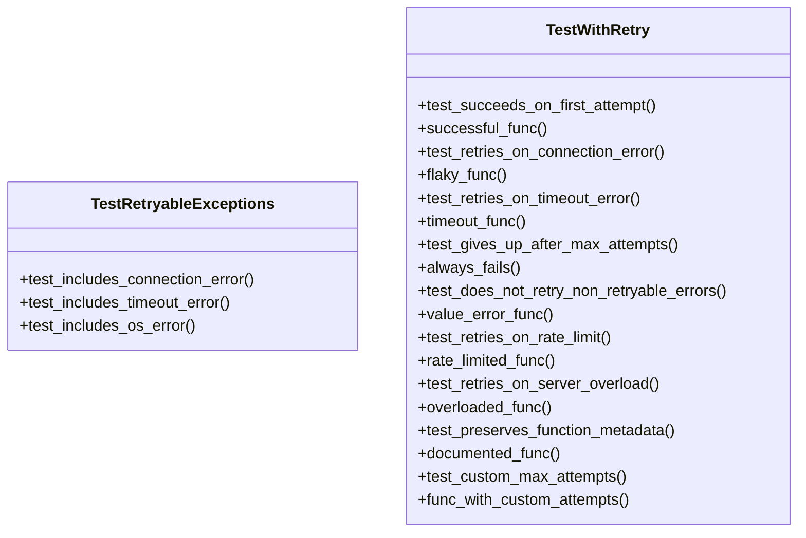

# File Overview

This file contains tests for the retry functionality implemented in the `local_deepwiki.providers.base` module. It verifies that the `with_retry` decorator correctly handles retry logic for various retryable exceptions, including connection errors, timeout errors, and others, as defined in the `RETRYABLE_EXCEPTIONS` tuple.

# Classes

## TestWithRetry

This class contains tests for the `with_retry` decorator functionality.

### Methods

- **test_succeeds_on_first_attempt**: Tests that a function succeeds on the first attempt without retries.
- **test_retries_on_connection_error**: Tests that `ConnectionError` triggers retries.
- **test_retries_on_timeout_error**: Tests that `TimeoutError` triggers retries.
- **test_gives_up_after_max_attempts**: Tests that the function gives up after the maximum number of attempts.
- **test_does_not_retry_non_retryable_errors**: Tests that non-retryable errors (like `ValueError`) are raised immediately without retries.
- **test_retries_on_rate_limit**: Tests that rate limit errors trigger retries.
- **test_retries_on_server_overload**: Tests that 503 service unavailable errors trigger retries.
- **test_preserves_function_metadata**: Tests that function metadata is preserved when using the decorator.
- **test_custom_max_attempts**: Tests that a custom `max_attempts` parameter is respected.

## TestRetryableExceptions

This class tests the `RETRYABLE_EXCEPTIONS` tuple to ensure it includes specific exceptions that should be retried.

### Methods

- **test_includes_connection_error**: Ensures `ConnectionError` is in the `RETRYABLE_EXCEPTIONS` tuple.
- **test_includes_timeout_error**: Ensures `TimeoutError` is in the `RETRYABLE_EXCEPTIONS` tuple.
- **test_includes_os_error**: Ensures `OSError` is in the `RETRYABLE_EXCEPTIONS` tuple.

# Functions

## with_retry

This is a decorator that adds retry logic to asynchronous functions. It retries the function on specific exceptions defined in `RETRYABLE_EXCEPTIONS`.

### Parameters

- `max_attempts` (int, optional): The maximum number of retry attempts. Defaults to 3.
- `base_delay` (float, optional): The base delay in seconds between retries. Defaults to 0.01.

### Returns

The decorated function that will retry on retryable exceptions.

## RETRYABLE_EXCEPTIONS

A tuple containing exceptions that are considered retryable. This includes `ConnectionError`, `TimeoutError`, and `OSError`.

# Usage Examples

### Basic usage of `with_retry`:

```python
from local_deepwiki.providers.base import with_retry

@with_retry(max_attempts=3, base_delay=0.1)
async def my_function():
    # Function logic here
    pass
```

### Testing retry behavior:

```python
import pytest
from local_deepwiki.providers.base import with_retry

async def test_retry_behavior():
    call_count = 0

    @with_retry(max_attempts=3, base_delay=0.01)
    async def flaky_func():
        nonlocal call_count
        call_count += 1
        if call_count < 3:
            raise ConnectionError("Connection refused")
        return "success"

    result = await flaky_func()
    assert result == "success"
    assert call_count == 3
```

# Related Components

- The `with_retry` decorator is imported from `local_deepwiki.providers.base`.
- The `RETRYABLE_EXCEPTIONS` tuple is also imported from `local_deepwiki.providers.base`.
- This file uses `pytest` for testing.

## API Reference

### class `TestWithRetry`

Tests for the with_retry decorator.

**Methods:**

#### `test_succeeds_on_first_attempt`

```python
async def test_succeeds_on_first_attempt()
```

Test that successful calls work normally.

#### `successful_func`

```python
async def successful_func()
```

#### `test_retries_on_connection_error`

```python
async def test_retries_on_connection_error()
```

Test that connection errors trigger retry.

#### `flaky_func`

```python
async def flaky_func()
```

#### `test_retries_on_timeout_error`

```python
async def test_retries_on_timeout_error()
```

Test that timeout errors trigger retry.

#### `timeout_func`

```python
async def timeout_func()
```

#### `test_gives_up_after_max_attempts`

```python
async def test_gives_up_after_max_attempts()
```

Test that function gives up after max attempts.

#### `always_fails`

```python
async def always_fails()
```

#### `test_does_not_retry_non_retryable_errors`

```python
async def test_does_not_retry_non_retryable_errors()
```

Test that non-retryable errors are raised immediately.

#### `value_error_func`

```python
async def value_error_func()
```

#### `test_retries_on_rate_limit`

```python
async def test_retries_on_rate_limit()
```

Test that rate limit errors trigger retry.

#### `rate_limited_func`

```python
async def rate_limited_func()
```

#### `test_retries_on_server_overload`

```python
async def test_retries_on_server_overload()
```

Test that 503 errors trigger retry.

#### `overloaded_func`

```python
async def overloaded_func()
```

#### `test_preserves_function_metadata`

```python
async def test_preserves_function_metadata()
```

Test that decorator preserves function name and docstring.

#### `documented_func`

```python
async def documented_func()
```

This is a docstring.

#### `test_custom_max_attempts`

```python
async def test_custom_max_attempts()
```

Test that max_attempts parameter is respected.

#### `func_with_custom_attempts`

```python
async def func_with_custom_attempts()
```


### class `TestRetryableExceptions`

Tests for the RETRYABLE_EXCEPTIONS tuple.

**Methods:**

#### `test_includes_connection_error`

```python
def test_includes_connection_error()
```

Test that ConnectionError is retryable.

#### `test_includes_timeout_error`

```python
def test_includes_timeout_error()
```

Test that TimeoutError is retryable.

#### `test_includes_os_error`

```python
def test_includes_os_error()
```

Test that OSError is retryable.


## Class Diagram



## Call Graph

```mermaid
flowchart TD
    N0[ConnectionError]
    N1[Exception]
    N2[TestWithRetry.always_fails]
    N3[TestWithRetry.flaky_func]
    N4[TestWithRetry.func_with_cus...]
    N5[TestWithRetry.overloaded_func]
    N6[TestWithRetry.rate_limited_...]
    N7[TestWithRetry.test_custom_m...]
    N8[TestWithRetry.test_does_not...]
    N9[TestWithRetry.test_gives_up...]
    N10[TestWithRetry.test_preserve...]
    N11[TestWithRetry.test_retries_...]
    N12[TestWithRetry.test_retries_...]
    N13[TestWithRetry.test_retries_...]
    N14[TestWithRetry.test_retries_...]
    N15[TestWithRetry.test_succeeds...]
    N16[TestWithRetry.timeout_func]
    N17[TestWithRetry.value_error_func]
    N18[TimeoutError]
    N19[ValueError]
    N20[always_fails]
    N21[flaky_func]
    N22[func_with_custom_attempts]
    N23[overloaded_func]
    N24[raises]
    N25[rate_limited_func]
    N26[successful_func]
    N27[timeout_func]
    N28[value_error_func]
    N29[with_retry]
    N15 --> N29
    N15 --> N26
    N11 --> N29
    N11 --> N0
    N11 --> N21
    N3 --> N0
    N14 --> N29
    N14 --> N18
    N14 --> N27
    N16 --> N18
    N9 --> N29
    N9 --> N0
    N9 --> N24
    N9 --> N20
    N2 --> N0
    N8 --> N29
    N8 --> N19
    N8 --> N24
    N8 --> N28
    N17 --> N19
    N12 --> N29
    N12 --> N1
    N12 --> N25
    N6 --> N1
    N13 --> N29
    N13 --> N1
    N13 --> N23
    N5 --> N1
    N10 --> N29
    N7 --> N29
    N7 --> N0
    N7 --> N22
    N4 --> N0
    classDef func fill:#e1f5fe
    class N0,N1,N18,N19,N20,N21,N22,N23,N24,N25,N26,N27,N28,N29 func
    classDef method fill:#fff3e0
    class N2,N3,N4,N5,N6,N7,N8,N9,N10,N11,N12,N13,N14,N15,N16,N17 method
```



## Relevant Source Files

- `tests/test_retry.py:8-144`

## See Also

- [test_vectorstore](test_vectorstore.md) - shares 2 dependencies
