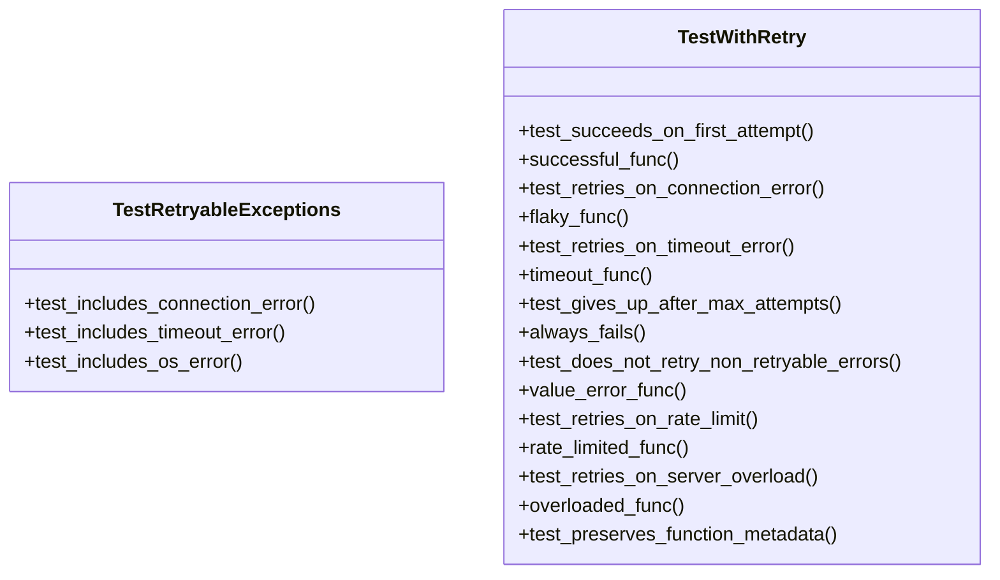

# test_retry.py

## File Overview

This test module validates the retry functionality provided by the `with_retry` decorator and the `RETRYABLE_EXCEPTIONS` tuple from the `local_deepwiki.providers.base` module. The tests ensure that the retry mechanism properly handles various types of exceptions and respects configuration parameters.

## Classes

### TestWithRetry

The primary test class that validates the behavior of the `with_retry` decorator through comprehensive test scenarios.

**Key Test Methods:**

- `test_succeeds_on_first_attempt` - Verifies that successful functions execute normally without retries
- `test_retries_on_connection_error` - Tests retry behavior when `ConnectionError` is raised
- `test_retries_on_timeout_error` - Tests retry behavior when `TimeoutError` is raised  
- `test_gives_up_after_max_attempts` - Validates that retries stop after reaching the maximum attempt limit
- `test_does_not_retry_non_retryable_errors` - Ensures non-retryable exceptions like `ValueError` are raised immediately
- `test_retries_on_rate_limit` - Tests retry behavior for rate limiting scenarios
- `test_retries_on_server_overload` - Tests retry behavior for server overload (503) errors
- `test_custom_max_attempts` - Validates that custom `max_attempts` parameter is respected

### TestRetryableExceptions

A focused test class that validates the contents of the `RETRYABLE_EXCEPTIONS` tuple.

**Test Methods:**

- `test_includes_connection_error` - Verifies `ConnectionError` is in the retryable exceptions
- `test_includes_timeout_error` - Verifies `TimeoutError` is in the retryable exceptions  
- `test_includes_os_error` - Verifies `OSError` is in the retryable exceptions

## Usage Examples

### Basic Retry Testing

```python
@with_retry(max_attempts=3, base_delay=0.01)
async def flaky_func():
    # Function that may fail and needs retry
    if some_condition:
        raise ConnectionError("Connection refused")
    return "success"

# Test the retry behavior
result = await flaky_func()
assert result == "success"
```

### Testing Non-Retryable Errors

```python
@with_retry(max_attempts=3, base_delay=0.01)
async def value_error_func():
    raise ValueError("Invalid value")

# This will raise immediately without retries
with pytest.raises(ValueError):
    await value_error_func()
```

### Custom Retry Configuration

```python
@with_retry(max_attempts=5, base_delay=0.01)
async def func_with_custom_attempts():
    # Function with custom retry attempts
    pass
```

## Related Components

- **`local_deepwiki.providers.base.with_retry`** - The retry decorator being tested
- **`local_deepwiki.providers.base.RETRYABLE_EXCEPTIONS`** - Tuple of exception types that trigger retries
- **`pytest`** - Testing framework used for assertions and exception handling

## Test Configuration

All tests use minimal delay settings (`base_delay=0.01`) to ensure fast test execution while still validating the retry timing mechanisms. The tests cover both successful retry scenarios and failure cases where the maximum attempt limit is reached.

## API Reference

### class `TestWithRetry`

Tests for the with_retry decorator.

**Methods:**

#### `test_succeeds_on_first_attempt`

```python
async def test_succeeds_on_first_attempt()
```

Test that successful calls work normally.

#### `successful_func`

```python
async def successful_func()
```

#### `test_retries_on_connection_error`

```python
async def test_retries_on_connection_error()
```

Test that connection errors trigger retry.

#### `flaky_func`

```python
async def flaky_func()
```

#### `test_retries_on_timeout_error`

```python
async def test_retries_on_timeout_error()
```

Test that timeout errors trigger retry.

#### `timeout_func`

```python
async def timeout_func()
```

#### `test_gives_up_after_max_attempts`

```python
async def test_gives_up_after_max_attempts()
```

Test that function gives up after max attempts.

#### `always_fails`

```python
async def always_fails()
```

#### `test_does_not_retry_non_retryable_errors`

```python
async def test_does_not_retry_non_retryable_errors()
```

Test that non-retryable errors are raised immediately.

#### `value_error_func`

```python
async def value_error_func()
```

#### `test_retries_on_rate_limit`

```python
async def test_retries_on_rate_limit()
```

Test that rate limit errors trigger retry.

#### `rate_limited_func`

```python
async def rate_limited_func()
```

#### `test_retries_on_server_overload`

```python
async def test_retries_on_server_overload()
```

Test that 503 errors trigger retry.

#### `overloaded_func`

```python
async def overloaded_func()
```

#### `test_preserves_function_metadata`

```python
async def test_preserves_function_metadata()
```

Test that decorator preserves function name and docstring.

#### `documented_func`

```python
async def documented_func()
```

This is a docstring.

#### `test_custom_max_attempts`

```python
async def test_custom_max_attempts()
```

Test that max_attempts parameter is respected.

#### `func_with_custom_attempts`

```python
async def func_with_custom_attempts()
```


### class `TestRetryableExceptions`

Tests for the RETRYABLE_EXCEPTIONS tuple.

**Methods:**

#### `test_includes_connection_error`

```python
def test_includes_connection_error()
```

Test that ConnectionError is retryable.

#### `test_includes_timeout_error`

```python
def test_includes_timeout_error()
```

Test that TimeoutError is retryable.

#### `test_includes_os_error`

```python
def test_includes_os_error()
```

Test that OSError is retryable.


## Class Diagram



## Call Graph

```mermaid
flowchart TD
    N0[ConnectionError]
    N1[Exception]
    N2[TestWithRetry.always_fails]
    N3[TestWithRetry.flaky_func]
    N4[TestWithRetry.func_with_cus...]
    N5[TestWithRetry.overloaded_func]
    N6[TestWithRetry.rate_limited_...]
    N7[TestWithRetry.test_custom_m...]
    N8[TestWithRetry.test_does_not...]
    N9[TestWithRetry.test_gives_up...]
    N10[TestWithRetry.test_preserve...]
    N11[TestWithRetry.test_retries_...]
    N12[TestWithRetry.test_retries_...]
    N13[TestWithRetry.test_retries_...]
    N14[TestWithRetry.test_retries_...]
    N15[TestWithRetry.test_succeeds...]
    N16[TestWithRetry.timeout_func]
    N17[TestWithRetry.value_error_func]
    N18[TimeoutError]
    N19[ValueError]
    N20[always_fails]
    N21[flaky_func]
    N22[func_with_custom_attempts]
    N23[overloaded_func]
    N24[raises]
    N25[rate_limited_func]
    N26[successful_func]
    N27[timeout_func]
    N28[value_error_func]
    N29[with_retry]
    N15 --> N29
    N15 --> N26
    N11 --> N29
    N11 --> N0
    N11 --> N21
    N3 --> N0
    N14 --> N29
    N14 --> N18
    N14 --> N27
    N16 --> N18
    N9 --> N29
    N9 --> N0
    N9 --> N24
    N9 --> N20
    N2 --> N0
    N8 --> N29
    N8 --> N19
    N8 --> N24
    N8 --> N28
    N17 --> N19
    N12 --> N29
    N12 --> N1
    N12 --> N25
    N6 --> N1
    N13 --> N29
    N13 --> N1
    N13 --> N23
    N5 --> N1
    N10 --> N29
    N7 --> N29
    N7 --> N0
    N7 --> N22
    N4 --> N0
    classDef func fill:#e1f5fe
    class N0,N1,N18,N19,N20,N21,N22,N23,N24,N25,N26,N27,N28,N29 func
    classDef method fill:#fff3e0
    class N2,N3,N4,N5,N6,N7,N8,N9,N10,N11,N12,N13,N14,N15,N16,N17 method
```



## Relevant Source Files

- `tests/test_retry.py:8-144`

## See Also

- [test_vectorstore](test_vectorstore.md) - shares 2 dependencies
