# test_search.py

## File Overview

This file contains unit tests for the search functionality of the local_deepwiki system. It tests various components involved in generating and serving search indexes, including text extraction, search entry generation, and the web API endpoint.

## Classes

### TestExtractHeadings

Tests for the [`extract_headings`](../src/local_deepwiki/generators/search.md) function that extracts heading text from markdown content.

### TestExtractCodeTerms

Tests for the [`extract_code_terms`](../src/local_deepwiki/generators/search.md) function that identifies code-related terms from markdown content.

### TestExtractSnippet

Tests for the [`extract_snippet`](../src/local_deepwiki/generators/search.md) function that generates text snippets from page content.

### TestGenerateSearchEntry

Tests for the [`generate_search_entry`](../src/local_deepwiki/generators/search.md) function.

**Key Methods:**
- `test_generates_complete_entry()` - Verifies that all required fields are populated in a search entry, including path, title, headings, and terms

### TestGenerateSearchIndex

Tests for the [`generate_search_index`](../src/local_deepwiki/generators/search.md) function that creates search indexes from wiki pages.

### TestWriteSearchIndex

Tests for the [`write_search_index`](../src/local_deepwiki/generators/search.md) function that persists search indexes to disk.

**Key Methods:**
- `test_writes_json_file()` - Verifies that the search index is correctly written to a JSON file on disk

### TestSearchJsonEndpoint

Tests for the Flask web application's `/search.json` endpoint.

**Key Methods:**
- `test_returns_search_index()` - Tests that the endpoint returns the search index data

## Functions Tested

Based on the imports, this test file covers the following functions from the search module:

- [`extract_code_terms`](../src/local_deepwiki/generators/search.md) - Extracts code-related terms from content
- [`extract_headings`](../src/local_deepwiki/generators/search.md) - Extracts heading text from markdown
- [`extract_snippet`](../src/local_deepwiki/generators/search.md) - Generates content snippets
- [`generate_search_entry`](../src/local_deepwiki/generators/search.md) - Creates search index entries for pages
- [`generate_search_index`](../src/local_deepwiki/generators/search.md) - Builds complete search indexes
- [`write_search_index`](../src/local_deepwiki/generators/search.md) - Persists search data to disk

## Usage Examples

### Testing Search Entry Generation

```python
page = WikiPage(
    path="files/wiki.md",
    title="Wiki Generator", 
    content="# Wiki Generator\n\nUse `WikiGenerator` class.",
    generated_at=0,
)
entry = generate_search_entry(page)
```

### Testing Search Index Writing

```python
with tempfile.TemporaryDirectory() as tmpdir:
    wiki_path = Path(tmpdir)
    pages = [
        WikiPage(
            path="index.md",
            title="Test",
            content="# Test\n\n`TestClass` content.",
            generated_at=0,
        ),
    ]
    result_path = write_search_index(wiki_path, pages)
```

## Related Components

This test file works with several key components:

- **[WikiPage](../src/local_deepwiki/models.md)** - The core page model used throughout the tests
- **Search generators** - Functions from `local_deepwiki.generators.search` for building search functionality
- **Flask web app** - Tests the web interface through the [`create_app`](../src/local_deepwiki/web/app.md) function
- **File system operations** - Uses `tempfile` and `pathlib.Path` for testing file operations

The tests use `pytest` as the testing framework and rely on temporary directories for isolated file system testing.

## API Reference

### class `TestExtractHeadings`

Tests for [extract_headings](../src/local_deepwiki/generators/search.md) function.

**Methods:**

#### `test_extracts_h1_headings`

```python
def test_extracts_h1_headings()
```

Test extraction of h1 headings.

#### `test_extracts_multiple_heading_levels`

```python
def test_extracts_multiple_heading_levels()
```

Test extraction of h1, h2, h3 headings.

#### `test_removes_markdown_formatting`

```python
def test_removes_markdown_formatting()
```

Test that markdown formatting is stripped from headings.

#### `test_empty_content`

```python
def test_empty_content()
```

Test with empty content.


### class `TestExtractCodeTerms`

Tests for [extract_code_terms](../src/local_deepwiki/generators/search.md) function.

**Methods:**

#### `test_extracts_simple_terms`

```python
def test_extracts_simple_terms()
```

Test extraction of simple backticked terms.

#### `test_extracts_qualified_names`

```python
def test_extracts_qualified_names()
```

Test extraction of qualified names.

#### `test_skips_long_code_blocks`

```python
def test_skips_long_code_blocks()
```

Test that long inline code is skipped.

#### `test_empty_content`

```python
def test_empty_content()
```

Test with empty content.


### class `TestExtractSnippet`

Tests for [extract_snippet](../src/local_deepwiki/generators/search.md) function.

**Methods:**

#### `test_extracts_plain_text`

```python
def test_extracts_plain_text()
```

Test basic snippet extraction.

#### `test_removes_code_blocks`

```python
def test_removes_code_blocks()
```

Test that code blocks are removed.

#### `test_removes_headings`

```python
def test_removes_headings()
```

Test that headings are removed.

#### `test_removes_links_keeps_text`

```python
def test_removes_links_keeps_text()
```

Test that link syntax is removed but text is kept.

#### `test_truncates_long_content`

```python
def test_truncates_long_content()
```

Test that long content is truncated.

#### `test_empty_content`

```python
def test_empty_content()
```

Test with empty content.


### class `TestGenerateSearchEntry`

Tests for [generate_search_entry](../src/local_deepwiki/generators/search.md) function.

**Methods:**

#### `test_generates_complete_entry`

```python
def test_generates_complete_entry()
```

Test that all fields are populated.


### class `TestGenerateSearchIndex`

Tests for [generate_search_index](../src/local_deepwiki/generators/search.md) function.

**Methods:**

#### `test_generates_index_for_multiple_pages`

```python
def test_generates_index_for_multiple_pages()
```

Test index generation with multiple pages.


### class `TestWriteSearchIndex`

Tests for [write_search_index](../src/local_deepwiki/generators/search.md) function.

**Methods:**

#### `test_writes_json_file`

```python
def test_writes_json_file()
```

Test that search index is written to disk.


### class `TestSearchJsonEndpoint`

Tests for the Flask /search.json endpoint.

**Methods:**

#### `test_returns_search_index`

```python
def test_returns_search_index()
```

Test that /search.json returns the index.

#### `test_returns_empty_when_no_index`

```python
def test_returns_empty_when_no_index()
```

Test that missing search.json returns empty array.


## Class Diagram

```mermaid
classDiagram
    class TestExtractCodeTerms {
        +test_extracts_simple_terms()
        +test_extracts_qualified_names()
        +test_skips_long_code_blocks()
        +foo()
        +test_empty_content()
    }
    class TestExtractHeadings {
        +test_extracts_h1_headings()
        +test_extracts_multiple_heading_levels()
        +test_removes_markdown_formatting()
        +test_empty_content()
    }
    class TestExtractSnippet {
        +test_extracts_plain_text()
        +test_removes_code_blocks()
        +foo()
        +test_removes_headings()
        +test_removes_links_keeps_text()
        +test_truncates_long_content()
        +test_empty_content()
    }
    class TestGenerateSearchEntry {
        +test_generates_complete_entry()
    }
    class TestGenerateSearchIndex {
        +test_generates_index_for_multiple_pages()
    }
    class TestSearchJsonEndpoint {
        +test_returns_search_index()
        +test_returns_empty_when_no_index()
    }
    class TestWriteSearchIndex {
        +test_writes_json_file()
    }
```



## Call Graph

```mermaid
flowchart TD
    N0[Path]
    N1[TemporaryDirectory]
    N2[TestExtractCodeTerms.test_e...]
    N3[TestExtractCodeTerms.test_e...]
    N4[TestExtractCodeTerms.test_e...]
    N5[TestExtractCodeTerms.test_s...]
    N6[TestExtractHeadings.test_em...]
    N7[TestExtractHeadings.test_ex...]
    N8[TestExtractHeadings.test_ex...]
    N9[TestExtractHeadings.test_re...]
    N10[TestExtractSnippet.test_emp...]
    N11[TestExtractSnippet.test_ext...]
    N12[TestExtractSnippet.test_rem...]
    N13[TestExtractSnippet.test_rem...]
    N14[TestExtractSnippet.test_rem...]
    N15[TestExtractSnippet.test_tru...]
    N16[TestGenerateSearchEntry.tes...]
    N17[TestGenerateSearchIndex.tes...]
    N18[TestSearchJsonEndpoint.test...]
    N19[TestSearchJsonEndpoint.test...]
    N20[TestWriteSearchIndex.test_w...]
    N21[WikiPage]
    N22[create_app]
    N23[extract_code_terms]
    N24[extract_headings]
    N25[extract_snippet]
    N26[generate_search_entry]
    N27[get_json]
    N28[test_client]
    N29[write_text]
    N7 --> N24
    N8 --> N24
    N9 --> N24
    N6 --> N24
    N4 --> N23
    N3 --> N23
    N5 --> N23
    N2 --> N23
    N11 --> N25
    N12 --> N25
    N13 --> N25
    N14 --> N25
    N15 --> N25
    N10 --> N25
    N16 --> N21
    N16 --> N26
    N17 --> N21
    N20 --> N1
    N20 --> N0
    N20 --> N21
    N19 --> N1
    N19 --> N0
    N19 --> N29
    N19 --> N22
    N19 --> N28
    N19 --> N27
    N18 --> N1
    N18 --> N0
    N18 --> N29
    N18 --> N22
    N18 --> N28
    N18 --> N27
    classDef func fill:#e1f5fe
    class N0,N1,N21,N22,N23,N24,N25,N26,N27,N28,N29 func
    classDef method fill:#fff3e0
    class N2,N3,N4,N5,N6,N7,N8,N9,N10,N11,N12,N13,N14,N15,N16,N17,N18,N19,N20 method
```



## Relevant Source Files

- `tests/test_search.py:20-53`

## See Also

- [models](../src/local_deepwiki/models.md) - dependency
- [search](../src/local_deepwiki/generators/search.md) - dependency
- [test_indexer](test_indexer.md) - shares 5 dependencies
- [test_parser](test_parser.md) - shares 4 dependencies
- [test_web](test_web.md) - shares 4 dependencies
