# File: test_search.py

## File Overview

This file contains unit tests for the search-related functionality in the local_deepwiki project. It tests functions that extract information from wiki pages for search indexing, generate search entries, and write search indexes to disk. The tests ensure that search functionality works correctly and that the search index is properly structured.

The file is part of the test suite and works with the core [WikiPage](../src/local_deepwiki/models.md) model and search generation components. It also tests the Flask web application's search endpoint.

## Classes

### TestWriteSearchIndex

Tests for the write_search_index function.

**Methods:**
- `test_writes_json_file`: Tests that the search index is written to disk as a JSON file.

### TestGenerateSearchEntry

Tests for the generate_search_entry function.

**Methods:**
- `test_generates_complete_entry`: Tests that all fields (path, title, headings, terms, snippet) are properly populated in the search entry.

### TestSearchJsonEndpoint

Tests for the Flask /search.json endpoint.

**Methods:**
- `test_returns_search_index`: Tests that the /search.json endpoint returns the correct search index data.

### TestGenerateSearchIndex

Tests for the generate_search_index function.

**Methods:**
- `test_generates_index_for_multiple_pages`: Tests index generation with multiple wiki pages.

### TestExtractHeadings

Tests for the extract_headings function.

**Methods:**
- (Not fully shown in provided code, but would test heading extraction from wiki content)

### TestExtractCodeTerms

Tests for the extract_code_terms function.

**Methods:**
- (Not fully shown in provided code, but would test code term extraction from wiki content)

### TestExtractSnippet

Tests for the extract_snippet function.

**Methods:**
- (Not fully shown in provided code, but would test snippet extraction from wiki content)

## Functions

### extract_code_terms

Extracts code terms (identifiers, class names, etc.) from wiki page content.

**Parameters:**
- `content` (str): The content of the wiki page

**Returns:**
- `list[str]`: A list of code terms found in the content

### extract_headings

Extracts headings from wiki page content.

**Parameters:**
- `content` (str): The content of the wiki page

**Returns:**
- `list[str]`: A list of heading strings found in the content

### extract_snippet

Extracts a snippet from wiki page content.

**Parameters:**
- `content` (str): The content of the wiki page

**Returns:**
- `str`: A snippet of the content, typically the first paragraph or line

### generate_search_entry

Generates a search entry for a single wiki page.

**Parameters:**
- `page` ([WikiPage](../src/local_deepwiki/models.md)): The wiki page to generate a search entry for

**Returns:**
- `dict`: A dictionary containing search entry fields (path, title, headings, terms, snippet)

### generate_search_index

Generates a complete search index for multiple wiki pages.

**Parameters:**
- `pages` (list[[WikiPage](../src/local_deepwiki/models.md)]): A list of wiki pages to index

**Returns:**
- `list[dict]`: A list of search entries, one for each page

### write_search_index

Writes the search index to a JSON file on disk.

**Parameters:**
- `wiki_path` (Path): The path to the wiki directory
- `pages` (list[[WikiPage](../src/local_deepwiki/models.md)]): The list of wiki pages to index

**Returns:**
- `Path`: The path to the written search index file

## Usage Examples

### Generate a search entry for a wiki page

```python
from local_deepwiki.models import WikiPage
from local_deepwiki.generators.search import generate_search_entry

page = WikiPage(
    path="index.md",
    title="Home",
    content="# Home Page\n\nThis is the home page content.",
    generated_at=0,
)
entry = generate_search_entry(page)
print(entry)
# Output: {
#   "path": "index.md",
#   "title": "Home",
#   "headings": ["Home Page"],
#   "terms": [],
#   "snippet": "This is the home page content."
# }
```

### Generate a search index for multiple pages

```python
from local_deepwiki.models import WikiPage
from local_deepwiki.generators.search import generate_search_index

pages = [
    WikiPage(
        path="index.md",
        title="Home",
        content="# Home Page\n\nWelcome to the home page.",
        generated_at=0,
    ),
    WikiPage(
        path="about.md",
        title="About",
        content="# About Us\n\nLearn about our company.",
        generated_at=0,
    ),
]
index = generate_search_index(pages)
print(index)
```

### Write search index to disk

```python
from pathlib import Path
from local_deepwiki.models import WikiPage
from local_deepwiki.generators.search import write_search_index

with tempfile.TemporaryDirectory() as tmpdir:
    wiki_path = Path(tmpdir)
    pages = [
        WikiPage(
            path="index.md",
            title="Home",
            content="# Home Page\n\nWelcome to the home page.",
            generated_at=0,
        ),
    ]
    result_path = write_search_index(wiki_path, pages)
    print(f"Search index written to: {result_path}")
```

## Related Components

This file works with the [WikiPage](../src/local_deepwiki/models.md) model to process wiki content for search indexing. It integrates with the search generation components in the generators.search module. The TestSearchJsonEndpoint class specifically tests the Flask web application's search endpoint, which depends on the search index generation functionality. The tests use the [create_app](../src/local_deepwiki/web/app.md) function to set up a Flask test client for endpoint testing.

## API Reference

### class `TestExtractHeadings`

Tests for extract_headings function.

**Methods:**

#### `test_extracts_h1_headings`

```python
def test_extracts_h1_headings()
```

Test extraction of h1 headings.

#### `test_extracts_multiple_heading_levels`

```python
def test_extracts_multiple_heading_levels()
```

Test extraction of h1, h2, h3 headings.

#### `test_removes_markdown_formatting`

```python
def test_removes_markdown_formatting()
```

Test that markdown formatting is stripped from headings.

#### `test_empty_content`

```python
def test_empty_content()
```

Test with empty content.


### class `TestExtractCodeTerms`

Tests for extract_code_terms function.

**Methods:**

#### `test_extracts_simple_terms`

```python
def test_extracts_simple_terms()
```

Test extraction of simple backticked terms.

#### `test_extracts_qualified_names`

```python
def test_extracts_qualified_names()
```

Test extraction of qualified names.

#### `test_skips_long_code_blocks`

```python
def test_skips_long_code_blocks()
```

Test that long inline code is skipped.

#### `test_empty_content`

```python
def test_empty_content()
```

Test with empty content.


### class `TestExtractSnippet`

Tests for extract_snippet function.

**Methods:**

#### `test_extracts_plain_text`

```python
def test_extracts_plain_text()
```

Test basic snippet extraction.

#### `test_removes_code_blocks`

```python
def test_removes_code_blocks()
```

Test that code blocks are removed.

#### `test_removes_headings`

```python
def test_removes_headings()
```

Test that headings are removed.

#### `test_removes_links_keeps_text`

```python
def test_removes_links_keeps_text()
```

Test that link syntax is removed but text is kept.

#### `test_truncates_long_content`

```python
def test_truncates_long_content()
```

Test that long content is truncated.

#### `test_empty_content`

```python
def test_empty_content()
```

Test with empty content.


### class `TestGenerateSearchEntry`

Tests for generate_search_entry function.

**Methods:**

#### `test_generates_complete_entry`

```python
def test_generates_complete_entry()
```

Test that all fields are populated.


### class `TestGenerateSearchIndex`

Tests for generate_search_index function.

**Methods:**

#### `test_generates_index_for_multiple_pages`

```python
def test_generates_index_for_multiple_pages()
```

Test index generation with multiple pages.


### class `TestWriteSearchIndex`

Tests for write_search_index function.

**Methods:**

#### `test_writes_json_file`

```python
def test_writes_json_file()
```

Test that search index is written to disk.


### class `TestSearchJsonEndpoint`

Tests for the Flask /search.json endpoint.

**Methods:**

#### `test_returns_search_index`

```python
def test_returns_search_index()
```

Test that /search.json returns the index.

#### `test_returns_empty_when_no_index`

```python
def test_returns_empty_when_no_index()
```

Test that missing search.json returns empty array.


## Class Diagram


## Call Graph

```mermaid
flowchart TD
    N0[Path]
    N1[TemporaryDirectory]
    N2[TestExtractCodeTerms.test_e...]
    N3[TestExtractCodeTerms.test_e...]
    N4[TestExtractCodeTerms.test_e...]
    N5[TestExtractCodeTerms.test_s...]
    N6[TestExtractHeadings.test_em...]
    N7[TestExtractHeadings.test_ex...]
    N8[TestExtractHeadings.test_ex...]
    N9[TestExtractHeadings.test_re...]
    N10[TestExtractSnippet.test_emp...]
    N11[TestExtractSnippet.test_ext...]
    N12[TestExtractSnippet.test_rem...]
    N13[TestExtractSnippet.test_rem...]
    N14[TestExtractSnippet.test_rem...]
    N15[TestExtractSnippet.test_tru...]
    N16[TestGenerateSearchEntry.tes...]
    N17[TestGenerateSearchIndex.tes...]
    N18[TestSearchJsonEndpoint.test...]
    N19[TestSearchJsonEndpoint.test...]
    N20[TestWriteSearchIndex.test_w...]
    N21[WikiPage]
    N22[create_app]
    N23[extract_code_terms]
    N24[extract_headings]
    N25[extract_snippet]
    N26[generate_search_entry]
    N27[get_json]
    N28[test_client]
    N29[write_text]
    N7 --> N24
    N8 --> N24
    N9 --> N24
    N6 --> N24
    N4 --> N23
    N3 --> N23
    N5 --> N23
    N2 --> N23
    N11 --> N25
    N12 --> N25
    N13 --> N25
    N14 --> N25
    N15 --> N25
    N10 --> N25
    N16 --> N21
    N16 --> N26
    N17 --> N21
    N20 --> N1
    N20 --> N0
    N20 --> N21
    N19 --> N1
    N19 --> N0
    N19 --> N29
    N19 --> N22
    N19 --> N28
    N19 --> N27
    N18 --> N1
    N18 --> N0
    N18 --> N29
    N18 --> N22
    N18 --> N28
    N18 --> N27
    classDef func fill:#e1f5fe
    class N0,N1,N21,N22,N23,N24,N25,N26,N27,N28,N29 func
    classDef method fill:#fff3e0
    class N2,N3,N4,N5,N6,N7,N8,N9,N10,N11,N12,N13,N14,N15,N16,N17,N18,N19,N20 method
```



## See Also

- [models](../src/local_deepwiki/models.md) - dependency
- [app](../src/local_deepwiki/web/app.md) - dependency
- [test_incremental_wiki](test_incremental_wiki.md) - shares 4 dependencies
