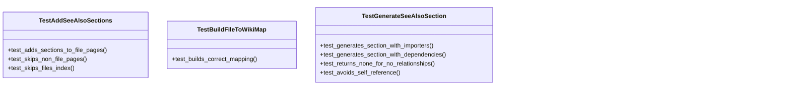

# test_see_also.py

## File Overview

This file contains unit tests for the See Also section generation functionality in the local_deepwiki library. It tests the core components responsible for analyzing file relationships and generating See Also sections that link related documentation pages. The tests ensure that the system correctly identifies import relationships between files and generates appropriate markdown links for cross-referencing.

The file works closely with the see_also module which provides the core logic for relationship analysis and section generation. It also integrates with the [ChunkType](../src/local_deepwiki/models.md), [CodeChunk](../src/local_deepwiki/models.md), [WikiPage](../src/local_deepwiki/models.md), and [Language](../src/local_deepwiki/models.md) models to understand code structure and content.

## Classes

### TestRelationshipAnalyzer

Tests the [RelationshipAnalyzer](../src/local_deepwiki/generators/see_also.md) class which is responsible for analyzing Python code chunks to determine import relationships between files.

Key methods:
- test_analyze_python_imports: Tests that the analyzer correctly identifies import relationships in Python code
- test_get_relationships_imports: Verifies that imported files are properly tracked
- test_get_relationships_imported_by: Ensures that files importing the current file are correctly identified
- test_ignores_non_import_chunks: Confirms that non-import chunks are ignored during analysis
- test_shared_dependencies: Tests that shared dependencies between files are handled correctly

### TestBuildFileToWikiMap

Tests the [build_file_to_wiki_map](../src/local_deepwiki/generators/see_also.md) function which creates a mapping between source file paths and their corresponding documentation file paths.

### TestGenerateSeeAlsoSection

Tests the [generate_see_also_section](../src/local_deepwiki/generators/see_also.md) function which generates the markdown content for See Also sections based on file relationships.

Key methods:
- test_generates_section_with_importers: Tests generating See Also with files that import this file

### TestRelativePath

Tests the _relative_path function which calculates relative paths between documentation files.

Key methods:
- test_same_directory: Tests relative path calculation when files are in the same directory
- test_parent_directory: Tests relative path calculation to parent directory
- test_sibling_directory: Tests relative path calculation to sibling directory

### TestAddSeeAlsoSections

Tests the [add_see_also_sections](../src/local_deepwiki/generators/see_also.md) function which adds See Also sections to existing wiki pages.

Key methods:
- test_adds_sections_to_file_pages: Tests that See Also sections are properly added to file documentation pages

## Functions

### generate_see_also_section

Generates a See Also section for a given file based on its relationships.

**Parameters:**
- relationships: [FileRelationships](../src/local_deepwiki/generators/see_also.md) object containing import and imported_by information
- file_to_wiki: Dictionary mapping file paths to their documentation file paths
- current_file: Path of the current file being processed

**Returns:**
- String containing the markdown content for the See Also section

### add_see_also_sections

Adds See Also sections to existing wiki pages.

**Parameters:**
- analyzer: [RelationshipAnalyzer](../src/local_deepwiki/generators/see_also.md) instance used to analyze file relationships
- wiki_pages: List of [WikiPage](../src/local_deepwiki/models.md) objects to process
- file_to_wiki: Dictionary mapping file paths to their documentation file paths

**Returns:**
- List of [WikiPage](../src/local_deepwiki/models.md) objects with See Also sections added

### _relative_path

Calculates the relative path from one documentation file to another.

**Parameters:**
- from_path: Source documentation file path
- to_path: Target documentation file path

**Returns:**
- String representing the relative path between the two files

## Usage Examples

### Testing Relationship Analysis

```python
def test_relationship_analysis():
    analyzer = RelationshipAnalyzer()
    chunks = [
        CodeChunk(
            id="1",
            file_path="src/module.py",
            language=Language.PYTHON,
            chunk_type=ChunkType.IMPORT,
            name="imports",
            content="import os"
        )
    ]
    relationships = analyzer.analyze_python_imports(chunks)
    assert "os" in relationships.imports
```

### Generating See Also Sections

```python
def test_see_also_generation():
    relationships = FileRelationships(
        file_path="src/module.py",
        imported_by={"src/other_module.py"}
    )
    file_to_wiki = {
        "src/module.py": "files/src/module.md",
        "src/other_module.py": "files/src/other_module.md"
    }
    section = generate_see_also_section(relationships, file_to_wiki, "src/module.py")
    assert "See Also" in section
```

### Adding Sections to Wiki Pages

```python
def test_adding_sections():
    analyzer = RelationshipAnalyzer()
    wiki_pages = [
        WikiPage(
            id="1",
            file_path="src/module.py",
            content="Some content"
        )
    ]
    file_to_wiki = {"src/module.py": "files/src/module.md"}
    updated_pages = add_see_also_sections(analyzer, wiki_pages, file_to_wiki)
    assert len(updated_pages) == 1
```

## Related Components

This test file works with the [RelationshipAnalyzer](../src/local_deepwiki/generators/see_also.md) class to test import relationship detection, the [FileRelationships](../src/local_deepwiki/generators/see_also.md) class to represent file dependencies, and the [WikiPage](../src/local_deepwiki/models.md) model to understand documentation structure. It integrates with the [ChunkType](../src/local_deepwiki/models.md) and [CodeChunk](../src/local_deepwiki/models.md) models to parse code content and with the [Language](../src/local_deepwiki/models.md) enum to identify programming languages. The functionality relies on the see_also module which provides the core logic for generating cross-references between documentation pages.

## API Reference

### class `TestRelationshipAnalyzer`

Tests for [RelationshipAnalyzer](../src/local_deepwiki/generators/see_also.md) class.

**Methods:**

#### `test_analyze_python_imports`

```python
def test_analyze_python_imports()
```

Test analyzing Python import statements.

#### `test_get_relationships_imports`

```python
def test_get_relationships_imports()
```

Test getting import relationships for a file.

#### `test_get_relationships_imported_by`

```python
def test_get_relationships_imported_by()
```

Test finding files that import a given file.

#### `test_ignores_non_import_chunks`

```python
def test_ignores_non_import_chunks()
```

Test that non-import chunks are ignored.

#### `test_shared_dependencies`

```python
def test_shared_dependencies()
```

Test finding files with shared dependencies.


### class `TestBuildFileToWikiMap`

Tests for [build_file_to_wiki_map](../src/local_deepwiki/generators/see_also.md) function.

**Methods:**

#### `test_builds_correct_mapping`

```python
def test_builds_correct_mapping()
```

Test that file paths are correctly mapped to wiki paths.


### class `TestGenerateSeeAlsoSection`

Tests for [generate_see_also_section](../src/local_deepwiki/generators/see_also.md) function.

**Methods:**

#### `test_generates_section_with_importers`

```python
def test_generates_section_with_importers()
```

Test generating See Also with files that import this file.

#### `test_generates_section_with_dependencies`

```python
def test_generates_section_with_dependencies()
```

Test generating See Also with dependency files.

#### `test_returns_none_for_no_relationships`

```python
def test_returns_none_for_no_relationships()
```

Test that None is returned when no related pages exist.

#### `test_avoids_self_reference`

```python
def test_avoids_self_reference()
```

Test that See Also doesn't include the current page.


### class `TestRelativePath`

Tests for _relative_path function.

**Methods:**

#### `test_same_directory`

```python
def test_same_directory()
```

Test relative path in same directory.

#### `test_parent_directory`

```python
def test_parent_directory()
```

Test relative path to parent directory.

#### `test_sibling_directory`

```python
def test_sibling_directory()
```

Test relative path to sibling directory.


### class `TestAddSeeAlsoSections`

Tests for [add_see_also_sections](../src/local_deepwiki/generators/see_also.md) function.

**Methods:**

#### `test_adds_sections_to_file_pages`

```python
def test_adds_sections_to_file_pages()
```

Test that See Also sections are added to file documentation pages.

#### `test_skips_non_file_pages`

```python
def test_skips_non_file_pages()
```

Test that non-file pages are not modified.

#### `test_skips_files_index`

```python
def test_skips_files_index()
```

Test that files/index.md is not modified.


## Class Diagram



## Call Graph

```mermaid
flowchart TD
    N0[CodeChunk]
    N1[FileRelationships]
    N2[RelationshipAnalyzer]
    N3[TestAddSeeAlsoSections.test...]
    N4[TestAddSeeAlsoSections.test...]
    N5[TestAddSeeAlsoSections.test...]
    N6[TestBuildFileToWikiMap.test...]
    N7[TestGenerateSeeAlsoSection....]
    N8[TestGenerateSeeAlsoSection....]
    N9[TestGenerateSeeAlsoSection....]
    N10[TestGenerateSeeAlsoSection....]
    N11[TestRelationshipAnalyzer.te...]
    N12[TestRelationshipAnalyzer.te...]
    N13[TestRelationshipAnalyzer.te...]
    N14[TestRelationshipAnalyzer.te...]
    N15[TestRelationshipAnalyzer.te...]
    N16[TestRelativePath.test_paren...]
    N17[TestRelativePath.test_same_...]
    N18[TestRelativePath.test_sibli...]
    N19[WikiPage]
    N20[_relative_path]
    N21[add_see_also_sections]
    N22[analyze_chunks]
    N23[build_file_to_wiki_map]
    N24[generate_see_also_section]
    N25[get_all_known_files]
    N26[get_relationships]
    N11 --> N2
    N11 --> N0
    N11 --> N22
    N11 --> N25
    N13 --> N2
    N13 --> N0
    N13 --> N22
    N13 --> N26
    N12 --> N2
    N12 --> N0
    N12 --> N22
    N12 --> N26
    N14 --> N2
    N14 --> N0
    N14 --> N22
    N14 --> N25
    N15 --> N2
    N15 --> N0
    N15 --> N22
    N15 --> N26
    N6 --> N19
    N6 --> N23
    N9 --> N1
    N9 --> N24
    N8 --> N1
    N8 --> N24
    N10 --> N1
    N10 --> N24
    N7 --> N1
    N7 --> N24
    N17 --> N20
    N16 --> N20
    N18 --> N20
    N3 --> N2
    N3 --> N0
    N3 --> N22
    N3 --> N19
    N3 --> N21
    N5 --> N2
    N5 --> N19
    N5 --> N21
    N4 --> N2
    N4 --> N19
    N4 --> N21
    classDef func fill:#e1f5fe
    class N0,N1,N2,N19,N20,N21,N22,N23,N24,N25,N26 func
    classDef method fill:#fff3e0
    class N3,N4,N5,N6,N7,N8,N9,N10,N11,N12,N13,N14,N15,N16,N17,N18 method
```



## See Also

- [models](../src/local_deepwiki/models.md) - dependency
- [see_also](../src/local_deepwiki/generators/see_also.md) - dependency
- [test_chunker](test_chunker.md) - shares 2 dependencies
- [test_api_docs](test_api_docs.md) - shares 2 dependencies
