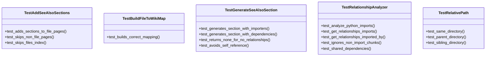

# File Overview

This file, `tests/test_see_also.py`, contains unit tests for the see also section generation functionality within the `local_deepwiki` project. It tests various components related to analyzing file relationships and generating "See Also" sections for documentation pages.

# Classes

## TestRelationshipAnalyzer

Tests for the [RelationshipAnalyzer](../src/local_deepwiki/generators/see_also.md) class, which is responsible for analyzing file import relationships.

### Methods

- `test_analyze_python_imports`: Tests the analysis of Python import statements.
- `test_get_relationships_imports`: Tests retrieving imported files from a given file.
- `test_get_relationships_imported_by`: Tests retrieving files that import a given file.
- `test_ignores_non_import_chunks`: Tests that non-import chunks are ignored during analysis.
- `test_shared_dependencies`: Tests shared dependencies between files.

## TestBuildFileToWikiMap

Tests for the [`build_file_to_wiki_map`](../src/local_deepwiki/generators/see_also.md) function.

### Methods

- `test_builds_map`: Tests building a mapping from file paths to wiki page paths.

## TestGenerateSeeAlsoSection

Tests for the [`generate_see_also_section`](../src/local_deepwiki/generators/see_also.md) function.

### Methods

- `test_generates_section_with_importers`: Tests generating a See Also section with files that import the current file.

## TestRelativePath

Tests for the `_relative_path` function.

### Methods

- `test_same_directory`: Tests relative path calculation in the same directory.
- `test_parent_directory`: Tests relative path calculation to a parent directory.
- `test_sibling_directory`: Tests relative path calculation to a sibling directory.

## TestAddSeeAlsoSections

Tests for the [`add_see_also_sections`](../src/local_deepwiki/generators/see_also.md) function.

### Methods

- `test_adds_sections_to_file_pages`: Tests that See Also sections are added to file documentation pages.

# Functions

## generate_see_also_section

Generates a "See Also" section for a given file based on its relationships.

### Parameters

- `relationships` ([FileRelationships](../src/local_deepwiki/generators/see_also.md)): The file relationships object containing import and imported_by information.
- `file_to_wiki` (dict): A mapping of file paths to wiki page paths.
- `file_path` (str): The path of the file for which to generate the section.

### Returns

- `str`: The generated "See Also" section content.

## add_see_also_sections

Adds "See Also" sections to a list of wiki pages.

### Parameters

- `analyzer` ([RelationshipAnalyzer](../src/local_deepwiki/generators/see_also.md)): The analyzer to use for determining relationships.
- `wiki_pages` (list): List of [WikiPage](../src/local_deepwiki/models.md) objects to process.
- `file_to_wiki` (dict): A mapping of file paths to wiki page paths.

### Returns

- `list`: The list of [WikiPage](../src/local_deepwiki/models.md) objects with "See Also" sections added.

## _relative_path

Calculates the relative path from one file to another.

### Parameters

- `from_path` (str): The source file path.
- `to_path` (str): The target file path.

### Returns

- `str`: The relative path from `from_path` to `to_path`.

# Usage Examples

## Using `generate_see_also_section`

```python
from local_deepwiki.generators.see_also import generate_see_also_section, FileRelationships

relationships = FileRelationships(
    file_path="src/local_deepwiki/core/chunker.py",
    imported_by={"src/local_deepwiki/core/indexer.py"},
)
file_to_wiki = {
    "src/local_deepwiki/core/chunker.py": "files/src/local_deepwiki/core/chunker.md",
    "src/local_deepwiki/core/indexer.py": "files/src/local_deepwiki/core/indexer.md",
}
section = generate_see_also_section(relationships, file_to_wiki, "src/local_deepwiki/core/chunker.py")
```

## Using `add_see_also_sections`

```python
from local_deepwiki.generators.see_also import add_see_also_sections, RelationshipAnalyzer
from local_deepwiki.models import WikiPage

analyzer = RelationshipAnalyzer()
wiki_pages = [WikiPage(...)]
file_to_wiki = {...}
updated_pages = add_see_also_sections(analyzer, wiki_pages, file_to_wiki)
```

# Related Components

This file works with the following components:

- [`RelationshipAnalyzer`](../src/local_deepwiki/generators/see_also.md): Analyzes file import relationships.
- [`FileRelationships`](../src/local_deepwiki/generators/see_also.md): Represents file relationships including imports and being imported by.
- [`WikiPage`](../src/local_deepwiki/models.md): Represents a wiki page with content and metadata.
- [`ChunkType`](../src/local_deepwiki/models.md): Defines types of code chunks.
- [`CodeChunk`](../src/local_deepwiki/models.md): Represents a code chunk with metadata.
- [`Language`](../src/local_deepwiki/models.md): Defines programming languages.
- [`build_file_to_wiki_map`](../src/local_deepwiki/generators/see_also.md): Builds a mapping from file paths to wiki page paths.

## API Reference

### class `TestRelationshipAnalyzer`

Tests for [RelationshipAnalyzer](../src/local_deepwiki/generators/see_also.md) class.

**Methods:**

#### `test_analyze_python_imports`

```python
def test_analyze_python_imports()
```

Test analyzing Python import statements.

#### `test_get_relationships_imports`

```python
def test_get_relationships_imports()
```

Test getting import relationships for a file.

#### `test_get_relationships_imported_by`

```python
def test_get_relationships_imported_by()
```

Test finding files that import a given file.

#### `test_ignores_non_import_chunks`

```python
def test_ignores_non_import_chunks()
```

Test that non-import chunks are ignored.

#### `test_shared_dependencies`

```python
def test_shared_dependencies()
```

Test finding files with shared dependencies.


### class `TestBuildFileToWikiMap`

Tests for [build_file_to_wiki_map](../src/local_deepwiki/generators/see_also.md) function.

**Methods:**

#### `test_builds_correct_mapping`

```python
def test_builds_correct_mapping()
```

Test that file paths are correctly mapped to wiki paths.


### class `TestGenerateSeeAlsoSection`

Tests for [generate_see_also_section](../src/local_deepwiki/generators/see_also.md) function.

**Methods:**

#### `test_generates_section_with_importers`

```python
def test_generates_section_with_importers()
```

Test generating See Also with files that import this file.

#### `test_generates_section_with_dependencies`

```python
def test_generates_section_with_dependencies()
```

Test generating See Also with dependency files.

#### `test_returns_none_for_no_relationships`

```python
def test_returns_none_for_no_relationships()
```

Test that None is returned when no related pages exist.

#### `test_avoids_self_reference`

```python
def test_avoids_self_reference()
```

Test that See Also doesn't include the current page.


### class `TestRelativePath`

Tests for _relative_path function.

**Methods:**

#### `test_same_directory`

```python
def test_same_directory()
```

Test relative path in same directory.

#### `test_parent_directory`

```python
def test_parent_directory()
```

Test relative path to parent directory.

#### `test_sibling_directory`

```python
def test_sibling_directory()
```

Test relative path to sibling directory.


### class `TestAddSeeAlsoSections`

Tests for [add_see_also_sections](../src/local_deepwiki/generators/see_also.md) function.

**Methods:**

#### `test_adds_sections_to_file_pages`

```python
def test_adds_sections_to_file_pages()
```

Test that See Also sections are added to file documentation pages.

#### `test_skips_non_file_pages`

```python
def test_skips_non_file_pages()
```

Test that non-file pages are not modified.

#### `test_skips_files_index`

```python
def test_skips_files_index()
```

Test that files/index.md is not modified.


## Class Diagram



## Call Graph

```mermaid
flowchart TD
    N0[CodeChunk]
    N1[FileRelationships]
    N2[RelationshipAnalyzer]
    N3[TestAddSeeAlsoSections.test...]
    N4[TestAddSeeAlsoSections.test...]
    N5[TestAddSeeAlsoSections.test...]
    N6[TestBuildFileToWikiMap.test...]
    N7[TestGenerateSeeAlsoSection....]
    N8[TestGenerateSeeAlsoSection....]
    N9[TestGenerateSeeAlsoSection....]
    N10[TestGenerateSeeAlsoSection....]
    N11[TestRelationshipAnalyzer.te...]
    N12[TestRelationshipAnalyzer.te...]
    N13[TestRelationshipAnalyzer.te...]
    N14[TestRelationshipAnalyzer.te...]
    N15[TestRelationshipAnalyzer.te...]
    N16[TestRelativePath.test_paren...]
    N17[TestRelativePath.test_same_...]
    N18[TestRelativePath.test_sibli...]
    N19[WikiPage]
    N20[_relative_path]
    N21[add_see_also_sections]
    N22[analyze_chunks]
    N23[build_file_to_wiki_map]
    N24[generate_see_also_section]
    N25[get_all_known_files]
    N26[get_relationships]
    N11 --> N2
    N11 --> N0
    N11 --> N22
    N11 --> N25
    N13 --> N2
    N13 --> N0
    N13 --> N22
    N13 --> N26
    N12 --> N2
    N12 --> N0
    N12 --> N22
    N12 --> N26
    N14 --> N2
    N14 --> N0
    N14 --> N22
    N14 --> N25
    N15 --> N2
    N15 --> N0
    N15 --> N22
    N15 --> N26
    N6 --> N19
    N6 --> N23
    N9 --> N1
    N9 --> N24
    N8 --> N1
    N8 --> N24
    N10 --> N1
    N10 --> N24
    N7 --> N1
    N7 --> N24
    N17 --> N20
    N16 --> N20
    N18 --> N20
    N3 --> N2
    N3 --> N0
    N3 --> N22
    N3 --> N19
    N3 --> N21
    N5 --> N2
    N5 --> N19
    N5 --> N21
    N4 --> N2
    N4 --> N19
    N4 --> N21
    classDef func fill:#e1f5fe
    class N0,N1,N2,N19,N20,N21,N22,N23,N24,N25,N26 func
    classDef method fill:#fff3e0
    class N3,N4,N5,N6,N7,N8,N9,N10,N11,N12,N13,N14,N15,N16,N17,N18 method
```



## Relevant Source Files

- `tests/test_see_also.py`

## See Also

- [see_also](../src/local_deepwiki/generators/see_also.md) - dependency
- [models](../src/local_deepwiki/models.md) - dependency
- [test_chunker](test_chunker.md) - shares 2 dependencies
- [test_api_docs](test_api_docs.md) - shares 2 dependencies
