# test_see_also.py

## File Overview

This test file contains comprehensive unit tests for the "See Also" functionality in the local_deepwiki project. The tests verify the behavior of components that analyze file relationships and generate cross-reference sections for wiki documentation pages.

## Test Classes

### TestRelationshipAnalyzer

Tests for the [RelationshipAnalyzer](../src/local_deepwiki/generators/see_also.md) class, which analyzes code relationships between files.

### TestBuildFileToWikiMap

Tests for the [build_file_to_wiki_map](../src/local_deepwiki/generators/see_also.md) function, which creates mappings between source files and their corresponding wiki documentation pages.

### TestGenerateSeeAlsoSection

Tests for the [generate_see_also_section](../src/local_deepwiki/generators/see_also.md) function, which creates "See Also" sections for documentation pages.

**Key Test Methods:**
- `test_generates_section_with_importers()` - Verifies that the function properly generates See Also sections when files import the current file

### TestRelativePath

Tests for the _relative_path function, which calculates relative paths between documentation files.

**Key Test Methods:**
- `test_same_directory()` - Tests relative path calculation for files in the same directory
- `test_parent_directory()` - Tests relative path calculation to parent directories  
- `test_sibling_directory()` - Tests relative path calculation between sibling directories

### TestAddSeeAlsoSections

Tests for the [add_see_also_sections](../src/local_deepwiki/generators/see_also.md) function, which adds See Also sections to file documentation pages.

**Key Test Methods:**
- `test_adds_sections_to_file_pages()` - Verifies that See Also sections are properly added to file documentation pages

## Test Data and Fixtures

The tests use various test data structures including:

- **[FileRelationships](../src/local_deepwiki/generators/see_also.md)** objects with file paths and import relationships
- **[CodeChunk](../src/local_deepwiki/models.md)** objects representing different types of code elements (imports, classes, functions)
- **[WikiPage](../src/local_deepwiki/models.md)** objects representing documentation pages
- File-to-wiki mapping dictionaries

## Usage Examples

The tests demonstrate how the See Also functionality works:

```python
# Example relationship data used in tests
relationships = FileRelationships(
    file_path="src/local_deepwiki/core/chunker.py",
    imported_by={"src/local_deepwiki/core/indexer.py"},
)

# Example file-to-wiki mapping
file_to_wiki = {
    "src/local_deepwiki/core/chunker.py": "files/src/local_deepwiki/core/chunker.md",
    "src/local_deepwiki/core/indexer.py": "files/src/local_deepwiki/core/indexer.md",
}
```

## Related Components

This test file works with several core components from the local_deepwiki.generators.see_also module:

- **[FileRelationships](../src/local_deepwiki/generators/see_also.md)** - Data structure for storing file relationship information
- **[RelationshipAnalyzer](../src/local_deepwiki/generators/see_also.md)** - Analyzes code relationships between files
- **[WikiPage](../src/local_deepwiki/models.md)** - Represents documentation pages
- **[CodeChunk](../src/local_deepwiki/models.md)** - Represents code elements with metadata like file path, language, and chunk type

The tests also use models from local_deepwiki.models including [ChunkType](../src/local_deepwiki/models.md), [Language](../src/local_deepwiki/models.md), and various code representation classes.

## API Reference

### class `TestRelationshipAnalyzer`

Tests for [RelationshipAnalyzer](../src/local_deepwiki/generators/see_also.md) class.

**Methods:**

#### `test_analyze_python_imports`

```python
def test_analyze_python_imports()
```

Test analyzing Python import statements.

#### `test_get_relationships_imports`

```python
def test_get_relationships_imports()
```

Test getting import relationships for a file.

#### `test_get_relationships_imported_by`

```python
def test_get_relationships_imported_by()
```

Test finding files that import a given file.

#### `test_ignores_non_import_chunks`

```python
def test_ignores_non_import_chunks()
```

Test that non-import chunks are ignored.

#### `test_shared_dependencies`

```python
def test_shared_dependencies()
```

Test finding files with shared dependencies.


### class `TestBuildFileToWikiMap`

Tests for [build_file_to_wiki_map](../src/local_deepwiki/generators/see_also.md) function.

**Methods:**

#### `test_builds_correct_mapping`

```python
def test_builds_correct_mapping()
```

Test that file paths are correctly mapped to wiki paths.


### class `TestGenerateSeeAlsoSection`

Tests for [generate_see_also_section](../src/local_deepwiki/generators/see_also.md) function.

**Methods:**

#### `test_generates_section_with_importers`

```python
def test_generates_section_with_importers()
```

Test generating See Also with files that import this file.

#### `test_generates_section_with_dependencies`

```python
def test_generates_section_with_dependencies()
```

Test generating See Also with dependency files.

#### `test_returns_none_for_no_relationships`

```python
def test_returns_none_for_no_relationships()
```

Test that None is returned when no related pages exist.

#### `test_avoids_self_reference`

```python
def test_avoids_self_reference()
```

Test that See Also doesn't include the current page.


### class `TestRelativePath`

Tests for _relative_path function.

**Methods:**

#### `test_same_directory`

```python
def test_same_directory()
```

Test relative path in same directory.

#### `test_parent_directory`

```python
def test_parent_directory()
```

Test relative path to parent directory.

#### `test_sibling_directory`

```python
def test_sibling_directory()
```

Test relative path to sibling directory.


### class `TestAddSeeAlsoSections`

Tests for [add_see_also_sections](../src/local_deepwiki/generators/see_also.md) function.

**Methods:**

#### `test_adds_sections_to_file_pages`

```python
def test_adds_sections_to_file_pages()
```

Test that See Also sections are added to file documentation pages.

#### `test_skips_non_file_pages`

```python
def test_skips_non_file_pages()
```

Test that non-file pages are not modified.

#### `test_skips_files_index`

```python
def test_skips_files_index()
```

Test that files/index.md is not modified.


## Class Diagram


## Call Graph

```mermaid
flowchart TD
    N0[CodeChunk]
    N1[FileRelationships]
    N2[RelationshipAnalyzer]
    N3[TestAddSeeAlsoSections.test...]
    N4[TestAddSeeAlsoSections.test...]
    N5[TestAddSeeAlsoSections.test...]
    N6[TestBuildFileToWikiMap.test...]
    N7[TestGenerateSeeAlsoSection....]
    N8[TestGenerateSeeAlsoSection....]
    N9[TestGenerateSeeAlsoSection....]
    N10[TestGenerateSeeAlsoSection....]
    N11[TestRelationshipAnalyzer.te...]
    N12[TestRelationshipAnalyzer.te...]
    N13[TestRelationshipAnalyzer.te...]
    N14[TestRelationshipAnalyzer.te...]
    N15[TestRelationshipAnalyzer.te...]
    N16[TestRelativePath.test_paren...]
    N17[TestRelativePath.test_same_...]
    N18[TestRelativePath.test_sibli...]
    N19[WikiPage]
    N20[_relative_path]
    N21[add_see_also_sections]
    N22[analyze_chunks]
    N23[build_file_to_wiki_map]
    N24[generate_see_also_section]
    N25[get_all_known_files]
    N26[get_relationships]
    N11 --> N2
    N11 --> N0
    N11 --> N22
    N11 --> N25
    N13 --> N2
    N13 --> N0
    N13 --> N22
    N13 --> N26
    N12 --> N2
    N12 --> N0
    N12 --> N22
    N12 --> N26
    N14 --> N2
    N14 --> N0
    N14 --> N22
    N14 --> N25
    N15 --> N2
    N15 --> N0
    N15 --> N22
    N15 --> N26
    N6 --> N19
    N6 --> N23
    N9 --> N1
    N9 --> N24
    N8 --> N1
    N8 --> N24
    N10 --> N1
    N10 --> N24
    N7 --> N1
    N7 --> N24
    N17 --> N20
    N16 --> N20
    N18 --> N20
    N3 --> N2
    N3 --> N0
    N3 --> N22
    N3 --> N19
    N3 --> N21
    N5 --> N2
    N5 --> N19
    N5 --> N21
    N4 --> N2
    N4 --> N19
    N4 --> N21
    classDef func fill:#e1f5fe
    class N0,N1,N2,N19,N20,N21,N22,N23,N24,N25,N26 func
    classDef method fill:#fff3e0
    class N3,N4,N5,N6,N7,N8,N9,N10,N11,N12,N13,N14,N15,N16,N17,N18 method
```



## Relevant Source Files

- `tests/test_see_also.py:16-177`

## See Also

- [see_also](../src/local_deepwiki/generators/see_also.md) - dependency
- [models](../src/local_deepwiki/models.md) - dependency
- [test_chunker](test_chunker.md) - shares 2 dependencies
- [test_api_docs](test_api_docs.md) - shares 2 dependencies
- [test_diagrams](test_diagrams.md) - shares 2 dependencies
