# test_server_handlers.py

## File Overview

This file contains unit tests for the server handler functions in the local_deepwiki application. It tests various server endpoints including repository indexing, question answering, code searching, wiki structure reading, wiki page reading, and HTML export functionality.

## Classes

### TestHandleIndexRepository

Test class for the [`handle_index_repository`](../src/local_deepwiki/server.md) handler function. This class contains tests to verify the repository indexing functionality.

### TestHandleAskQuestion

Test class for the [`handle_ask_question`](../src/local_deepwiki/server.md) handler function. This class tests the question answering capabilities of the server.

### TestHandleSearchCode

Test class for the [`handle_search_code`](../src/local_deepwiki/server.md) handler function. This class verifies the code search functionality.

### TestHandleReadWikiStructure

Test class for the [`handle_read_wiki_structure`](../src/local_deepwiki/server.md) handler function. This class tests the ability to read and return wiki structure information.

### TestHandleReadWikiPage

Test class for the [`handle_read_wiki_page`](../src/local_deepwiki/server.md) handler function. Contains tests for reading individual wiki pages.

#### Key Methods

**`test_returns_error_for_nonexistent_wiki(self, tmp_path)`**
- Tests error handling when attempting to read a page from a non-existent wiki
- Parameters: `tmp_path` - pytest fixture for temporary directory
- Verifies that appropriate error handling occurs for invalid wiki paths

**`test_returns_error_for_nonexistent_page(self, tmp_path)`** (partial)
- Tests error handling for non-existent wiki pages
- Parameters: `tmp_path` - pytest fixture for temporary directory

### TestHandleExportWikiHtml

Test class for the [`handle_export_wiki_html`](../src/local_deepwiki/server.md) handler function. Contains tests for HTML export functionality.

#### Key Methods

**`test_returns_error_for_nonexistent_wiki(self, tmp_path)`**
- Tests error handling when attempting to export a non-existent wiki
- Parameters: `tmp_path` - pytest fixture for temporary directory
- Verifies that the function returns an error message containing "Error" and "does not exist"

**`test_exports_wiki_successfully(self, tmp_path)`** (partial)
- Tests successful wiki export functionality
- Parameters: `tmp_path` - pytest fixture for temporary directory

## Usage Examples

### Testing Handler Functions

```python
# Example test structure for handler functions
async def test_returns_error_for_nonexistent_wiki(self, tmp_path):
    nonexistent = tmp_path / "does_not_exist"
    result = await handle_export_wiki_html({"wiki_path": str(nonexistent)})
    
    assert len(result) == 1
    assert "Error" in result[0].text
    assert "does not exist" in result[0].text
```

### Handler Function Parameters

The handler functions accept dictionary parameters with keys like:
- `wiki_path`: String path to the wiki directory
- `page`: Page identifier (for page-specific operations)

## Related Components

This test file imports and tests the following handler functions from `local_deepwiki.server`:

- [`handle_ask_question`](../src/local_deepwiki/server.md): Handles question answering requests
- [`handle_export_wiki_html`](../src/local_deepwiki/server.md): Handles HTML export functionality
- [`handle_index_repository`](../src/local_deepwiki/server.md): Handles repository indexing operations
- [`handle_read_wiki_page`](../src/local_deepwiki/server.md): Handles individual wiki page reading
- [`handle_read_wiki_structure`](../src/local_deepwiki/server.md): Handles wiki structure retrieval
- [`handle_search_code`](../src/local_deepwiki/server.md): Handles code search operations

The tests use pytest fixtures and async/await patterns, indicating these are asynchronous handler functions that return structured response objects with a `text` attribute.

## API Reference

### class `TestHandleIndexRepository`

Tests for [handle_index_repository](../src/local_deepwiki/server.md) handler.

**Methods:**

#### `test_returns_error_for_nonexistent_path`

```python
async def test_returns_error_for_nonexistent_path(tmp_path)
```

Test error returned for non-existent repository path.


| [Parameter](../src/local_deepwiki/generators/api_docs.md) | Type | Default | Description |
|-----------|------|---------|-------------|
| `tmp_path` | - | - | - |

#### `test_returns_error_for_file_path`

```python
async def test_returns_error_for_file_path(tmp_path)
```

Test error returned when path is a file, not directory.


| [Parameter](../src/local_deepwiki/generators/api_docs.md) | Type | Default | Description |
|-----------|------|---------|-------------|
| `tmp_path` | - | - | - |

#### `test_returns_error_for_invalid_language`

```python
async def test_returns_error_for_invalid_language(tmp_path)
```

Test error returned for invalid language filter.


| [Parameter](../src/local_deepwiki/generators/api_docs.md) | Type | Default | Description |
|-----------|------|---------|-------------|
| `tmp_path` | - | - | - |

#### `test_returns_error_for_invalid_llm_provider`

```python
async def test_returns_error_for_invalid_llm_provider(tmp_path)
```

Test error returned for invalid LLM provider.


| [Parameter](../src/local_deepwiki/generators/api_docs.md) | Type | Default | Description |
|-----------|------|---------|-------------|
| `tmp_path` | - | - | - |

#### `test_returns_error_for_invalid_embedding_provider`

```python
async def test_returns_error_for_invalid_embedding_provider(tmp_path)
```

Test error returned for invalid embedding provider.


| [Parameter](../src/local_deepwiki/generators/api_docs.md) | Type | Default | Description |
|-----------|------|---------|-------------|
| `tmp_path` | - | - | - |


### class `TestHandleAskQuestion`

Tests for [handle_ask_question](../src/local_deepwiki/server.md) handler.

**Methods:**

#### `test_returns_error_for_empty_question`

```python
async def test_returns_error_for_empty_question()
```

Test error returned for empty question.

#### `test_returns_error_for_whitespace_question`

```python
async def test_returns_error_for_whitespace_question()
```

Test error returned for whitespace-only question.

#### `test_returns_error_for_unindexed_repo`

```python
async def test_returns_error_for_unindexed_repo(tmp_path)
```

Test error returned when repository is not indexed.


| [Parameter](../src/local_deepwiki/generators/api_docs.md) | Type | Default | Description |
|-----------|------|---------|-------------|
| `tmp_path` | - | - | - |

#### `test_clamps_max_context_to_valid_range`

```python
async def test_clamps_max_context_to_valid_range(tmp_path)
```

Test that max_context is clamped to valid range.


| [Parameter](../src/local_deepwiki/generators/api_docs.md) | Type | Default | Description |
|-----------|------|---------|-------------|
| `tmp_path` | - | - | - |


### class `TestHandleSearchCode`

Tests for [handle_search_code](../src/local_deepwiki/server.md) handler.

**Methods:**

#### `test_returns_error_for_empty_query`

```python
async def test_returns_error_for_empty_query()
```

Test error returned for empty query.

#### `test_returns_error_for_invalid_language_filter`

```python
async def test_returns_error_for_invalid_language_filter(tmp_path)
```

Test error returned for invalid language filter.


| [Parameter](../src/local_deepwiki/generators/api_docs.md) | Type | Default | Description |
|-----------|------|---------|-------------|
| `tmp_path` | - | - | - |

#### `test_returns_error_for_unindexed_repo`

```python
async def test_returns_error_for_unindexed_repo(tmp_path)
```

Test error returned when repository is not indexed.


| [Parameter](../src/local_deepwiki/generators/api_docs.md) | Type | Default | Description |
|-----------|------|---------|-------------|
| `tmp_path` | - | - | - |

#### `test_clamps_limit_to_valid_range`

```python
async def test_clamps_limit_to_valid_range(tmp_path)
```

Test that limit is clamped to valid range.


| [Parameter](../src/local_deepwiki/generators/api_docs.md) | Type | Default | Description |
|-----------|------|---------|-------------|
| `tmp_path` | - | - | - |


### class `TestHandleReadWikiStructure`

Tests for [handle_read_wiki_structure](../src/local_deepwiki/server.md) handler.

**Methods:**

#### `test_returns_error_for_nonexistent_path`

```python
async def test_returns_error_for_nonexistent_path(tmp_path)
```

Test error returned for non-existent wiki path.


| [Parameter](../src/local_deepwiki/generators/api_docs.md) | Type | Default | Description |
|-----------|------|---------|-------------|
| `tmp_path` | - | - | - |

#### `test_returns_structure_for_empty_wiki`

```python
async def test_returns_structure_for_empty_wiki(tmp_path)
```

Test returns empty structure for wiki with no pages.


| [Parameter](../src/local_deepwiki/generators/api_docs.md) | Type | Default | Description |
|-----------|------|---------|-------------|
| `tmp_path` | - | - | - |

#### `test_returns_toc_json_if_exists`

```python
async def test_returns_toc_json_if_exists(tmp_path)
```

Test returns toc.json content if file exists.


| [Parameter](../src/local_deepwiki/generators/api_docs.md) | Type | Default | Description |
|-----------|------|---------|-------------|
| `tmp_path` | - | - | - |

#### `test_builds_structure_from_markdown_files`

```python
async def test_builds_structure_from_markdown_files(tmp_path)
```

Test builds structure from markdown files when no toc.json.


| [Parameter](../src/local_deepwiki/generators/api_docs.md) | Type | Default | Description |
|-----------|------|---------|-------------|
| `tmp_path` | - | - | - |


### class `TestHandleReadWikiPage`

Tests for [handle_read_wiki_page](../src/local_deepwiki/server.md) handler.

**Methods:**

#### `test_returns_error_for_nonexistent_wiki`

```python
async def test_returns_error_for_nonexistent_wiki(tmp_path)
```

Test error when wiki path doesn't exist.


| [Parameter](../src/local_deepwiki/generators/api_docs.md) | Type | Default | Description |
|-----------|------|---------|-------------|
| `tmp_path` | - | - | - |

#### `test_returns_error_for_nonexistent_page`

```python
async def test_returns_error_for_nonexistent_page(tmp_path)
```

Test error returned for non-existent page.


| [Parameter](../src/local_deepwiki/generators/api_docs.md) | Type | Default | Description |
|-----------|------|---------|-------------|
| `tmp_path` | - | - | - |

#### `test_returns_page_content`

```python
async def test_returns_page_content(tmp_path)
```

Test returns page content successfully.


| [Parameter](../src/local_deepwiki/generators/api_docs.md) | Type | Default | Description |
|-----------|------|---------|-------------|
| `tmp_path` | - | - | - |

#### `test_blocks_path_traversal`

```python
async def test_blocks_path_traversal(tmp_path)
```

Test that path traversal attacks are blocked.


| [Parameter](../src/local_deepwiki/generators/api_docs.md) | Type | Default | Description |
|-----------|------|---------|-------------|
| `tmp_path` | - | - | - |

#### `test_returns_nested_page`

```python
async def test_returns_nested_page(tmp_path)
```

Test returns nested page content.


| [Parameter](../src/local_deepwiki/generators/api_docs.md) | Type | Default | Description |
|-----------|------|---------|-------------|
| `tmp_path` | - | - | - |


### class `TestHandleExportWikiHtml`

Tests for [handle_export_wiki_html](../src/local_deepwiki/server.md) handler.

**Methods:**

#### `test_returns_error_for_nonexistent_wiki`

```python
async def test_returns_error_for_nonexistent_wiki(tmp_path)
```

Test error returned for non-existent wiki path.


| [Parameter](../src/local_deepwiki/generators/api_docs.md) | Type | Default | Description |
|-----------|------|---------|-------------|
| `tmp_path` | - | - | - |

#### `test_exports_wiki_successfully`

```python
async def test_exports_wiki_successfully(tmp_path)
```

Test successful wiki export.


| [Parameter](../src/local_deepwiki/generators/api_docs.md) | Type | Default | Description |
|-----------|------|---------|-------------|
| `tmp_path` | - | - | - |


## Class Diagram

```mermaid
classDiagram
    class TestHandleAskQuestion {
        +test_returns_error_for_empty_question()
        +test_returns_error_for_whitespace_question()
        +test_returns_error_for_unindexed_repo()
        +test_clamps_max_context_to_valid_range()
    }
    class TestHandleExportWikiHtml {
        +test_returns_error_for_nonexistent_wiki()
        +test_exports_wiki_successfully()
    }
    class TestHandleIndexRepository {
        +test_returns_error_for_nonexistent_path()
        +test_returns_error_for_file_path()
        +test_returns_error_for_invalid_language()
        +test_returns_error_for_invalid_llm_provider()
        +test_returns_error_for_invalid_embedding_provider()
    }
    class TestHandleReadWikiPage {
        +test_returns_error_for_nonexistent_wiki()
        +test_returns_error_for_nonexistent_page()
        +test_returns_page_content()
        +test_blocks_path_traversal()
        +test_returns_nested_page()
    }
    class TestHandleReadWikiStructure {
        +test_returns_error_for_nonexistent_path()
        +test_returns_structure_for_empty_wiki()
        +test_returns_toc_json_if_exists()
        +test_builds_structure_from_markdown_files()
    }
    class TestHandleSearchCode {
        +test_returns_error_for_empty_query()
        +test_returns_error_for_invalid_language_filter()
        +test_returns_error_for_unindexed_repo()
        +test_clamps_limit_to_valid_range()
    }
```



## Call Graph

```mermaid
flowchart TD
    N0[TestHandleAskQuestion.test_...]
    N1[TestHandleAskQuestion.test_...]
    N2[TestHandleAskQuestion.test_...]
    N3[TestHandleAskQuestion.test_...]
    N4[TestHandleExportWikiHtml.te...]
    N5[TestHandleIndexRepository.t...]
    N6[TestHandleIndexRepository.t...]
    N7[TestHandleIndexRepository.t...]
    N8[TestHandleIndexRepository.t...]
    N9[TestHandleIndexRepository.t...]
    N10[TestHandleReadWikiPage.test...]
    N11[TestHandleReadWikiPage.test...]
    N12[TestHandleReadWikiPage.test...]
    N13[TestHandleReadWikiStructure...]
    N14[TestHandleReadWikiStructure...]
    N15[TestHandleReadWikiStructure...]
    N16[TestHandleReadWikiStructure...]
    N17[TestHandleSearchCode.test_c...]
    N18[TestHandleSearchCode.test_r...]
    N19[TestHandleSearchCode.test_r...]
    N20[TestHandleSearchCode.test_r...]
    N21[handle_ask_question]
    N22[handle_export_wiki_html]
    N23[handle_index_repository]
    N24[handle_read_wiki_page]
    N25[handle_read_wiki_structure]
    N26[handle_search_code]
    N27[loads]
    N28[mkdir]
    N29[write_text]
    N9 --> N23
    N5 --> N29
    N5 --> N23
    N7 --> N23
    N8 --> N23
    N6 --> N23
    N1 --> N21
    N3 --> N21
    N2 --> N21
    N0 --> N21
    N18 --> N26
    N19 --> N26
    N20 --> N26
    N17 --> N26
    N14 --> N25
    N15 --> N25
    N15 --> N27
    N16 --> N29
    N16 --> N25
    N16 --> N27
    N13 --> N29
    N13 --> N28
    N13 --> N25
    N13 --> N27
    N12 --> N29
    N12 --> N24
    N10 --> N29
    N10 --> N24
    N11 --> N28
    N11 --> N29
    N11 --> N24
    N4 --> N29
    N4 --> N22
    N4 --> N27
    classDef func fill:#e1f5fe
    class N21,N22,N23,N24,N25,N26,N27,N28,N29 func
    classDef method fill:#fff3e0
    class N0,N1,N2,N3,N4,N5,N6,N7,N8,N9,N10,N11,N12,N13,N14,N15,N16,N17,N18,N19,N20 method
```



## Relevant Source Files

- `tests/test_server_handlers.py:15-69`
