# test_server_validation.py

## File Overview

This test file contains comprehensive unit tests for server validation functions in the local_deepwiki package. The tests validate input parameters for various server operations including language validation, provider validation, and basic input sanitization.

## Test Classes

### TestValidatePositiveInt

Tests for the `_validate_positive_int` function that validates positive integer inputs.

### TestValidateNonEmptyString

Tests for the `_validate_non_empty_string` function that validates string inputs are not empty.

**Key Test Methods:**
- `test_returns_valid_string()` - Verifies valid strings are returned unchanged
- `test_returns_string_with_whitespace()` - Confirms strings with whitespace content are preserved
- `test_raises_for_empty_string()` - Tests that empty strings raise ValueError

### TestValidateLanguage

Tests for the `_validate_language` function that validates programming language inputs.

**Key Test Methods:**
- `test_returns_none_for_none()` - Verifies None input returns None
- `test_returns_valid_language()` - Tests valid language strings are returned unchanged
- `test_accepts_all_valid_languages()` - Validates all languages in VALID_LANGUAGES constant are accepted

### TestValidateLanguagesList

Tests for the `_validate_languages_list` function that validates lists of programming languages.

**Key Test Methods:**
- `test_returns_none_for_none()` - Verifies None input returns None
- `test_returns_valid_list()` - Tests valid language lists are returned unchanged
- `test_returns_empty_list()` - Confirms empty lists are handled correctly

### TestValidateProvider

Tests for the `_validate_provider` function that validates provider selections against allowed sets.

**Key Test Methods:**
- `test_returns_none_for_none()` - Verifies None input returns None
- `test_returns_valid_provider()` - Tests valid providers are returned unchanged
- `test_accepts_all_valid_llm_providers()` - Validates all LLM providers in VALID_LLM_PROVIDERS constant are accepted

### TestValidationConstants

Tests for validation constants and their usage in the validation functions.

## Usage Examples

```python
import pytest
from local_deepwiki.server import _validate_language

# Test language validation
def test_language_validation():
    result = _validate_language("python")
    assert result == "python"
    
    result = _validate_language(None)
    assert result is None

# Test provider validation
def test_provider_validation():
    valid_providers = {"openai", "anthropic"}
    result = _validate_provider("openai", valid_providers, "LLM")
    assert result == "openai"
```

## Related Components

This test file imports and tests validation functions from:
- **local_deepwiki.server** module - Contains the validation functions being tested
- **VALID_LANGUAGES** constant - Set of supported programming languages
- **VALID_LLM_PROVIDERS** constant - Set of supported LLM providers  
- **VALID_EMBEDDING_PROVIDERS** constant - Set of supported embedding providers
- **MAX_CONTEXT_CHUNKS**, **MIN_CONTEXT_CHUNKS** constants - Context chunk limits
- **MAX_SEARCH_LIMIT**, **MIN_SEARCH_LIMIT** constants - Search result limits

The tests ensure these validation functions properly handle edge cases, invalid inputs, and maintain the integrity of server input validation across the application.

## API Reference

### class `TestValidatePositiveInt`

Tests for _validate_positive_int function.

**Methods:**

#### `test_returns_default_for_none`

```python
def test_returns_default_for_none()
```

Test that None returns the default value.

#### `test_returns_value_within_bounds`

```python
def test_returns_value_within_bounds()
```

Test that valid values are returned unchanged.

#### `test_clamps_to_minimum`

```python
def test_clamps_to_minimum()
```

Test that values below minimum are clamped.

#### `test_clamps_to_maximum`

```python
def test_clamps_to_maximum()
```

Test that values above maximum are clamped.

#### `test_raises_for_non_integer`

```python
def test_raises_for_non_integer()
```

Test that non-integer raises ValueError.

#### `test_raises_for_float`

```python
def test_raises_for_float()
```

Test that float raises ValueError.


### class `TestValidateNonEmptyString`

Tests for _validate_non_empty_string function.

**Methods:**

#### `test_returns_valid_string`

```python
def test_returns_valid_string()
```

Test that valid strings are returned.

#### `test_returns_string_with_whitespace`

```python
def test_returns_string_with_whitespace()
```

Test that strings with content are returned.

#### `test_raises_for_empty_string`

```python
def test_raises_for_empty_string()
```

Test that empty string raises ValueError.

#### `test_raises_for_whitespace_only`

```python
def test_raises_for_whitespace_only()
```

Test that whitespace-only string raises ValueError.

#### `test_raises_for_non_string`

```python
def test_raises_for_non_string()
```

Test that non-string raises ValueError.

#### `test_raises_for_list`

```python
def test_raises_for_list()
```

Test that list raises ValueError.


### class `TestValidateLanguage`

Tests for _validate_language function.

**Methods:**

#### `test_returns_none_for_none`

```python
def test_returns_none_for_none()
```

Test that None input returns None.

#### `test_returns_valid_language`

```python
def test_returns_valid_language()
```

Test that valid language is returned.

#### `test_accepts_all_valid_languages`

```python
def test_accepts_all_valid_languages()
```

Test all valid languages are accepted.

#### `test_raises_for_invalid_language`

```python
def test_raises_for_invalid_language()
```

Test that invalid language raises ValueError.

#### `test_error_message_shows_valid_options`

```python
def test_error_message_shows_valid_options()
```

Test that error message includes valid options.


### class `TestValidateLanguagesList`

Tests for _validate_languages_list function.

**Methods:**

#### `test_returns_none_for_none`

```python
def test_returns_none_for_none()
```

Test that None input returns None.

#### `test_returns_valid_list`

```python
def test_returns_valid_list()
```

Test that valid list is returned.

#### `test_returns_empty_list`

```python
def test_returns_empty_list()
```

Test that empty list is returned.

#### `test_raises_for_invalid_language_in_list`

```python
def test_raises_for_invalid_language_in_list()
```

Test that invalid language in list raises ValueError.

#### `test_raises_for_multiple_invalid_languages`

```python
def test_raises_for_multiple_invalid_languages()
```

Test that multiple invalid languages are listed.

#### `test_raises_for_non_list`

```python
def test_raises_for_non_list()
```

Test that non-list raises ValueError.


### class `TestValidateProvider`

Tests for _validate_provider function.

**Methods:**

#### `test_returns_none_for_none`

```python
def test_returns_none_for_none()
```

Test that None input returns None.

#### `test_returns_valid_provider`

```python
def test_returns_valid_provider()
```

Test that valid provider is returned.

#### `test_accepts_all_valid_llm_providers`

```python
def test_accepts_all_valid_llm_providers()
```

Test all valid LLM providers are accepted.

#### `test_accepts_all_valid_embedding_providers`

```python
def test_accepts_all_valid_embedding_providers()
```

Test all valid embedding providers are accepted.

#### `test_raises_for_invalid_provider`

```python
def test_raises_for_invalid_provider()
```

Test that invalid provider raises ValueError.

#### `test_error_message_shows_valid_options`

```python
def test_error_message_shows_valid_options()
```

Test that error message includes valid options.


### class `TestValidationConstants`

Tests for validation constants.

**Methods:**

#### `test_context_bounds_are_reasonable`

```python
def test_context_bounds_are_reasonable()
```

Test that context chunk bounds make sense.

#### `test_search_limit_bounds_are_reasonable`

```python
def test_search_limit_bounds_are_reasonable()
```

Test that search limit bounds make sense.

#### `test_valid_languages_not_empty`

```python
def test_valid_languages_not_empty()
```

Test that there are valid languages.

#### `test_valid_llm_providers_not_empty`

```python
def test_valid_llm_providers_not_empty()
```

Test that there are valid LLM providers.

#### `test_valid_embedding_providers_not_empty`

```python
def test_valid_embedding_providers_not_empty()
```

Test that there are valid embedding providers.


## Class Diagram

```mermaid
classDiagram
    class TestValidateLanguage {
        +test_returns_none_for_none()
        +test_returns_valid_language()
        +test_accepts_all_valid_languages()
        +test_raises_for_invalid_language()
        +test_error_message_shows_valid_options()
    }
    class TestValidateLanguagesList {
        +test_returns_none_for_none()
        +test_returns_valid_list()
        +test_returns_empty_list()
        +test_raises_for_invalid_language_in_list()
        +test_raises_for_multiple_invalid_languages()
        +test_raises_for_non_list()
    }
    class TestValidateNonEmptyString {
        +test_returns_valid_string()
        +test_returns_string_with_whitespace()
        +test_raises_for_empty_string()
        +test_raises_for_whitespace_only()
        +test_raises_for_non_string()
        +test_raises_for_list()
    }
    class TestValidatePositiveInt {
        +test_returns_default_for_none()
        +test_returns_value_within_bounds()
        +test_clamps_to_minimum()
        +test_clamps_to_maximum()
        +test_raises_for_non_integer()
        +test_raises_for_float()
    }
    class TestValidateProvider {
        +test_returns_none_for_none()
        +test_returns_valid_provider()
        +test_accepts_all_valid_llm_providers()
        +test_accepts_all_valid_embedding_providers()
        +test_raises_for_invalid_provider()
        +test_error_message_shows_valid_options()
    }
    class TestValidationConstants {
        +test_context_bounds_are_reasonable()
        +test_search_limit_bounds_are_reasonable()
        +test_valid_languages_not_empty()
        +test_valid_llm_providers_not_empty()
        +test_valid_embedding_providers_not_empty()
    }
```



## Call Graph


## Relevant Source Files

- `tests/test_server_validation.py:21-52`
