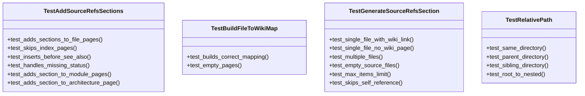

# File Overview

This file contains tests for the `source_refs` module, which is responsible for generating and inserting source reference sections into wiki pages. The tests cover various scenarios including building file-to-wiki mappings, generating source reference sections, and adding these sections to different types of wiki pages.

# Classes

## TestBuildFileToWikiMap

Tests for the [`build_file_to_wiki_map`](../src/local_deepwiki/generators/see_also.md) function. This class contains tests to verify that the mapping between source files and wiki pages is correctly built.

## TestRelativePath

Tests for the `_relative_path` function. This class verifies that relative paths between wiki pages and source files are correctly computed.

## TestGenerateSourceRefsSection

Tests for the `generate_source_refs_section` function. This class contains tests to ensure that source reference sections are correctly generated for different scenarios, such as single files with wiki links.

## TestAddSourceRefsSections

Tests for the `add_source_refs_sections` function. This class verifies that source reference sections are correctly added to various types of wiki pages, including file pages, module pages, and architecture pages.

# Functions

## build_file_to_wiki_map

Builds a mapping from source file paths to corresponding wiki page paths.

**Parameters:**
- `wiki_pages` (list): List of [`WikiPage`](../src/local_deepwiki/models.md) objects representing wiki pages.

**Returns:**
- `dict`: A dictionary mapping source file paths to wiki page paths.

## generate_source_refs_section

Generates a source references section for given source files.

**Parameters:**
- `source_files` (list): List of source file paths.
- `current_wiki_path` (str): Path of the current wiki page.
- `file_to_wiki` (dict): Mapping from source file paths to wiki page paths.

**Returns:**
- `str`: The generated source references section.

## _relative_path

Computes the relative path from a wiki page to a source file.

**Parameters:**
- `wiki_path` (str): Path of the wiki page.
- `file_path` (str): Path of the source file.

**Returns:**
- `str`: The relative path from the wiki page to the source file.

## add_source_refs_sections

Adds source reference sections to wiki pages based on their type.

**Parameters:**
- `wiki_pages` (list): List of [`WikiPage`](../src/local_deepwiki/models.md) objects.
- `page_statuses` (dict): Dictionary mapping page paths to [`WikiPageStatus`](../src/local_deepwiki/models.md) objects.
- `file_to_wiki` (dict): Mapping from source file paths to wiki page paths.

**Returns:**
- `list`: List of updated [`WikiPage`](../src/local_deepwiki/models.md) objects with source reference sections added.

# Usage Examples

## Using `build_file_to_wiki_map`

```python
from local_deepwiki.generators.source_refs import build_file_to_wiki_map
from local_deepwiki.models import WikiPage

wiki_pages = [
    WikiPage(path="files/src/parser.md", title="Parser", content="# Parser\n\nContent."),
]
file_to_wiki = build_file_to_wiki_map(wiki_pages)
```

## Using `generate_source_refs_section`

```python
from local_deepwiki.generators.source_refs import generate_source_refs_section

file_to_wiki = {
    "src/local_deepwiki/core/parser.py": "files/src/local_deepwiki/core/parser.md",
}
section = generate_source_refs_section(
    source_files=["src/local_deepwiki/core/parser.py"],
    current_wiki_path="files/src/local_deepwiki/core/chunker.md",
    file_to_wiki=file_to_wiki,
)
```

## Using `add_source_refs_sections`

```python
from local_deepwiki.generators.source_refs import add_source_refs_sections
from local_deepwiki.models import WikiPage, WikiPageStatus

pages = [
    WikiPage(path="files/src/parser.md", title="Parser", content="# Parser\n\nContent."),
]
page_statuses = {
    "files/src/parser.md": WikiPageStatus(
        path="files/src/parser.md",
        source_files=["src/parser.py"],
        source_hashes={"src/parser.py": "abc123"},
        content_hash="xyz",
        generated_at=0,
    ),
}
file_to_wiki = {"src/parser.py": "files/src/parser.md"}
updated_pages = add_source_refs_sections(pages, page_statuses, file_to_wiki)
```

# Related Components

This file works with the following components:

- [`WikiPage`](../src/local_deepwiki/models.md) class from `local_deepwiki.models`
- [`WikiPageStatus`](../src/local_deepwiki/models.md) class from `local_deepwiki.models`
- The `source_refs` module in `local_deepwiki.generators`

## API Reference

### class `TestBuildFileToWikiMap`

Tests for [build_file_to_wiki_map](../src/local_deepwiki/generators/see_also.md) function.

**Methods:**

#### `test_builds_correct_mapping`

```python
def test_builds_correct_mapping()
```

Test that file paths are correctly mapped to wiki paths.

#### `test_empty_pages`

```python
def test_empty_pages()
```

Test with empty pages list.


### class `TestRelativePath`

Tests for _relative_path function.

**Methods:**

#### `test_same_directory`

```python
def test_same_directory()
```

Test relative path in same directory.

#### `test_parent_directory`

```python
def test_parent_directory()
```

Test relative path to parent directory.

#### `test_sibling_directory`

```python
def test_sibling_directory()
```

Test relative path to sibling directory.

#### `test_root_to_nested`

```python
def test_root_to_nested()
```

Test relative path from root to nested.


### class `TestGenerateSourceRefsSection`

Tests for generate_source_refs_section function.

**Methods:**

#### `test_single_file_with_wiki_link`

```python
def test_single_file_with_wiki_link()
```

Test generating section for single file with wiki page.

#### `test_single_file_no_wiki_page`

```python
def test_single_file_no_wiki_page()
```

Test generating section for file without wiki page.

#### `test_multiple_files`

```python
def test_multiple_files()
```

Test generating section for multiple files.

#### `test_empty_source_files`

```python
def test_empty_source_files()
```

Test that empty source files returns None.

#### `test_max_items_limit`

```python
def test_max_items_limit()
```

Test that max_items limits the output.

#### `test_skips_self_reference`

```python
def test_skips_self_reference()
```

Test that current page is not linked to itself.


### class `TestAddSourceRefsSections`

Tests for add_source_refs_sections function.

**Methods:**

#### `test_adds_sections_to_file_pages`

```python
def test_adds_sections_to_file_pages()
```

Test that sections are added to file documentation pages.

#### `test_skips_index_pages`

```python
def test_skips_index_pages()
```

Test that index pages are not modified.

#### `test_inserts_before_see_also`

```python
def test_inserts_before_see_also()
```

Test that section is inserted before See Also.

#### `test_handles_missing_status`

```python
def test_handles_missing_status()
```

Test that pages without status are passed through.

#### `test_adds_section_to_module_pages`

```python
def test_adds_section_to_module_pages()
```

Test that sections are added to module pages.

#### `test_adds_section_to_architecture_page`

```python
def test_adds_section_to_architecture_page()
```

Test that sections are added to architecture page.


## Class Diagram



## Call Graph

```mermaid
flowchart TD
    N0[TestAddSourceRefsSections.t...]
    N1[TestAddSourceRefsSections.t...]
    N2[TestAddSourceRefsSections.t...]
    N3[TestAddSourceRefsSections.t...]
    N4[TestAddSourceRefsSections.t...]
    N5[TestAddSourceRefsSections.t...]
    N6[TestBuildFileToWikiMap.test...]
    N7[TestBuildFileToWikiMap.test...]
    N8[TestGenerateSourceRefsSecti...]
    N9[TestGenerateSourceRefsSecti...]
    N10[TestGenerateSourceRefsSecti...]
    N11[TestGenerateSourceRefsSecti...]
    N12[TestGenerateSourceRefsSecti...]
    N13[TestGenerateSourceRefsSecti...]
    N14[TestRelativePath.test_paren...]
    N15[TestRelativePath.test_root_...]
    N16[TestRelativePath.test_same_...]
    N17[TestRelativePath.test_sibli...]
    N18[WikiPage]
    N19[WikiPageStatus]
    N20[_relative_path]
    N21[add_source_refs_sections]
    N22[build_file_to_wiki_map]
    N23[generate_source_refs_section]
    N6 --> N18
    N6 --> N22
    N7 --> N22
    N16 --> N20
    N14 --> N20
    N17 --> N20
    N15 --> N20
    N12 --> N23
    N11 --> N23
    N10 --> N23
    N8 --> N23
    N9 --> N23
    N13 --> N23
    N2 --> N18
    N2 --> N19
    N2 --> N21
    N5 --> N18
    N5 --> N19
    N5 --> N21
    N4 --> N18
    N4 --> N19
    N4 --> N21
    N3 --> N18
    N3 --> N21
    N1 --> N18
    N1 --> N19
    N1 --> N21
    N0 --> N18
    N0 --> N19
    N0 --> N21
    classDef func fill:#e1f5fe
    class N18,N19,N20,N21,N22,N23 func
    classDef method fill:#fff3e0
    class N0,N1,N2,N3,N4,N5,N6,N7,N8,N9,N10,N11,N12,N13,N14,N15,N16,N17 method
```



## Relevant Source Files

- `tests/test_source_refs.py`

## See Also

- [models](../src/local_deepwiki/models.md) - dependency
- [test_chunker](test_chunker.md) - shares 2 dependencies
- [test_see_also](test_see_also.md) - shares 2 dependencies
- [test_api_docs](test_api_docs.md) - shares 2 dependencies
