# test_source_refs.py

## File Overview

This file contains comprehensive test suites for the source references functionality in the local_deepwiki system. It tests the generation and management of source reference sections that link wiki pages to their corresponding source code files.

## Imports

The test file imports several components from the source_refs module:
- `_format_file_entry` - Formats individual file entries
- `_relative_path` - Calculates relative paths between files
- [`add_source_refs_sections`](../src/local_deepwiki/generators/source_refs.md) - Adds source reference sections to wiki pages
- [`build_file_to_wiki_map`](../src/local_deepwiki/generators/see_also.md) - Creates mapping between source files and wiki pages
- [`generate_source_refs_section`](../src/local_deepwiki/generators/source_refs.md) - Generates the actual source reference content

It also imports the [WikiPage](../src/local_deepwiki/models.md) and [WikiPageStatus](../src/local_deepwiki/models.md) models for testing data structures.

## Test Classes

### TestBuildFileToWikiMap

Tests the [build_file_to_wiki_map](../src/local_deepwiki/generators/see_also.md) function that creates mappings between source files and their corresponding wiki documentation pages.

### TestRelativePath

Tests the _relative_path function for calculating relative paths between files in the documentation structure.

### TestGenerateSourceRefsSection

Tests the core [generate_source_refs_section](../src/local_deepwiki/generators/source_refs.md) function that creates source reference sections for wiki pages.

**Key test methods:**
- `test_single_file_with_wiki_link` - Verifies generation of sections for single files that have corresponding wiki pages

### TestAddSourceRefsSections

Tests the [add_source_refs_sections](../src/local_deepwiki/generators/source_refs.md) function that adds source reference sections to existing wiki pages.

**Key test methods:**
- `test_adds_sections_to_file_pages` - Verifies that source reference sections are properly added to file documentation pages
- `test_skips_index_pages` - Tests that index pages are skipped during section addition
- `test_inserts_before_see_also` - Ensures sections are inserted in the correct location relative to existing content
- `test_handles_missing_status` - Tests behavior when page status information is missing
- `test_adds_section_to_module_pages` - Verifies sections are added to module-level documentation pages
- `test_adds_section_to_architecture_page` - Tests addition of sections to architecture documentation

### TestFormatFileEntry

Tests the _format_file_entry function that formats individual file entries in source reference sections.

### TestGenerateSourceRefsSectionWithLineInfo

Tests the [generate_source_refs_section](../src/local_deepwiki/generators/source_refs.md) function when line number information is available for source files.

**Key test methods:**
- `test_single_file_with_line_info` - Verifies that line numbers are properly displayed in source references when available

## Usage Examples

Based on the test structure, the components are used as follows:

```python
# Generate source reference section
result = generate_source_refs_section(
    source_files=["src/local_deepwiki/core/parser.py"],
    current_wiki_path="files/src/local_deepwiki/core/chunker.md",
    file_to_wiki=file_to_wiki_mapping
)

# Generate with line information
result = generate_source_refs_section(
    source_files=["src/parser.py"],
    current_wiki_path="files/src/chunker.md",
    file_to_wiki={},
    file_line_info={"src/parser.py": {"start_line": 42, "end_line": 150}}
)
```

## Related Components

This test file works with several key components:

- **[WikiPage](../src/local_deepwiki/models.md)** - Represents individual wiki documentation pages
- **[WikiPageStatus](../src/local_deepwiki/models.md)** - Tracks the status and metadata of wiki pages including source file associations
- **Source reference functions** - The core functionality being tested for linking documentation to source code

The tests verify the integration between these components to ensure proper cross-referencing between documentation and source code files.

## API Reference

### class `TestBuildFileToWikiMap`

Tests for [build_file_to_wiki_map](../src/local_deepwiki/generators/see_also.md) function.

**Methods:**

#### `test_builds_correct_mapping`

```python
def test_builds_correct_mapping()
```

Test that file paths are correctly mapped to wiki paths.

#### `test_empty_pages`

```python
def test_empty_pages()
```

Test with empty pages list.


### class `TestRelativePath`

Tests for _relative_path function.

**Methods:**

#### `test_same_directory`

```python
def test_same_directory()
```

Test relative path in same directory.

#### `test_parent_directory`

```python
def test_parent_directory()
```

Test relative path to parent directory.

#### `test_sibling_directory`

```python
def test_sibling_directory()
```

Test relative path to sibling directory.

#### `test_root_to_nested`

```python
def test_root_to_nested()
```

Test relative path from root to nested.


### class `TestGenerateSourceRefsSection`

Tests for [generate_source_refs_section](../src/local_deepwiki/generators/source_refs.md) function.

**Methods:**

#### `test_single_file_with_wiki_link`

```python
def test_single_file_with_wiki_link()
```

Test generating section for single file with wiki page.

#### `test_single_file_no_wiki_page`

```python
def test_single_file_no_wiki_page()
```

Test generating section for file without wiki page.

#### `test_multiple_files`

```python
def test_multiple_files()
```

Test generating section for multiple files.

#### `test_empty_source_files`

```python
def test_empty_source_files()
```

Test that empty source files returns None.

#### `test_max_items_limit`

```python
def test_max_items_limit()
```

Test that max_items limits the output.

#### `test_skips_self_reference`

```python
def test_skips_self_reference()
```

Test that current page is not linked to itself.


### class `TestAddSourceRefsSections`

Tests for [add_source_refs_sections](../src/local_deepwiki/generators/source_refs.md) function.

**Methods:**

#### `test_adds_sections_to_file_pages`

```python
def test_adds_sections_to_file_pages()
```

Test that sections are added to file documentation pages.

#### `test_skips_index_pages`

```python
def test_skips_index_pages()
```

Test that index pages are not modified.

#### `test_inserts_before_see_also`

```python
def test_inserts_before_see_also()
```

Test that section is inserted before See Also.

#### `test_handles_missing_status`

```python
def test_handles_missing_status()
```

Test that pages without status are passed through.

#### `test_adds_section_to_module_pages`

```python
def test_adds_section_to_module_pages()
```

Test that sections are added to module pages.

#### `test_adds_section_to_architecture_page`

```python
def test_adds_section_to_architecture_page()
```

Test that sections are added to architecture page.


### class `TestFormatFileEntry`

Tests for _format_file_entry function.

**Methods:**

#### `test_without_line_info`

```python
def test_without_line_info()
```

Test formatting without line info.

#### `test_with_line_info`

```python
def test_with_line_info()
```

Test formatting with line info shows start-end range.

#### `test_with_line_info_and_wiki_link`

```python
def test_with_line_info_and_wiki_link()
```

Test formatting with line info and wiki link.

#### `test_skips_self_link_with_line_info`

```python
def test_skips_self_link_with_line_info()
```

Test that self-reference doesn't include link even with line info.


### class `TestGenerateSourceRefsSectionWithLineInfo`

Tests for [generate_source_refs_section](../src/local_deepwiki/generators/source_refs.md) with line info.

**Methods:**

#### `test_single_file_with_line_info`

```python
def test_single_file_with_line_info()
```

Test single file displays line numbers.

#### `test_multiple_files_with_line_info`

```python
def test_multiple_files_with_line_info()
```

Test multiple files each display their line numbers.

#### `test_partial_line_info`

```python
def test_partial_line_info()
```

Test that files without line info fallback gracefully.


### class `TestAddSourceRefsSectionsWithLineInfo`

Tests for [add_source_refs_sections](../src/local_deepwiki/generators/source_refs.md) with line info in status.

**Methods:**

#### `test_passes_line_info_to_section_generator`

```python
def test_passes_line_info_to_section_generator()
```

Test that line info from status is used in generated section.

#### `test_handles_empty_line_info`

```python
def test_handles_empty_line_info()
```

Test that empty line info works (fallback to no line numbers).


## Class Diagram

```mermaid
classDiagram
    class TestAddSourceRefsSections {
        +test_adds_sections_to_file_pages()
        +test_skips_index_pages()
        +test_inserts_before_see_also()
        +test_handles_missing_status()
        +test_adds_section_to_module_pages()
        +test_adds_section_to_architecture_page()
    }
    class TestAddSourceRefsSectionsWithLineInfo {
        +test_passes_line_info_to_section_generator()
        +test_handles_empty_line_info()
    }
    class TestBuildFileToWikiMap {
        +test_builds_correct_mapping()
        +test_empty_pages()
    }
    class TestFormatFileEntry {
        +test_without_line_info()
        +test_with_line_info()
        +test_with_line_info_and_wiki_link()
        +test_skips_self_link_with_line_info()
    }
    class TestGenerateSourceRefsSection {
        +test_single_file_with_wiki_link()
        +test_single_file_no_wiki_page()
        +test_multiple_files()
        +test_empty_source_files()
        +test_max_items_limit()
        +test_skips_self_reference()
    }
    class TestGenerateSourceRefsSectionWithLineInfo {
        +test_single_file_with_line_info()
        +test_multiple_files_with_line_info()
        +test_partial_line_info()
    }
    class TestRelativePath {
        +test_same_directory()
        +test_parent_directory()
        +test_sibling_directory()
        +test_root_to_nested()
    }
```



## Call Graph

```mermaid
flowchart TD
    N0[TestAddSourceRefsSections.t...]
    N1[TestAddSourceRefsSections.t...]
    N2[TestAddSourceRefsSections.t...]
    N3[TestAddSourceRefsSections.t...]
    N4[TestAddSourceRefsSections.t...]
    N5[TestAddSourceRefsSections.t...]
    N6[TestAddSourceRefsSectionsWi...]
    N7[TestAddSourceRefsSectionsWi...]
    N8[TestBuildFileToWikiMap.test...]
    N9[TestBuildFileToWikiMap.test...]
    N10[TestFormatFileEntry.test_wi...]
    N11[TestFormatFileEntry.test_wi...]
    N12[TestFormatFileEntry.test_wi...]
    N13[TestGenerateSourceRefsSecti...]
    N14[TestGenerateSourceRefsSecti...]
    N15[TestGenerateSourceRefsSecti...]
    N16[TestGenerateSourceRefsSecti...]
    N17[TestGenerateSourceRefsSecti...]
    N18[TestGenerateSourceRefsSecti...]
    N19[TestRelativePath.test_paren...]
    N20[TestRelativePath.test_root_...]
    N21[TestRelativePath.test_same_...]
    N22[TestRelativePath.test_sibli...]
    N23[WikiPage]
    N24[WikiPageStatus]
    N25[_format_file_entry]
    N26[_relative_path]
    N27[add_source_refs_sections]
    N28[build_file_to_wiki_map]
    N29[generate_source_refs_section]
    N8 --> N23
    N8 --> N28
    N9 --> N28
    N21 --> N26
    N19 --> N26
    N22 --> N26
    N20 --> N26
    N17 --> N29
    N16 --> N29
    N15 --> N29
    N13 --> N29
    N14 --> N29
    N18 --> N29
    N2 --> N23
    N2 --> N24
    N2 --> N27
    N5 --> N23
    N5 --> N24
    N5 --> N27
    N4 --> N23
    N4 --> N24
    N4 --> N27
    N3 --> N23
    N3 --> N27
    N1 --> N23
    N1 --> N24
    N1 --> N27
    N0 --> N23
    N0 --> N24
    N0 --> N27
    N12 --> N25
    N10 --> N25
    N11 --> N25
    N7 --> N23
    N7 --> N24
    N7 --> N27
    N6 --> N23
    N6 --> N24
    N6 --> N27
    classDef func fill:#e1f5fe
    class N23,N24,N25,N26,N27,N28,N29 func
    classDef method fill:#fff3e0
    class N0,N1,N2,N3,N4,N5,N6,N7,N8,N9,N10,N11,N12,N13,N14,N15,N16,N17,N18,N19,N20,N21,N22 method
```



## Relevant Source Files

- `tests/test_source_refs.py:15-51`

## See Also

- [source_refs](../src/local_deepwiki/generators/source_refs.md) - dependency
- [models](../src/local_deepwiki/models.md) - dependency
- [test_chunker](test_chunker.md) - shares 2 dependencies
- [test_see_also](test_see_also.md) - shares 2 dependencies
- [test_api_docs](test_api_docs.md) - shares 2 dependencies
