# File Overview

This file contains test cases for the source references functionality in the `local_deepwiki` project. It tests various aspects of how source file references are added to wiki pages, including handling of file-to-wiki mappings, line information, and section insertion logic.

# Classes

## TestBuildFileToWikiMap

Tests for the [`build_file_to_wiki_map`](../src/local_deepwiki/generators/see_also.md) function.

## TestRelativePath

Tests for the `_relative_path` function.

### Methods

- `test_same_directory`: Test relative path in same directory.
- `test_parent_directory`: Test relative path to parent directory.
- `test_child_directory`: Test relative path to child directory.

## TestGenerateSourceRefsSection

Tests for `generate_source_refs_section` function.

### Methods

- `test_single_file_with_wiki_link`: Test generating section for single file with wiki page.
- `test_single_file_without_wiki_link`: Test generating section for single file without wiki page.
- `test_multiple_files_with_wiki_links`: Test generating section for multiple files with wiki pages.
- `test_multiple_files_mixed_wiki_links`: Test generating section for multiple files with mixed wiki page availability.

## TestAddSourceRefsSections

Tests for `add_source_refs_sections` function.

### Methods

- `test_adds_sections_to_file_pages`: Test that sections are added to file documentation pages.
- `test_skips_index_pages`: Test that sections are not added to index pages.
- `test_inserts_before_see_also`: Test that sections are inserted before "See Also" section.
- `test_handles_missing_status`: Test handling of missing page status.
- `test_adds_section_to_module_pages`: Test that sections are added to module pages.
- `test_adds_section_to_architecture_page`: Test that sections are added to architecture page.

## TestFormatFileEntry

Tests for `_format_file_entry` function.

### Methods

- `test_without_line_info`: Test formatting without line info.
- `test_with_line_info`: Test formatting with line info shows start-end range.

## TestGenerateSourceRefsSectionWithLineInfo

Tests for `generate_source_refs_section` with line info.

### Methods

- `test_single_file_with_line_info`: Test single file displays line numbers.
- `test_multiple_files_with_line_info`: Test multiple files display line numbers.

## TestAddSourceRefsSectionsWithLineInfo

Tests for `add_source_refs_sections` with line info in status.

### Methods

- `test_passes_line_info_to_section_generator`: Test that line info from status is used in generated section.

# Functions

## build_file_to_wiki_map

Maps source file paths to corresponding wiki page paths.

## generate_source_refs_section

Generates a section listing source files with optional wiki links and line information.

### Parameters

- `source_files` (list of str): List of source file paths.
- `current_wiki_path` (str): Path of the current wiki page.
- `file_to_wiki` (dict): Mapping from source file paths to wiki page paths.
- `file_line_info` (dict, optional): Mapping from source file paths to line information.

### Returns

- str: Formatted section content.

## _format_file_entry

Formats a single file entry with optional wiki link and line information.

### Parameters

- `file_path` (str): Path to the source file.
- `wiki_path` (str or None): Wiki page path for the file, or None if not available.
- `current_wiki_path` (str): Path of the current wiki page.
- `line_info` (dict or None): Line information for the file.

### Returns

- str: Formatted file entry.

## _relative_path

Calculates the relative path from one wiki page to another.

### Parameters

- `from_path` (str): Source wiki page path.
- `to_path` (str): Target wiki page path.

### Returns

- str: Relative path from `from_path` to `to_path`.

# Usage Examples

## Using `generate_source_refs_section`

```python
result = generate_source_refs_section(
    source_files=["src/parser.py"],
    current_wiki_path="files/src/chunker.md",
    file_to_wiki={"src/parser.py": "files/src/parser.md"},
)
```

## Using `add_source_refs_sections`

```python
pages = [
    WikiPage(
        path="files/src/parser.md",
        title="parser",
        content="# Parser\n\nContent here.",
        generated_at=0,
    ),
]

page_statuses = {
    "files/src/parser.md": WikiPageStatus(
        path="files/src/parser.md",
        source_files=["src/parser.py"],
        source_hashes={},
        content_hash="xyz",
        generated_at=0,
    ),
}

result = add_source_refs_sections(pages, page_statuses)
```

# Related Components

This file works with the following components:

- `WikiPage` from `local_deepwiki.models`
- `WikiPageStatus` from `local_deepwiki.models`
- `add_source_refs_sections` from `local_deepwiki.generators.source_refs`
- [`build_file_to_wiki_map`](../src/local_deepwiki/generators/see_also.md) from `local_deepwiki.generators.source_refs`
- `generate_source_refs_section` from `local_deepwiki.generators.source_refs`
- `_format_file_entry` from `local_deepwiki.generators.source_refs`
- `_relative_path` from `local_deepwiki.generators.source_refs`

## API Reference

### class `TestBuildFileToWikiMap`

Tests for [build_file_to_wiki_map](../src/local_deepwiki/generators/see_also.md) function.

**Methods:**

#### `test_builds_correct_mapping`

```python
def test_builds_correct_mapping()
```

Test that file paths are correctly mapped to wiki paths.

#### `test_empty_pages`

```python
def test_empty_pages()
```

Test with empty pages list.


### class `TestRelativePath`

Tests for _relative_path function.

**Methods:**

#### `test_same_directory`

```python
def test_same_directory()
```

Test relative path in same directory.

#### `test_parent_directory`

```python
def test_parent_directory()
```

Test relative path to parent directory.

#### `test_sibling_directory`

```python
def test_sibling_directory()
```

Test relative path to sibling directory.

#### `test_root_to_nested`

```python
def test_root_to_nested()
```

Test relative path from root to nested.


### class `TestGenerateSourceRefsSection`

Tests for generate_source_refs_section function.

**Methods:**

#### `test_single_file_with_wiki_link`

```python
def test_single_file_with_wiki_link()
```

Test generating section for single file with wiki page.

#### `test_single_file_no_wiki_page`

```python
def test_single_file_no_wiki_page()
```

Test generating section for file without wiki page.

#### `test_multiple_files`

```python
def test_multiple_files()
```

Test generating section for multiple files.

#### `test_empty_source_files`

```python
def test_empty_source_files()
```

Test that empty source files returns None.

#### `test_max_items_limit`

```python
def test_max_items_limit()
```

Test that max_items limits the output.

#### `test_skips_self_reference`

```python
def test_skips_self_reference()
```

Test that current page is not linked to itself.


### class `TestAddSourceRefsSections`

Tests for add_source_refs_sections function.

**Methods:**

#### `test_adds_sections_to_file_pages`

```python
def test_adds_sections_to_file_pages()
```

Test that sections are added to file documentation pages.

#### `test_skips_index_pages`

```python
def test_skips_index_pages()
```

Test that index pages are not modified.

#### `test_inserts_before_see_also`

```python
def test_inserts_before_see_also()
```

Test that section is inserted before See Also.

#### `test_handles_missing_status`

```python
def test_handles_missing_status()
```

Test that pages without status are passed through.

#### `test_adds_section_to_module_pages`

```python
def test_adds_section_to_module_pages()
```

Test that sections are added to module pages.

#### `test_adds_section_to_architecture_page`

```python
def test_adds_section_to_architecture_page()
```

Test that sections are added to architecture page.


### class `TestFormatFileEntry`

Tests for _format_file_entry function.

**Methods:**

#### `test_without_line_info`

```python
def test_without_line_info()
```

Test formatting without line info.

#### `test_with_line_info`

```python
def test_with_line_info()
```

Test formatting with line info shows start-end range.

#### `test_with_line_info_and_wiki_link`

```python
def test_with_line_info_and_wiki_link()
```

Test formatting with line info and wiki link.

#### `test_skips_self_link_with_line_info`

```python
def test_skips_self_link_with_line_info()
```

Test that self-reference doesn't include link even with line info.


### class `TestGenerateSourceRefsSectionWithLineInfo`

Tests for generate_source_refs_section with line info.

**Methods:**

#### `test_single_file_with_line_info`

```python
def test_single_file_with_line_info()
```

Test single file displays line numbers.

#### `test_multiple_files_with_line_info`

```python
def test_multiple_files_with_line_info()
```

Test multiple files each display their line numbers.

#### `test_partial_line_info`

```python
def test_partial_line_info()
```

Test that files without line info fallback gracefully.


### class `TestAddSourceRefsSectionsWithLineInfo`

Tests for add_source_refs_sections with line info in status.

**Methods:**

#### `test_passes_line_info_to_section_generator`

```python
def test_passes_line_info_to_section_generator()
```

Test that line info from status is used in generated section.

#### `test_handles_empty_line_info`

```python
def test_handles_empty_line_info()
```

Test that empty line info works (fallback to no line numbers).


## Class Diagram

```mermaid
classDiagram
    class TestAddSourceRefsSections {
        +test_adds_sections_to_file_pages()
        +test_skips_index_pages()
        +test_inserts_before_see_also()
        +test_handles_missing_status()
        +test_adds_section_to_module_pages()
        +test_adds_section_to_architecture_page()
    }
    class TestAddSourceRefsSectionsWithLineInfo {
        +test_passes_line_info_to_section_generator()
        +test_handles_empty_line_info()
    }
    class TestBuildFileToWikiMap {
        +test_builds_correct_mapping()
        +test_empty_pages()
    }
    class TestFormatFileEntry {
        +test_without_line_info()
        +test_with_line_info()
        +test_with_line_info_and_wiki_link()
        +test_skips_self_link_with_line_info()
    }
    class TestGenerateSourceRefsSection {
        +test_single_file_with_wiki_link()
        +test_single_file_no_wiki_page()
        +test_multiple_files()
        +test_empty_source_files()
        +test_max_items_limit()
        +test_skips_self_reference()
    }
    class TestGenerateSourceRefsSectionWithLineInfo {
        +test_single_file_with_line_info()
        +test_multiple_files_with_line_info()
        +test_partial_line_info()
    }
    class TestRelativePath {
        +test_same_directory()
        +test_parent_directory()
        +test_sibling_directory()
        +test_root_to_nested()
    }
```



## Call Graph

```mermaid
flowchart TD
    N0[TestAddSourceRefsSections.t...]
    N1[TestAddSourceRefsSections.t...]
    N2[TestAddSourceRefsSections.t...]
    N3[TestAddSourceRefsSections.t...]
    N4[TestAddSourceRefsSections.t...]
    N5[TestAddSourceRefsSections.t...]
    N6[TestAddSourceRefsSectionsWi...]
    N7[TestAddSourceRefsSectionsWi...]
    N8[TestBuildFileToWikiMap.test...]
    N9[TestBuildFileToWikiMap.test...]
    N10[TestFormatFileEntry.test_wi...]
    N11[TestFormatFileEntry.test_wi...]
    N12[TestFormatFileEntry.test_wi...]
    N13[TestGenerateSourceRefsSecti...]
    N14[TestGenerateSourceRefsSecti...]
    N15[TestGenerateSourceRefsSecti...]
    N16[TestGenerateSourceRefsSecti...]
    N17[TestGenerateSourceRefsSecti...]
    N18[TestGenerateSourceRefsSecti...]
    N19[TestRelativePath.test_paren...]
    N20[TestRelativePath.test_root_...]
    N21[TestRelativePath.test_same_...]
    N22[TestRelativePath.test_sibli...]
    N23[WikiPage]
    N24[WikiPageStatus]
    N25[_format_file_entry]
    N26[_relative_path]
    N27[add_source_refs_sections]
    N28[build_file_to_wiki_map]
    N29[generate_source_refs_section]
    N8 --> N23
    N8 --> N28
    N9 --> N28
    N21 --> N26
    N19 --> N26
    N22 --> N26
    N20 --> N26
    N17 --> N29
    N16 --> N29
    N15 --> N29
    N13 --> N29
    N14 --> N29
    N18 --> N29
    N2 --> N23
    N2 --> N24
    N2 --> N27
    N5 --> N23
    N5 --> N24
    N5 --> N27
    N4 --> N23
    N4 --> N24
    N4 --> N27
    N3 --> N23
    N3 --> N27
    N1 --> N23
    N1 --> N24
    N1 --> N27
    N0 --> N23
    N0 --> N24
    N0 --> N27
    N12 --> N25
    N10 --> N25
    N11 --> N25
    N7 --> N23
    N7 --> N24
    N7 --> N27
    N6 --> N23
    N6 --> N24
    N6 --> N27
    classDef func fill:#e1f5fe
    class N23,N24,N25,N26,N27,N28,N29 func
    classDef method fill:#fff3e0
    class N0,N1,N2,N3,N4,N5,N6,N7,N8,N9,N10,N11,N12,N13,N14,N15,N16,N17,N18,N19,N20,N21,N22 method
```



## Relevant Source Files

- `tests/test_source_refs.py:15-51`

## See Also

- [test_diagrams](test_diagrams.md) - shares 2 dependencies
