# Test Examples Module Tests

## File Overview

This file contains comprehensive unit tests for the test examples functionality in the local_deepwiki project. It tests the ability to [find](../src/local_deepwiki/generators/manifest.md) test files, extract usage examples from test code, format examples as markdown, and provide complete file-level example generation.

## Test Classes

### TestFindTestFile

Tests the [find_test_file](../src/local_deepwiki/generators/test_examples.md) function which locates corresponding test files for source files using naming conventions.

**Key Test Methods:**
- `test_find_test_file_direct_match` - Verifies finding test files with direct naming convention (e.g., `api_docs.py` → `test_api_docs.py`)

### TestExtractExamplesForEntities

Tests the [extract_examples_for_entities](../src/local_deepwiki/generators/test_examples.md) function which parses test files to [find](../src/local_deepwiki/generators/manifest.md) usage examples for specific code entities.

**Key Test Methods:**
- `test_extract_simple_function_call` - Tests extraction of basic function call examples from test code
- `test_extract_class_instantiation` - Tests extraction of class instantiation examples
- `test_extract_with_dedent_setup` - Tests extraction with setup code using dedent
- `test_filters_mock_heavy_tests` - Verifies that tests with extensive mocking are filtered out
- `test_respects_max_examples_per_entity` - Tests the maximum examples limit per entity
- `test_multiple_entities` - Tests extraction for multiple entities in the same test file

### TestFormatExamplesMarkdown

Tests the [format_examples_markdown](../src/local_deepwiki/generators/test_examples.md) function which converts extracted examples into markdown format.

**Key Test Methods:**
- `test_format_single_example` - Tests formatting of a single usage example into markdown

### TestGetFileExamples

Tests the [main](../src/local_deepwiki/export/html.md) [get_file_examples](../src/local_deepwiki/generators/test_examples.md) function which orchestrates the complete process of finding examples for a source file.

**Key Test Methods:**
- `test_get_file_examples_returns_markdown` - Tests that the function returns properly formatted markdown
- `test_get_file_examples_no_test_file` - Tests behavior when no corresponding test file exists (returns None)
- `test_get_file_examples_non_python` - Tests that non-Python files return None
- `test_get_file_examples_filters_short_names` - Tests filtering of very short entity names
- `test_get_file_examples_no_matching_tests` - Tests behavior when test file exists but has no matching examples

## Functions Under Test

Based on the imports, this file tests the following functions from the test_examples module:

- [`find_test_file`](../src/local_deepwiki/generators/test_examples.md) - Locates test files corresponding to source files
- [`extract_examples_for_entities`](../src/local_deepwiki/generators/test_examples.md) - Extracts usage examples from test code
- [`format_examples_markdown`](../src/local_deepwiki/generators/test_examples.md) - Formats examples as markdown
- [`get_file_examples`](../src/local_deepwiki/generators/test_examples.md) - Main function that combines all steps to generate examples

## Usage Examples

### Testing File Example Generation

```python
# Test basic file example generation
result = get_file_examples(
    source_file=source_file,
    repo_root=tmp_path,
    entity_names=["calculate"],
)
```

### Testing Example Extraction

```python
# Test extracting examples for specific entities
examples = extract_examples_for_entities(
    test_file,
    entity_names=["process_data"],
    max_examples_per_entity=2,
)
```

## Related Components

This test file works with the following components from the local_deepwiki.generators.test_examples module:

- **[UsageExample](../src/local_deepwiki/generators/test_examples.md)** - Data structure representing a usage example
- **[find_test_file](../src/local_deepwiki/generators/test_examples.md)** - Function for locating test files
- **[extract_examples_for_entities](../src/local_deepwiki/generators/test_examples.md)** - Function for extracting examples from test code
- **[format_examples_markdown](../src/local_deepwiki/generators/test_examples.md)** - Function for formatting examples as markdown
- **[get_file_examples](../src/local_deepwiki/generators/test_examples.md)** - Main orchestrating function

The tests use pytest fixtures and temporary directories to create realistic file structures for testing the example generation functionality.

## API Reference

### class `TestFindTestFile`

Tests for [find_test_file](../src/local_deepwiki/generators/test_examples.md) function.

**Methods:**

#### `test_find_test_file_direct_match`

```python
def test_find_test_file_direct_match(tmp_path: Path) -> None
```

Test finding test file with direct naming convention.


| [Parameter](../src/local_deepwiki/generators/api_docs.md) | Type | Default | Description |
|-----------|------|---------|-------------|
| `tmp_path` | `Path` | - | - |

#### `test_find_test_file_in_test_dir`

```python
def test_find_test_file_in_test_dir(tmp_path: Path) -> None
```

Test finding test file in 'test' directory (singular).


| [Parameter](../src/local_deepwiki/generators/api_docs.md) | Type | Default | Description |
|-----------|------|---------|-------------|
| `tmp_path` | `Path` | - | - |

#### `test_find_test_file_not_found`

```python
def test_find_test_file_not_found(tmp_path: Path) -> None
```

Test returns None when no test file exists.


| [Parameter](../src/local_deepwiki/generators/api_docs.md) | Type | Default | Description |
|-----------|------|---------|-------------|
| `tmp_path` | `Path` | - | - |

#### `test_find_test_file_skips_test_files`

```python
def test_find_test_file_skips_test_files(tmp_path: Path) -> None
```

Test that test files themselves return None.


| [Parameter](../src/local_deepwiki/generators/api_docs.md) | Type | Default | Description |
|-----------|------|---------|-------------|
| `tmp_path` | `Path` | - | - |


### class `TestExtractExamplesForEntities`

Tests for [extract_examples_for_entities](../src/local_deepwiki/generators/test_examples.md) function.

**Methods:**

#### `test_extract_simple_function_call`

```python
def test_extract_simple_function_call(tmp_path: Path) -> None
```

Test extracting example that calls a simple function.


| [Parameter](../src/local_deepwiki/generators/api_docs.md) | Type | Default | Description |
|-----------|------|---------|-------------|
| `tmp_path` | `Path` | - | - |

#### `test_extract_class_instantiation`

```python
def test_extract_class_instantiation(tmp_path: Path) -> None
```

Test extracting example that instantiates a class.


| [Parameter](../src/local_deepwiki/generators/api_docs.md) | Type | Default | Description |
|-----------|------|---------|-------------|
| `tmp_path` | `Path` | - | - |

#### `test_extract_with_dedent_setup`

```python
def test_extract_with_dedent_setup(tmp_path: Path) -> None
```

Test extracting example with dedent pattern captures from dedent.


| [Parameter](../src/local_deepwiki/generators/api_docs.md) | Type | Default | Description |
|-----------|------|---------|-------------|
| `tmp_path` | `Path` | - | - |

#### `test_filters_mock_heavy_tests`

```python
def test_filters_mock_heavy_tests(tmp_path: Path) -> None
```

Test that tests using extensive mocking are filtered out.


| [Parameter](../src/local_deepwiki/generators/api_docs.md) | Type | Default | Description |
|-----------|------|---------|-------------|
| `tmp_path` | `Path` | - | - |

#### `test_respects_max_examples_per_entity`

```python
def test_respects_max_examples_per_entity(tmp_path: Path) -> None
```

Test that max_examples_per_entity is respected.


| [Parameter](../src/local_deepwiki/generators/api_docs.md) | Type | Default | Description |
|-----------|------|---------|-------------|
| `tmp_path` | `Path` | - | - |

#### `test_multiple_entities`

```python
def test_multiple_entities(tmp_path: Path) -> None
```

Test extracting examples for multiple entities.


| [Parameter](../src/local_deepwiki/generators/api_docs.md) | Type | Default | Description |
|-----------|------|---------|-------------|
| `tmp_path` | `Path` | - | - |


### class `TestFormatExamplesMarkdown`

Tests for [format_examples_markdown](../src/local_deepwiki/generators/test_examples.md) function.

**Methods:**

#### `test_format_single_example`

```python
def test_format_single_example() -> None
```

Test formatting a single example.

#### `test_format_with_description`

```python
def test_format_with_description() -> None
```

Test that docstring becomes the section title.

#### `test_format_multiple_examples`

```python
def test_format_multiple_examples() -> None
```

Test formatting multiple examples.

#### `test_format_empty_list`

```python
def test_format_empty_list() -> None
```

Test formatting empty list returns empty string.

#### `test_respects_max_examples`

```python
def test_respects_max_examples() -> None
```

Test that max_examples limits output.


### class `TestGetFileExamples`

Tests for [get_file_examples](../src/local_deepwiki/generators/test_examples.md) function.

**Methods:**

#### `test_get_file_examples_returns_markdown`

```python
def test_get_file_examples_returns_markdown(tmp_path: Path) -> None
```

Test that [get_file_examples](../src/local_deepwiki/generators/test_examples.md) returns formatted markdown.


| [Parameter](../src/local_deepwiki/generators/api_docs.md) | Type | Default | Description |
|-----------|------|---------|-------------|
| `tmp_path` | `Path` | - | - |

#### `test_get_file_examples_no_test_file`

```python
def test_get_file_examples_no_test_file(tmp_path: Path) -> None
```

Test returns None when no test file exists.


| [Parameter](../src/local_deepwiki/generators/api_docs.md) | Type | Default | Description |
|-----------|------|---------|-------------|
| `tmp_path` | `Path` | - | - |

#### `test_get_file_examples_non_python`

```python
def test_get_file_examples_non_python(tmp_path: Path) -> None
```

Test returns None for non-Python files.


| [Parameter](../src/local_deepwiki/generators/api_docs.md) | Type | Default | Description |
|-----------|------|---------|-------------|
| `tmp_path` | `Path` | - | - |

#### `test_get_file_examples_filters_short_names`

```python
def test_get_file_examples_filters_short_names(tmp_path: Path) -> None
```

Test that very short entity names are filtered.


| [Parameter](../src/local_deepwiki/generators/api_docs.md) | Type | Default | Description |
|-----------|------|---------|-------------|
| `tmp_path` | `Path` | - | - |

#### `test_get_file_examples_no_matching_tests`

```python
def test_get_file_examples_no_matching_tests(tmp_path: Path) -> None
```

Test returns None when test file has no matching examples.


| [Parameter](../src/local_deepwiki/generators/api_docs.md) | Type | Default | Description |
|-----------|------|---------|-------------|
| `tmp_path` | `Path` | - | - |


## Class Diagram

```mermaid
classDiagram
    class TestExtractExamplesForEntities {
        +test_extract_simple_function_call(tmp_path: Path) None
        +test_extract_class_instantiation(tmp_path: Path) None
        +test_extract_with_dedent_setup(tmp_path: Path) None
        +test_filters_mock_heavy_tests(tmp_path: Path) None
        +test_respects_max_examples_per_entity(tmp_path: Path) None
        +test_multiple_entities(tmp_path: Path) None
    }
    class TestFindTestFile {
        +test_find_test_file_direct_match() -> None
        +test_find_test_file_in_test_dir() -> None
        +test_find_test_file_not_found() -> None
        +test_find_test_file_skips_test_files() -> None
    }
    class TestFormatExamplesMarkdown {
        +test_format_single_example() -> None
        +test_format_with_description() -> None
        +test_format_multiple_examples() -> None
        +test_format_empty_list() -> None
        +test_respects_max_examples() -> None
    }
    class TestGetFileExamples {
        +test_get_file_examples_returns_markdown(tmp_path: Path) None
        +test_get_file_examples_no_test_file(tmp_path: Path) None
        +test_get_file_examples_non_python(tmp_path: Path) None
        +test_get_file_examples_filters_short_names(tmp_path: Path) None
        +test_get_file_examples_no_matching_tests(tmp_path: Path) None
    }
```



## Call Graph


## Relevant Source Files

- `tests/test_test_examples.py:17-66`

## See Also

- [test_examples](../src/local_deepwiki/generators/test_examples.md) - dependency
- [test_api_docs](test_api_docs.md) - shares 3 dependencies
- [test_callgraph](test_callgraph.md) - shares 3 dependencies
- [test_chunker](test_chunker.md) - shares 2 dependencies
