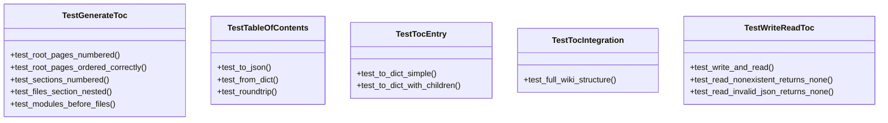

# test_toc.py

## File Overview

This file contains comprehensive test suites for the table of contents (TOC) functionality in the local-deepwiki system. It tests TOC entry creation, TOC generation from page data, file I/O operations, and integration scenarios with realistic wiki structures.

## Test Classes

### TestTocEntry

Tests for the [TocEntry](../src/local_deepwiki/generators/toc.md) class, which represents individual entries in a table of contents.

### TestTableOfContents

Tests for the [TableOfContents](../src/local_deepwiki/generators/toc.md) class, which manages collections of TOC entries.

### TestGenerateToc

Tests for the [generate_toc](../src/local_deepwiki/generators/toc.md) function that creates table of contents from page data.

**Key Test Methods:**
- `test_root_pages_numbered()` - Verifies that root-level pages are properly numbered sequentially, testing with pages like "index.md", "architecture.md", and "dependencies.md"

### TestWriteReadToc

Tests for TOC persistence operations using [write_toc](../src/local_deepwiki/generators/toc.md) and [read_toc](../src/local_deepwiki/generators/toc.md) functions.

**Key Test Methods:**
- `test_write_and_read()` - Tests the complete write/read cycle by creating a [TocEntry](../src/local_deepwiki/generators/toc.md), writing it to a "toc.json" file, and verifying the restored data matches the original
- `test_read_nonexistent_returns_none()` - Verifies that reading from a non-existent TOC file returns None

### TestTocIntegration

Integration tests that verify TOC generation with realistic wiki structures.

**Key Test Methods:**
- `test_full_wiki_structure()` - Tests TOC generation with a comprehensive wiki structure including nested modules and various page types

## Usage Examples

### Testing TOC Entry Creation
```python
entry = TocEntry(number="1", title="Overview", path="index.md")
toc = TableOfContents(entries=[entry])
```

### Testing TOC Generation
```python
pages = [
    {"path": "index.md", "title": "My Project"},
    {"path": "architecture.md", "title": "Architecture"},
    {"path": "dependencies.md", "title": "Dependencies"},
]
toc = generate_toc(pages)
```

### Testing TOC Persistence
```python
# Write TOC to file
write_toc(toc, tmp_path)

# Read TOC back from file
restored = read_toc(tmp_path)
```

## Related Components

This test file works with the following components from `local_deepwiki.generators.toc`:

- **[TocEntry](../src/local_deepwiki/generators/toc.md)** - Individual table of contents entries
- **[TableOfContents](../src/local_deepwiki/generators/toc.md)** - Collections of TOC entries
- **[generate_toc](../src/local_deepwiki/generators/toc.md)** - Function to create TOCs from page data
- **[read_toc](../src/local_deepwiki/generators/toc.md)** - Function to load TOCs from JSON files
- **[write_toc](../src/local_deepwiki/generators/toc.md)** - Function to save TOCs to JSON files

The tests use pytest fixtures and the `pathlib.Path` for file system operations, along with JSON handling for TOC persistence verification.

## API Reference

### class `TestTocEntry`

Tests for [TocEntry](../src/local_deepwiki/generators/toc.md) dataclass.

**Methods:**

#### `test_to_dict_simple`

```python
def test_to_dict_simple()
```

#### `test_to_dict_with_children`

```python
def test_to_dict_with_children()
```


### class `TestTableOfContents`

Tests for [TableOfContents](../src/local_deepwiki/generators/toc.md) dataclass.

**Methods:**

#### `test_to_json`

```python
def test_to_json()
```

#### `test_from_dict`

```python
def test_from_dict()
```

#### `test_roundtrip`

```python
def test_roundtrip()
```


### class `TestGenerateToc`

Tests for [generate_toc](../src/local_deepwiki/generators/toc.md) function.

**Methods:**

#### `test_root_pages_numbered`

```python
def test_root_pages_numbered()
```

#### `test_root_pages_ordered_correctly`

```python
def test_root_pages_ordered_correctly()
```

#### `test_sections_numbered`

```python
def test_sections_numbered()
```

#### `test_files_section_nested`

```python
def test_files_section_nested()
```

#### `test_modules_before_files`

```python
def test_modules_before_files()
```


### class `TestWriteReadToc`

Tests for [write_toc](../src/local_deepwiki/generators/toc.md) and [read_toc](../src/local_deepwiki/generators/toc.md) functions.

**Methods:**

#### `test_write_and_read`

```python
def test_write_and_read(tmp_path: Path)
```


| [Parameter](../src/local_deepwiki/generators/api_docs.md) | Type | Default | Description |
|-----------|------|---------|-------------|
| `tmp_path` | `Path` | - | - |

#### `test_read_nonexistent_returns_none`

```python
def test_read_nonexistent_returns_none(tmp_path: Path)
```


| [Parameter](../src/local_deepwiki/generators/api_docs.md) | Type | Default | Description |
|-----------|------|---------|-------------|
| `tmp_path` | `Path` | - | - |

#### `test_read_invalid_json_returns_none`

```python
def test_read_invalid_json_returns_none(tmp_path: Path)
```


| [Parameter](../src/local_deepwiki/generators/api_docs.md) | Type | Default | Description |
|-----------|------|---------|-------------|
| `tmp_path` | `Path` | - | - |


### class `TestTocIntegration`

Integration tests for TOC generation.

**Methods:**

#### `test_full_wiki_structure`

```python
def test_full_wiki_structure()
```

Test TOC generation with a realistic wiki structure.


## Class Diagram



## Call Graph


## Relevant Source Files

- `tests/test_toc.py:17-43`

## See Also

- [toc](../src/local_deepwiki/generators/toc.md) - dependency
- [test_indexer](test_indexer.md) - shares 3 dependencies
- [test_pdf_export](test_pdf_export.md) - shares 3 dependencies
- [test_html_export](test_html_export.md) - shares 3 dependencies
