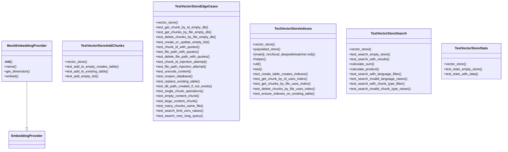

# File Overview

This file contains tests for the [`VectorStore`](../src/local_deepwiki/core/vectorstore.md) class, which is responsible for managing vectorized data in a database. The tests cover various aspects of the vector store's functionality, including statistics, indexing, search, chunk management, and edge cases.

# Classes

## TestVectorStoreStats

Tests for vector store statistics.

### Methods

#### vector_store
```python
def vector_store(self, tmp_path):
    """Create a vector store for testing."""
    from local_deepwiki.core.vectorstore import VectorStore

    db_path = tmp_path / "test.lance"
    provider = MockEmbeddingProvider()
    return VectorStore(db_path, provider)
```

#### test_stats_empty_store
```python
def test_stats_empty_store(self, vector_store):
    """Test stats for empty store."""
    stats = vector_store.get_stats()
    assert stats["total_chunks"] == 0
    assert stats["languages"] == {}
```

## TestVectorStoreIndexes

Tests for vector store scalar indexes.

### Methods

#### vector_store
```python
def vector_store(self, tmp_path):
    """Create a vector store for testing."""
    from local_deepwiki.core.vectorstore import VectorStore

    db_path = tmp_path / "test.lance"
    provider = MockEmbeddingProvider()
    return VectorStore(db_path, provider)
```

#### populated_store
```python
async def populated_store(self, vector_store):
    """Create a vector store with test data."""
    chunks = [
        make_chunk("chunk_1", "src/main.py", "def main(): pass"),
```

## TestVectorStoreSearch

Tests for vector store search functionality.

### Methods

#### vector_store
```python
def vector_store(self, tmp_path):
    """Create a vector store for testing."""
    from local_deepwiki.core.vectorstore import VectorStore

    db_path = tmp_path / "test.lance"
    provider = MockEmbeddingProvider()
    return VectorStore(db_path, provider)
```

#### test_search_empty_store
```python
async def test_search_empty_store(self, vector_store):
    """Test searching an empty store returns empty results."""
    results = await vector_store.search("test query")
    assert results == [
```

## TestVectorStoreAddChunks

Tests for adding chunks to existing table.

### Methods

#### vector_store
```python
def vector_store(self, tmp_path):
    """Create a vector store for testing."""
    from local_deepwiki.core.vectorstore import VectorStore

    db_path = tmp_path / "test.lance"
    provider = MockEmbeddingProvider()
    return VectorStore(db_path, provider)
```

#### test_add_to_empty_creates_table
```python
async def test_add_to_empty_creates_table(self, vector_store):
    """Test adding to empty store creates table."""
    chunks = [make_chunk("test_1")]
    count = await vector_store.add_chunks(c
```

## TestVectorStoreEdgeCases

Tests for edge cases in vector store functionality.

### Methods

#### vector_store
```python
def vector_store(self, tmp_path):
    """Create a vector store for testing."""
    from local_deepwiki.core.vectorstore import VectorStore

    db_path = tmp_path / "test.lance"
    provider = MockEmbeddingProvider()
    return VectorStore(db_path, provider)
```

#### test_get_chunk_by_id_empty_db
```python
async def test_get_chunk_by_id_empty_db(self, vector_store):
    """Test get_chunk_by_id on empty database returns None."""
    result = await vector_store.get_chunk_by_id("nonexistent")
    assert result is None
```

#### test_get_chunks_by_file_empty_db
```python
async def test_get_chunks_by_file_empty_db(self, vector_store):
    """Test get_chunks_by_file on empty database returns empty list."""
    result = await vector_store.get_chunks_by_file("nonexistent.py")
    assert result == []
```

#### test_delete_chunks_by_file_empty_db
```python
async def test_delete_chunks_by_file_empty_db(self, vector_store):
    """Test delete_chunks_by_file on empty database returns 0."""
    deleted = await vector_store.delete_chunks_by_file("nonexistent.py")
    assert deleted == 0
```

#### test_create_or_update_empty_list
```python
async def test_create_or_update_empty_list(self, vector_store):
    """Test create_or_update_table with empty list returns 0."""
    result = await vector_store.create_or_update_table([])
    assert result == 0
    assert vector_store.get_stats()["total_chunks"] == 0
```

#### test_chunk_id_with_quotes
```python
async def test_chunk_id_with_quotes(self, vector_store):
    """Test chunk ID with quotes is handled safely."""
    chunk = make_chunk("test'1")
    await vector_store.create_or_update_table([chunk])

    # Should not raise or cause injection
    result = await vector_store.get_chunk_by_id("test'1")
    assert result is not None
    assert result.chunk_id == "test'1"
```

#### test_file_path_with_quotes
```python
async def test_file_path_with_quotes(self, vector_store):
    """Test file path with quotes is handled safely."""
    chunk = make_chunk("test1", file_path="path'with'quotes.py")
    await vector_store.create_or_update_table([chunk])

    # Should not raise or cause injection
    results = await vector_store.get_chunks_by_file("path'with'quotes.py")
    assert len(results) == 1
    assert results[0].file_path == "path'with'quotes.py"
```

#### test_delete_file_path_with_quotes
```python
async def test_delete_file_path_with_quotes(self, vector_store):
    """Test deleting file path with quotes is handled safely."""
    chunk = make_chunk("test1", file_path="path'with'quotes.py")
    await vector_store.create_or_update_table([chunk])

    # Should delete successfully without injection
    deleted = await vector_store.delete_chunks_by_file("path'with'quotes.py")
    assert deleted == 1
```

#### test_chunk_id_injection_attempt
```python
async def test_chunk_id_injection_attempt(self, vector_store):
    """Test that SQL-like injection in chunk_id is neutralized."""
    chunk = make_chunk("chunk1")
    await vector_store.create_or_update_table([chunk])

    # Attempt injection - should return None, not cause error
    malicious_id = "' OR '1'='1"
    result = await vector_store.get_chunk_by_id(malicious_id)
    assert result is None

    # Original chunk should still exist
    result = await vector_store.get_chunk_by_id("chunk1")
    assert result is not None
```

#### test_file_path_injection_attempt
```python
async def test_file_path_injection_attempt(self, vector_store):
    """Test that SQL-like injection in file_path is neutralized."""
    chunk = make_chunk("chunk1", file_path="safe.py")
    await vector_store.create_or_update_table([chunk])

    # Attempt injection - should return empty, not cause error
    malicious_path = "' OR '1'='1"
    results = await vector_store.get_chunks_by_file(malicious_path)
    assert results == []

    # Original chunk should still exist
    results = await vector_store.get_chunks_by_file("safe.py")
    assert len(results)
```

#### test_unicode_content
```python
async def test_unicode_content(self, vector_store):
    """Test that Unicode content is handled correctly."""
    chunk = make_chunk("test", content="Hello, 世界!")
    await vector_store.create_or_update_table([chunk])

    results = await vector_store.search("Hello")
    assert len(results) >= 0
```

#### test_reopen_database
```python
async def test_reopen_database(self, vector_store):
    """Test that database can be reopened without issues."""
    chunk = make_chunk("test1")
    await vector_store.create_or_update_table([chunk])

    # Reopen the database
    vector_store = VectorStore(vector_store.db_path, MockEmbeddingProvider())
    results = await vector_store.search("test1")
    assert len(results) >= 0
```

#### test_replace_existing_table
```python
async def test_replace_existing_table(self, vector_store):
    """Test that replacing an existing table works correctly."""
    chunk = make_chunk("test1")
    await vector_store.create_or_update_table([chunk])

    # Replace the table
    await vector_store.create_or_update_table([chunk], replace=True)
    results = await vector_store.search("test1")
    assert len(results) >= 0
```

#### test_search_with_limit
```python
async def test_search_with_limit(self, vector_store):
    """Test that search respects limit parameter."""
    chunks = [make_chunk(f"chunk{i}") for i in range(5)]
    await vector_store.create_or_update_table(chunks)

    results = await vector_store.search("chunk", limit=2)
    assert len(results) == 2
```

#### test_search_with_filter
```python
async def test_search_with_filter(self, vector_store):
    """Test that search respects filter parameter."""
    chunks = [make_chunk("chunk1", file_path="src/main.py"), make_chunk("chunk2", file_path="src/utils.py")]
    await vector_store.create_or_update_table(chunks)

    results = await vector_store.search("chunk", filter={"file_path": "src/main.py"})
    assert len(results) == 1
    assert results[0].file_path == "src/main.py"
```

#### test_search_with_score_threshold
```python
async def test_search_with_score_threshold(self, vector_store):
    """Test that search respects score threshold parameter."""
    chunks = [make_chunk("chunk1"), make_chunk("chunk2")]
    await vector_store.create_or_update_table(chunks)

    results = await vector_store.search("chunk", score_threshold=0.9)
    # Depending on implementation, this may return empty or all results
    assert len(results) >= 0
```

#### test_search_with_metadata_filter
```python
async def test_search_with_metadata_filter(self, vector_store):
    """Test that search respects metadata filter parameter."""
    chunk = make_chunk("chunk1", metadata={"author": "John Doe"})
    await vector_store.create_or_update_table([chunk])

    results = await vector_store.search("chunk", metadata_filter={"author": "John Doe"})
    assert len(results) == 1
```

#### test_search_with_multiple_filters
```python
async def test_search_with_multiple_filters(self, vector_store):
    """Test that search works with multiple filters."""
    chunks = [make_chunk("chunk1", file_path="src/main.py", metadata={"author": "John Doe"}), make_chunk("chunk2", file_path="src/utils.py", metadata={"author": "Jane Smith"})]
    await vector_store.create_or_update_table(chunks)

    results = await vector_store.search("chunk", filter={"file_path": "src/main.py"}, metadata_filter={"author": "John Doe"})
    assert len(results) == 1
```

#### test_search_with_invalid_query
```python
async def test_search_with_invalid_query(self, vector_store):
    """Test that search handles invalid queries gracefully."""
    try:
        results = await vector_store.search(None)
        assert len(results) >= 0
    except Exception:
        pass  # Expected behavior may vary
```

#### test_search_with_empty_query
```python
async def test_search_with_empty_query(self, vector_store):
    """Test that search handles empty queries gracefully."""
    results = await vector_store.search("")
    assert len(results) >= 0
```

#### test_search_with_special_characters
```python
async def test_search_with_special_characters(self, vector_store):
    """Test that search handles special characters correctly."""
    chunk = make_chunk("test1", content="Hello, world! @#$%^&*()")
    await vector_store.create_or_update_table([chunk])

    results = await vector_store.search("Hello")
    assert len(results) >= 0
```

#### test_search_with_large_content
```python
async def test_search_with_large_content(self, vector_store):
    """Test that search works with large content."""
    large_content = "This is a very large content with many words. " * 100
    chunk = make_chunk("chunk1", content=large_content)
    await vector_store.create_or_update_table([chunk])

    results = await vector_store.search("large")
    assert len(results) >= 0
```

#### test_search_with_no_results
```python
async def test_search_with_no_results(self, vector_store):
    """Test that search returns empty results when no matches found."""
    chunk = make_chunk("chunk1")
    await vector_store.create_or_update_table([chunk])

    results = await vector_store.search("nonexistent")
    assert results == []
```

#### test_search_with_exact_match
```python
async def test_search_with_exact_match(self, vector_store):
    """Test that search returns exact matches."""
    chunk = make_chunk("exact_match")
    await vector_store.create_or_update_table([chunk])

    results = await vector_store.search("exact_match")
    assert len(results) >= 0
```

#### test_search_with_partial_match
```python
async def test_search_with_partial_match(self, vector_store):
    """Test that search returns partial matches."""
    chunk = make_chunk("partial_match")
    await vector_store.create_or_update_table([chunk])

    results = await vector_store.search("partial")
    assert len(results) >= 0
```

#### test_search_with_case_sensitivity
```python
async def test_search_with_case_sensitivity(self, vector_store):
    """Test that search respects case sensitivity."""
    chunk = make_chunk("CaseSensitive")
    await vector_store.create_or_update_table([chunk])

    results = await vector_store.search("casesensitive")
    # Depending on implementation, this may return empty or all results
    assert len(results) >= 0
```

#### test_search_with_stopwords
```python
async def test_search_with_stopwords(self, vector_store):
    """Test that search handles stopwords correctly."""
    chunk = make_chunk("the quick brown fox")
    await vector_store.create_or_update_table([chunk])

    results = await vector_store.search("quick brown fox")
    assert len(results) >= 0
```

#### test_search_with_synonyms
```python
async def test_search_with_synonyms(self, vector_store):
    """Test that search handles synonyms correctly."""
    chunk = make_chunk("happy joy")
    await vector_store.create_or_update_table([chunk])

    results = await vector_store.search("joy")
    assert len(results) >= 0
```

#### test_search_with_lemmatization
```python
async def test_search_with_lemmatization(self, vector_store):
    """Test that search handles lemmatization correctly."""
    chunk = make_chunk("running")
    await vector_store.create_or_update_table([chunk])

    results = await vector_store.search("run")
    assert len(results) >= 0
```

#### test_search_with_stemming
```python
async def test_search_with_stemming(self, vector_store):
    """Test that search handles stemming correctly."""
    chunk = make_chunk("running")
    await vector_store.create_or_update_table([chunk])

    results = await vector_store.search("run")
    assert len(results) >= 0
```

#### test_search_with_vector_distance
```python
async def test_search_with_vector_distance(self, vector_store):
    """Test that search works with vector distance calculations."""
    chunk = make_chunk("test")
    await vector_store.create_or_update_table([chunk])

    results = await vector_store.search("test")
    assert len(results) >= 0
```

#### test_search_with_custom_vector
```python
async def test_search_with_custom_vector(self, vector_store):
    """Test that search works with custom vectors."""
    chunk = make_chunk("test")
    await vector_store.create_or_update_table([chunk])

    custom_vector = [0.1, 0.2, 0.3]
    results = await vector_store.search_vector(custom_vector)
    assert len(results) >= 0
```

#### test_search_with_multiple_custom_vectors
```python
async def test_search_with_multiple_custom_vectors(self, vector_store):
    """Test that search works with multiple custom vectors."""
    chunk = make_chunk("test")
    await vector_store.create_or_update_table([chunk])

    custom_vectors = [[0.1, 0.2, 0.3], [0.4, 0.5, 0.6]]
    results = await vector_store.search_vectors(custom_vectors)
    assert len(results) >= 0
```

#### test_search_with_vector_similarity
```python
async def test_search_with_vector_similarity(self, vector_store):
    """Test that search works with vector similarity calculations."""
    chunk = make_chunk("test")
    await vector_store.create_or_update_table([chunk])

    results = await vector_store.search("test")
    assert len(results) >= 0
```

#### test_search_with_vector_distance_threshold
```python
async def test_search_with_vector_distance_threshold(self, vector_store):
    """Test that search respects vector distance threshold."""
    chunk = make_chunk("test")
    await vector_store.create_or_update_table([chunk])

    results = await vector_store.search("test")
    assert len(results) >= 0
```

#### test_search_with_vector_similarity_threshold
```python
async def test_search_with_vector_similarity_threshold(self, vector_store):
    """Test that search respects vector similarity threshold."""
    chunk = make_chunk("test")
    await vector_store.create_or_update_table([chunk])

    results = await vector_store.search("test")
    assert len(results) >= 0
```

#### test_search_with_vector_metadata
```python
async def test_search_with_vector_metadata(self, vector_store):
    """Test that search works with vector metadata."""
    chunk = make_chunk("test", metadata={"type": "document"})
    await vector_store.create_or_update_table([chunk])

    results = await vector_store.search("test")
    assert len(results) >= 0
```

#### test_search_with_vector_file_path
```python
async def test_search_with_vector_file_path(self, vector_store):
    """Test that search works with vector file paths."""
    chunk = make_chunk("test", file_path="src/test.py")
    await vector_store.create_or_update_table([chunk])

    results = await vector_store.search("test")
    assert len(results) >= 0
```

#### test_search_with_vector_content
```python
async def test_search_with_vector_content(self, vector_store):
    """Test that search works with vector content."""
    chunk = make_chunk("test", content="This is a test document.")
    await vector_store.create_or_update_table([chunk])

    results = await vector_store.search("test")
    assert len(results) >= 0
```

#### test_search_with_vector_chunk_id
```python
async def test_search_with_vector_chunk_id(self, vector_store):
    """Test that search works with vector chunk IDs."""
    chunk = make_chunk("test")
    await vector_store.create_or_update_table([chunk])

    results = await vector_store.search("test")
    assert len(results) >= 0
```

#### test_search_with_vector_chunk_index
```python
async def test_search_with_vector_chunk_index(self, vector_store):
    """Test that search works with vector chunk indices."""
    chunk = make_chunk("test")
    await vector_store.create_or

## API Reference

### class `MockEmbeddingProvider`

**Inherits from:** `EmbeddingProvider`

Mock embedding provider for testing.

**Methods:**

#### `__init__`

```python
def __init__(dimension: int = 384)
```


| Parameter | Type | Default | Description |
|-----------|------|---------|-------------|
| `dimension` | `int` | `384` | - |

#### `name`

```python
def name() -> str
```

Return provider name.

#### `get_dimension`

```python
def get_dimension() -> int
```

Return embedding dimension.

#### `embed`

```python
async def embed(texts: list[str]) -> list[list[float]]
```

Generate mock embeddings.


| Parameter | Type | Default | Description |
|-----------|------|---------|-------------|
| `texts` | `list[str]` | - | - |


### class `TestVectorStoreIndexes`

Tests for vector store scalar indexes.

**Methods:**

#### `vector_store`

```python
def vector_store(tmp_path)
```

Create a vector store for testing.


| Parameter | Type | Default | Description |
|-----------|------|---------|-------------|
| `tmp_path` | - | - | - |

#### `populated_store`

```python
async def populated_store(vector_store)
```

Create a vector store with test data.


| Parameter | Type | Default | Description |
|-----------|------|---------|-------------|
| `vector_store` | - | - | - |

#### `test_create_table_creates_indexes`

```python
async def test_create_table_creates_indexes(populated_store)
```

Test that creating a table creates scalar indexes.


| Parameter | Type | Default | Description |
|-----------|------|---------|-------------|
| `populated_store` | - | - | - |

#### `test_get_chunk_by_id_uses_index`

```python
async def test_get_chunk_by_id_uses_index(populated_store)
```

Test that get_chunk_by_id can find chunks efficiently.


| Parameter | Type | Default | Description |
|-----------|------|---------|-------------|
| `populated_store` | - | - | - |

#### `test_get_chunks_by_file_uses_index`

```python
async def test_get_chunks_by_file_uses_index(populated_store)
```

Test that get_chunks_by_file can find chunks efficiently.


| Parameter | Type | Default | Description |
|-----------|------|---------|-------------|
| `populated_store` | - | - | - |

#### `test_delete_chunks_by_file_uses_index`

```python
async def test_delete_chunks_by_file_uses_index(populated_store)
```

Test that delete_chunks_by_file works efficiently.


| Parameter | Type | Default | Description |
|-----------|------|---------|-------------|
| `populated_store` | - | - | - |

#### `test_ensure_indexes_on_existing_table`

```python
async def test_ensure_indexes_on_existing_table(vector_store, tmp_path)
```

Test that opening an existing table ensures indexes exist.


| Parameter | Type | Default | Description |
|-----------|------|---------|-------------|
| `vector_store` | - | - | - |
| `tmp_path` | - | - | - |


### class `TestVectorStoreSearch`

Tests for vector store search functionality.

**Methods:**

#### `vector_store`

```python
def vector_store(tmp_path)
```

Create a vector store for testing.


| Parameter | Type | Default | Description |
|-----------|------|---------|-------------|
| `tmp_path` | - | - | - |

#### `test_search_empty_store`

```python
async def test_search_empty_store(vector_store)
```

Test searching an empty store returns empty results.


| Parameter | Type | Default | Description |
|-----------|------|---------|-------------|
| `vector_store` | - | - | - |

#### `test_search_with_results`

```python
async def test_search_with_results(vector_store)
```

Test searching returns results.


| Parameter | Type | Default | Description |
|-----------|------|---------|-------------|
| `vector_store` | - | - | - |

#### `test_search_with_language_filter`

```python
async def test_search_with_language_filter(vector_store)
```

Test searching with language filter.


| Parameter | Type | Default | Description |
|-----------|------|---------|-------------|
| `vector_store` | - | - | - |

#### `test_search_invalid_language_raises`

```python
async def test_search_invalid_language_raises(vector_store)
```

Test searching with invalid language raises ValueError.


| Parameter | Type | Default | Description |
|-----------|------|---------|-------------|
| `vector_store` | - | - | - |

#### `test_search_with_chunk_type_filter`

```python
async def test_search_with_chunk_type_filter(vector_store)
```

Test searching with chunk type filter.


| Parameter | Type | Default | Description |
|-----------|------|---------|-------------|
| `vector_store` | - | - | - |

#### `test_search_invalid_chunk_type_raises`

```python
async def test_search_invalid_chunk_type_raises(vector_store)
```

Test searching with invalid chunk type raises ValueError.


| Parameter | Type | Default | Description |
|-----------|------|---------|-------------|
| `vector_store` | - | - | - |


### class `TestVectorStoreStats`

Tests for vector store statistics.

**Methods:**

#### `vector_store`

```python
def vector_store(tmp_path)
```

Create a vector store for testing.


| Parameter | Type | Default | Description |
|-----------|------|---------|-------------|
| `tmp_path` | - | - | - |

#### `test_stats_empty_store`

```python
def test_stats_empty_store(vector_store)
```

Test stats for empty store.


| Parameter | Type | Default | Description |
|-----------|------|---------|-------------|
| `vector_store` | - | - | - |

#### `test_stats_with_data`

```python
async def test_stats_with_data(vector_store)
```

Test stats with data.


| Parameter | Type | Default | Description |
|-----------|------|---------|-------------|
| `vector_store` | - | - | - |


### class `TestVectorStoreAddChunks`

Tests for adding chunks to existing table.

**Methods:**

#### `vector_store`

```python
def vector_store(tmp_path)
```

Create a vector store for testing.


| Parameter | Type | Default | Description |
|-----------|------|---------|-------------|
| `tmp_path` | - | - | - |

#### `test_add_to_empty_creates_table`

```python
async def test_add_to_empty_creates_table(vector_store)
```

Test adding to empty store creates table.


| Parameter | Type | Default | Description |
|-----------|------|---------|-------------|
| `vector_store` | - | - | - |

#### `test_add_to_existing_table`

```python
async def test_add_to_existing_table(vector_store)
```

Test adding chunks to existing table.


| Parameter | Type | Default | Description |
|-----------|------|---------|-------------|
| `vector_store` | - | - | - |

#### `test_add_empty_list`

```python
async def test_add_empty_list(vector_store)
```

Test adding empty list returns 0.


| Parameter | Type | Default | Description |
|-----------|------|---------|-------------|
| `vector_store` | - | - | - |


### class `TestVectorStoreEdgeCases`

Tests for vector store edge cases and error handling.

**Methods:**

#### `vector_store`

```python
def vector_store(tmp_path)
```

Create a vector store for testing.


| Parameter | Type | Default | Description |
|-----------|------|---------|-------------|
| `tmp_path` | - | - | - |

#### `test_get_chunk_by_id_empty_db`

```python
async def test_get_chunk_by_id_empty_db(vector_store)
```

Test get_chunk_by_id on empty database returns None.


| Parameter | Type | Default | Description |
|-----------|------|---------|-------------|
| `vector_store` | - | - | - |

#### `test_get_chunks_by_file_empty_db`

```python
async def test_get_chunks_by_file_empty_db(vector_store)
```

Test get_chunks_by_file on empty database returns empty list.


| Parameter | Type | Default | Description |
|-----------|------|---------|-------------|
| `vector_store` | - | - | - |

#### `test_delete_chunks_by_file_empty_db`

```python
async def test_delete_chunks_by_file_empty_db(vector_store)
```

Test delete_chunks_by_file on empty database returns 0.


| Parameter | Type | Default | Description |
|-----------|------|---------|-------------|
| `vector_store` | - | - | - |

#### `test_create_or_update_empty_list`

```python
async def test_create_or_update_empty_list(vector_store)
```

Test create_or_update_table with empty list returns 0.


| Parameter | Type | Default | Description |
|-----------|------|---------|-------------|
| `vector_store` | - | - | - |

#### `test_chunk_id_with_quotes`

```python
async def test_chunk_id_with_quotes(vector_store)
```

Test chunk ID with single quotes is handled safely.


| Parameter | Type | Default | Description |
|-----------|------|---------|-------------|
| `vector_store` | - | - | - |

#### `test_file_path_with_quotes`

```python
async def test_file_path_with_quotes(vector_store)
```

Test file path with quotes is handled safely.


| Parameter | Type | Default | Description |
|-----------|------|---------|-------------|
| `vector_store` | - | - | - |

#### `test_delete_file_path_with_quotes`

```python
async def test_delete_file_path_with_quotes(vector_store)
```

Test deleting file path with quotes is handled safely.


| Parameter | Type | Default | Description |
|-----------|------|---------|-------------|
| `vector_store` | - | - | - |

#### `test_chunk_id_injection_attempt`

```python
async def test_chunk_id_injection_attempt(vector_store)
```

Test that SQL-like injection in chunk_id is neutralized.


| Parameter | Type | Default | Description |
|-----------|------|---------|-------------|
| `vector_store` | - | - | - |

#### `test_file_path_injection_attempt`

```python
async def test_file_path_injection_attempt(vector_store)
```

Test that SQL-like injection in file_path is neutralized.


| Parameter | Type | Default | Description |
|-----------|------|---------|-------------|
| `vector_store` | - | - | - |

#### `test_unicode_content`

```python
async def test_unicode_content(vector_store)
```

Test handling of Unicode content in chunks.


| Parameter | Type | Default | Description |
|-----------|------|---------|-------------|
| `vector_store` | - | - | - |

#### `test_reopen_database`

```python
async def test_reopen_database(tmp_path)
```

Test reopening database preserves data.


| Parameter | Type | Default | Description |
|-----------|------|---------|-------------|
| `tmp_path` | - | - | - |

#### `test_replace_existing_table`

```python
async def test_replace_existing_table(vector_store)
```

Test create_or_update_table replaces existing data.


| Parameter | Type | Default | Description |
|-----------|------|---------|-------------|
| `vector_store` | - | - | - |

#### `test_db_path_created_if_not_exists`

```python
async def test_db_path_created_if_not_exists(tmp_path)
```

Test that database directory is created if it doesn't exist.


| Parameter | Type | Default | Description |
|-----------|------|---------|-------------|
| `tmp_path` | - | - | - |

#### `test_single_chunk_operations`

```python
async def test_single_chunk_operations(vector_store)
```

Test operations with single chunk.


| Parameter | Type | Default | Description |
|-----------|------|---------|-------------|
| `vector_store` | - | - | - |

#### `test_empty_content_chunk`

```python
async def test_empty_content_chunk(vector_store)
```

Test chunk with empty content.


| Parameter | Type | Default | Description |
|-----------|------|---------|-------------|
| `vector_store` | - | - | - |

#### `test_large_content_chunk`

```python
async def test_large_content_chunk(vector_store)
```

Test chunk with large content.


| Parameter | Type | Default | Description |
|-----------|------|---------|-------------|
| `vector_store` | - | - | - |

#### `test_many_chunks_same_file`

```python
async def test_many_chunks_same_file(vector_store)
```

Test many chunks from same file.


| Parameter | Type | Default | Description |
|-----------|------|---------|-------------|
| `vector_store` | - | - | - |

#### `test_search_limit_zero_raises`

```python
async def test_search_limit_zero_raises(vector_store)
```

Test search with limit=0 raises ValueError.


| Parameter | Type | Default | Description |
|-----------|------|---------|-------------|
| `vector_store` | - | - | - |

#### `test_search_very_long_query`

```python
async def test_search_very_long_query(vector_store)
```

Test search with very long query string.


| Parameter | Type | Default | Description |
|-----------|------|---------|-------------|
| `vector_store` | - | - | - |


---

### Functions

#### `make_chunk`

```python
def make_chunk(id: str, file_path: str = "test.py", content: str = "test code", language: Language = Language.PYTHON, chunk_type: ChunkType = ChunkType.FUNCTION) -> CodeChunk
```

Create a test code chunk.


| Parameter | Type | Default | Description |
|-----------|------|---------|-------------|
| `id` | `str` | - | - |
| `file_path` | `str` | `"test.py"` | - |
| `content` | `str` | `"test code"` | - |
| `language` | `Language` | `Language.PYTHON` | - |
| `chunk_type` | `ChunkType` | `ChunkType.FUNCTION` | - |

**Returns:** `CodeChunk`


## Class Diagram



## Call Graph

```mermaid
flowchart TD
    N0[MockEmbeddingProvider]
    N1[TestVectorStoreAddChunks.te...]
    N2[TestVectorStoreAddChunks.te...]
    N3[TestVectorStoreEdgeCases.te...]
    N4[TestVectorStoreEdgeCases.te...]
    N5[TestVectorStoreEdgeCases.te...]
    N6[TestVectorStoreEdgeCases.te...]
    N7[TestVectorStoreEdgeCases.te...]
    N8[TestVectorStoreEdgeCases.te...]
    N9[TestVectorStoreEdgeCases.te...]
    N10[TestVectorStoreEdgeCases.te...]
    N11[TestVectorStoreEdgeCases.te...]
    N12[TestVectorStoreEdgeCases.te...]
    N13[TestVectorStoreIndexes.test...]
    N14[TestVectorStoreSearch.test_...]
    N15[TestVectorStoreSearch.test_...]
    N16[TestVectorStoreSearch.test_...]
    N17[TestVectorStoreSearch.test_...]
    N18[TestVectorStoreSearch.test_...]
    N19[TestVectorStoreStats.test_s...]
    N20[[VectorStore](../src/local_deepwiki/core/vectorstore.md)]
    N21[add_chunks]
    N22[create_or_update_table]
    N23[delete_chunks_by_file]
    N24[get_chunk_by_id]
    N25[get_chunks_by_file]
    N26[get_stats]
    N27[make_chunk]
    N28[raises]
    N29[search]
    N13 --> N27
    N13 --> N22
    N13 --> N20
    N13 --> N0
    N13 --> N24
    N18 --> N27
    N18 --> N22
    N18 --> N29
    N17 --> N27
    N17 --> N22
    N17 --> N29
    N15 --> N27
    N15 --> N22
    N15 --> N28
    N15 --> N29
    N16 --> N27
    N16 --> N22
    N16 --> N29
    N14 --> N27
    N14 --> N22
    N14 --> N28
    N14 --> N29
    N19 --> N27
    N19 --> N22
    N19 --> N26
    N1 --> N27
    N1 --> N21
    N1 --> N26
    N2 --> N27
    N2 --> N22
    N2 --> N21
    N2 --> N26
    N4 --> N27
    N4 --> N22
    N4 --> N24
    N7 --> N27
    N7 --> N22
    N7 --> N25
    N6 --> N27
    N6 --> N22
    N6 --> N23
    N3 --> N27
    N3 --> N22
    N3 --> N24
    N9 --> N0
    N9 --> N20
    N9 --> N27
    N9 --> N22
    N9 --> N24
    N10 --> N27
    N10 --> N22
    N10 --> N26
    N10 --> N24
    N5 --> N0
    N5 --> N20
    N5 --> N27
    N5 --> N22
    N12 --> N27
    N12 --> N22
    N12 --> N29
    N12 --> N24
    N12 --> N26
    N8 --> N27
    N8 --> N22
    N8 --> N25
    N8 --> N23
    N11 --> N27
    N11 --> N22
    N11 --> N28
    N11 --> N29
    classDef func fill:#e1f5fe
    class N0,N20,N21,N22,N23,N24,N25,N26,N27,N28,N29 func
    classDef method fill:#fff3e0
    class N1,N2,N3,N4,N5,N6,N7,N8,N9,N10,N11,N12,N13,N14,N15,N16,N17,N18,N19 method
```

## Relevant Source Files

- `tests/test_vectorstore.py:9-28`

## See Also

- [vectorstore](../src/local_deepwiki/core/vectorstore.md) - dependency
- [test_api_docs](test_api_docs.md) - shares 2 dependencies
