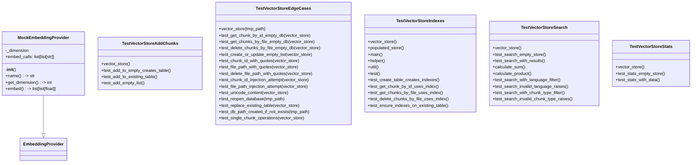

# test_vectorstore.py

## File Overview

This file contains comprehensive test suites for the [VectorStore](../src/local_deepwiki/core/vectorstore.md) component, covering search functionality, index operations, statistics, chunk management, and edge cases. The tests ensure the vector store correctly handles data operations, SQL injection attempts, and various edge conditions.

## Classes

### MockEmbeddingProvider

A mock implementation of the EmbeddingProvider interface used for testing purposes. This class provides fake embeddings to isolate vector store functionality from actual embedding generation.

### TestVectorStoreIndexes

Tests for vector store scalar indexes functionality. This test class verifies that the vector store correctly manages and utilizes indexes for efficient data retrieval.

**Key Methods:**
- `vector_store`: Fixture that creates a [VectorStore](../src/local_deepwiki/core/vectorstore.md) instance with a temporary database path and MockEmbeddingProvider
- `populated_store`: Fixture that creates a vector store with test data including chunks from "src/[main](../src/local_deepwiki/watcher.md).py"

### TestVectorStoreSearch

Tests for vector store search functionality. This class validates that search operations work correctly across different scenarios.

**Key Methods:**
- `vector_store`: Fixture that creates a [VectorStore](../src/local_deepwiki/core/vectorstore.md) instance for testing
- `test_search_empty_store`: Verifies that searching an empty store returns empty results

### TestVectorStoreStats

Tests for vector store statistics functionality. This class ensures that the statistics reporting features work correctly.

**Key Methods:**
- `vector_store`: Fixture that creates a [VectorStore](../src/local_deepwiki/core/vectorstore.md) instance for testing
- `test_stats_empty_store`: Tests that statistics for an empty store return correct values (total_chunks: 0, languages: {})

### TestVectorStoreAddChunks

Tests for adding chunks to existing tables. This class verifies that the vector store correctly handles adding new chunks to the database.

**Key Methods:**
- `vector_store`: Fixture that creates a [VectorStore](../src/local_deepwiki/core/vectorstore.md) instance for testing
- `test_add_to_empty_creates_table`: Tests that adding chunks to an empty store creates the necessary table structure

### TestVectorStoreEdgeCases

Comprehensive tests for edge cases and error conditions. This class covers security concerns, data integrity, and boundary conditions.

**Key Methods:**
- `vector_store`: Fixture that creates a [VectorStore](../src/local_deepwiki/core/vectorstore.md) instance for testing
- `test_get_chunk_by_id_empty_db`: Tests that retrieving a chunk by ID from an empty database returns None
- `test_get_chunks_by_file_empty_db`: Tests that retrieving chunks by file from an empty database returns an empty list
- `test_delete_chunks_by_file_empty_db`: Tests that deleting chunks by file from an empty database returns 0
- `test_create_or_update_empty_list`: Tests that creating or updating with an empty list returns 0 and maintains empty statistics
- `test_file_path_with_quotes`: Tests that file paths containing quotes are handled safely without causing injection issues
- `test_delete_file_path_with_quotes`: Tests that deleting files with quotes in their paths works correctly
- `test_file_path_injection_attempt`: Tests that SQL-like injection attempts in file paths are neutralized and don't cause errors
- `test_search_limit_zero_raises`: Tests that searching with limit=0 raises a ValueError as required by LanceDB

## Usage Examples

### Creating a Test Vector Store

```python
@pytest.fixture
def vector_store(self, tmp_path):
    from local_deepwiki.core.vectorstore import VectorStore
    
    db_path = tmp_path / "test.lance"
    provider = MockEmbeddingProvider()
    return VectorStore(db_path, provider)
```

### Testing Empty Store Statistics

```python
def test_stats_empty_store(self, vector_store):
    stats = vector_store.get_stats()
    assert stats["total_chunks"] == 0
    assert stats["languages"] == {}
```

### Testing Search with Invalid Limit

```python
async def test_search_limit_zero_raises(self, vector_store):
    chunk = make_chunk("test")
    await vector_store.create_or_update_table([chunk])
    
    with pytest.raises(ValueError, match="Limit is required"):
        await vector_store.search("test", limit=0)
```

## Related Components

This test file works with several components from the local_deepwiki package:

- **[VectorStore](../src/local_deepwiki/core/vectorstore.md)**: The [main](../src/local_deepwiki/watcher.md) class being tested, imported from `local_deepwiki.core.vectorstore`
- **EmbeddingProvider**: Base class from `local_deepwiki.providers.base` that MockEmbeddingProvider implements
- **CodeChunk**: Model from `local_deepwiki.models` used for creating test data
- **ChunkType and Language**: Enums from `local_deepwiki.models` used in chunk creation

The tests use pytest fixtures and async/await patterns, indicating the [VectorStore](../src/local_deepwiki/core/vectorstore.md) operations are asynchronous and the codebase uses modern Python async functionality.

## API Reference

### class `MockEmbeddingProvider`

**Inherits from:** `EmbeddingProvider`

Mock embedding provider for testing.

**Methods:**

#### `__init__`

```python
def __init__(dimension: int = 384)
```


| [Parameter](../src/local_deepwiki/generators/api_docs.md) | Type | Default | Description |
|-----------|------|---------|-------------|
| `dimension` | `int` | `384` | - |

#### `name`

```python
def name() -> str
```

Return provider name.

#### `get_dimension`

```python
def get_dimension() -> int
```

Return embedding dimension.

#### `embed`

```python
async def embed(texts: list[str]) -> list[list[float]]
```

Generate mock embeddings.


| [Parameter](../src/local_deepwiki/generators/api_docs.md) | Type | Default | Description |
|-----------|------|---------|-------------|
| `texts` | `list[str]` | - | - |


### class `TestVectorStoreIndexes`

Tests for vector store scalar indexes.

**Methods:**

#### `vector_store`

```python
def vector_store(tmp_path)
```

Create a vector store for testing.


| [Parameter](../src/local_deepwiki/generators/api_docs.md) | Type | Default | Description |
|-----------|------|---------|-------------|
| `tmp_path` | - | - | - |

#### `populated_store`

```python
async def populated_store(vector_store)
```

Create a vector store with test data.


| [Parameter](../src/local_deepwiki/generators/api_docs.md) | Type | Default | Description |
|-----------|------|---------|-------------|
| `vector_store` | - | - | - |

#### `test_create_table_creates_indexes`

```python
async def test_create_table_creates_indexes(populated_store)
```

Test that creating a table creates scalar indexes.


| [Parameter](../src/local_deepwiki/generators/api_docs.md) | Type | Default | Description |
|-----------|------|---------|-------------|
| `populated_store` | - | - | - |

#### `test_get_chunk_by_id_uses_index`

```python
async def test_get_chunk_by_id_uses_index(populated_store)
```

Test that get_chunk_by_id can [find](../src/local_deepwiki/generators/manifest.md) chunks efficiently.


| [Parameter](../src/local_deepwiki/generators/api_docs.md) | Type | Default | Description |
|-----------|------|---------|-------------|
| `populated_store` | - | - | - |

#### `test_get_chunks_by_file_uses_index`

```python
async def test_get_chunks_by_file_uses_index(populated_store)
```

Test that get_chunks_by_file can [find](../src/local_deepwiki/generators/manifest.md) chunks efficiently.


| [Parameter](../src/local_deepwiki/generators/api_docs.md) | Type | Default | Description |
|-----------|------|---------|-------------|
| `populated_store` | - | - | - |

#### `test_delete_chunks_by_file_uses_index`

```python
async def test_delete_chunks_by_file_uses_index(populated_store)
```

Test that delete_chunks_by_file works efficiently.


| [Parameter](../src/local_deepwiki/generators/api_docs.md) | Type | Default | Description |
|-----------|------|---------|-------------|
| `populated_store` | - | - | - |

#### `test_ensure_indexes_on_existing_table`

```python
async def test_ensure_indexes_on_existing_table(vector_store, tmp_path)
```

Test that opening an existing table ensures indexes exist.


| [Parameter](../src/local_deepwiki/generators/api_docs.md) | Type | Default | Description |
|-----------|------|---------|-------------|
| `vector_store` | - | - | - |
| `tmp_path` | - | - | - |


### class `TestVectorStoreSearch`

Tests for vector store search functionality.

**Methods:**

#### `vector_store`

```python
def vector_store(tmp_path)
```

Create a vector store for testing.


| [Parameter](../src/local_deepwiki/generators/api_docs.md) | Type | Default | Description |
|-----------|------|---------|-------------|
| `tmp_path` | - | - | - |

#### `test_search_empty_store`

```python
async def test_search_empty_store(vector_store)
```

Test searching an empty store returns empty results.


| [Parameter](../src/local_deepwiki/generators/api_docs.md) | Type | Default | Description |
|-----------|------|---------|-------------|
| `vector_store` | - | - | - |

#### `test_search_with_results`

```python
async def test_search_with_results(vector_store)
```

Test searching returns results.


| [Parameter](../src/local_deepwiki/generators/api_docs.md) | Type | Default | Description |
|-----------|------|---------|-------------|
| `vector_store` | - | - | - |

#### `test_search_with_language_filter`

```python
async def test_search_with_language_filter(vector_store)
```

Test searching with language filter.


| [Parameter](../src/local_deepwiki/generators/api_docs.md) | Type | Default | Description |
|-----------|------|---------|-------------|
| `vector_store` | - | - | - |

#### `test_search_invalid_language_raises`

```python
async def test_search_invalid_language_raises(vector_store)
```

Test searching with invalid language raises ValueError.


| [Parameter](../src/local_deepwiki/generators/api_docs.md) | Type | Default | Description |
|-----------|------|---------|-------------|
| `vector_store` | - | - | - |

#### `test_search_with_chunk_type_filter`

```python
async def test_search_with_chunk_type_filter(vector_store)
```

Test searching with chunk type filter.


| [Parameter](../src/local_deepwiki/generators/api_docs.md) | Type | Default | Description |
|-----------|------|---------|-------------|
| `vector_store` | - | - | - |

#### `test_search_invalid_chunk_type_raises`

```python
async def test_search_invalid_chunk_type_raises(vector_store)
```

Test searching with invalid chunk type raises ValueError.


| [Parameter](../src/local_deepwiki/generators/api_docs.md) | Type | Default | Description |
|-----------|------|---------|-------------|
| `vector_store` | - | - | - |


### class `TestVectorStoreStats`

Tests for vector store statistics.

**Methods:**

#### `vector_store`

```python
def vector_store(tmp_path)
```

Create a vector store for testing.


| [Parameter](../src/local_deepwiki/generators/api_docs.md) | Type | Default | Description |
|-----------|------|---------|-------------|
| `tmp_path` | - | - | - |

#### `test_stats_empty_store`

```python
def test_stats_empty_store(vector_store)
```

Test stats for empty store.


| [Parameter](../src/local_deepwiki/generators/api_docs.md) | Type | Default | Description |
|-----------|------|---------|-------------|
| `vector_store` | - | - | - |

#### `test_stats_with_data`

```python
async def test_stats_with_data(vector_store)
```

Test stats with data.


| [Parameter](../src/local_deepwiki/generators/api_docs.md) | Type | Default | Description |
|-----------|------|---------|-------------|
| `vector_store` | - | - | - |


### class `TestVectorStoreAddChunks`

Tests for adding chunks to existing table.

**Methods:**

#### `vector_store`

```python
def vector_store(tmp_path)
```

Create a vector store for testing.


| [Parameter](../src/local_deepwiki/generators/api_docs.md) | Type | Default | Description |
|-----------|------|---------|-------------|
| `tmp_path` | - | - | - |

#### `test_add_to_empty_creates_table`

```python
async def test_add_to_empty_creates_table(vector_store)
```

Test adding to empty store creates table.


| [Parameter](../src/local_deepwiki/generators/api_docs.md) | Type | Default | Description |
|-----------|------|---------|-------------|
| `vector_store` | - | - | - |

#### `test_add_to_existing_table`

```python
async def test_add_to_existing_table(vector_store)
```

Test adding chunks to existing table.


| [Parameter](../src/local_deepwiki/generators/api_docs.md) | Type | Default | Description |
|-----------|------|---------|-------------|
| `vector_store` | - | - | - |

#### `test_add_empty_list`

```python
async def test_add_empty_list(vector_store)
```

Test adding empty list returns 0.


| [Parameter](../src/local_deepwiki/generators/api_docs.md) | Type | Default | Description |
|-----------|------|---------|-------------|
| `vector_store` | - | - | - |


### class `TestVectorStoreEdgeCases`

Tests for vector store edge cases and error handling.

**Methods:**

#### `vector_store`

```python
def vector_store(tmp_path)
```

Create a vector store for testing.


| [Parameter](../src/local_deepwiki/generators/api_docs.md) | Type | Default | Description |
|-----------|------|---------|-------------|
| `tmp_path` | - | - | - |

#### `test_get_chunk_by_id_empty_db`

```python
async def test_get_chunk_by_id_empty_db(vector_store)
```

Test get_chunk_by_id on empty database returns None.


| [Parameter](../src/local_deepwiki/generators/api_docs.md) | Type | Default | Description |
|-----------|------|---------|-------------|
| `vector_store` | - | - | - |

#### `test_get_chunks_by_file_empty_db`

```python
async def test_get_chunks_by_file_empty_db(vector_store)
```

Test get_chunks_by_file on empty database returns empty list.


| [Parameter](../src/local_deepwiki/generators/api_docs.md) | Type | Default | Description |
|-----------|------|---------|-------------|
| `vector_store` | - | - | - |

#### `test_delete_chunks_by_file_empty_db`

```python
async def test_delete_chunks_by_file_empty_db(vector_store)
```

Test delete_chunks_by_file on empty database returns 0.


| [Parameter](../src/local_deepwiki/generators/api_docs.md) | Type | Default | Description |
|-----------|------|---------|-------------|
| `vector_store` | - | - | - |

#### `test_create_or_update_empty_list`

```python
async def test_create_or_update_empty_list(vector_store)
```

Test create_or_update_table with empty list returns 0.


| [Parameter](../src/local_deepwiki/generators/api_docs.md) | Type | Default | Description |
|-----------|------|---------|-------------|
| `vector_store` | - | - | - |

#### `test_chunk_id_with_quotes`

```python
async def test_chunk_id_with_quotes(vector_store)
```

Test chunk ID with single quotes is handled safely.


| [Parameter](../src/local_deepwiki/generators/api_docs.md) | Type | Default | Description |
|-----------|------|---------|-------------|
| `vector_store` | - | - | - |

#### `test_file_path_with_quotes`

```python
async def test_file_path_with_quotes(vector_store)
```

Test file path with quotes is handled safely.


| [Parameter](../src/local_deepwiki/generators/api_docs.md) | Type | Default | Description |
|-----------|------|---------|-------------|
| `vector_store` | - | - | - |

#### `test_delete_file_path_with_quotes`

```python
async def test_delete_file_path_with_quotes(vector_store)
```

Test deleting file path with quotes is handled safely.


| [Parameter](../src/local_deepwiki/generators/api_docs.md) | Type | Default | Description |
|-----------|------|---------|-------------|
| `vector_store` | - | - | - |

#### `test_chunk_id_injection_attempt`

```python
async def test_chunk_id_injection_attempt(vector_store)
```

Test that SQL-like injection in chunk_id is neutralized.


| [Parameter](../src/local_deepwiki/generators/api_docs.md) | Type | Default | Description |
|-----------|------|---------|-------------|
| `vector_store` | - | - | - |

#### `test_file_path_injection_attempt`

```python
async def test_file_path_injection_attempt(vector_store)
```

Test that SQL-like injection in file_path is neutralized.


| [Parameter](../src/local_deepwiki/generators/api_docs.md) | Type | Default | Description |
|-----------|------|---------|-------------|
| `vector_store` | - | - | - |

#### `test_unicode_content`

```python
async def test_unicode_content(vector_store)
```

Test handling of Unicode content in chunks.


| [Parameter](../src/local_deepwiki/generators/api_docs.md) | Type | Default | Description |
|-----------|------|---------|-------------|
| `vector_store` | - | - | - |

#### `test_reopen_database`

```python
async def test_reopen_database(tmp_path)
```

Test reopening database preserves data.


| [Parameter](../src/local_deepwiki/generators/api_docs.md) | Type | Default | Description |
|-----------|------|---------|-------------|
| `tmp_path` | - | - | - |

#### `test_replace_existing_table`

```python
async def test_replace_existing_table(vector_store)
```

Test create_or_update_table replaces existing data.


| [Parameter](../src/local_deepwiki/generators/api_docs.md) | Type | Default | Description |
|-----------|------|---------|-------------|
| `vector_store` | - | - | - |

#### `test_db_path_created_if_not_exists`

```python
async def test_db_path_created_if_not_exists(tmp_path)
```

Test that database directory is created if it doesn't exist.


| [Parameter](../src/local_deepwiki/generators/api_docs.md) | Type | Default | Description |
|-----------|------|---------|-------------|
| `tmp_path` | - | - | - |

#### `test_single_chunk_operations`

```python
async def test_single_chunk_operations(vector_store)
```

Test operations with single chunk.


| [Parameter](../src/local_deepwiki/generators/api_docs.md) | Type | Default | Description |
|-----------|------|---------|-------------|
| `vector_store` | - | - | - |

#### `test_empty_content_chunk`

```python
async def test_empty_content_chunk(vector_store)
```

Test chunk with empty content.


| [Parameter](../src/local_deepwiki/generators/api_docs.md) | Type | Default | Description |
|-----------|------|---------|-------------|
| `vector_store` | - | - | - |

#### `test_large_content_chunk`

```python
async def test_large_content_chunk(vector_store)
```

Test chunk with large content.


| [Parameter](../src/local_deepwiki/generators/api_docs.md) | Type | Default | Description |
|-----------|------|---------|-------------|
| `vector_store` | - | - | - |

#### `test_many_chunks_same_file`

```python
async def test_many_chunks_same_file(vector_store)
```

Test many chunks from same file.


| [Parameter](../src/local_deepwiki/generators/api_docs.md) | Type | Default | Description |
|-----------|------|---------|-------------|
| `vector_store` | - | - | - |

#### `test_search_limit_zero_raises`

```python
async def test_search_limit_zero_raises(vector_store)
```

Test search with limit=0 raises ValueError.


| [Parameter](../src/local_deepwiki/generators/api_docs.md) | Type | Default | Description |
|-----------|------|---------|-------------|
| `vector_store` | - | - | - |

#### `test_search_very_long_query`

```python
async def test_search_very_long_query(vector_store)
```

Test search with very long query string.


| [Parameter](../src/local_deepwiki/generators/api_docs.md) | Type | Default | Description |
|-----------|------|---------|-------------|
| `vector_store` | - | - | - |


---

### Functions

#### `make_chunk`

```python
def make_chunk(id: str, file_path: str = "test.py", content: str = "test code", language: Language = Language.PYTHON, chunk_type: ChunkType = ChunkType.FUNCTION) -> CodeChunk
```

Create a test code chunk.


| [Parameter](../src/local_deepwiki/generators/api_docs.md) | Type | Default | Description |
|-----------|------|---------|-------------|
| `id` | `str` | - | - |
| `file_path` | `str` | `"test.py"` | - |
| `content` | `str` | `"test code"` | - |
| `language` | `Language` | `Language.PYTHON` | - |
| `chunk_type` | `ChunkType` | `ChunkType.FUNCTION` | - |

**Returns:** `CodeChunk`


## Class Diagram



## Call Graph


## Relevant Source Files

- `tests/test_vectorstore.py:9-28`

## See Also

- [vectorstore](../src/local_deepwiki/core/vectorstore.md) - dependency
- [test_api_docs](test_api_docs.md) - shares 2 dependencies
