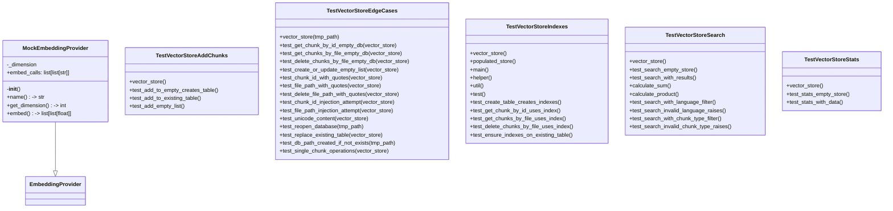

# test_vectorstore.py

## File Overview

This file contains comprehensive test suites for the VectorStore class functionality. It tests vector storage operations, search capabilities, statistics reporting, indexing, and edge cases including SQL injection protection and Unicode handling.

## Classes

### MockEmbeddingProvider

A mock implementation of the EmbeddingProvider interface used for testing purposes.

### TestVectorStoreIndexes

Tests for vector store scalar indexes functionality.

**Key Methods:**
- `vector_store(tmp_path)`: Pytest fixture that creates a VectorStore instance for testing with a temporary database path
- `populated_store(vector_store)`: Pytest fixture that creates a vector store populated with test data

### TestVectorStoreSearch

Tests for vector store search functionality.

**Key Methods:**
- `vector_store(tmp_path)`: Pytest fixture that creates a VectorStore instance for testing
- `test_search_empty_store(vector_store)`: Tests that searching an empty store returns empty results

### TestVectorStoreStats

Tests for vector store statistics functionality.

**Key Methods:**
- `vector_store(tmp_path)`: Pytest fixture that creates a VectorStore instance for testing
- `test_stats_empty_store(vector_store)`: Tests statistics reporting for an empty store, verifying that `total_chunks` is 0 and `languages` is an empty dictionary

### TestVectorStoreAddChunks

Tests for adding chunks to existing tables.

**Key Methods:**
- `vector_store(tmp_path)`: Pytest fixture that creates a VectorStore instance for testing
- `test_add_to_empty_creates_table(vector_store)`: Tests that adding chunks to an empty store creates the table

### TestVectorStoreEdgeCases

Tests for edge cases and error conditions in vector store operations.

**Key Methods:**
- `vector_store(tmp_path)`: Pytest fixture that creates a VectorStore instance for testing
- `test_get_chunk_by_id_empty_db(vector_store)`: Tests that retrieving a chunk by ID from an empty database returns None
- `test_get_chunks_by_file_empty_db(vector_store)`: Tests that retrieving chunks by file from an empty database returns an empty list
- `test_delete_chunks_by_file_empty_db(vector_store)`: Tests that deleting chunks by file from an empty database returns 0
- `test_create_or_update_empty_list(vector_store)`: Tests that creating or updating with an empty list returns 0
- `test_file_path_with_quotes(vector_store)`: Tests that file paths containing quotes are handled safely without causing injection issues
- `test_delete_file_path_with_quotes(vector_store)`: Tests that deleting files with quotes in their paths works correctly
- `test_file_path_injection_attempt(vector_store)`: Tests protection against SQL-like injection attempts in file paths
- `test_search_limit_zero_raises(vector_store)`: Tests that searching with a limit of 0 raises a ValueError with the message "Limit is required"

## Usage Examples

### Creating a Test Vector Store

```python
# Using the fixture pattern shown in the tests
@pytest.fixture
def vector_store(self, tmp_path):
    from local_deepwiki.core.vectorstore import VectorStore
    
    db_path = tmp_path / "test.lance"
    provider = MockEmbeddingProvider()
    return VectorStore(db_path, provider)
```

### Testing Empty Store Statistics

```python
async def test_stats_empty_store(self, vector_store):
    stats = vector_store.get_stats()
    assert stats["total_chunks"] == 0
    assert stats["languages"] == {}
```

### Testing Search with Invalid Limit

```python
async def test_search_limit_zero_raises(self, vector_store):
    chunk = make_chunk("test")
    await vector_store.create_or_update_table([chunk])
    
    with pytest.raises(ValueError, match="Limit is required"):
        await vector_store.search("test", limit=0)
```

## Related Components

This test file works with several components from the local_deepwiki package:

- **VectorStore**: The [main](../src/local_deepwiki/web/app.md) class being tested, imported from `local_deepwiki.core.vectorstore`
- **EmbeddingProvider**: Base class for embedding providers, imported from `local_deepwiki.providers.base`
- **[CodeChunk](../src/local_deepwiki/models.md)**: Data model for code chunks, imported from `local_deepwiki.models`
- **[ChunkType](../src/local_deepwiki/models.md)**: Enumeration for chunk types, imported from `local_deepwiki.models`
- **[Language](../src/local_deepwiki/models.md)**: Enumeration for programming languages, imported from `local_deepwiki.models`

The tests verify vector store operations including chunk storage, retrieval, search, statistics, and proper handling of edge cases like SQL injection attempts and special characters in file paths.

## API Reference

### class `MockEmbeddingProvider`

**Inherits from:** `EmbeddingProvider`

Mock embedding provider for testing.

**Methods:**

#### `__init__`

```python
def __init__(dimension: int = 384)
```


| Parameter | Type | Default | Description |
|-----------|------|---------|-------------|
| `dimension` | `int` | `384` | - |

#### `name`

```python
def name() -> str
```

Return provider name.

#### `get_dimension`

```python
def get_dimension() -> int
```

Return embedding dimension.

#### `embed`

```python
async def embed(texts: list[str]) -> list[list[float]]
```

Generate mock embeddings.


| Parameter | Type | Default | Description |
|-----------|------|---------|-------------|
| `texts` | `list[str]` | - | - |


### class `TestVectorStoreIndexes`

Tests for vector store scalar indexes.

**Methods:**

#### `vector_store`

```python
def vector_store(tmp_path)
```

Create a vector store for testing.


| Parameter | Type | Default | Description |
|-----------|------|---------|-------------|
| `tmp_path` | - | - | - |

#### `populated_store`

```python
async def populated_store(vector_store)
```

Create a vector store with test data.


| Parameter | Type | Default | Description |
|-----------|------|---------|-------------|
| `vector_store` | - | - | - |

#### `test_create_table_creates_indexes`

```python
async def test_create_table_creates_indexes(populated_store)
```

Test that creating a table creates scalar indexes.


| Parameter | Type | Default | Description |
|-----------|------|---------|-------------|
| `populated_store` | - | - | - |

#### `test_get_chunk_by_id_uses_index`

```python
async def test_get_chunk_by_id_uses_index(populated_store)
```

Test that get_chunk_by_id can [find](../src/local_deepwiki/generators/manifest.md) chunks efficiently.


| Parameter | Type | Default | Description |
|-----------|------|---------|-------------|
| `populated_store` | - | - | - |

#### `test_get_chunks_by_file_uses_index`

```python
async def test_get_chunks_by_file_uses_index(populated_store)
```

Test that get_chunks_by_file can [find](../src/local_deepwiki/generators/manifest.md) chunks efficiently.


| Parameter | Type | Default | Description |
|-----------|------|---------|-------------|
| `populated_store` | - | - | - |

#### `test_delete_chunks_by_file_uses_index`

```python
async def test_delete_chunks_by_file_uses_index(populated_store)
```

Test that delete_chunks_by_file works efficiently.


| Parameter | Type | Default | Description |
|-----------|------|---------|-------------|
| `populated_store` | - | - | - |

#### `test_ensure_indexes_on_existing_table`

```python
async def test_ensure_indexes_on_existing_table(vector_store, tmp_path)
```

Test that opening an existing table ensures indexes exist.


| Parameter | Type | Default | Description |
|-----------|------|---------|-------------|
| `vector_store` | - | - | - |
| `tmp_path` | - | - | - |


### class `TestVectorStoreSearch`

Tests for vector store search functionality.

**Methods:**

#### `vector_store`

```python
def vector_store(tmp_path)
```

Create a vector store for testing.


| Parameter | Type | Default | Description |
|-----------|------|---------|-------------|
| `tmp_path` | - | - | - |

#### `test_search_empty_store`

```python
async def test_search_empty_store(vector_store)
```

Test searching an empty store returns empty results.


| Parameter | Type | Default | Description |
|-----------|------|---------|-------------|
| `vector_store` | - | - | - |

#### `test_search_with_results`

```python
async def test_search_with_results(vector_store)
```

Test searching returns results.


| Parameter | Type | Default | Description |
|-----------|------|---------|-------------|
| `vector_store` | - | - | - |

#### `test_search_with_language_filter`

```python
async def test_search_with_language_filter(vector_store)
```

Test searching with language filter.


| Parameter | Type | Default | Description |
|-----------|------|---------|-------------|
| `vector_store` | - | - | - |

#### `test_search_invalid_language_raises`

```python
async def test_search_invalid_language_raises(vector_store)
```

Test searching with invalid language raises ValueError.


| Parameter | Type | Default | Description |
|-----------|------|---------|-------------|
| `vector_store` | - | - | - |

#### `test_search_with_chunk_type_filter`

```python
async def test_search_with_chunk_type_filter(vector_store)
```

Test searching with chunk type filter.


| Parameter | Type | Default | Description |
|-----------|------|---------|-------------|
| `vector_store` | - | - | - |

#### `test_search_invalid_chunk_type_raises`

```python
async def test_search_invalid_chunk_type_raises(vector_store)
```

Test searching with invalid chunk type raises ValueError.


| Parameter | Type | Default | Description |
|-----------|------|---------|-------------|
| `vector_store` | - | - | - |


### class `TestVectorStoreStats`

Tests for vector store statistics.

**Methods:**

#### `vector_store`

```python
def vector_store(tmp_path)
```

Create a vector store for testing.


| Parameter | Type | Default | Description |
|-----------|------|---------|-------------|
| `tmp_path` | - | - | - |

#### `test_stats_empty_store`

```python
def test_stats_empty_store(vector_store)
```

Test stats for empty store.


| Parameter | Type | Default | Description |
|-----------|------|---------|-------------|
| `vector_store` | - | - | - |

#### `test_stats_with_data`

```python
async def test_stats_with_data(vector_store)
```

Test stats with data.


| Parameter | Type | Default | Description |
|-----------|------|---------|-------------|
| `vector_store` | - | - | - |


### class `TestVectorStoreAddChunks`

Tests for adding chunks to existing table.

**Methods:**

#### `vector_store`

```python
def vector_store(tmp_path)
```

Create a vector store for testing.


| Parameter | Type | Default | Description |
|-----------|------|---------|-------------|
| `tmp_path` | - | - | - |

#### `test_add_to_empty_creates_table`

```python
async def test_add_to_empty_creates_table(vector_store)
```

Test adding to empty store creates table.


| Parameter | Type | Default | Description |
|-----------|------|---------|-------------|
| `vector_store` | - | - | - |

#### `test_add_to_existing_table`

```python
async def test_add_to_existing_table(vector_store)
```

Test adding chunks to existing table.


| Parameter | Type | Default | Description |
|-----------|------|---------|-------------|
| `vector_store` | - | - | - |

#### `test_add_empty_list`

```python
async def test_add_empty_list(vector_store)
```

Test adding empty list returns 0.


| Parameter | Type | Default | Description |
|-----------|------|---------|-------------|
| `vector_store` | - | - | - |


### class `TestVectorStoreEdgeCases`

Tests for vector store edge cases and error handling.

**Methods:**

#### `vector_store`

```python
def vector_store(tmp_path)
```

Create a vector store for testing.


| Parameter | Type | Default | Description |
|-----------|------|---------|-------------|
| `tmp_path` | - | - | - |

#### `test_get_chunk_by_id_empty_db`

```python
async def test_get_chunk_by_id_empty_db(vector_store)
```

Test get_chunk_by_id on empty database returns None.


| Parameter | Type | Default | Description |
|-----------|------|---------|-------------|
| `vector_store` | - | - | - |

#### `test_get_chunks_by_file_empty_db`

```python
async def test_get_chunks_by_file_empty_db(vector_store)
```

Test get_chunks_by_file on empty database returns empty list.


| Parameter | Type | Default | Description |
|-----------|------|---------|-------------|
| `vector_store` | - | - | - |

#### `test_delete_chunks_by_file_empty_db`

```python
async def test_delete_chunks_by_file_empty_db(vector_store)
```

Test delete_chunks_by_file on empty database returns 0.


| Parameter | Type | Default | Description |
|-----------|------|---------|-------------|
| `vector_store` | - | - | - |

#### `test_create_or_update_empty_list`

```python
async def test_create_or_update_empty_list(vector_store)
```

Test create_or_update_table with empty list returns 0.


| Parameter | Type | Default | Description |
|-----------|------|---------|-------------|
| `vector_store` | - | - | - |

#### `test_chunk_id_with_quotes`

```python
async def test_chunk_id_with_quotes(vector_store)
```

Test chunk ID with single quotes is handled safely.


| Parameter | Type | Default | Description |
|-----------|------|---------|-------------|
| `vector_store` | - | - | - |

#### `test_file_path_with_quotes`

```python
async def test_file_path_with_quotes(vector_store)
```

Test file path with quotes is handled safely.


| Parameter | Type | Default | Description |
|-----------|------|---------|-------------|
| `vector_store` | - | - | - |

#### `test_delete_file_path_with_quotes`

```python
async def test_delete_file_path_with_quotes(vector_store)
```

Test deleting file path with quotes is handled safely.


| Parameter | Type | Default | Description |
|-----------|------|---------|-------------|
| `vector_store` | - | - | - |

#### `test_chunk_id_injection_attempt`

```python
async def test_chunk_id_injection_attempt(vector_store)
```

Test that SQL-like injection in chunk_id is neutralized.


| Parameter | Type | Default | Description |
|-----------|------|---------|-------------|
| `vector_store` | - | - | - |

#### `test_file_path_injection_attempt`

```python
async def test_file_path_injection_attempt(vector_store)
```

Test that SQL-like injection in file_path is neutralized.


| Parameter | Type | Default | Description |
|-----------|------|---------|-------------|
| `vector_store` | - | - | - |

#### `test_unicode_content`

```python
async def test_unicode_content(vector_store)
```

Test handling of Unicode content in chunks.


| Parameter | Type | Default | Description |
|-----------|------|---------|-------------|
| `vector_store` | - | - | - |

#### `test_reopen_database`

```python
async def test_reopen_database(tmp_path)
```

Test reopening database preserves data.


| Parameter | Type | Default | Description |
|-----------|------|---------|-------------|
| `tmp_path` | - | - | - |

#### `test_replace_existing_table`

```python
async def test_replace_existing_table(vector_store)
```

Test create_or_update_table replaces existing data.


| Parameter | Type | Default | Description |
|-----------|------|---------|-------------|
| `vector_store` | - | - | - |

#### `test_db_path_created_if_not_exists`

```python
async def test_db_path_created_if_not_exists(tmp_path)
```

Test that database directory is created if it doesn't exist.


| Parameter | Type | Default | Description |
|-----------|------|---------|-------------|
| `tmp_path` | - | - | - |

#### `test_single_chunk_operations`

```python
async def test_single_chunk_operations(vector_store)
```

Test operations with single chunk.


| Parameter | Type | Default | Description |
|-----------|------|---------|-------------|
| `vector_store` | - | - | - |

#### `test_empty_content_chunk`

```python
async def test_empty_content_chunk(vector_store)
```

Test chunk with empty content.


| Parameter | Type | Default | Description |
|-----------|------|---------|-------------|
| `vector_store` | - | - | - |

#### `test_large_content_chunk`

```python
async def test_large_content_chunk(vector_store)
```

Test chunk with large content.


| Parameter | Type | Default | Description |
|-----------|------|---------|-------------|
| `vector_store` | - | - | - |

#### `test_many_chunks_same_file`

```python
async def test_many_chunks_same_file(vector_store)
```

Test many chunks from same file.


| Parameter | Type | Default | Description |
|-----------|------|---------|-------------|
| `vector_store` | - | - | - |

#### `test_search_limit_zero_raises`

```python
async def test_search_limit_zero_raises(vector_store)
```

Test search with limit=0 raises ValueError.


| Parameter | Type | Default | Description |
|-----------|------|---------|-------------|
| `vector_store` | - | - | - |

#### `test_search_very_long_query`

```python
async def test_search_very_long_query(vector_store)
```

Test search with very long query string.


| Parameter | Type | Default | Description |
|-----------|------|---------|-------------|
| `vector_store` | - | - | - |


---

### Functions

#### `make_chunk`

```python
def make_chunk(id: str, file_path: str = "test.py", content: str = "test code", language: Language = Language.PYTHON, chunk_type: ChunkType = ChunkType.FUNCTION) -> CodeChunk
```

Create a test code chunk.


| Parameter | Type | Default | Description |
|-----------|------|---------|-------------|
| `id` | `str` | - | - |
| `file_path` | `str` | `"test.py"` | - |
| `content` | `str` | `"test code"` | - |
| `language` | [`Language`](../src/local_deepwiki/models.md) | `Language.PYTHON` | - |
| `chunk_type` | [`ChunkType`](../src/local_deepwiki/models.md) | `ChunkType.FUNCTION` | - |

**Returns:** [`CodeChunk`](../src/local_deepwiki/models.md)


## Class Diagram



## Call Graph


## Relevant Source Files

- `tests/test_vectorstore.py:9-28`

## See Also

- [models](../src/local_deepwiki/models.md) - dependency
