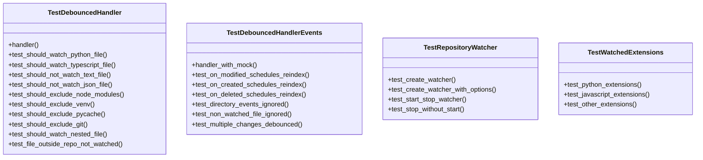

# File Overview

This file contains tests for the [`DebouncedHandler`](../src/local_deepwiki/watcher.md) and [`RepositoryWatcher`](../src/local_deepwiki/watcher.md) classes from the `local_deepwiki.watcher` module. It verifies the behavior of file watching and debouncing functionality, ensuring that only specific file types are monitored and that events are properly scheduled for reindexing.

# Classes

## TestWatchedExtensions

Tests that the correct file extensions are included in the `WATCHED_EXTENSIONS` set.

### Methods

- `test_python_extensions`: Verifies that Python file extensions (`.py`, `.pyi`) are included in the watched extensions.
- `test_javascript_extensions`: Verifies that JavaScript and TypeScript file extensions (`.js`, `.jsx`, `.ts`, `.tsx`) are included in the watched extensions.
- `test_other_extensions`: Verifies that other file extensions (`.md`, `.txt`, `.csv`) are included in the watched extensions.

## TestDebouncedHandler

Tests the [`DebouncedHandler`](../src/local_deepwiki/watcher.md) class, which handles file system events and schedules reindexing with debouncing.

### Methods

- `test_should_watch_python_file`: Tests that Python files are watched.
- `test_on_modified_schedules_reindex`: Tests that file modification events schedule reindexing.
- `test_on_created_schedules_reindex`: Tests that file creation events schedule reindexing.
- `test_on_deleted_schedules_reindex`: Tests that file deletion events schedule reindexing.
- `test_directory_events_ignored`: Tests that directory events are ignored.
- `test_non_watched_file_ignored`: Tests that non-watched file types are ignored.
- `test_multiple_changes_debounced`: Tests that multiple rapid changes are debounced into a single reindex.

## TestRepositoryWatcher

Tests the [`RepositoryWatcher`](../src/local_deepwiki/watcher.md) class, which manages watching a repository for file changes.

### Methods

- `test_create_watcher`: Tests creating a watcher with default settings.
- `test_create_watcher_with_options`: Tests creating a watcher with custom configuration options.

## TestDebouncedHandlerEvents

A test class that groups event-related tests for the [`DebouncedHandler`](../src/local_deepwiki/watcher.md).

# Functions

This file does not define any standalone functions outside of test methods.

# Usage Examples

The tests use `pytest` fixtures to set up test environments. For example:

```python
def test_should_watch_python_file(self, handler, tmp_path):
    test_file = tmp_path / "test.py"
    test_file.touch()
    assert handler._should_watch_file(str(test_file)) == True
```

This example shows how a test creates a Python file and checks if it's watched by the handler.

# Related Components

This file works with the following components from the `local_deepwiki.watcher` module:

- [`DebouncedHandler`](../src/local_deepwiki/watcher.md): Handles file system events and schedules reindexing with debouncing.
- [`RepositoryWatcher`](../src/local_deepwiki/watcher.md): Manages watching a repository for file changes.
- `WATCHED_EXTENSIONS`: A set of file extensions that are watched for changes.

It also uses the [`Config`](../src/local_deepwiki/config.md) class from `local_deepwiki.config` for configuration options.

## API Reference

### class `TestWatchedExtensions`

Test that watched extensions are correct.

**Methods:**

#### `test_python_extensions`

```python
def test_python_extensions()
```

Test Python extensions are watched.

#### `test_javascript_extensions`

```python
def test_javascript_extensions()
```

Test JavaScript/TypeScript extensions are watched.

#### `test_other_extensions`

```python
def test_other_extensions()
```

Test other language extensions are watched.


### class `TestDebouncedHandler`

Test [DebouncedHandler](../src/local_deepwiki/watcher.md) functionality.

**Methods:**

#### `handler`

```python
def handler(tmp_path)
```

Create a handler for testing.


| [Parameter](../src/local_deepwiki/generators/api_docs.md) | Type | Default | Description |
|-----------|------|---------|-------------|
| `tmp_path` | - | - | - |

#### `test_should_watch_python_file`

```python
def test_should_watch_python_file(handler, tmp_path)
```

Test that Python files are watched.


| [Parameter](../src/local_deepwiki/generators/api_docs.md) | Type | Default | Description |
|-----------|------|---------|-------------|
| `handler` | - | - | - |
| `tmp_path` | - | - | - |

#### `test_should_watch_typescript_file`

```python
def test_should_watch_typescript_file(handler, tmp_path)
```

Test that TypeScript files are watched.


| [Parameter](../src/local_deepwiki/generators/api_docs.md) | Type | Default | Description |
|-----------|------|---------|-------------|
| `handler` | - | - | - |
| `tmp_path` | - | - | - |

#### `test_should_not_watch_text_file`

```python
def test_should_not_watch_text_file(handler, tmp_path)
```

Test that text files are not watched.


| [Parameter](../src/local_deepwiki/generators/api_docs.md) | Type | Default | Description |
|-----------|------|---------|-------------|
| `handler` | - | - | - |
| `tmp_path` | - | - | - |

#### `test_should_not_watch_json_file`

```python
def test_should_not_watch_json_file(handler, tmp_path)
```

Test that JSON files are not watched.


| [Parameter](../src/local_deepwiki/generators/api_docs.md) | Type | Default | Description |
|-----------|------|---------|-------------|
| `handler` | - | - | - |
| `tmp_path` | - | - | - |

#### `test_should_exclude_node_modules`

```python
def test_should_exclude_node_modules(handler, tmp_path)
```

Test that node_modules files are excluded.


| [Parameter](../src/local_deepwiki/generators/api_docs.md) | Type | Default | Description |
|-----------|------|---------|-------------|
| `handler` | - | - | - |
| `tmp_path` | - | - | - |

#### `test_should_exclude_venv`

```python
def test_should_exclude_venv(handler, tmp_path)
```

Test that venv files are excluded.


| [Parameter](../src/local_deepwiki/generators/api_docs.md) | Type | Default | Description |
|-----------|------|---------|-------------|
| `handler` | - | - | - |
| `tmp_path` | - | - | - |

#### `test_should_exclude_pycache`

```python
def test_should_exclude_pycache(handler, tmp_path)
```

Test that __pycache__ files are excluded.


| [Parameter](../src/local_deepwiki/generators/api_docs.md) | Type | Default | Description |
|-----------|------|---------|-------------|
| `handler` | - | - | - |
| `tmp_path` | - | - | - |

#### `test_should_exclude_git`

```python
def test_should_exclude_git(handler, tmp_path)
```

Test that .git files are excluded.


| [Parameter](../src/local_deepwiki/generators/api_docs.md) | Type | Default | Description |
|-----------|------|---------|-------------|
| `handler` | - | - | - |
| `tmp_path` | - | - | - |

#### `test_should_watch_nested_file`

```python
def test_should_watch_nested_file(handler, tmp_path)
```

Test that nested source files are watched.


| [Parameter](../src/local_deepwiki/generators/api_docs.md) | Type | Default | Description |
|-----------|------|---------|-------------|
| `handler` | - | - | - |
| `tmp_path` | - | - | - |

#### `test_file_outside_repo_not_watched`

```python
def test_file_outside_repo_not_watched(handler, tmp_path)
```

Test that files outside repo are not watched.


| [Parameter](../src/local_deepwiki/generators/api_docs.md) | Type | Default | Description |
|-----------|------|---------|-------------|
| `handler` | - | - | - |
| `tmp_path` | - | - | - |


### class `TestRepositoryWatcher`

Test [RepositoryWatcher](../src/local_deepwiki/watcher.md) functionality.

**Methods:**

#### `test_create_watcher`

```python
def test_create_watcher(tmp_path)
```

Test creating a watcher.


| [Parameter](../src/local_deepwiki/generators/api_docs.md) | Type | Default | Description |
|-----------|------|---------|-------------|
| `tmp_path` | - | - | - |

#### `test_create_watcher_with_options`

```python
def test_create_watcher_with_options(tmp_path)
```

Test creating a watcher with options.


| [Parameter](../src/local_deepwiki/generators/api_docs.md) | Type | Default | Description |
|-----------|------|---------|-------------|
| `tmp_path` | - | - | - |

#### `test_start_stop_watcher`

```python
def test_start_stop_watcher(tmp_path)
```

Test starting and stopping a watcher.


| [Parameter](../src/local_deepwiki/generators/api_docs.md) | Type | Default | Description |
|-----------|------|---------|-------------|
| `tmp_path` | - | - | - |

#### `test_stop_without_start`

```python
def test_stop_without_start(tmp_path)
```

Test stopping a watcher that was never started.


| [Parameter](../src/local_deepwiki/generators/api_docs.md) | Type | Default | Description |
|-----------|------|---------|-------------|
| `tmp_path` | - | - | - |


### class `TestDebouncedHandlerEvents`

Test event handling with debouncing.

**Methods:**

#### `handler_with_mock`

```python
def handler_with_mock(tmp_path)
```

Create a handler with mocked reindex.


| [Parameter](../src/local_deepwiki/generators/api_docs.md) | Type | Default | Description |
|-----------|------|---------|-------------|
| `tmp_path` | - | - | - |

#### `test_on_modified_schedules_reindex`

```python
def test_on_modified_schedules_reindex(handler_with_mock, tmp_path)
```

Test that file modification schedules reindex.


| [Parameter](../src/local_deepwiki/generators/api_docs.md) | Type | Default | Description |
|-----------|------|---------|-------------|
| `handler_with_mock` | - | - | - |
| `tmp_path` | - | - | - |

#### `test_on_created_schedules_reindex`

```python
def test_on_created_schedules_reindex(handler_with_mock, tmp_path)
```

Test that file creation schedules reindex.


| [Parameter](../src/local_deepwiki/generators/api_docs.md) | Type | Default | Description |
|-----------|------|---------|-------------|
| `handler_with_mock` | - | - | - |
| `tmp_path` | - | - | - |

#### `test_on_deleted_schedules_reindex`

```python
def test_on_deleted_schedules_reindex(handler_with_mock, tmp_path)
```

Test that file deletion schedules reindex.


| [Parameter](../src/local_deepwiki/generators/api_docs.md) | Type | Default | Description |
|-----------|------|---------|-------------|
| `handler_with_mock` | - | - | - |
| `tmp_path` | - | - | - |

#### `test_directory_events_ignored`

```python
def test_directory_events_ignored(handler_with_mock, tmp_path)
```

Test that directory events are ignored.


| [Parameter](../src/local_deepwiki/generators/api_docs.md) | Type | Default | Description |
|-----------|------|---------|-------------|
| `handler_with_mock` | - | - | - |
| `tmp_path` | - | - | - |

#### `test_non_watched_file_ignored`

```python
def test_non_watched_file_ignored(handler_with_mock, tmp_path)
```

Test that non-watched files are ignored.


| [Parameter](../src/local_deepwiki/generators/api_docs.md) | Type | Default | Description |
|-----------|------|---------|-------------|
| `handler_with_mock` | - | - | - |
| `tmp_path` | - | - | - |

#### `test_multiple_changes_debounced`

```python
def test_multiple_changes_debounced(handler_with_mock, tmp_path)
```

Test that multiple rapid changes are debounced.


| [Parameter](../src/local_deepwiki/generators/api_docs.md) | Type | Default | Description |
|-----------|------|---------|-------------|
| `handler_with_mock` | - | - | - |
| `tmp_path` | - | - | - |


## Class Diagram



## Call Graph

```mermaid
flowchart TD
    N0[Config]
    N1[DebouncedHandler]
    N2[MagicMock]
    N3[RepositoryWatcher]
    N4[TestDebouncedHandler.handler]
    N5[TestDebouncedHandler.test_f...]
    N6[TestDebouncedHandler.test_s...]
    N7[TestDebouncedHandler.test_s...]
    N8[TestDebouncedHandler.test_s...]
    N9[TestDebouncedHandler.test_s...]
    N10[TestDebouncedHandler.test_s...]
    N11[TestDebouncedHandler.test_s...]
    N12[TestDebouncedHandler.test_s...]
    N13[TestDebouncedHandler.test_s...]
    N14[TestDebouncedHandler.test_s...]
    N15[TestDebouncedHandlerEvents....]
    N16[TestDebouncedHandlerEvents....]
    N17[TestDebouncedHandlerEvents....]
    N18[TestDebouncedHandlerEvents....]
    N19[TestDebouncedHandlerEvents....]
    N20[TestDebouncedHandlerEvents....]
    N21[TestRepositoryWatcher.test_...]
    N22[TestRepositoryWatcher.test_...]
    N23[TestRepositoryWatcher.test_...]
    N24[_should_watch_file]
    N25[cancel]
    N26[is_running]
    N27[mkdir]
    N28[on_modified]
    N29[touch]
    N4 --> N0
    N4 --> N1
    N13 --> N29
    N13 --> N24
    N14 --> N29
    N14 --> N24
    N11 --> N29
    N11 --> N24
    N10 --> N29
    N10 --> N24
    N7 --> N27
    N7 --> N29
    N7 --> N24
    N9 --> N27
    N9 --> N29
    N9 --> N24
    N8 --> N27
    N8 --> N29
    N8 --> N24
    N6 --> N27
    N6 --> N29
    N6 --> N24
    N12 --> N27
    N12 --> N29
    N12 --> N24
    N5 --> N27
    N5 --> N29
    N5 --> N24
    N21 --> N3
    N21 --> N26
    N22 --> N3
    N22 --> N26
    N23 --> N3
    N23 --> N26
    N15 --> N0
    N15 --> N1
    N20 --> N29
    N20 --> N2
    N20 --> N28
    N20 --> N25
    N18 --> N29
    N18 --> N2
    N18 --> N25
    N19 --> N2
    N19 --> N25
    N17 --> N29
    N17 --> N2
    N17 --> N28
    N16 --> N29
    N16 --> N2
    N16 --> N28
    N16 --> N25
    classDef func fill:#e1f5fe
    class N0,N1,N2,N3,N24,N25,N26,N27,N28,N29 func
    classDef method fill:#fff3e0
    class N4,N5,N6,N7,N8,N9,N10,N11,N12,N13,N14,N15,N16,N17,N18,N19,N20,N21,N22,N23 method
```



## Relevant Source Files

- `tests/test_watcher.py`
