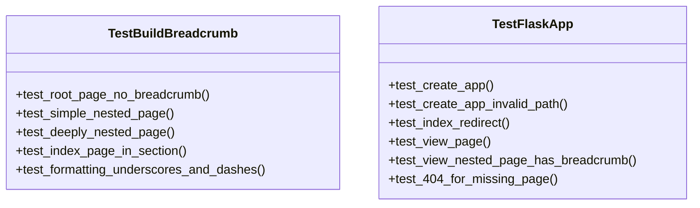

# Test Web Documentation

## File Overview

This file contains unit tests for the web application components of `local_deepwiki`. It tests the Flask application initialization and breadcrumb building functionality, ensuring proper behavior for wiki navigation.

## Classes

### `TestBuildBreadcrumb`

Tests for the `build_breadcrumb` function that generates navigation breadcrumbs for wiki pages.

**Methods:**

- `test_root_page_no_breadcrumb(wiki_dir)`
  - Tests that root pages (index.md, architecture.md) return empty breadcrumbs
  - Parameters: `wiki_dir` - temporary directory path for test wiki
  - Asserts: Empty string result for root pages

- `test_simple_nested_page(wiki_dir)`
  - Tests breadcrumb generation for pages one level deep
  - Parameters: `wiki_dir` - temporary directory path for test wiki
  - Asserts: Breadcrumb contains Home link and proper page hierarchy

### `TestFlaskApp`

Tests for Flask application functionality including initialization and routing.

**Methods:**

- `test_create_app(wiki_dir)`
  - Tests that `create_app` initializes correctly with a valid wiki directory
  - Parameters: `wiki_dir` - temporary directory path for test wiki
  - Asserts: App instance is returned (not None)

- `test_create_app_invalid_path()`
  - Tests that `create_app` raises ValueError for non-existent paths
  - Asserts: ValueError with "does not exist" message

- `test_index_redirect(wiki_dir)`
  - Tests that the root URL (/) redirects to /wiki/index.md
  - Parameters: `wiki_dir` - temporary directory path for test wiki
  - Asserts: HTTP 302 redirect response

## Functions

### `wiki_dir`

**Purpose:**
A pytest fixture that creates a temporary directory structure for testing wiki content.

**Parameters:**
None

**Returns:**
Path object pointing to temporary directory containing test wiki files

**Usage:**
```python
def test_something(wiki_dir):
    # wiki_dir contains test wiki structure
    pass
```

## Usage Examples

### Running Tests
```bash
pytest tests/test_web.py
```

### Testing App Creation
```python
def test_app_initialization(wiki_dir):
    app = create_app(wiki_dir)
    assert app is not None
```

### Testing Breadcrumb Generation
```python
def test_breadcrumb_generation(wiki_dir):
    breadcrumb = build_breadcrumb(wiki_dir, "modules/src.md")
    assert '<a href="' in breadcrumb  # Contains Home link
```

## Dependencies

- `pytest` - Testing framework
- `pathlib.Path` - Path manipulation
- `tempfile` - Temporary file handling
- `local_deepwiki.web.app` - Contains `build_breadcrumb` and `create_app` functions being tested

The test file requires the `local_deepwiki` package to be installed and accessible in the Python path.

## Class Diagram



## See Also

- [app](../src/local_deepwiki/web/app.md) - dependency
- [test_search](test_search.md) - shares 4 dependencies
- [test_parser](test_parser.md) - shares 3 dependencies
- [test_chunker](test_chunker.md) - shares 2 dependencies
