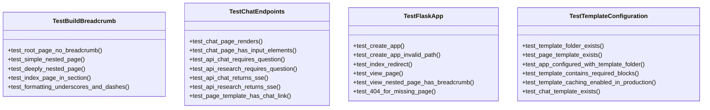

# tests/test_web.py

## File Overview

This file contains unit tests for the Flask web application functionality of the local_deepwiki project. It tests core web app features including app initialization, routing, template configuration, breadcrumb generation, and chat endpoints.

## Test Classes

### TestFlaskApp

Tests for Flask app functionality, focusing on app creation and basic routing behavior.

**Key Test Methods:**
- `test_create_app(wiki_dir)` - Verifies that the [create_app](../src/local_deepwiki/web/app.md) function initializes correctly with a valid wiki directory
- `test_create_app_invalid_path()` - Tests that [create_app](../src/local_deepwiki/web/app.md) raises a ValueError when given a non-existent path
- `test_index_redirect(wiki_dir)` - Tests that the root path redirects to `/wiki/index.md`

### TestTemplateConfiguration

Tests for Jinja2 template configuration and template file existence.

**Key Test Methods:**
- `test_template_folder_exists()` - Verifies that the templates folder exists in the module directory
- `test_page_template_exists()` - Confirms that the `page.html` template file exists
- `test_app_configured_with_template_folder` - Tests template folder configuration (method signature truncated in provided code)

### TestBuildBreadcrumb

Tests for breadcrumb generation functionality (implementation details not shown in provided code).

### TestChatEndpoints

Tests for chat endpoint functionality (implementation details not shown in provided code).

## Functions

### wiki_dir

A pytest fixture function that provides a wiki directory for testing purposes (implementation not shown in provided code).

## Usage Examples

```python
# Testing app creation
def test_create_app(wiki_dir):
    app = create_app(wiki_dir)
    assert app is not None

# Testing invalid path handling
def test_create_app_invalid_path():
    with pytest.raises(ValueError, match="does not exist"):
        create_app("/nonexistent/path")
```

## Related Components

This test file imports and tests components from:
- `local_deepwiki.web.app` - The [main](../src/local_deepwiki/export/html.md) Flask application module containing:
  - `_MODULE_DIR` - Module directory constant
  - `app` - Flask application instance
  - [`build_breadcrumb`](../src/local_deepwiki/web/app.md) - Breadcrumb generation function
  - [`create_app`](../src/local_deepwiki/web/app.md) - App factory function

The tests use standard testing libraries:
- `pytest` for test framework functionality
- `tempfile` for temporary file/directory creation
- `pathlib.Path` for file system path operations

## API Reference

### class `TestBuildBreadcrumb`

Tests for [build_breadcrumb](../src/local_deepwiki/web/app.md) function.

**Methods:**

#### `test_root_page_no_breadcrumb`

```python
def test_root_page_no_breadcrumb(wiki_dir)
```

Root pages should have no breadcrumb.


| [Parameter](../src/local_deepwiki/generators/api_docs.md) | Type | Default | Description |
|-----------|------|---------|-------------|
| `wiki_dir` | - | - | - |

#### `test_simple_nested_page`

```python
def test_simple_nested_page(wiki_dir)
```

Pages one level deep should show Home > Section > Page.


| [Parameter](../src/local_deepwiki/generators/api_docs.md) | Type | Default | Description |
|-----------|------|---------|-------------|
| `wiki_dir` | - | - | - |

#### `test_deeply_nested_page`

```python
def test_deeply_nested_page(wiki_dir)
```

Deeply nested pages should show full path.


| [Parameter](../src/local_deepwiki/generators/api_docs.md) | Type | Default | Description |
|-----------|------|---------|-------------|
| `wiki_dir` | - | - | - |

#### `test_index_page_in_section`

```python
def test_index_page_in_section(wiki_dir)
```

Index pages in sections should show proper breadcrumb.


| [Parameter](../src/local_deepwiki/generators/api_docs.md) | Type | Default | Description |
|-----------|------|---------|-------------|
| `wiki_dir` | - | - | - |

#### `test_formatting_underscores_and_dashes`

```python
def test_formatting_underscores_and_dashes(wiki_dir)
```

Underscores and dashes should be replaced with spaces.


| [Parameter](../src/local_deepwiki/generators/api_docs.md) | Type | Default | Description |
|-----------|------|---------|-------------|
| `wiki_dir` | - | - | - |


### class `TestFlaskApp`

Tests for Flask app functionality.

**Methods:**

#### `test_create_app`

```python
def test_create_app(wiki_dir)
```

Test that [create_app](../src/local_deepwiki/web/app.md) initializes correctly.


| [Parameter](../src/local_deepwiki/generators/api_docs.md) | Type | Default | Description |
|-----------|------|---------|-------------|
| `wiki_dir` | - | - | - |

#### `test_create_app_invalid_path`

```python
def test_create_app_invalid_path()
```

Test that [create_app](../src/local_deepwiki/web/app.md) raises error for invalid path.

#### `test_index_redirect`

```python
def test_index_redirect(wiki_dir)
```

Test that / redirects to /wiki/index.md.


| [Parameter](../src/local_deepwiki/generators/api_docs.md) | Type | Default | Description |
|-----------|------|---------|-------------|
| `wiki_dir` | - | - | - |

#### `test_view_page`

```python
def test_view_page(wiki_dir)
```

Test viewing a wiki page.


| [Parameter](../src/local_deepwiki/generators/api_docs.md) | Type | Default | Description |
|-----------|------|---------|-------------|
| `wiki_dir` | - | - | - |

#### `test_view_nested_page_has_breadcrumb`

```python
def test_view_nested_page_has_breadcrumb(wiki_dir)
```

Test that nested pages display breadcrumbs.


| [Parameter](../src/local_deepwiki/generators/api_docs.md) | Type | Default | Description |
|-----------|------|---------|-------------|
| `wiki_dir` | - | - | - |

#### `test_404_for_missing_page`

```python
def test_404_for_missing_page(wiki_dir)
```

Test that missing pages return 404.


| [Parameter](../src/local_deepwiki/generators/api_docs.md) | Type | Default | Description |
|-----------|------|---------|-------------|
| `wiki_dir` | - | - | - |


### class `TestTemplateConfiguration`

Tests for Jinja2 template configuration.

**Methods:**

#### `test_template_folder_exists`

```python
def test_template_folder_exists()
```

Test that the templates folder exists.

#### `test_page_template_exists`

```python
def test_page_template_exists()
```

Test that the page.html template exists.

#### `test_app_configured_with_template_folder`

```python
def test_app_configured_with_template_folder()
```

Test that Flask app has correct template folder configured.

#### `test_template_contains_required_blocks`

```python
def test_template_contains_required_blocks()
```

Test that the template contains essential Jinja2 variables.

#### `test_template_caching_enabled_in_production`

```python
def test_template_caching_enabled_in_production(wiki_dir)
```

Test that template caching is enabled when debug=False.


| [Parameter](../src/local_deepwiki/generators/api_docs.md) | Type | Default | Description |
|-----------|------|---------|-------------|
| `wiki_dir` | - | - | - |

#### `test_chat_template_exists`

```python
def test_chat_template_exists()
```

Test that the chat.html template exists.


### class `TestChatEndpoints`

Tests for chat functionality.

**Methods:**

#### `test_chat_page_renders`

```python
def test_chat_page_renders(wiki_dir)
```

Test that the chat page renders successfully.


| [Parameter](../src/local_deepwiki/generators/api_docs.md) | Type | Default | Description |
|-----------|------|---------|-------------|
| `wiki_dir` | - | - | - |

#### `test_chat_page_has_input_elements`

```python
def test_chat_page_has_input_elements(wiki_dir)
```

Test that the chat page has required input elements.


| [Parameter](../src/local_deepwiki/generators/api_docs.md) | Type | Default | Description |
|-----------|------|---------|-------------|
| `wiki_dir` | - | - | - |

#### `test_api_chat_requires_question`

```python
def test_api_chat_requires_question(wiki_dir)
```

Test that /api/chat returns error for missing question.


| [Parameter](../src/local_deepwiki/generators/api_docs.md) | Type | Default | Description |
|-----------|------|---------|-------------|
| `wiki_dir` | - | - | - |

#### `test_api_research_requires_question`

```python
def test_api_research_requires_question(wiki_dir)
```

Test that /api/research returns error for missing question.


| [Parameter](../src/local_deepwiki/generators/api_docs.md) | Type | Default | Description |
|-----------|------|---------|-------------|
| `wiki_dir` | - | - | - |

#### `test_api_chat_returns_sse`

```python
def test_api_chat_returns_sse(wiki_dir)
```

Test that /api/chat returns Server-Sent Events content type.


| [Parameter](../src/local_deepwiki/generators/api_docs.md) | Type | Default | Description |
|-----------|------|---------|-------------|
| `wiki_dir` | - | - | - |

#### `test_api_research_returns_sse`

```python
def test_api_research_returns_sse(wiki_dir)
```

Test that /api/research returns Server-Sent Events content type.


| [Parameter](../src/local_deepwiki/generators/api_docs.md) | Type | Default | Description |
|-----------|------|---------|-------------|
| `wiki_dir` | - | - | - |

#### `test_page_template_has_chat_link`

```python
def test_page_template_has_chat_link(wiki_dir)
```

Test that wiki pages have a link to the chat interface.


| [Parameter](../src/local_deepwiki/generators/api_docs.md) | Type | Default | Description |
|-----------|------|---------|-------------|
| `wiki_dir` | - | - | - |


---

### Functions

#### `wiki_dir`

`@pytest.fixture`

```python
def wiki_dir()
```

Create a temporary wiki directory structure.


## Class Diagram



## Call Graph


## Relevant Source Files

- `tests/test_web.py:40-104`

## See Also

- [test_search](test_search.md) - shares 4 dependencies
- [test_parser](test_parser.md) - shares 3 dependencies
- [test_indexer](test_indexer.md) - shares 3 dependencies
