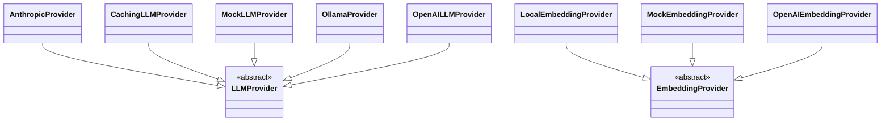

# Class Inheritance

This page shows the class inheritance hierarchies in the codebase.

## Inheritance Diagram

## Inheritance Trees

- **[EmbeddingProvider](files/src/local_deepwiki/providers/base.md)** (abstract) `base.py` - Abstract base class for embedding providers.
  └─ **[LocalEmbeddingProvider](files/src/local_deepwiki/providers/embeddings/local.md)** `local.py` - Embedding provider using local sentence-transformers models.
  └─ **MockEmbeddingProvider** `test_vectorstore.py` - Mock embedding provider for testing.
  └─ **[OpenAIEmbeddingProvider](files/src/local_deepwiki/providers/embeddings/openai.md)** `openai.py` - Embedding provider using OpenAI API.

- **[LLMProvider](files/src/local_deepwiki/providers/base.md)** (abstract) `base.py` - Abstract base class for LLM providers.
  └─ **[AnthropicProvider](files/src/local_deepwiki/providers/llm/anthropic.md)** `anthropic.py` - LLM provider using Anthropic API.
  └─ **[CachingLLMProvider](files/src/local_deepwiki/providers/llm/cached.md)** `cached.py` - LLM provider [wrapper](files/src/local_deepwiki/providers/base.md) that caches responses.
  └─ **MockLLMProvider** `test_deep_research.py` - Mock LLM provider for testing.
  └─ **[OllamaProvider](files/src/local_deepwiki/providers/llm/ollama.md)** `ollama.py` - LLM provider using local Ollama.
  └─ **[OpenAILLMProvider](files/src/local_deepwiki/providers/llm/openai.md)** `openai.py` - LLM provider using OpenAI API.

## All Classes

| Class | Inherits From | File |
|-------|---------------|------|
| [`AnthropicProvider`](files/src/local_deepwiki/providers/llm/anthropic.md) | [`LLMProvider`](files/src/local_deepwiki/providers/base.md) | [anthropic.py](files/src/local_deepwiki/providers/llm/anthropic.md) |
| [`CachingLLMProvider`](files/src/local_deepwiki/providers/llm/cached.md) | [`LLMProvider`](files/src/local_deepwiki/providers/base.md) | [cached.py](files/src/local_deepwiki/providers/llm/cached.md) |
| [`EmbeddingProvider`](files/src/local_deepwiki/providers/base.md) | `ABC` | [base.py](files/src/local_deepwiki/providers/base.md) |
| [`LLMProvider`](files/src/local_deepwiki/providers/base.md) | `ABC` | [base.py](files/src/local_deepwiki/providers/base.md) |
| [`LocalEmbeddingProvider`](files/src/local_deepwiki/providers/embeddings/local.md) | [`EmbeddingProvider`](files/src/local_deepwiki/providers/base.md) | [local.py](files/src/local_deepwiki/providers/embeddings/local.md) |
| `MockEmbeddingProvider` | [`EmbeddingProvider`](files/src/local_deepwiki/providers/base.md) | [test_vectorstore.py](files/tests/test_vectorstore.md) |
| `MockLLMProvider` | [`LLMProvider`](files/src/local_deepwiki/providers/base.md) | [test_deep_research.py](files/tests/test_deep_research.md) |
| [`OllamaProvider`](files/src/local_deepwiki/providers/llm/ollama.md) | [`LLMProvider`](files/src/local_deepwiki/providers/base.md) | [ollama.py](files/src/local_deepwiki/providers/llm/ollama.md) |
| [`OpenAIEmbeddingProvider`](files/src/local_deepwiki/providers/embeddings/openai.md) | [`EmbeddingProvider`](files/src/local_deepwiki/providers/base.md) | [openai.py](files/src/local_deepwiki/providers/embeddings/openai.md) |
| [`OpenAILLMProvider`](files/src/local_deepwiki/providers/llm/openai.md) | [`LLMProvider`](files/src/local_deepwiki/providers/base.md) | [openai.py](files/src/local_deepwiki/providers/llm/openai.md) |

## Relevant Source Files

The following source files were used to generate this documentation:

- `tests/test_provider_factories.py:21-99`
- `tests/test_parser.py:24-123`
- `tests/test_retry.py:8-144`
- `tests/test_ollama_health.py:16-19`
- `tests/test_server_handlers.py:15-75`
- `tests/test_chunker.py:13-428`
- `tests/test_changelog.py:18-96`
- `tests/test_coverage.py:13-50`
- `tests/test_vectorstore.py:9-28`
- `tests/test_wiki_coverage.py:50-120`

*Showing 10 of 102 source files.*
