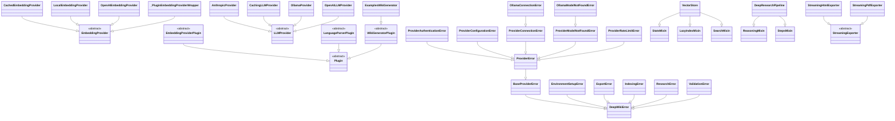

# Class Inheritance

This page shows the class inheritance hierarchies in the codebase.

## Inheritance Diagram

```mermaid
classDiagram
    class AnthropicProvider
    class BaseProviderError
    class CachedEmbeddingProvider
    class CachingLLMProvider
    class DeepResearchPipeline
    class DeepWikiError
    class EmbeddingProvider {
        <<abstract>>
    }
    class EmbeddingProviderPlugin {
        <<abstract>>
    }
    class EnvironmentSetupError
    class ExamplesWikiGenerator
    class ExportError
    class IndexingError
    class LLMProvider {
        <<abstract>>
    }
    class LanguageParserPlugin {
        <<abstract>>
    }
    class LazyIndexMixin
    class LocalEmbeddingProvider
    class OllamaConnectionError
    class OllamaModelNotFoundError
    class OllamaProvider
    class OpenAIEmbeddingProvider
    class OpenAILLMProvider
    class Plugin {
        <<abstract>>
    }
    class ProviderAuthenticationError
    class ProviderConfigurationError
    class ProviderConnectionError
    class ProviderError
    class ProviderModelNotFoundError
    class ProviderRateLimitError
    class ReasoningMixin
    class ResearchError
    class SearchMixin
    class StatsMixin
    class StepsMixin
    class StreamingExporter {
        <<abstract>>
    }
    class StreamingHtmlExporter
    class StreamingPdfExporter
    class ValidationError
    class VectorStore
    class WikiGeneratorPlugin {
        <<abstract>>
    }
    class _PluginEmbeddingProviderWrapper
    AnthropicProvider --|> LLMProvider
    BaseProviderError --|> DeepWikiError
    CachedEmbeddingProvider --|> EmbeddingProvider
    CachingLLMProvider --|> LLMProvider
    DeepResearchPipeline --|> ReasoningMixin
    DeepResearchPipeline --|> StepsMixin
    EmbeddingProviderPlugin --|> Plugin
    EnvironmentSetupError --|> DeepWikiError
    ExamplesWikiGenerator --|> WikiGeneratorPlugin
    ExportError --|> DeepWikiError
    IndexingError --|> DeepWikiError
    LanguageParserPlugin --|> Plugin
    LocalEmbeddingProvider --|> EmbeddingProvider
    OllamaConnectionError --|> ProviderConnectionError
    OllamaModelNotFoundError --|> ProviderModelNotFoundError
    OllamaProvider --|> LLMProvider
    OpenAIEmbeddingProvider --|> EmbeddingProvider
    OpenAILLMProvider --|> LLMProvider
    ProviderAuthenticationError --|> ProviderError
    ProviderConfigurationError --|> ProviderError
    ProviderConnectionError --|> ProviderError
    ProviderError --|> BaseProviderError
    ProviderModelNotFoundError --|> ProviderError
    ProviderRateLimitError --|> ProviderError
    ResearchError --|> DeepWikiError
    StreamingHtmlExporter --|> StreamingExporter
    StreamingPdfExporter --|> StreamingExporter
    ValidationError --|> DeepWikiError
    VectorStore --|> StatsMixin
    VectorStore --|> LazyIndexMixin
    VectorStore --|> SearchMixin
    WikiGeneratorPlugin --|> Plugin
    _PluginEmbeddingProviderWrapper --|> EmbeddingProvider
```

## Inheritance Trees

- **[DeepWikiError](files/src/local_deepwiki/errors.md)** `errors.py` - Base exception for all DeepWiki errors.
  └─ **[BaseProviderError](files/src/local_deepwiki/errors.md)** `errors.py` - Error raised when an LLM or embedding provider fails.
    └─ **[ProviderError](files/src/local_deepwiki/providers/errors.md)** `errors.py` - Base exception for all provider errors.
      └─ **[ProviderAuthenticationError](files/src/local_deepwiki/providers/errors.md)** `errors.py` - Raised when authentication with the provider fails.
      └─ **[ProviderConfigurationError](files/src/local_deepwiki/providers/errors.md)** `errors.py` - Raised when the provider is misconfigured.
      └─ **[ProviderConnectionError](files/src/local_deepwiki/providers/errors.md)** `errors.py` - Raised when a provider cannot be reached or connected to.
        └─ **[OllamaConnectionError](files/src/local_deepwiki/providers/llm/ollama.md)** `ollama.py` - Raised when Ollama server is not accessible.
      └─ **[ProviderModelNotFoundError](files/src/local_deepwiki/providers/errors.md)** `errors.py` - Raised when the requested model is not available.
        └─ **[OllamaModelNotFoundError](files/src/local_deepwiki/providers/llm/ollama.md)** `ollama.py` - Raised when the requested model is not available in Ollama.
      └─ **[ProviderRateLimitError](files/src/local_deepwiki/providers/errors.md)** `errors.py` - Raised when a provider rate limits the request.
  └─ **[EnvironmentSetupError](files/src/local_deepwiki/errors.md)** `errors.py` - Error raised when environment setup is incomplete.
  └─ **[ExportError](files/src/local_deepwiki/errors.md)** `errors.py` - Error raised when wiki export fails.
  └─ **[IndexingError](files/src/local_deepwiki/errors.md)** `errors.py` - Error raised when repository indexing fails.
  └─ **[ResearchError](files/src/local_deepwiki/errors.md)** `errors.py` - Error raised when deep research fails.
  └─ **[ValidationError](files/src/local_deepwiki/errors.md)** `errors.py` - Error raised when input validation fails.

- **[EmbeddingProvider](files/src/local_deepwiki/providers/base.md)** (abstract) `base.py` - Abstract base class for embedding providers.
  └─ **[CachedEmbeddingProvider](files/src/local_deepwiki/providers/embeddings/cache.md)** `cache.py` - Embedding provider [wrapper](files/src/local_deepwiki/handlers/_error_handling.md) that adds caching.
  └─ **[LocalEmbeddingProvider](files/src/local_deepwiki/providers/embeddings/local.md)** `local.py` - Embedding provider using local sentence-transformers models.
  └─ **[OpenAIEmbeddingProvider](files/src/local_deepwiki/providers/embeddings/openai.md)** `openai.py` - Embedding provider using OpenAI API.
  └─ **_PluginEmbeddingProviderWrapper** `__init__.py` - Wrapper to adapt [EmbeddingProviderPlugin](files/src/local_deepwiki/plugins/base.md) to EmbeddingProv...

- **[LLMProvider](files/src/local_deepwiki/providers/base.md)** (abstract) `base.py` - Abstract base class for LLM providers.
  └─ **[AnthropicProvider](files/src/local_deepwiki/providers/llm/anthropic.md)** `anthropic.py` - LLM provider using Anthropic API.
  └─ **[CachingLLMProvider](files/src/local_deepwiki/providers/llm/cached.md)** `cached.py` - LLM provider [wrapper](files/src/local_deepwiki/handlers/_error_handling.md) that caches responses.
  └─ **[OllamaProvider](files/src/local_deepwiki/providers/llm/ollama.md)** `ollama.py` - LLM provider using local Ollama.
  └─ **[OpenAILLMProvider](files/src/local_deepwiki/providers/llm/openai.md)** `openai.py` - LLM provider using OpenAI API.

- **[LazyIndexMixin](files/src/local_deepwiki/core/vectorstore/mixins/lazy_index.md)** `lazy_index.py` - Mixin providing lazy vector index management methods.
  └─ **[VectorStore](files/src/local_deepwiki/core/vectorstore/store.md)** `store.py` - Vector store using LanceDB for code chunk storage and sem...

- **[Plugin](files/src/local_deepwiki/plugins/base.md)** (abstract) `base.py` - Base class for all plugins.
  └─ **[EmbeddingProviderPlugin](files/src/local_deepwiki/plugins/base.md)** (abstract) `base.py` - [Plugin](files/src/local_deepwiki/plugins/base.md) for adding custom embedding providers.
  └─ **[LanguageParserPlugin](files/src/local_deepwiki/plugins/base.md)** (abstract) `base.py` - [Plugin](files/src/local_deepwiki/plugins/base.md) for adding support for new programming languages.
  └─ **[WikiGeneratorPlugin](files/src/local_deepwiki/plugins/base.md)** (abstract) `base.py` - [Plugin](files/src/local_deepwiki/plugins/base.md) for adding custom wiki page generators.
    └─ **[ExamplesWikiGenerator](files/src/local_deepwiki/generators/examples/plugin.md)** `plugin.py` - Generate Examples sections for API documentation.

- **[ReasoningMixin](files/src/local_deepwiki/core/deep_research/reasoning.md)** `reasoning.py` - Mixin providing core reasoning methods for DeepResearchPi...
  └─ **[DeepResearchPipeline](files/src/local_deepwiki/core/deep_research/pipeline.md)** `pipeline.py` - Multi-step research pipeline for complex codebase questions.

- **[SearchMixin](files/src/local_deepwiki/core/vectorstore/mixins/search.md)** `search.py` - Mixin providing search, pagination, feedback, and adaptiv...
  └─ **[VectorStore](files/src/local_deepwiki/core/vectorstore/store.md)** `store.py` - Vector store using LanceDB for code chunk storage and sem...

- **[StatsMixin](files/src/local_deepwiki/core/vectorstore/mixins/stats.md)** `stats.py` - Mixin providing chunk retrieval, statistics, cache, and i...
  └─ **[VectorStore](files/src/local_deepwiki/core/vectorstore/store.md)** `store.py` - Vector store using LanceDB for code chunk storage and sem...

- **[StepsMixin](files/src/local_deepwiki/core/deep_research/steps.md)** `steps.py` - Mixin providing step execution methods for DeepResearchPi...
  └─ **[DeepResearchPipeline](files/src/local_deepwiki/core/deep_research/pipeline.md)** `pipeline.py` - Multi-step research pipeline for complex codebase questions.

- **[StreamingExporter](files/src/local_deepwiki/export/streaming.md)** (abstract) `streaming.py` - Abstract base class for streaming wiki exporters.
  └─ **[StreamingHtmlExporter](files/src/local_deepwiki/export/html.md)** `html.py` - Memory-efficient HTML exporter using streaming page itera...
  └─ **[StreamingPdfExporter](files/src/local_deepwiki/export/pdf.md)** `pdf.py` - Memory-efficient PDF exporter using streaming page iterat...

## All Classes

| Class | Inherits From | File |
|-------|---------------|------|
| `AnthropicProvider` | `LLMProvider` | [anthropic.py](files/src/local_deepwiki/providers/llm/anthropic.md) |
| `BaseProviderError` | `DeepWikiError` | [errors.py](files/src/local_deepwiki/errors.md) |
| `CachedEmbeddingProvider` | `EmbeddingProvider` | [cache.py](files/src/local_deepwiki/providers/embeddings/cache.md) |
| `CachingLLMProvider` | `LLMProvider` | [cached.py](files/src/local_deepwiki/providers/llm/cached.md) |
| `DeepResearchPipeline` | `ReasoningMixin`, `StepsMixin` | [pipeline.py](files/src/local_deepwiki/core/deep_research/pipeline.md) |
| `DeepWikiError` | `Exception` | [errors.py](files/src/local_deepwiki/errors.md) |
| `EmbeddingProvider` | `ABC` | [base.py](files/src/local_deepwiki/providers/base.md) |
| `EmbeddingProviderPlugin` | `Plugin` | [base.py](files/src/local_deepwiki/plugins/base.md) |
| `EnvironmentSetupError` | `DeepWikiError` | [errors.py](files/src/local_deepwiki/errors.md) |
| `ExamplesWikiGenerator` | `WikiGeneratorPlugin` | [plugin.py](files/src/local_deepwiki/generators/examples/plugin.md) |
| `ExportError` | `DeepWikiError` | [errors.py](files/src/local_deepwiki/errors.md) |
| `IndexingError` | `DeepWikiError` | [errors.py](files/src/local_deepwiki/errors.md) |
| `LLMProvider` | `ABC` | [base.py](files/src/local_deepwiki/providers/base.md) |
| `LanguageParserPlugin` | `Plugin` | [base.py](files/src/local_deepwiki/plugins/base.md) |
| `LazyIndexMixin` | - | [lazy_index.py](files/src/local_deepwiki/core/vectorstore/mixins/lazy_index.md) |
| `LocalEmbeddingProvider` | `EmbeddingProvider` | [local.py](files/src/local_deepwiki/providers/embeddings/local.md) |
| `OllamaConnectionError` | `ProviderConnectionError` | [ollama.py](files/src/local_deepwiki/providers/llm/ollama.md) |
| `OllamaModelNotFoundError` | `ProviderModelNotFoundError` | [ollama.py](files/src/local_deepwiki/providers/llm/ollama.md) |
| `OllamaProvider` | `LLMProvider` | [ollama.py](files/src/local_deepwiki/providers/llm/ollama.md) |
| `OpenAIEmbeddingProvider` | `EmbeddingProvider` | [openai.py](files/src/local_deepwiki/providers/embeddings/openai.md) |
| `OpenAILLMProvider` | `LLMProvider` | [openai.py](files/src/local_deepwiki/providers/llm/openai.md) |
| `Plugin` | `ABC` | [base.py](files/src/local_deepwiki/plugins/base.md) |
| `ProviderAuthenticationError` | `ProviderError` | [errors.py](files/src/local_deepwiki/providers/errors.md) |
| `ProviderConfigurationError` | `ProviderError` | [errors.py](files/src/local_deepwiki/providers/errors.md) |
| `ProviderConnectionError` | `ProviderError` | [errors.py](files/src/local_deepwiki/providers/errors.md) |
| `ProviderError` | `BaseProviderError` | [errors.py](files/src/local_deepwiki/providers/errors.md) |
| `ProviderModelNotFoundError` | `ProviderError` | [errors.py](files/src/local_deepwiki/providers/errors.md) |
| `ProviderRateLimitError` | `ProviderError` | [errors.py](files/src/local_deepwiki/providers/errors.md) |
| `ReasoningMixin` | - | [reasoning.py](files/src/local_deepwiki/core/deep_research/reasoning.md) |
| `ResearchError` | `DeepWikiError` | [errors.py](files/src/local_deepwiki/errors.md) |
| `SearchMixin` | - | [search.py](files/src/local_deepwiki/core/vectorstore/mixins/search.md) |
| `StatsMixin` | - | [stats.py](files/src/local_deepwiki/core/vectorstore/mixins/stats.md) |
| `StepsMixin` | - | [steps.py](files/src/local_deepwiki/core/deep_research/steps.md) |
| `StreamingExporter` | `ABC` | [streaming.py](files/src/local_deepwiki/export/streaming.md) |
| `StreamingHtmlExporter` | `StreamingExporter` | [html.py](files/src/local_deepwiki/export/html.md) |
| `StreamingPdfExporter` | `StreamingExporter` | [pdf.py](files/src/local_deepwiki/export/pdf.md) |
| `ValidationError` | `DeepWikiError` | [errors.py](files/src/local_deepwiki/errors.md) |
| `VectorStore` | `StatsMixin`, `LazyIndexMixin`, `SearchMixin` | [store.py](files/src/local_deepwiki/core/vectorstore/store.md) |
| `WikiGeneratorPlugin` | `Plugin` | [base.py](files/src/local_deepwiki/plugins/base.md) |
| `_PluginEmbeddingProviderWrapper` | `EmbeddingProvider` | __init__.py |

## Relevant Source Files

The following source files were used to generate this documentation:

- [`src/local_deepwiki/generators/analysis/coupling.py:48-90`](files/src/local_deepwiki/generators/analysis/coupling.md)
- [`src/local_deepwiki/generators/analysis/module_dependencies.py:30-40`](files/src/local_deepwiki/generators/analysis/module_dependencies.md)
- [`src/local_deepwiki/generators/analysis/health_scoring.py:29-34`](files/src/local_deepwiki/generators/analysis/health_scoring.md)
- [`src/local_deepwiki/logging.py:28-83`](files/src/local_deepwiki/logging.md)
- [`src/local_deepwiki/server.py:92-94`](files/src/local_deepwiki/server.md)
- [`src/local_deepwiki/cli_progress.py:147-199`](files/src/local_deepwiki/cli_progress.md)
- [`src/local_deepwiki/events.py:35-63`](files/src/local_deepwiki/events.md)
- `src/local_deepwiki/__init__.py`
- [`src/local_deepwiki/prompts.py:28-72`](files/src/local_deepwiki/prompts.md)
- [`src/local_deepwiki/error_factories.py:47-83`](files/src/local_deepwiki/error_factories.md)

*Showing 10 of 263 source files.*
