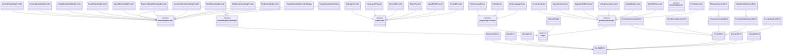

# Class Inheritance

This page shows the class inheritance hierarchies in the codebase.

## Inheritance Diagram

```mermaid
classDiagram
    class AnthropicProvider
    class CachedEmbeddingProvider
    class CachingLLMProvider
    class CircularGenerator
    class ConcreteEmbeddingProvider
    class DeepWikiError
    class DependentGenerator
    class EmbeddingProvider {
        <<abstract>>
    }
    class EmbeddingProviderPlugin {
        <<abstract>>
    }
    class EnvironmentError
    class ExamplesWikiGenerator
    class ExportError
    class FailingCleanupEmbedding
    class FailingCleanupGenerator
    class FailingCleanupParser
    class FailingMockEmbeddingProvider
    class FailingParser
    class FailingWikiGenerator
    class IndexingError
    class LLMProvider {
        <<abstract>>
    }
    class LanguageParserPlugin {
        <<abstract>>
    }
    class LocalEmbeddingProvider
    class MockEmbeddingProvider
    class MockLLMProvider
    class MockLanguageParser
    class MockWikiGenerator
    class OllamaConnectionError
    class OllamaModelNotFoundError
    class OllamaProvider
    class OpenAIEmbeddingProvider
    class OpenAILLMProvider
    class Plugin {
        <<abstract>>
    }
    class PriorityGenerator
    class ProviderAuthenticationError
    class ProviderConfigurationError
    class ProviderConnectionError
    class ProviderError
    class ProviderModelNotFoundError
    class ProviderRateLimitError
    class RateLimitMockEmbeddingProvider
    class ResearchError
    class SemanticMockEmbeddingProvider
    class SlowMockEmbeddingProvider
    class StreamingExporter {
        <<abstract>>
    }
    class TestEmbeddingProvider
    class TestLLMProvider
    class UnknownPlugin
    class ValidationError
    class WikiGeneratorPlugin {
        <<abstract>>
    }
    class _PluginEmbeddingProviderWrapper
    AnthropicProvider --|> LLMProvider
    CachedEmbeddingProvider --|> EmbeddingProvider
    CachingLLMProvider --|> LLMProvider
    CircularGenerator --|> WikiGeneratorPlugin
    ConcreteEmbeddingProvider --|> EmbeddingProvider
    DependentGenerator --|> WikiGeneratorPlugin
    EmbeddingProviderPlugin --|> Plugin
    EnvironmentError --|> DeepWikiError
    ExamplesWikiGenerator --|> WikiGeneratorPlugin
    ExportError --|> DeepWikiError
    FailingCleanupEmbedding --|> EmbeddingProviderPlugin
    FailingCleanupGenerator --|> WikiGeneratorPlugin
    FailingCleanupParser --|> LanguageParserPlugin
    FailingMockEmbeddingProvider --|> EmbeddingProvider
    FailingParser --|> LanguageParserPlugin
    FailingWikiGenerator --|> WikiGeneratorPlugin
    IndexingError --|> DeepWikiError
    LanguageParserPlugin --|> Plugin
    LocalEmbeddingProvider --|> EmbeddingProvider
    MockEmbeddingProvider --|> EmbeddingProvider
    MockEmbeddingProvider --|> EmbeddingProviderPlugin
    MockLLMProvider --|> LLMProvider
    MockLanguageParser --|> LanguageParserPlugin
    MockWikiGenerator --|> WikiGeneratorPlugin
    OllamaConnectionError --|> ProviderConnectionError
    OllamaModelNotFoundError --|> ProviderModelNotFoundError
    OllamaProvider --|> LLMProvider
    OpenAIEmbeddingProvider --|> EmbeddingProvider
    OpenAILLMProvider --|> LLMProvider
    PriorityGenerator --|> WikiGeneratorPlugin
    ProviderAuthenticationError --|> ProviderError
    ProviderConfigurationError --|> ProviderError
    ProviderConnectionError --|> ProviderError
    ProviderError --|> DeepWikiError
    ProviderModelNotFoundError --|> ProviderError
    ProviderRateLimitError --|> ProviderError
    RateLimitMockEmbeddingProvider --|> EmbeddingProvider
    ResearchError --|> DeepWikiError
    SemanticMockEmbeddingProvider --|> EmbeddingProvider
    SlowMockEmbeddingProvider --|> EmbeddingProvider
    TestEmbeddingProvider --|> EmbeddingProvider
    TestLLMProvider --|> LLMProvider
    UnknownPlugin --|> Plugin
    ValidationError --|> DeepWikiError
    WikiGeneratorPlugin --|> Plugin
    _PluginEmbeddingProviderWrapper --|> EmbeddingProvider
```

## Inheritance Trees

- **[DeepWikiError](files/src/local_deepwiki/errors.md)** `errors.py` - Base exception for all DeepWiki errors.
  └─ **[EnvironmentError](files/src/local_deepwiki/errors.md)** `errors.py` - Error raised when environment setup is incomplete.
  └─ **[ExportError](files/src/local_deepwiki/errors.md)** `errors.py` - Error raised when wiki export fails.
  └─ **[IndexingError](files/src/local_deepwiki/errors.md)** `errors.py` - Error raised when repository indexing fails.
  └─ **[ProviderError](files/src/local_deepwiki/providers/base.md)** `errors.py` - Error raised when an LLM or embedding provider fails.
    └─ **[ProviderAuthenticationError](files/src/local_deepwiki/providers/base.md)** `base.py` - Raised when authentication with the provider fails.
    └─ **[ProviderConfigurationError](files/src/local_deepwiki/providers/base.md)** `base.py` - Raised when the provider is misconfigured.
    └─ **[ProviderConnectionError](files/src/local_deepwiki/providers/base.md)** `base.py` - Raised when a provider cannot be reached or connected to.
      └─ **[OllamaConnectionError](files/src/local_deepwiki/providers/llm/ollama.md)** `ollama.py` - Raised when Ollama server is not accessible.
    └─ **[ProviderModelNotFoundError](files/src/local_deepwiki/providers/base.md)** `base.py` - Raised when the requested model is not available.
      └─ **[OllamaModelNotFoundError](files/src/local_deepwiki/providers/llm/ollama.md)** `ollama.py` - Raised when the requested model is not available in Ollama.
    └─ **[ProviderRateLimitError](files/src/local_deepwiki/providers/base.md)** `base.py` - Raised when a provider rate limits the request.
  └─ **[ResearchError](files/src/local_deepwiki/errors.md)** `errors.py` - Error raised when deep research fails.
  └─ **[ValidationError](files/src/local_deepwiki/errors.md)** `errors.py` - Error raised when input validation fails.

- **[EmbeddingProvider](files/src/local_deepwiki/providers/base.md)** (abstract) `base.py` - Abstract base class for embedding providers.
  └─ **[CachedEmbeddingProvider](files/src/local_deepwiki/providers/embeddings/cache.md)** `cache.py` - Embedding provider [wrapper](files/src/local_deepwiki/providers/base.md) that adds caching.
  └─ **ConcreteEmbeddingProvider** `test_base_provider.py` - Concrete implementation for testing.
  └─ **FailingMockEmbeddingProvider** `test_vectorstore.py` - Mock embedding provider that fails for testing error hand...
  └─ **[LocalEmbeddingProvider](files/src/local_deepwiki/providers/embeddings/local.md)** `local.py` - Embedding provider using local sentence-transformers models.
  └─ **MockEmbeddingProvider** `test_fuzzy_search.py`
  └─ **[OpenAIEmbeddingProvider](files/src/local_deepwiki/providers/embeddings/openai.md)** `openai.py` - Embedding provider using OpenAI API.
  └─ **RateLimitMockEmbeddingProvider** `test_vectorstore.py` - Mock embedding provider that simulates rate limiting.
  └─ **SemanticMockEmbeddingProvider** `test_vectorstore.py` - Mock embedding provider that generates different embeddin...
  └─ **SlowMockEmbeddingProvider** `test_vectorstore.py` - Mock embedding provider with configurable delay for testi...
  └─ **TestEmbeddingProvider** `test_base_provider.py` - Test implementation that calls super.
  └─ **_PluginEmbeddingProviderWrapper** `__init__.py` - Wrapper to adapt [EmbeddingProviderPlugin](files/src/local_deepwiki/plugins/base.md) to EmbeddingProv...

- **[LLMProvider](files/src/local_deepwiki/providers/base.md)** (abstract) `base.py` - Abstract base class for LLM providers.
  └─ **[AnthropicProvider](files/src/local_deepwiki/providers/llm/anthropic.md)** `anthropic.py` - LLM provider using Anthropic API.
  └─ **[CachingLLMProvider](files/src/local_deepwiki/providers/llm/cached.md)** `cached.py` - LLM provider [wrapper](files/src/local_deepwiki/providers/base.md) that caches responses.
  └─ **MockLLMProvider** `test_deep_research.py` - Mock LLM provider for testing.
  └─ **[OllamaProvider](files/src/local_deepwiki/providers/llm/ollama.md)** `ollama.py` - LLM provider using local Ollama.
  └─ **[OpenAILLMProvider](files/src/local_deepwiki/providers/llm/openai.md)** `openai.py` - LLM provider using OpenAI API.
  └─ **TestLLMProvider** `test_base_provider.py` - Test implementation that calls super.

- **[Plugin](files/src/local_deepwiki/plugins/base.md)** (abstract) `base.py` - Base class for all plugins.
  └─ **[EmbeddingProviderPlugin](files/src/local_deepwiki/plugins/base.md)** (abstract) `base.py` - [Plugin](files/src/local_deepwiki/plugins/base.md) for adding custom embedding providers.
    └─ **FailingCleanupEmbedding** `test_plugin_registry.py` - Embedding provider that fails during cleanup.
    └─ **MockEmbeddingProvider** `test_fuzzy_search.py`
  └─ **[LanguageParserPlugin](files/src/local_deepwiki/plugins/base.md)** (abstract) `base.py` - [Plugin](files/src/local_deepwiki/plugins/base.md) for adding support for new programming languages.
    └─ **FailingCleanupParser** `test_plugin_registry.py` - Parser that fails during cleanup.
    └─ **FailingParser** `test_plugins.py`
    └─ **MockLanguageParser** `test_plugins.py` - Mock language parser for testing.
  └─ **UnknownPlugin** `test_plugins.py`
  └─ **[WikiGeneratorPlugin](files/src/local_deepwiki/plugins/base.md)** (abstract) `base.py` - [Plugin](files/src/local_deepwiki/plugins/base.md) for adding custom wiki page generators.
    └─ **CircularGenerator** `test_plugins.py`
    └─ **DependentGenerator** `test_plugins.py`
    └─ **[ExamplesWikiGenerator](files/src/local_deepwiki/generators/examples_plugin.md)** `examples_plugin.py` - Generate Examples sections for API documentation.
    └─ **FailingCleanupGenerator** `test_plugin_registry.py` - Wiki generator that fails during cleanup.
    └─ **FailingWikiGenerator** `test_plugins.py`
    └─ **MockWikiGenerator** `test_plugins.py` - Mock wiki generator for testing.
    └─ **PriorityGenerator** `test_plugins.py`

- **[StreamingExporter](files/src/local_deepwiki/export/streaming.md)** (abstract) `streaming.py` - Abstract base class for streaming wiki exporters.
  └─ **[StreamingHtmlExporter](files/src/local_deepwiki/export/html.md)** `html.py` - Memory-efficient HTML exporter using streaming page itera...
  └─ **[StreamingPdfExporter](files/src/local_deepwiki/export/pdf.md)** `pdf.py` - Memory-efficient PDF exporter using streaming page iterat...

## All Classes

| Class | Inherits From | File |
|-------|---------------|------|
| [`AnthropicProvider`](files/src/local_deepwiki/providers/llm/anthropic.md) | [`LLMProvider`](files/src/local_deepwiki/providers/base.md) | [anthropic.py](files/src/local_deepwiki/providers/llm/anthropic.md) |
| [`CachedEmbeddingProvider`](files/src/local_deepwiki/providers/embeddings/cache.md) | [`EmbeddingProvider`](files/src/local_deepwiki/providers/base.md) | [cache.py](files/src/local_deepwiki/providers/embeddings/cache.md) |
| [`CachingLLMProvider`](files/src/local_deepwiki/providers/llm/cached.md) | [`LLMProvider`](files/src/local_deepwiki/providers/base.md) | [cached.py](files/src/local_deepwiki/providers/llm/cached.md) |
| `CircularGenerator` | [`WikiGeneratorPlugin`](files/src/local_deepwiki/plugins/base.md) | [test_plugins.py](files/tests/test_plugins.md) |
| `ConcreteEmbeddingProvider` | [`EmbeddingProvider`](files/src/local_deepwiki/providers/base.md) | [test_base_provider.py](files/tests/test_base_provider.md) |
| [`DeepWikiError`](files/src/local_deepwiki/errors.md) | `Exception` | [errors.py](files/src/local_deepwiki/errors.md) |
| `DependentGenerator` | [`WikiGeneratorPlugin`](files/src/local_deepwiki/plugins/base.md) | [test_plugins.py](files/tests/test_plugins.md) |
| [`EmbeddingProvider`](files/src/local_deepwiki/providers/base.md) | `ABC` | [base.py](files/src/local_deepwiki/providers/base.md) |
| [`EmbeddingProviderPlugin`](files/src/local_deepwiki/plugins/base.md) | [`Plugin`](files/src/local_deepwiki/plugins/base.md) | [base.py](files/src/local_deepwiki/plugins/base.md) |
| [`EnvironmentError`](files/src/local_deepwiki/errors.md) | [`DeepWikiError`](files/src/local_deepwiki/errors.md) | [errors.py](files/src/local_deepwiki/errors.md) |
| [`ExamplesWikiGenerator`](files/src/local_deepwiki/generators/examples_plugin.md) | [`WikiGeneratorPlugin`](files/src/local_deepwiki/plugins/base.md) | [examples_plugin.py](files/src/local_deepwiki/generators/examples_plugin.md) |
| [`ExportError`](files/src/local_deepwiki/errors.md) | [`DeepWikiError`](files/src/local_deepwiki/errors.md) | [errors.py](files/src/local_deepwiki/errors.md) |
| `FailingCleanupEmbedding` | [`EmbeddingProviderPlugin`](files/src/local_deepwiki/plugins/base.md) | [test_plugin_registry.py](files/tests/test_plugin_registry.md) |
| `FailingCleanupGenerator` | [`WikiGeneratorPlugin`](files/src/local_deepwiki/plugins/base.md) | [test_plugin_registry.py](files/tests/test_plugin_registry.md) |
| `FailingCleanupParser` | [`LanguageParserPlugin`](files/src/local_deepwiki/plugins/base.md) | [test_plugin_registry.py](files/tests/test_plugin_registry.md) |
| `FailingMockEmbeddingProvider` | [`EmbeddingProvider`](files/src/local_deepwiki/providers/base.md) | [test_vectorstore.py](files/tests/test_vectorstore.md) |
| `FailingParser` | [`LanguageParserPlugin`](files/src/local_deepwiki/plugins/base.md) | [test_plugins.py](files/tests/test_plugins.md) |
| `FailingWikiGenerator` | [`WikiGeneratorPlugin`](files/src/local_deepwiki/plugins/base.md) | [test_plugins.py](files/tests/test_plugins.md) |
| [`IndexingError`](files/src/local_deepwiki/errors.md) | [`DeepWikiError`](files/src/local_deepwiki/errors.md) | [errors.py](files/src/local_deepwiki/errors.md) |
| [`LLMProvider`](files/src/local_deepwiki/providers/base.md) | `ABC` | [base.py](files/src/local_deepwiki/providers/base.md) |
| [`LanguageParserPlugin`](files/src/local_deepwiki/plugins/base.md) | [`Plugin`](files/src/local_deepwiki/plugins/base.md) | [base.py](files/src/local_deepwiki/plugins/base.md) |
| [`LocalEmbeddingProvider`](files/src/local_deepwiki/providers/embeddings/local.md) | [`EmbeddingProvider`](files/src/local_deepwiki/providers/base.md) | [local.py](files/src/local_deepwiki/providers/embeddings/local.md) |
| `MockEmbeddingProvider` | [`EmbeddingProvider`](files/src/local_deepwiki/providers/base.md), [`EmbeddingProviderPlugin`](files/src/local_deepwiki/plugins/base.md) | [test_fuzzy_search.py](files/tests/test_fuzzy_search.md) |
| `MockLLMProvider` | [`LLMProvider`](files/src/local_deepwiki/providers/base.md) | [test_deep_research.py](files/tests/test_deep_research.md) |
| `MockLanguageParser` | [`LanguageParserPlugin`](files/src/local_deepwiki/plugins/base.md) | [test_plugins.py](files/tests/test_plugins.md) |
| `MockWikiGenerator` | [`WikiGeneratorPlugin`](files/src/local_deepwiki/plugins/base.md) | [test_plugins.py](files/tests/test_plugins.md) |
| [`OllamaConnectionError`](files/src/local_deepwiki/providers/llm/ollama.md) | [`ProviderConnectionError`](files/src/local_deepwiki/providers/base.md) | [ollama.py](files/src/local_deepwiki/providers/llm/ollama.md) |
| [`OllamaModelNotFoundError`](files/src/local_deepwiki/providers/llm/ollama.md) | [`ProviderModelNotFoundError`](files/src/local_deepwiki/providers/base.md) | [ollama.py](files/src/local_deepwiki/providers/llm/ollama.md) |
| [`OllamaProvider`](files/src/local_deepwiki/providers/llm/ollama.md) | [`LLMProvider`](files/src/local_deepwiki/providers/base.md) | [ollama.py](files/src/local_deepwiki/providers/llm/ollama.md) |
| [`OpenAIEmbeddingProvider`](files/src/local_deepwiki/providers/embeddings/openai.md) | [`EmbeddingProvider`](files/src/local_deepwiki/providers/base.md) | [openai.py](files/src/local_deepwiki/providers/embeddings/openai.md) |
| [`OpenAILLMProvider`](files/src/local_deepwiki/providers/llm/openai.md) | [`LLMProvider`](files/src/local_deepwiki/providers/base.md) | [openai.py](files/src/local_deepwiki/providers/llm/openai.md) |
| [`Plugin`](files/src/local_deepwiki/plugins/base.md) | `ABC` | [base.py](files/src/local_deepwiki/plugins/base.md) |
| `PriorityGenerator` | [`WikiGeneratorPlugin`](files/src/local_deepwiki/plugins/base.md) | [test_plugins.py](files/tests/test_plugins.md) |
| [`ProviderAuthenticationError`](files/src/local_deepwiki/providers/base.md) | [`ProviderError`](files/src/local_deepwiki/providers/base.md) | [base.py](files/src/local_deepwiki/providers/base.md) |
| [`ProviderConfigurationError`](files/src/local_deepwiki/providers/base.md) | [`ProviderError`](files/src/local_deepwiki/providers/base.md) | [base.py](files/src/local_deepwiki/providers/base.md) |
| [`ProviderConnectionError`](files/src/local_deepwiki/providers/base.md) | [`ProviderError`](files/src/local_deepwiki/providers/base.md) | [base.py](files/src/local_deepwiki/providers/base.md) |
| [`ProviderError`](files/src/local_deepwiki/providers/base.md) | `BaseProviderError`, [`DeepWikiError`](files/src/local_deepwiki/errors.md) | [errors.py](files/src/local_deepwiki/errors.md) |
| [`ProviderModelNotFoundError`](files/src/local_deepwiki/providers/base.md) | [`ProviderError`](files/src/local_deepwiki/providers/base.md) | [base.py](files/src/local_deepwiki/providers/base.md) |
| [`ProviderRateLimitError`](files/src/local_deepwiki/providers/base.md) | [`ProviderError`](files/src/local_deepwiki/providers/base.md) | [base.py](files/src/local_deepwiki/providers/base.md) |
| `RateLimitMockEmbeddingProvider` | [`EmbeddingProvider`](files/src/local_deepwiki/providers/base.md) | [test_vectorstore.py](files/tests/test_vectorstore.md) |
| [`ResearchError`](files/src/local_deepwiki/errors.md) | [`DeepWikiError`](files/src/local_deepwiki/errors.md) | [errors.py](files/src/local_deepwiki/errors.md) |
| `SemanticMockEmbeddingProvider` | [`EmbeddingProvider`](files/src/local_deepwiki/providers/base.md) | [test_vectorstore.py](files/tests/test_vectorstore.md) |
| `SlowMockEmbeddingProvider` | [`EmbeddingProvider`](files/src/local_deepwiki/providers/base.md) | [test_vectorstore.py](files/tests/test_vectorstore.md) |
| [`StreamingExporter`](files/src/local_deepwiki/export/streaming.md) | `ABC` | [streaming.py](files/src/local_deepwiki/export/streaming.md) |
| [`StreamingHtmlExporter`](files/src/local_deepwiki/export/html.md) | [`StreamingExporter`](files/src/local_deepwiki/export/streaming.md) | [html.py](files/src/local_deepwiki/export/html.md) |
| [`StreamingPdfExporter`](files/src/local_deepwiki/export/pdf.md) | [`StreamingExporter`](files/src/local_deepwiki/export/streaming.md) | [pdf.py](files/src/local_deepwiki/export/pdf.md) |
| `TestEmbeddingProvider` | [`EmbeddingProvider`](files/src/local_deepwiki/providers/base.md) | [test_base_provider.py](files/tests/test_base_provider.md) |
| `TestLLMProvider` | [`LLMProvider`](files/src/local_deepwiki/providers/base.md) | [test_base_provider.py](files/tests/test_base_provider.md) |
| `UnknownPlugin` | [`Plugin`](files/src/local_deepwiki/plugins/base.md) | [test_plugins.py](files/tests/test_plugins.md) |
| [`ValidationError`](files/src/local_deepwiki/errors.md) | [`DeepWikiError`](files/src/local_deepwiki/errors.md) | [errors.py](files/src/local_deepwiki/errors.md) |
| [`WikiGeneratorPlugin`](files/src/local_deepwiki/plugins/base.md) | [`Plugin`](files/src/local_deepwiki/plugins/base.md) | [base.py](files/src/local_deepwiki/plugins/base.md) |
| `_PluginEmbeddingProviderWrapper` | [`EmbeddingProvider`](files/src/local_deepwiki/providers/base.md) | [__init__.py](files/src/local_deepwiki/providers/embeddings/__init__.md) |

## Relevant Source Files

The following source files were used to generate this documentation:

- [`src/local_deepwiki/models.py:11-26`](files/src/local_deepwiki/models.md)
- `tests/test_manifest.py:19-61`
- [`src/local_deepwiki/server.py:47-558`](files/src/local_deepwiki/server.md)
- [`src/local_deepwiki/generators/diagrams.py:12-21`](files/src/local_deepwiki/generators/diagrams.md)
- [`src/local_deepwiki/handlers.py:695-715`](files/src/local_deepwiki/handlers.md)
- `coverage_html/coverage_html_cb_dd2e7eb5.js:11-19`
- `tests/test_provider_factories.py:21-99`
- `tests/test_streaming_export.py:48-71`
- `tests/test_parser.py:28-127`
- `tests/test_fuzzy_search.py:16-48`

*Showing 10 of 166 source files.*
