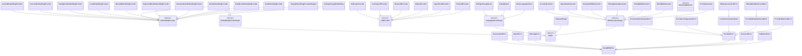

# Class Inheritance

This page shows the class inheritance hierarchies in the codebase.

## Inheritance Diagram

```mermaid
classDiagram
    class AnthropicProvider
    class CachedEmbeddingProvider
    class CachingLLMProvider
    class CircularGenerator
    class ConcreteEmbeddingProvider
    class DeepWikiError
    class DependentGenerator
    class EmbeddingProvider {
        <<abstract>>
    }
    class EmbeddingProviderPlugin {
        <<abstract>>
    }
    class EnvironmentError
    class ExamplesWikiGenerator
    class ExportError
    class FailingCleanupEmbedding
    class FailingCleanupGenerator
    class FailingCleanupParser
    class FailingMockEmbeddingProvider
    class FailingParser
    class FailingWikiGenerator
    class IndexingError
    class LLMProvider {
        <<abstract>>
    }
    class LanguageParserPlugin {
        <<abstract>>
    }
    class LocalEmbeddingProvider
    class MockEmbeddingProvider
    class MockLLMProvider
    class MockLanguageParser
    class MockWikiGenerator
    class OllamaConnectionError
    class OllamaModelNotFoundError
    class OllamaProvider
    class OpenAIEmbeddingProvider
    class OpenAILLMProvider
    class Plugin {
        <<abstract>>
    }
    class PriorityGenerator
    class ProviderAuthenticationError
    class ProviderConfigurationError
    class ProviderConnectionError
    class ProviderError
    class ProviderModelNotFoundError
    class ProviderRateLimitError
    class RateLimitMockEmbeddingProvider
    class ResearchError
    class SemanticMockEmbeddingProvider
    class SlowMockEmbeddingProvider
    class StreamingExporter {
        <<abstract>>
    }
    class TestEmbeddingProvider
    class TestLLMProvider
    class UnknownPlugin
    class ValidationError
    class WikiGeneratorPlugin {
        <<abstract>>
    }
    class _PluginEmbeddingProviderWrapper
    AnthropicProvider --|> LLMProvider
    CachedEmbeddingProvider --|> EmbeddingProvider
    CachingLLMProvider --|> LLMProvider
    CircularGenerator --|> WikiGeneratorPlugin
    ConcreteEmbeddingProvider --|> EmbeddingProvider
    DependentGenerator --|> WikiGeneratorPlugin
    EmbeddingProviderPlugin --|> Plugin
    EnvironmentError --|> DeepWikiError
    ExamplesWikiGenerator --|> WikiGeneratorPlugin
    ExportError --|> DeepWikiError
    FailingCleanupEmbedding --|> EmbeddingProviderPlugin
    FailingCleanupGenerator --|> WikiGeneratorPlugin
    FailingCleanupParser --|> LanguageParserPlugin
    FailingMockEmbeddingProvider --|> EmbeddingProvider
    FailingParser --|> LanguageParserPlugin
    FailingWikiGenerator --|> WikiGeneratorPlugin
    IndexingError --|> DeepWikiError
    LanguageParserPlugin --|> Plugin
    LocalEmbeddingProvider --|> EmbeddingProvider
    MockEmbeddingProvider --|> EmbeddingProviderPlugin
    MockEmbeddingProvider --|> EmbeddingProvider
    MockLLMProvider --|> LLMProvider
    MockLanguageParser --|> LanguageParserPlugin
    MockWikiGenerator --|> WikiGeneratorPlugin
    OllamaConnectionError --|> ProviderConnectionError
    OllamaModelNotFoundError --|> ProviderModelNotFoundError
    OllamaProvider --|> LLMProvider
    OpenAIEmbeddingProvider --|> EmbeddingProvider
    OpenAILLMProvider --|> LLMProvider
    PriorityGenerator --|> WikiGeneratorPlugin
    ProviderAuthenticationError --|> ProviderError
    ProviderConfigurationError --|> ProviderError
    ProviderConnectionError --|> ProviderError
    ProviderError --|> DeepWikiError
    ProviderModelNotFoundError --|> ProviderError
    ProviderRateLimitError --|> ProviderError
    RateLimitMockEmbeddingProvider --|> EmbeddingProvider
    ResearchError --|> DeepWikiError
    SemanticMockEmbeddingProvider --|> EmbeddingProvider
    SlowMockEmbeddingProvider --|> EmbeddingProvider
    TestEmbeddingProvider --|> EmbeddingProvider
    TestLLMProvider --|> LLMProvider
    UnknownPlugin --|> Plugin
    ValidationError --|> DeepWikiError
    WikiGeneratorPlugin --|> Plugin
    _PluginEmbeddingProviderWrapper --|> EmbeddingProvider
```

## Inheritance Trees

- **DeepWikiError** `errors.py` - Base exception for all DeepWiki errors.
  └─ **EnvironmentError** `errors.py` - Error raised when environment setup is incomplete.
  └─ **ExportError** `errors.py` - Error raised when wiki export fails.
  └─ **IndexingError** `errors.py` - Error raised when repository indexing fails.
  └─ **ProviderError** `errors.py` - Error raised when an LLM or embedding provider fails.
    └─ **ProviderAuthenticationError** `base.py` - Raised when authentication with the provider fails.
    └─ **ProviderConfigurationError** `base.py` - Raised when the provider is misconfigured.
    └─ **ProviderConnectionError** `base.py` - Raised when a provider cannot be reached or connected to.
      └─ **OllamaConnectionError** `ollama.py` - Raised when Ollama server is not accessible.
    └─ **ProviderModelNotFoundError** `base.py` - Raised when the requested model is not available.
      └─ **OllamaModelNotFoundError** `ollama.py` - Raised when the requested model is not available in Ollama.
    └─ **ProviderRateLimitError** `base.py` - Raised when a provider rate limits the request.
  └─ **ResearchError** `errors.py` - Error raised when deep research fails.
  └─ **ValidationError** `errors.py` - Error raised when input validation fails.

- **EmbeddingProvider** (abstract) `base.py` - Abstract base class for embedding providers.
  └─ **CachedEmbeddingProvider** `cache.py` - Embedding provider wrapper that adds caching.
  └─ **ConcreteEmbeddingProvider** `test_base_provider.py` - Concrete implementation for testing.
  └─ **FailingMockEmbeddingProvider** `test_vectorstore.py` - Mock embedding provider that fails for testing error hand...
  └─ **LocalEmbeddingProvider** `local.py` - Embedding provider using local sentence-transformers models.
  └─ **MockEmbeddingProvider** `test_fuzzy_search.py`
  └─ **OpenAIEmbeddingProvider** `openai.py` - Embedding provider using OpenAI API.
  └─ **RateLimitMockEmbeddingProvider** `test_vectorstore.py` - Mock embedding provider that simulates rate limiting.
  └─ **SemanticMockEmbeddingProvider** `test_vectorstore.py` - Mock embedding provider that generates different embeddin...
  └─ **SlowMockEmbeddingProvider** `test_vectorstore.py` - Mock embedding provider with configurable delay for testi...
  └─ **TestEmbeddingProvider** `test_base_provider.py` - Test implementation that calls super.
  └─ **_PluginEmbeddingProviderWrapper** `__init__.py` - Wrapper to adapt EmbeddingProviderPlugin to EmbeddingProv...

- **LLMProvider** (abstract) `base.py` - Abstract base class for LLM providers.
  └─ **AnthropicProvider** `anthropic.py` - LLM provider using Anthropic API.
  └─ **CachingLLMProvider** `cached.py` - LLM provider wrapper that caches responses.
  └─ **MockLLMProvider** `test_deep_research.py` - Mock LLM provider for testing.
  └─ **OllamaProvider** `ollama.py` - LLM provider using local Ollama.
  └─ **OpenAILLMProvider** `openai.py` - LLM provider using OpenAI API.
  └─ **TestLLMProvider** `test_base_provider.py` - Test implementation that calls super.

- **Plugin** (abstract) `base.py` - Base class for all plugins.
  └─ **EmbeddingProviderPlugin** (abstract) `base.py` - Plugin for adding custom embedding providers.
    └─ **FailingCleanupEmbedding** `test_plugin_registry.py` - Embedding provider that fails during cleanup.
    └─ **MockEmbeddingProvider** `test_fuzzy_search.py`
  └─ **LanguageParserPlugin** (abstract) `base.py` - Plugin for adding support for new programming languages.
    └─ **FailingCleanupParser** `test_plugin_registry.py` - Parser that fails during cleanup.
    └─ **FailingParser** `test_plugins.py`
    └─ **MockLanguageParser** `test_plugins.py` - Mock language parser for testing.
  └─ **UnknownPlugin** `test_plugins.py`
  └─ **WikiGeneratorPlugin** (abstract) `base.py` - Plugin for adding custom wiki page generators.
    └─ **CircularGenerator** `test_plugins.py`
    └─ **DependentGenerator** `test_plugins.py`
    └─ **ExamplesWikiGenerator** `examples_plugin.py` - Generate Examples sections for API documentation.
    └─ **FailingCleanupGenerator** `test_plugin_registry.py` - Wiki generator that fails during cleanup.
    └─ **FailingWikiGenerator** `test_plugins.py`
    └─ **MockWikiGenerator** `test_plugins.py` - Mock wiki generator for testing.
    └─ **PriorityGenerator** `test_plugins.py`

- **StreamingExporter** (abstract) `streaming.py` - Abstract base class for streaming wiki exporters.
  └─ **StreamingHtmlExporter** `html.py` - Memory-efficient HTML exporter using streaming page itera...
  └─ **StreamingPdfExporter** `pdf.py` - Memory-efficient PDF exporter using streaming page iterat...

## All Classes

| Class | Inherits From | File |
|-------|---------------|------|
| `AnthropicProvider` | `LLMProvider` | [anthropic.py](files/src/local_deepwiki/providers/llm/anthropic.md) |
| `CachedEmbeddingProvider` | `EmbeddingProvider` | [cache.py](files/src/local_deepwiki/providers/embeddings/cache.md) |
| `CachingLLMProvider` | `LLMProvider` | [cached.py](files/src/local_deepwiki/providers/llm/cached.md) |
| `CircularGenerator` | `WikiGeneratorPlugin` | [test_plugins.py](files/tests/test_plugins.md) |
| `ConcreteEmbeddingProvider` | `EmbeddingProvider` | [test_base_provider.py](files/tests/test_base_provider.md) |
| `DeepWikiError` | `Exception` | [errors.py](files/src/local_deepwiki/errors.md) |
| `DependentGenerator` | `WikiGeneratorPlugin` | [test_plugins.py](files/tests/test_plugins.md) |
| `EmbeddingProvider` | `ABC` | [base.py](files/src/local_deepwiki/providers/base.md) |
| `EmbeddingProviderPlugin` | `Plugin` | [base.py](files/src/local_deepwiki/plugins/base.md) |
| `EnvironmentError` | `DeepWikiError` | [errors.py](files/src/local_deepwiki/errors.md) |
| `ExamplesWikiGenerator` | `WikiGeneratorPlugin` | [examples_plugin.py](files/src/local_deepwiki/generators/examples_plugin.md) |
| `ExportError` | `DeepWikiError` | [errors.py](files/src/local_deepwiki/errors.md) |
| `FailingCleanupEmbedding` | `EmbeddingProviderPlugin` | [test_plugin_registry.py](files/tests/test_plugin_registry.md) |
| `FailingCleanupGenerator` | `WikiGeneratorPlugin` | [test_plugin_registry.py](files/tests/test_plugin_registry.md) |
| `FailingCleanupParser` | `LanguageParserPlugin` | [test_plugin_registry.py](files/tests/test_plugin_registry.md) |
| `FailingMockEmbeddingProvider` | `EmbeddingProvider` | [test_vectorstore.py](files/tests/test_vectorstore.md) |
| `FailingParser` | `LanguageParserPlugin` | [test_plugins.py](files/tests/test_plugins.md) |
| `FailingWikiGenerator` | `WikiGeneratorPlugin` | [test_plugins.py](files/tests/test_plugins.md) |
| `IndexingError` | `DeepWikiError` | [errors.py](files/src/local_deepwiki/errors.md) |
| `LLMProvider` | `ABC` | [base.py](files/src/local_deepwiki/providers/base.md) |
| `LanguageParserPlugin` | `Plugin` | [base.py](files/src/local_deepwiki/plugins/base.md) |
| `LocalEmbeddingProvider` | `EmbeddingProvider` | [local.py](files/src/local_deepwiki/providers/embeddings/local.md) |
| `MockEmbeddingProvider` | `EmbeddingProviderPlugin`, `EmbeddingProvider` | [test_fuzzy_search.py](files/tests/test_fuzzy_search.md) |
| `MockLLMProvider` | `LLMProvider` | [test_deep_research.py](files/tests/test_deep_research.md) |
| `MockLanguageParser` | `LanguageParserPlugin` | [test_plugins.py](files/tests/test_plugins.md) |
| `MockWikiGenerator` | `WikiGeneratorPlugin` | [test_plugins.py](files/tests/test_plugins.md) |
| `OllamaConnectionError` | `ProviderConnectionError` | [ollama.py](files/src/local_deepwiki/providers/llm/ollama.md) |
| `OllamaModelNotFoundError` | `ProviderModelNotFoundError` | [ollama.py](files/src/local_deepwiki/providers/llm/ollama.md) |
| `OllamaProvider` | `LLMProvider` | [ollama.py](files/src/local_deepwiki/providers/llm/ollama.md) |
| `OpenAIEmbeddingProvider` | `EmbeddingProvider` | [openai.py](files/src/local_deepwiki/providers/embeddings/openai.md) |
| `OpenAILLMProvider` | `LLMProvider` | [openai.py](files/src/local_deepwiki/providers/llm/openai.md) |
| `Plugin` | `ABC` | [base.py](files/src/local_deepwiki/plugins/base.md) |
| `PriorityGenerator` | `WikiGeneratorPlugin` | [test_plugins.py](files/tests/test_plugins.md) |
| `ProviderAuthenticationError` | `ProviderError` | [base.py](files/src/local_deepwiki/providers/base.md) |
| `ProviderConfigurationError` | `ProviderError` | [base.py](files/src/local_deepwiki/providers/base.md) |
| `ProviderConnectionError` | `ProviderError` | [base.py](files/src/local_deepwiki/providers/base.md) |
| `ProviderError` | `BaseProviderError`, `DeepWikiError` | [errors.py](files/src/local_deepwiki/errors.md) |
| `ProviderModelNotFoundError` | `ProviderError` | [base.py](files/src/local_deepwiki/providers/base.md) |
| `ProviderRateLimitError` | `ProviderError` | [base.py](files/src/local_deepwiki/providers/base.md) |
| `RateLimitMockEmbeddingProvider` | `EmbeddingProvider` | [test_vectorstore.py](files/tests/test_vectorstore.md) |
| `ResearchError` | `DeepWikiError` | [errors.py](files/src/local_deepwiki/errors.md) |
| `SemanticMockEmbeddingProvider` | `EmbeddingProvider` | [test_vectorstore.py](files/tests/test_vectorstore.md) |
| `SlowMockEmbeddingProvider` | `EmbeddingProvider` | [test_vectorstore.py](files/tests/test_vectorstore.md) |
| `StreamingExporter` | `ABC` | [streaming.py](files/src/local_deepwiki/export/streaming.md) |
| `StreamingHtmlExporter` | `StreamingExporter` | [html.py](files/src/local_deepwiki/export/html.md) |
| `StreamingPdfExporter` | `StreamingExporter` | [pdf.py](files/src/local_deepwiki/export/pdf.md) |
| `TestEmbeddingProvider` | `EmbeddingProvider` | [test_base_provider.py](files/tests/test_base_provider.md) |
| `TestLLMProvider` | `LLMProvider` | [test_base_provider.py](files/tests/test_base_provider.md) |
| `UnknownPlugin` | `Plugin` | [test_plugins.py](files/tests/test_plugins.md) |
| `ValidationError` | `DeepWikiError` | [errors.py](files/src/local_deepwiki/errors.md) |
| `WikiGeneratorPlugin` | `Plugin` | [base.py](files/src/local_deepwiki/plugins/base.md) |
| `_PluginEmbeddingProviderWrapper` | `EmbeddingProvider` | [__init__.py](files/src/local_deepwiki/providers/embeddings/__init__.md) |
