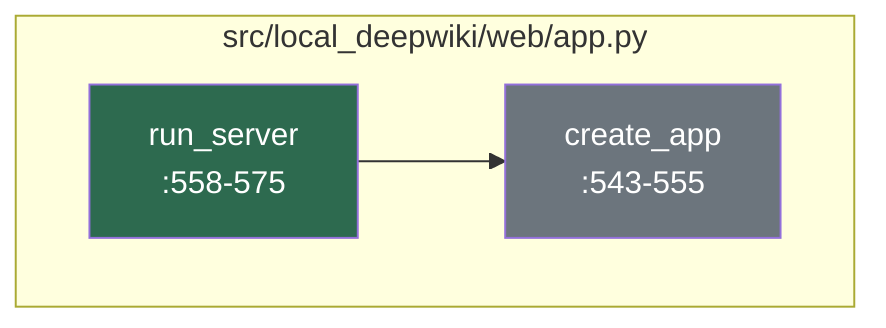

# Developer Onboarding Guide

The `local-deepwiki` project is a powerful tool designed for developers who need to explore, understand, and navigate private software repositories with ease. It transforms local repository documentation into an interactive, AI-enhanced experience by leveraging a deep research and graph-based retrieval system. This project is ideal for teams working on complex codebases where understanding relationships between modules, functions, and components is crucial. It solves the problem of scattered documentation and siloed knowledge by creating a unified, searchable knowledge graph from source code and markdown files, making it easier to find relevant information, trace code dependencies, and generate comprehensive documentation.

At its core, `local-deepwiki` acts as a local, secure, and customizable MCP (Model Context Protocol) server that allows developers to query their repository content using natural language. It supports multiple AI providers including Anthropic, OpenAI, and Ollama, and uses embedding models from Sentence Transformers to create semantic representations of code and documentation. This enables not only traditional keyword searches but also context-aware understanding of code relationships. The system integrates with a vector database (LanceDB) to store and retrieve embeddings, and it supports various document formats including markdown, Python, and more, ensuring that developers can access rich, structured information about their codebase.

The architecture of `local-deepwiki` is designed to be modular and extensible, allowing developers to customize the system for their specific needs. It provides a comprehensive CLI interface for configuration and management, a web-based UI for interactive exploration, and a robust backend that handles both local and hybrid AI model configurations. This makes it suitable for both individual developers and large teams working in different environments, from local development machines to cloud-based CI/CD pipelines.

## Architecture at a Glance

```mermaid
componentDiagram
    component "CLI Interface" as CLI
    component "Web Application" as WebApp
    component "Core Services" as Core
    component "AI/ML Providers" as AIProviders
    component "Database" as Database
    component "Configuration" as Config
    component "Documentation Parser" as Parser
    component "Access Control" as AccessControl

    CLI --> Core : CLI commands
    WebApp --> Core : HTTP requests
    Core --> AIProviders : LLM/Embedding requests
    Core --> Database : Vector storage
    Core --> Config : Configuration loading
    Core --> Parser : Document parsing
    Core --> AccessControl : RBAC checks
    AIProviders --> Database : Embedding storage
```

- **CLI Interface** ([`src/local_deepwiki/cli/main.py`](files/src/local_deepwiki/cli/main.py)): The command-line interface for managing and configuring the local deepwiki server, including initialization, configuration, and status checks.
- **Web Application** ([`src/local_deepwiki/web/app.py`](files/src/local_deepwiki/web/app.py)): The Flask-based web server that serves the user interface and handles HTTP requests for documentation retrieval and generation.
- **Core Services** ([`src/local_deepwiki/core/`](files/src/local_deepwiki/core/)): The central business logic layer that orchestrates document parsing, vector storage, AI model interactions, and graph-based retrieval.
- **AI/ML Providers** ([`src/local_deepwiki/config/models_llm.py`](files/src/local_deepwiki/config/models_llm.md)): Integration points for various AI models (OpenAI, Anthropic, Ollama) and embedding models from Sentence Transformers.
- **Database** ([`src/local_deepwiki/config/models.py`](files/src/local_deepwiki/config/models.md)): Uses LanceDB for vector storage of document embeddings and semantic search capabilities.
- **Configuration** ([`src/local_deepwiki/config/`](files/src/local_deepwiki/config/)): Loads and validates configuration files (YAML) for server settings, embedding models, LLM providers, and search parameters.
- **Documentation Parser** ([`src/local_deepwiki/core/parser/`](files/src/local_deepwiki/core/parser/)): Parses various source code and markdown files to extract content and structure for indexing and retrieval.
- **Access Control** ([`src/local_deepwiki/security/access_control.py`](files/src/local_deepwiki/security/access_control.md)): Implements role-based access control (RBAC) to ensure secure access to repository content.

## How It Works

### Flow: Server Request Processing

Question: How does the core server handle incoming requests and route them to appropriate processing pipelines?

Files: `src/local_deepwiki/web/app.py`



This code flow demonstrates the initialization and setup of a wiki web server by creating a Flask application instance that is configured with a specific wiki path. The server setup follows a clear separation of concerns where the main server runner delegates the Flask application creation to a dedicated function, ensuring proper configuration before starting the web server.

1. **[run_server](files/src/local_deepwiki/web/app.md)** ([`src/local_deepwiki/web/app.py`](files/src/local_deepwiki/web/app.py):558-575) - This function serves as the main entry point for starting the wiki web server, accepting parameters like wiki path and host configuration, and handling the server execution process.
2. **[create_app](files/src/local_deepwiki/web/app.md)** ([`src/local_deepwiki/web/app.py`](files/src/local_deepwiki/web/app.py):543-555) - This function creates and configures a Flask application instance with the specified wiki path, setting up the global WIKI_PATH variable to ensure the application knows where to look for wiki content.
3. **[run_server](files/src/local_deepwiki/web/app.md) calls [create_app](files/src/local_deepwiki/web/app.md)** - The server runner calls the application creation function to obtain a properly configured Flask app instance before proceeding with server startup, following a factory pattern approach for application initialization.

The code uses a factory pattern approach where [`run_server`](files/src/local_deepwiki/web/app.md) acts as the main orchestrator that calls [`create_app`](files/src/local_deepwiki/web/app.md) to generate the Flask application instance, promoting separation of concerns and testability. The global variable `WIKI_PATH` is used to store the wiki path configuration, which suggests a simple but effective approach to sharing configuration across the application modules. The function signatures use type hints (`str | Path`) and proper documentation strings, indicating good code quality practices and clear API contracts for the server configuration parameters.

### Flow: Documentation Retrieval

Question: How does the graph-based retrieval system search and return relevant documentation from the local repository?

Files: `src/local_deepwiki/config/models.py`, `src/local_deepwiki/core/path_utils.py`, `src/local_deepwiki/error_factories.py`, `src/local_deepwiki/errors.py`, `src/local_deepwiki/generators/analysis/callgraph.py`, `src/local_deepwiki/handlers/_index_helpers.py`, `src/local_deepwiki/handlers/_response.py`, `src/local_deepwiki/handlers/analysis_entity.py`, `src/local_deepwiki/handlers/generators.py`, `src/local_deepwiki/plugins/registry.py`

```mermaid
flowchart TD
    subgraph src/local_deepwiki/config/models_py["src/local_deepwiki/config/models.py"]
        N0["get_vector_db_path\n:255-257"]
    end
    subgraph src/local_deepwiki/core/path_utils_py["src/local_deepwiki/core/path_utils.py"]
        N1["validate_file_in_repo\n:17-40"]
    end
    subgraph src/local_deepwiki/error_factories_py["src/local_deepwiki/error_factories.py"]
        N2["_apply_sanitization_patterns\n:585-592"]
        N3["path_not_found_error\n:473-491"]
        N4["sanitize_error_message\n:595-628"]
    end
    subgraph src/local_deepwiki/errors_py["src/local_deepwiki/errors.py"]
        N5["ValidationError\n:121-157"]
    end
    subgraph src/local_deepwiki/generators/analysis/callgraph_py["src/local_deepwiki/generators/analysis/callgraph.py"]
        N6["CallGraphExtractor\n:314-382"]
        N7["_trim_nodes_to_limit\n:385-397"]
        N8["build_reverse_call_graph\n:488-504"]
        N9["generate_call_graph_diagram\n:443-470"]
    end
    subgraph src/local_deepwiki/handlers/_index_helpers_py["src/local_deepwiki/handlers/_index_helpers.py"]
        N10["_create_vector_store\n:52-68"]
    end
    subgraph src/local_deepwiki/handlers/_response_py["src/local_deepwiki/handlers/_response.py"]
        N11["make_tool_text_content\n:40-61"]
        N12["wrap_tool_response\n:0-0"]
    end
    subgraph src/local_deepwiki/handlers/analysis_entity_py["src/local_deepwiki/handlers/analysis_entity.py"]
        N13["_collect_call_graph\n:84-116"]
    end
    subgraph src/local_deepwiki/handlers/generators_py["src/local_deepwiki/handlers/generators.py"]
        N14["_build_generator_service\n:44-47"]
        N15["handle_get_call_graph\n:152-189"]
    end
    subgraph src/local_deepwiki/plugins/registry_py["src/local_deepwiki/plugins/registry.py"]
        N16["get_embedding_provider\n:192-201"]
    end
    subgraph src/local_deepwiki/security/access_control_py["src/local_deepwiki/security/access_control.py"]
        N17["get_access_controller\n:347-361"]
    end
    subgraph src/local_deepwiki/services/analysis_service_py["src/local_deepwiki/services/analysis_service.py"]
        N18["_set_section_error\n:81-90"]
    end
    subgraph src/local_deepwiki/services/generator_service_py["src/local_deepwiki/services/generator_service.py"]
        N19["GeneratorService\n:23-602"]
    end
    N14 -.-> N19
    N14 -.-> N10
    N13 -.-> N6
    N13 --> N18
    N13 -.-> N8
    N10 -.-> N0
    N10 -.-> N16
    N18 -.-> N4
    N9 --> N7
    N15 -.-> N6
    N15 --> N14
    N15 -.-> N9
    N15 -.-> N17
    N15 -.-> N11
    N15 -.-> N3
    N15 -.-> N1
    N11 --> N12
    N3 -.-> N5
    N4 --> N2
    N1 -.-> N5
    N1 -.-> N3

    classDef entry fill:#2d6a4f,color:#fff
    classDef crossfile fill:#1d3557,color:#fff
    classDef leaf fill:#6c757d,color:#fff
    class N15 entry
    class N0,N1,N10,N11,N16,N17,N18,N19,N3,N4,N5,N6,N8,N9 crossfile
    class N12,N2,N7 leaf
    click N0 "files/src/local_deepwiki/config/models.py" _blank
    click N1 "files/src/local_deepwiki/core/path_utils.py" _blank
    click N2 "files/src/local_deepwiki/error_factories.py" _blank
    click N3 "files/src/local_deepwiki/error_factories.py" _blank
    click N4 "files/src/local_deepwiki/error_factories.py" _blank
    click N5 "files/src/local_deepwiki/errors.py" _blank
    click N6 "files/src/local_deepwiki/generators/analysis/callgraph.py" _blank
    click N7 "files/src/local_deepwiki/generators/analysis/callgraph.py" _blank
    click N8 "files/src/local_deepwiki/generators/analysis/callgraph.py" _blank
    click N9 "files/src/local_deepwiki/generators/analysis/callgraph.py" _blank
    click N10 "files/src/local_deepwiki/handlers/_index_helpers.py" _blank
    click N11 "files/src/local_deepwiki/handlers/_response.py" _blank
    click N12 "files/src/local_deepwiki/handlers/_response.py" _blank
    click N13 "files/src/local_deepwiki/handlers/analysis_entity.py" _blank
    click N14 "files/src/local_deepwiki/handlers/generators.py" _blank
    click N15 "files/src/local_deepwiki/handlers/generators.py" _blank
    click N16 "files/src/local_deepwiki/plugins/registry.py" _blank
    click N17 "files/src/local_deepwiki/security/access_control.py" _blank
    click N18 "files/src/local_deepwiki/services/analysis_service.py" _blank
    click N19 "files/src/local_deepwiki/services/generator_service.py" _blank
```



This code flow implements a graph-based retrieval system that searches and returns relevant documentation from a local repository by processing call graphs. It begins with a handler function that orchestrates access control, validates file paths, and extracts call graphs from source files. The system uses a generator service with vector storage to analyze code relationships and generate documentation diagrams, while maintaining security through role-based access control and proper error handling.

1. **[handle_get_call_graph](files/src/local_deepwiki/handlers/generators.md)** ([`src/local_deepwiki/handlers/generators.py`](files/src/local_deepwiki/handlers/generators.md):152-189) - Main handler function that processes the get_call_graph tool request and initializes the call graph extraction process
2. **[get_access_controller](files/src/local_deepwiki/security/access_control.md)** ([`src/local_deepwiki/security/access_control.py`](files/src/local_deepwiki/security/access_control.md):347-361) - Retrieves the global access controller instance for authentication and authorization checks
3. **[validate_file_in_repo](files/src/local_deepwiki/core/path_utils.md)** ([`src/local_deepwiki/core/path_utils.py`](files/src/local_deepwiki/core/path_utils.md):17-40) - Validates that the requested file path is within the repository boundaries and exists
4. **[CallGraphExtractor](files/src/local_deepwiki/generators/analysis/callgraph.md)** ([`src/local_deepwiki/generators/analysis/callgraph.py`](files/src/local_deepwiki/generators/analysis/callgraph.md):314-382) - Initializes the call graph extractor class to analyze source code relationships
5. **_build_generator_service** ([`src/local_deepwiki/handlers/generators.py`](files/src/local_deepwiki/handlers/generators.md):44-47) - Creates a [GeneratorService](files/src/local_deepwiki/services/generator_service.md) instance with vector store for the repository to enable semantic search capabilities
6. **_create_vector_store** ([`src/local_deepwiki/handlers/_index_helpers.py`](files/src/local_deepwiki/handlers/_index_helpers.md):52-68) - Initializes the vector store with configured embedding provider for storing and retrieving document embeddings
7. **[GeneratorService](files/src/local_deepwiki/services/generator_service.md)** ([`src/local_deepwiki/services/generator_service.py`](files/src/local_deepwiki/services/generator_service.md):23-602) - Encapsulates the business logic for generating various documentation artifacts including call graphs and diagrams
8. **[generate_call_graph_diagram](files/src/local_deepwiki/generators/analysis/callgraph.md)** ([`src/local_deepwiki/generators/analysis/callgraph.py`](files/src/local_deepwiki/generators/analysis/callgraph.md):443-470) - Generates Mermaid flowchart representations of the call graph for visualization purposes
9. **[build_reverse_call_graph](files/src/local_deepwiki/generators/analysis/callgraph.md)** ([`src/local_deepwiki/generators/analysis/callgraph.py`](files/src/local_deepwiki/generators/analysis/callgraph.md):488-504) - Creates a reverse mapping of callees to callers for bidirectional graph traversal
10. **[make_tool_text_content](files/src/local_deepwiki/handlers/_response.md)** ([`src/local_deepwiki/handlers/_response.py`](files/src/local_deepwiki/handlers/_response.md):40-61) - Wraps the generated call graph data in a standardized JSON response format for client consumption

The system employs a layered architecture where access control is enforced at the handler level before any processing occurs, ensuring security through RBAC mode configuration. Error handling is comprehensive with dedicated error factories that sanitize sensitive information from error messages and provide clear validation feedback. The retrieval system combines static code analysis (call graph extraction) with semantic search capabilities through vector stores, enabling both precise code relationship mapping and broader documentation relevance matching.

## Getting Started

To begin working with `local-deepwiki`, you'll need to ensure your environment meets the following prerequisites:

- Python >=3.11
- Git for version control
- Access to a local repository to document
- Optional: AI model access keys for OpenAI, Anthropic, or Ollama

Install the project using pip:

```bash
pip install -e .
```

This command installs the package in development mode, making it easy to modify and test changes.

To run the server, use the CLI:

```bash
local-deepwiki serve --wiki-path /path/to/your/repo
```

You can also configure the server using YAML configuration files. Example configurations are available in the `examples/` directory:

```bash
local-deepwiki init --config examples/config-local.yaml
```

The web interface will be accessible at `http://localhost:8000` by default.

## Key Concepts

| Concept | What It Means |
|--------|---------------|
| **MCP Server** | Model Context Protocol server that provides an interface for querying documentation and generating content using AI models |
| **Graph-based Retrieval** | A system that builds and traverses call graphs to understand relationships between code elements and retrieve relevant documentation |
| **Vector Store** | A database that stores document embeddings for semantic search and similarity matching |
| **Call Graph** | A representation of the relationships between functions and modules in a codebase, showing which functions call which others |
| **Embedding Model** | A machine learning model that converts text into numerical vectors for semantic similarity calculations |
| **Role-Based Access Control (RBAC)** | A security model that restricts access to repository content based on user roles |
| **CLI Interface** | Command-line interface for managing and configuring the local deepwiki server |
| **Configuration File** | YAML-based file that defines server settings, AI model providers, and search parameters |

## Development Workflow

The development workflow for `local-deep

## Relevant Source Files

The following source files were used to generate this documentation:

- [`src/local_deepwiki/core/git_utils.py:28-31`](files/src/local_deepwiki/core/git_utils.md)
- [`src/local_deepwiki/core/chunker.py:50-63`](files/src/local_deepwiki/core/chunker.md)
- [`src/local_deepwiki/server.py:92-94`](files/src/local_deepwiki/server.md)
- [`src/local_deepwiki/core/vectorstore/embedding.py:20-30`](files/src/local_deepwiki/core/vectorstore/embedding.md)
- [`src/local_deepwiki/core/graph_rag/store.py:44-411`](files/src/local_deepwiki/core/graph_rag/store.md)
- [`src/local_deepwiki/config/provider_models.py:10-20`](files/src/local_deepwiki/config/provider_models.md)
- [`src/local_deepwiki/core/indexer.py:233-263`](files/src/local_deepwiki/core/indexer.md)
- `src/local_deepwiki/providers/llm/__init__.py:16-19`
- [`src/local_deepwiki/cli/init_cli.py:30-43`](files/src/local_deepwiki/cli/init_cli.md)
- [`src/local_deepwiki/web/app.py:87-96`](files/src/local_deepwiki/web/app.md)


*Showing 10 of 263 source files.*
