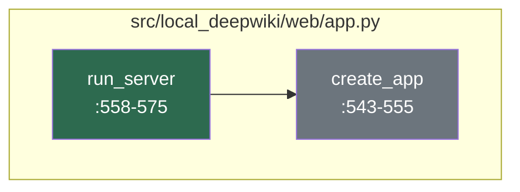

# Developer Onboarding Guide

The **local-deepwiki** project is a local, AI-powered documentation server that enables developers to explore and interact with repository documentation in a DeepWiki-style environment. It supports private documentation repositories and integrates with various AI models via the Model Context Protocol (MCP), allowing for rich, contextual search and analysis. Designed for teams seeking to enhance their internal knowledge management, this tool bridges the gap between raw code documentation and intelligent, interactive exploration. It's particularly useful for developers working in environments where security and control over data are paramount, as it operates entirely locally without relying on external cloud services.

The system is built using a Python-based Flask web framework, which serves as the core HTTP server, and leverages **LanceDB** for vector-based document storage and retrieval. AI/ML capabilities are powered by a range of providers including **Anthropic**, **OpenAI**, and **Ollama**, enabling natural language understanding and generation. Additionally, it uses **sentence-transformers** for semantic search, **markdown** for parsing documentation, and **nh3** for safe HTML sanitization. The architecture is modular and extensible, supporting both command-line and web-based interfaces, and is designed to be integrated into development workflows to improve code understanding and documentation accessibility.

## Architecture at a Glance

```mermaid
  componentDiagram
    direction LR
    classDef entry fill:#2d6a4f,color:#fff
    classDef crossfile fill:#1d3557,color:#fff
    classDef leaf fill:#6c757d,color:#fff

    subgraph "CLI Layer"
      CLI["cli/main.py"]
    end

    subgraph "Web Layer"
      Web["web/app.py"]
    end

    subgraph "Core Logic"
      Server["server.py"]
      Config["config/loader.py"]
      Models["config/models.py"]
    end

    subgraph "Data Layer"
      DB["lancedb"]
      Embedding["sentence-transformers"]
    end

    CLI --> Web
    Web --> Server
    Server --> Config
    Server --> Models
    Models --> DB
    Models --> Embedding
```

### Component Descriptions

- **[cli/main.py](files/src/local_deepwiki/cli/main.md)**: The primary command-line interface entry point that routes user commands to appropriate CLI modules.
- **[web/app.py](files/src/local_deepwiki/web/app.py)**: The Flask web application that handles HTTP requests and serves the web UI for documentation exploration.
- **[server.py](files/src/local_deepwiki/server.py)**: The core server logic that orchestrates the processing of repository documentation and MCP interactions.
- **[config/loader.py](files/src/local_deepwiki/config/loader.md)**: Responsible for loading and validating configuration settings from various sources.
- **[config/models.py](files/src/local_deepwiki/config/models.md)**: Defines and manages the configuration of LLM, embedding, and search models used in the system.
- **LanceDB**: Vector database for storing and retrieving document embeddings.
- **sentence-transformers**: Used for generating semantic embeddings for search and retrieval.

## How It Works

### Flow: Core Server Logic

Question: How does the core server process repository documentation and respond to MCP requests?
Files: src/local_deepwiki/web/app.py



#### Narrative Walkthrough

The core server logic begins with the [`run_server`](files/src/local_deepwiki/web/app.md) function, which is the main entry point for starting the Flask web server. This function is located in [src/local_deepwiki/web/app.py](files/src/local_deepwiki/web/app.py) and is responsible for initializing the Flask application with appropriate parameters, including the path to the documentation repository.

Once [`run_server`](files/src/local_deepwiki/web/app.md) is called, it invokes [`create_app`](files/src/local_deepwiki/web/app.md), which is defined in the same file. The [`create_app`](files/src/local_deepwiki/web/app.md) function sets up the Flask application instance, configures the global `WIKI_PATH` variable, and returns the configured Flask app. This app is then used to handle incoming HTTP requests, routing them to appropriate handlers that process repository documentation and respond to MCP requests.

The separation of concerns between [`run_server`](files/src/local_deepwiki/web/app.md) and [`create_app`](files/src/local_deepwiki/web/app.md) allows for a clean, testable architecture where server initialization is decoupled from application configuration. This design supports easy testing and modular configuration, ensuring that the system can be extended or modified without disrupting core functionality.

## Getting Started

To begin working with the **local-deepwiki** project, you'll need to ensure your environment meets the following prerequisites:

- **Python >= 3.11**
- **pip** or **Poetry** for package management

Install the project in development mode using:

```bash
pip install -e .
```

To run the web server, use:

```bash
local-deepwiki serve
```

This command will start the Flask web server, typically on `http://localhost:5000`. For CLI usage, refer to the help system:

```bash
local-deepwiki --help
```

Configuration can be managed via the `.toml` files or environment variables, as defined in [pyproject.toml](pyproject.toml) and [config/loader.py](files/src/local_deepwiki/config/loader.md).

## Key Concepts

| Concept | What It Means |
|--------|---------------|
| **MCP** | Model Context Protocol, used to enable communication between the server and various AI/ML models. |
| **Wiki Path** | The directory path where the documentation repository is located; used to determine the source of documentation to be processed. |
| **Embedding Model** | A model that converts text into numerical vectors for semantic search and retrieval using tools like `sentence-transformers`. |
| **Flask App** | The core web framework instance that handles HTTP requests and routes them to appropriate handlers. |
| **LanceDB** | A vector database used for storing and querying document embeddings, enabling fast and semantic search. |
| **CLI** | Command-line interface, used for tasks like initialization, updates, and configuration management. |

## Development Workflow

To run tests, use:

```bash
pytest tests/
```

For linting and code formatting, the project uses:

```bash
pre-commit run --all-files
```

To ensure consistent development practices, install the pre-commit hooks:

```bash
pre-commit install
```

Common development tasks include:

- Adding new CLI commands in [cli/main.py](files/src/local_deepwiki/cli/main.md)
- Extending web endpoints in [web/app.py](files/src/local_deepwiki/web/app.py)
- Modifying configuration models in [config/models.py](files/src/local_deepwiki/config/models.md)
- Updating documentation in the `docs/` directory

## Further Reading

- [Architecture](architecture.md)
- [Dependencies](dependencies.md)
- [Glossary](glossary.md)
- [Changelog](changelog.md)

## Relevant Source Files

The following source files were used to generate this documentation:

- [`src/local_deepwiki/plugins/registry.py:25-361`](files/src/local_deepwiki/plugins/registry.md)
- [`src/local_deepwiki/generators/analysis/health_scoring.py:34-39`](files/src/local_deepwiki/generators/analysis/health_scoring.md)
- [`src/local_deepwiki/generators/analysis/duplication.py:26-37`](files/src/local_deepwiki/generators/analysis/duplication.md)
- [`src/local_deepwiki/generators/analysis/testability.py:26-37`](files/src/local_deepwiki/generators/analysis/testability.md)
- [`src/local_deepwiki/export/toc_renderer.py:8-17`](files/src/local_deepwiki/export/toc_renderer.md)
- [`src/local_deepwiki/export/pdf.py:129-534`](files/src/local_deepwiki/export/pdf.md)
- [`src/local_deepwiki/generators/analysis/cohesion.py:40-60`](files/src/local_deepwiki/generators/analysis/cohesion.md)
- [`src/local_deepwiki/generators/analysis/hotspots.py:69-89`](files/src/local_deepwiki/generators/analysis/hotspots.md)
- [`src/local_deepwiki/logging.py:28-83`](files/src/local_deepwiki/logging.md)
- [`src/local_deepwiki/server.py:98-100`](files/src/local_deepwiki/server.md)


*Showing 10 of 269 source files.*
