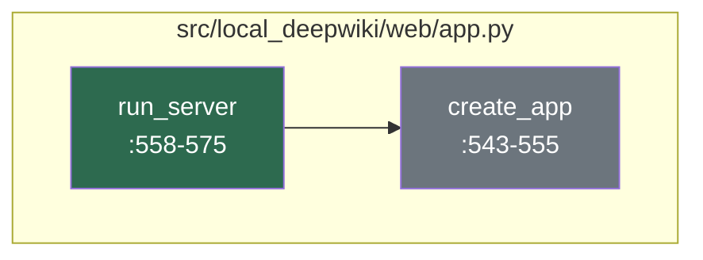

# Developer Onboarding Guide

The `local-deepwiki` project is a powerful, local-first solution that brings the capabilities of DeepWiki-style documentation to private repositories. Designed for developers who need to navigate complex codebases, it offers an intelligent, AI-driven documentation experience that can answer questions about code structure, dependencies, and relationships. This system enables teams to maintain a rich, searchable knowledge base directly from their local development environments, without relying on external services or cloud infrastructure.

The project is built with Python 3.11+ and leverages a robust stack including Flask for the web interface, LanceDB for vector storage, and various AI/ML providers such as Anthropic, Ollama, and OpenAI. It supports multiple configuration modes—local, hybrid, and cloud—making it adaptable to different deployment scenarios. Whether you're exploring a new codebase, conducting impact analysis, or simply looking for documentation on how a specific function works, `local-deepwiki` provides a unified interface that bridges code and knowledge through semantic search and graph-based retrieval.

## Architecture at a Glance

```mermaid
componentDiagram
    component "CLI Layer" as CLI {
        CLI -> ConfigCLI : config
        CLI -> CacheCLI : cache
        CLI -> InitCLI : init
        CLI -> StatusCLI : status
        CLI -> UpdateCLI : update
        CLI -> CheckCLI : check
        CLI -> ProfileCLI : profile
        CLI -> SearchModelsCLI : search
        CLI -> InteractiveSearchCLI : interactive
    }

    component "Core Services" as Core {
        Core -> ConfigLoader : load config
        Core -> GeneratorService : generate
        Core -> AnalysisService : analyze
        Core -> GraphRAG : retrieve
        Core -> Parser : parse
    }

    component "Web Layer" as Web {
        Web -> FlaskApp : serve
        Web -> AccessControl : enforce
        Web -> Handlers : route
    }

    component "AI/ML Providers" as Providers {
        Providers -> LLMProvider : LLM
        Providers -> EmbeddingProvider : Embeddings
        Providers -> SearchProvider : Search
    }

    component "Storage" as Storage {
        Storage -> VectorDB : store
        Storage -> Filesystem : persist
    }

    CLI --> Core
    Core --> Web
    Core --> Providers
    Core --> Storage
```

- **CLI Layer**: Provides command-line tools for configuration, initialization, status checking, and updates. [CLI Overview](files/src/local_deepwiki/cli/main.md)
- **Core Services**: Contains the main logic for configuration loading, documentation generation, analysis, graph-based retrieval, and parsing. [Core Services](files/src/local_deepwiki/core/indexer.md)
- **Web Layer**: Serves the web interface using Flask and handles request routing with access control. [Web App](files/src/local_deepwiki/web/app.md)
- **AI/ML Providers**: Integrates with various AI/ML services for LLMs, embeddings, and search capabilities. [Providers](files/src/local_deepwiki/config/provider_models.md)
- **Storage**: Manages vector databases (LanceDB) and file system storage for documentation chunks and metadata. [Storage](files/src/local_deepwiki/config/models.md)

## How It Works

### Flow: Server Request Processing

Question: How does the core server process incoming requests and route them to appropriate handlers for documentation retrieval?

Files: `src/local_deepwiki/web/app.py`



#### Narrative Walkthrough

The server initialization begins with the [`run_server`](files/src/local_deepwiki/web/app.md) function located in `src/local_deepwiki/web/app.py` at line 558. This function serves as the entry point for starting the wiki web server, accepting parameters like the wiki path and host configuration. It acts as the main execution driver for the server startup process.

Once [`run_server`](files/src/local_deepwiki/web/app.md) is invoked, it calls the [`create_app`](files/src/local_deepwiki/web/app.md) function, also found in `src/local_deepwiki/web/app.py` at line 543. This function creates and configures a Flask application instance with the specified wiki path. It sets up the global `WIKI_PATH` variable and establishes the foundation for request routing and documentation handling.

This flow demonstrates a clear separation of concerns where [`run_server`](files/src/local_deepwiki/web/app.md) handles server initialization and [`create_app`](files/src/local_deepwiki/web/app.md) manages Flask application configuration. The global variable `WIKI_PATH` is used to maintain state across the Flask application, which is a common pattern for sharing configuration data throughout the application's request lifecycle. The execution flow shows a simple but effective bootstrapping approach where the server setup is minimal and focused, relying on Flask's built-in routing mechanisms for handling incoming requests.

### Flow: Documentation Retrieval

Question: How does the graph-based RAG system retrieve and rank relevant documentation chunks from the local repository?

Files: `src/local_deepwiki/config/models.py`, `src/local_deepwiki/core/path_utils.py`, `src/local_deepwiki/error_factories.py`, `src/local_deepwiki/errors.py`, `src/local_deepwiki/generators/analysis/callgraph.py`, `src/local_deepwiki/handlers/_index_helpers.py`, `src/local_deepwiki/handlers/_response.py`, `src/local_deepwiki/handlers/analysis_entity.py`, `src/local_deepwiki/handlers/generators.py`, `src/local_deepwiki/plugins/registry.py`

```mermaid
flowchart TD
    subgraph src/local_deepwiki/config/models_py["src/local_deepwiki/config/models.py"]
        N0["get_vector_db_path\n:255-257"]
    end
    subgraph src/local_deepwiki/core/path_utils_py["src/local_deepwiki/core/path_utils.py"]
        N1["validate_file_in_repo\n:17-40"]
    end
    subgraph src/local_deepwiki/error_factories_py["src/local_deepwiki/error_factories.py"]
        N2["_apply_sanitization_patterns\n:585-592"]
        N3["path_not_found_error\n:473-491"]
        N4["sanitize_error_message\n:595-628"]
    end
    subgraph src/local_deepwiki/errors_py["src/local_deepwiki/errors.py"]
        N5["ValidationError\n:121-157"]
    end
    subgraph src/local_deepwiki/generators/analysis/callgraph_py["src/local_deepwiki/generators/analysis/callgraph.py"]
        N6["CallGraphExtractor\n:314-382"]
        N7["_trim_nodes_to_limit\n:385-397"]
        N8["build_reverse_call_graph\n:488-504"]
        N9["generate_call_graph_diagram\n:443-470"]
    end
    subgraph src/local_deepwiki/handlers/_index_helpers_py["src/local_deepwiki/handlers/_index_helpers.py"]
        N10["_create_vector_store\n:52-68"]
    end
    subgraph src/local_deepwiki/handlers/_response_py["src/local_deepwiki/handlers/_response.py"]
        N11["make_tool_text_content\n:40-61"]
        N12["wrap_tool_response\n:0-0"]
    end
    subgraph src/local_deepwiki/handlers/analysis_entity_py["src/local_deepwiki/handlers/analysis_entity.py"]
        N13["_collect_call_graph\n:84-116"]
    end
    subgraph src/local_deepwiki/handlers/generators_py["src/local_deepwiki/handlers/generators.py"]
        N14["_build_generator_service\n:44-47"]
        N15["handle_get_call_graph\n:152-189"]
    end
    subgraph src/local_deepwiki/plugins/registry_py["src/local_deepwiki/plugins/registry.py"]
        N16["get_embedding_provider\n:192-201"]
    end
    subgraph src/local_deepwiki/security/access_control_py["src/local_deepwiki/security/access_control.py"]
        N17["get_access_controller\n:347-361"]
    end
    subgraph src/local_deepwiki/services/analysis_service_py["src/local_deepwiki/services/analysis_service.py"]
        N18["_set_section_error\n:81-90"]
    end
    subgraph src/local_deepwiki/services/generator_service_py["src/local_deepwiki/services/generator_service.py"]
        N19["GeneratorService\n:23-602"]
    end
    N14 -.-> N19
    N14 -.-> N10
    N13 -.-> N6
    N13 --> N18
    N13 -.-> N8
    N10 -.-> N0
    N10 -.-> N16
    N18 -.-> N4
    N9 --> N7
    N15 -.-> N6
    N15 --> N14
    N15 -.-> N9
    N15 -.-> N17
    N15 -.-> N11
    N15 -.-> N3
    N15 -.-> N1
    N11 --> N12
    N3 -.-> N5
    N4 --> N2
    N1 -.-> N5
    N1 -.-> N3

    classDef entry fill:#2d6a4f,color:#fff
    classDef crossfile fill:#1d3557,color:#fff
    classDef leaf fill:#6c757d,color:#fff
    class N15 entry
    class N0,N1,N10,N11,N16,N17,N18,N19,N3,N4,N5,N6,N8,N9 crossfile
    class N12,N2,N7 leaf
    click N0 "files/src/local_deepwiki/config/models.py" _blank
    click N1 "files/src/local_deepwiki/core/path_utils.py" _blank
    click N2 "files/src/local_deepwiki/error_factories.py" _blank
    click N3 "files/src/local_deepwiki/error_factories.py" _blank
    click N4 "files/src/local_deepwiki/error_factories.py" _blank
    click N5 "files/src/local_deepwiki/errors.py" _blank
    click N6 "files/src/local_deepwiki/generators/analysis/callgraph.py" _blank
    click N7 "files/src/local_deepwiki/generators/analysis/callgraph.py" _blank
    click N8 "files/src/local_deepwiki/generators/analysis/callgraph.py" _blank
    click N9 "files/src/local_deepwiki/generators/analysis/callgraph.py" _blank
    click N10 "files/src/local_deepwiki/handlers/_index_helpers.py" _blank
    click N11 "files/src/local_deepwiki/handlers/_response.py" _blank
    click N12 "files/src/local_deepwiki/handlers/_response.py" _blank
    click N13 "files/src/local_deepwiki/handlers/analysis_entity.py" _blank
    click N14 "files/src/local_deepwiki/handlers/generators.py" _blank
    click N15 "files/src/local_deepwiki/handlers/generators.py" _blank
    click N16 "files/src/local_deepwiki/plugins/registry.py" _blank
    click N17 "files/src/local_deepwiki/security/access_control.py" _blank
    click N18 "files/src/local_deepwiki/services/analysis_service.py" _blank
    click N19 "files/src/local_deepwiki/services/generator_service.py" _blank
```



#### Narrative Walkthrough

The documentation retrieval process begins with [`handle_get_call_graph`](files/src/local_deepwiki/handlers/generators.md) at `src/local_deepwiki/handlers/generators.py:152-189`. This function handles the get_call_graph tool call request and initializes the process by calling `get_access_controller()` from `src/local_deepwiki/security/access_control.py:347-361` to verify access permissions before proceeding.

Next, [`validate_file_in_repo`](files/src/local_deepwiki/core/path_utils.md) at `src/local_deepwiki/core/path_utils.py:17-40` ensures that the requested file path is within the repository boundaries and exists. If validation fails, a [`ValidationError`](files/src/local_deepwiki/errors.md) is raised, as defined in `src/local_deepwiki/errors.py:121-157`.

The system then calls `_build_generator_service` at `src/local_deepwiki/handlers/generators.py:44-47`, which creates a [`GeneratorService`](files/src/local_deepwiki/services/generator_service.md) with a vector store for the specified repository. This function calls `_create_vector_store()` from `src/local_deepwiki/handlers/_index_helpers.py:52-68` to initialize the vector database for semantic search.

The `GeneratorService.generate_call_graph` at `src/local_deepwiki/services/generator_service.py:23-602` generates call graph information for the specified repository. It processes the call graph data through various analysis steps, including the [`CallGraphExtractor`](files/src/local_deepwiki/generators/analysis/callgraph.md) at `src/local_deepwiki/generators/analysis/callgraph.py:314-382`, which extracts call graphs from source files.

Finally, [`generate_call_graph_diagram`](files/src/local_deepwiki/generators/analysis/callgraph.md) at `src/local_deepwiki/generators/analysis/callgraph.py:443-470` creates a Mermaid flowchart representation of the call graph. The result is wrapped in a standardized JSON envelope by [`make_tool_text_content`](files/src/local_deepwiki/handlers/_response.md) at `src/local_deepwiki/handlers/_response.py:40-61` and delivered to the requesting agent.

This system follows a layered architecture pattern where access control is enforced early in the process, followed by validation, then generation, and finally response formatting. Error handling is comprehensive with specific [`ValidationError`](files/src/local_deepwiki/errors.md) types and sanitization of error messages to prevent information leakage.

## Getting Started

To get started with `local-deepwiki`, you'll need to ensure the following prerequisites are met:

- Python 3.11 or higher
- Git for version control
- A local development environment with appropriate permissions to access your repository

Install the project dependencies using `pip`:

```bash
pip install -e .
```

You can also install in development mode with additional test dependencies:

```bash
pip install -e ".[dev]"
```

To run the server, use the CLI entry point:

```bash
local-deepwiki run --wiki-path /path/to/your/repo
```

For configuration options, see the example config files in the `examples/` directory:

- `config-local.yaml` for local-only setup
- `config-hybrid.yaml` for hybrid mode
- `config-cloud.yaml` for cloud-based setup

## Key Concepts

| Concept | What It Means |
|--------|---------------|
| **RAG System** | Retrieval-Augmented Generation system that retrieves relevant documentation chunks from a local repository using semantic search |
| **Vector Store** | Database (LanceDB) used to store and search embeddings of documentation chunks for semantic similarity |
| **Call Graph** | A representation of how functions and methods call each other in a codebase, used for analysis and documentation |
| **CLI Layer** | Command-line interface components for configuration, initialization, status checking, and updates |
| **Generator Service** | Core service responsible for generating documentation content including call graphs and analysis reports |
| **Access Control** | Security mechanism enforcing role-based access control (RBAC) for documentation retrieval |
| **Embedding Provider** | AI service that generates vector embeddings for semantic search, supporting multiple providers (OpenAI, Ollama, Anthropic) |
| **GraphRAG** | Graph-based Retrieval-Augmented Generation that uses graph structures to improve search relevance |

## Development Workflow

To run tests, use:

```bash
pytest tests/
```

To run tests with coverage:

```bash
pytest tests/ --cov=src/local_deepwiki
```

To lint the codebase:

```bash
pre-commit run --all-files
```

To format code:

```bash
black src/
```

For development, install the project in editable mode with dev dependencies:

```bash
pip install -e ".[dev]"
```

The project uses `pyproject.toml` for configuration and `.pre-commit-config.yaml` for pre-commit hooks.

## Further Reading

- [Architecture](architecture.md)
- [Dependencies](dependencies.md)
- [Glossary](glossary.md)
- [Changelog](changelog.md)

## Relevant Source Files

The following source files were used to generate this documentation:

- [`src/local_deepwiki/server.py:98-100`](files/src/local_deepwiki/server.md)
- `src/local_deepwiki/models/__init__.py`
- [`src/local_deepwiki/tool_defs/analysis.py`](files/src/local_deepwiki/tool_defs/analysis.md)
- [`src/local_deepwiki/generators/analysis/duplication.py:26-37`](files/src/local_deepwiki/generators/analysis/duplication.md)
- [`src/local_deepwiki/generators/analysis/architecture_health.py:55-123`](files/src/local_deepwiki/generators/analysis/architecture_health.md)
- [`src/local_deepwiki/generators/analysis/maintainability.py:69-79`](files/src/local_deepwiki/generators/analysis/maintainability.md)
- [`src/local_deepwiki/models/tool_args.py:15-49`](files/src/local_deepwiki/models/tool_args.md)
- [`src/local_deepwiki/generators/analysis/cohesion.py:40-60`](files/src/local_deepwiki/generators/analysis/cohesion.md)
- [`src/local_deepwiki/generators/analysis/health_scoring.py:34-39`](files/src/local_deepwiki/generators/analysis/health_scoring.md)
- [`src/local_deepwiki/generators/analysis/churn.py:25-38`](files/src/local_deepwiki/generators/analysis/churn.md)


*Showing 10 of 268 source files.*
