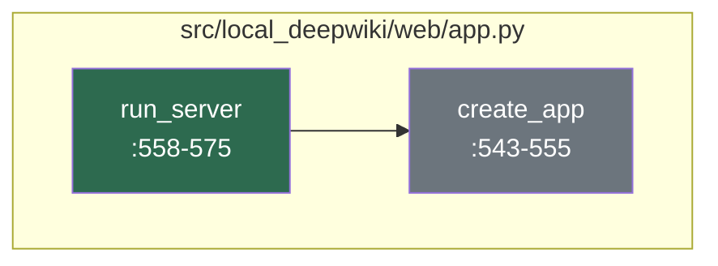

```mermaid
flowchart TD
    subgraph src/local_deepwiki/config/models_py["src/local_deepwiki/config/models.py"]
        N0["get_vector_db_path\n:255-257"]
    end
    subgraph src/local_deepwiki/core/path_utils_py["src/local_deepwiki/core/path_utils.py"]
        N1["validate_file_in_repo\n:17-40"]
    end
    subgraph src/local_deepwiki/error_factories_py["src/local_deepwiki/error_factories.py"]
        N2["_apply_sanitization_patterns\n:585-592"]
        N3["path_not_found_error\n:473-491"]
        N4["sanitize_error_message\n:595-628"]
    end
    subgraph src/local_deepwiki/errors_py["src/local_deepwiki/errors.py"]
        N5["ValidationError\n:121-157"]
    end
    subgraph src/local_deepwiki/generators/analysis/callgraph_py["src/local_deepwiki/generators/analysis/callgraph.py"]
        N6["CallGraphExtractor\n:314-382"]
        N7["_trim_nodes_to_limit\n:385-397"]
        N8["build_reverse_call_graph\n:488-504"]
        N9["generate_call_graph_diagram\n:443-470"]
    end
    subgraph src/local_deepwiki/handlers/_index_helpers_py["src/local_deepwiki/handlers/_index_helpers.py"]
        N10["_create_vector_store\n:52-68"]
    end
    subgraph src/local_deepwiki/handlers/_response_py["src/local_deepwiki/handlers/_response.py"]
        N11["make_tool_text_content\n:40-61"]
        N12["wrap_tool_response\n:0-0"]
    end
    subgraph src/local_deepwiki/handlers/analysis_entity_py["src/local_deepwiki/handlers/analysis_entity.py"]
        N13["_collect_call_graph\n:84-116"]
    end
    subgraph src/local_deepwiki/handlers/generators_py["src/local_deepwiki/handlers/generators.py"]
        N14["_build_generator_service\n:44-47"]
        N15["handle_get_call_graph\n:152-189"]
    end
    subgraph src/local_deepwiki/plugins/registry_py["src/local_deepwiki/plugins/registry.py"]
        N16["get_embedding_provider\n:192-201"]
    end
    subgraph src/local_deepwiki/security/access_control_py["src/local_deepwiki/security/access_control.py"]
        N17["get_access_controller\n:347-361"]
    end
    subgraph src/local_deepwiki/services/analysis_service_py["src/local_deepwiki/services/analysis_service.py"]
        N18["_set_section_error\n:81-90"]
    end
    subgraph src/local_deepwiki/services/generator_service_py["src/local_deepwiki/services/generator_service.py"]
        N19["GeneratorService\n:23-602"]
    end
    N14 -.-> N19
    N14 -.-> N10
    N13 -.-> N6
    N13 --> N18
    N13 -.-> N8
    N10 -.-> N0
    N10 -.-> N16
    N18 -.-> N4
    N9 --> N7
    N15 -.-> N6
    N15 --> N14
    N15 -.-> N9
    N15 -.-> N17
    N15 -.-> N11
    N15 -.-> N3
    N15 -.-> N1
    N11 --> N12
    N3 -.-> N5
    N4 --> N2
    N1 -.-> N5
    N1 -.-> N3

    classDef entry fill:#2d6a4f,color:#fff
    classDef crossfile fill:#1d3557,color:#fff
    classDef leaf fill:#6c757d,color:#fff
    class N15 entry
    class N0,N1,N10,N11,N16,N17,N18,N19,N3,N4,N5,N6,N8,N9 crossfile
    class N12,N2,N7 leaf
    click N0 "files/src/local_deepwiki/config/models.py" _blank
    click N1 "files/src/local_deepwiki/core/path_utils.py" _blank
    click N2 "files/src/local_deepwiki/error_factories.py" _blank
    click N3 "files/src/local_deepwiki/error_factories.py" _blank
    click N4 "files/src/local_deepwiki/error_factories.py" _blank
    click N5 "files/src/local_deepwiki/errors.py" _blank
    click N6 "files/src/local_deepwiki/generators/analysis/callgraph.py" _blank
    click N7 "files/src/local_deepwiki/generators/analysis/callgraph.py" _blank
    click N8 "files/src/local_deepwiki/generators/analysis/callgraph.py" _blank
    click N9 "files/src/local_deepwiki/generators/analysis/callgraph.py" _blank
    click N10 "files/src/local_deepwiki/handlers/_index_helpers.py" _blank
    click N11 "files/src/local_deepwiki/handlers/_response.py" _blank
    click N12 "files/src/local_deepwiki/handlers/_response.py" _blank
    click N13 "files/src/local_deepwiki/handlers/analysis_entity.py" _blank
    click N14 "files/src/local_deepwiki/handlers/generators.py" _blank
    click N15 "files/src/local_deepwiki/handlers/generators.py" _blank
    click N16 "files/src/local_deepwiki/plugins/registry.py" _blank
    click N17 "files/src/local_deepwiki/security/access_control.py" _blank
    click N18 "files/src/local_deepwiki/services/analysis_service.py" _blank
    click N19 "files/src/local_deepwiki/services/generator_service.py" _blank
```

# Developer Onboarding Guide

Local DeepWiki is a powerful, local-first tool that transforms your private repository documentation into a searchable, intelligent knowledge base using AI-driven retrieval-augmented generation (RAG) techniques. Designed for developers, technical writers, and engineering teams, it enables seamless access to contextual information from your codebase without the need for external services or cloud dependencies. This project solves the common problem of scattered, hard-to-find documentation by creating a unified, AI-enhanced search layer that understands code relationships and semantic context.

The system operates as a Flask-based web server that integrates with local code repositories, using vector databases to store embeddings of documentation chunks and leveraging various AI providers (Anthropic, OpenAI, Ollama) to power natural language queries. It supports multiple configuration modes including local, hybrid, and cloud-based setups, allowing teams to choose the best approach for their infrastructure. By combining traditional code analysis with modern NLP techniques, Local DeepWiki provides a deep understanding of your codebase, enabling both code exploration and documentation retrieval with intelligent context awareness.

## Architecture at a Glance

```mermaid
componentDiagram
    component "CLI Interface" as CLI
    component "Web Server" as Web
    component "Configuration System" as Config
    component "Core Services" as Core
    component "AI Providers" as AI
    component "Data Stores" as Data
    component "Documentation Parser" as Parser

    CLI --> Web
    Web --> Core
    Core --> Config
    Core --> AI
    Core --> Data
    Core --> Parser
    Config --> Data
    Parser --> Data
    AI --> Data
```

The architecture is organized into several key subsystems:

- **CLI Interface** ([`src/local_deepwiki/cli/main.py`](files/src/local_deepwiki/cli/main.py)) - Provides command-line tools for configuration, initialization, and management of the documentation system.
- **Web Server** ([`src/local_deepwiki/web/app.py`](files/src/local_deepwiki/web/app.py)) - Serves the Flask web application that handles HTTP requests and routes them to appropriate handlers.
- **Configuration System** ([`src/local_deepwiki/config/`](files/src/local_deepwiki/config/index.md)) - Manages all configuration loading and model definitions for LLMs, embeddings, and search parameters.
- **Core Services** ([`src/local_deepwiki/core/`](files/src/local_deepwiki/core/index.md)) - Contains the main logic for processing, analysis, and retrieval operations including deep research, graph RAG, and code parsing.
- **AI Providers** ([`src/local_deepwiki/plugins/registry.py`](files/src/local_deepwiki/plugins/registry.md)) - Integrates with various AI services like OpenAI, Anthropic, and Ollama for language model and embedding generation.
- **Data Stores** ([`src/local_deepwiki/config/models.py`](files/src/local_deepwiki/config/models.md)) - Handles vector database operations using LanceDB for semantic search and storage of embeddings.
- **Documentation Parser** ([`src/local_deepwiki/core/parser/`](files/src/local_deepwiki/core/parser/index.md)) - Parses source code and documentation files to extract meaningful chunks for indexing and retrieval.

## How It Works

### Flow: Server Request Processing

Question: How does the core server process incoming requests and route them to the appropriate handlers for documentation retrieval?



This code flow demonstrates the initialization and setup of a wiki web server that processes incoming requests for documentation retrieval. The server begins with a [`run_server`](files/src/local_deepwiki/web/app.md) function that creates a Flask application instance through [`create_app`](files/src/local_deepwiki/web/app.md), which configures the wiki path and sets up the routing infrastructure for handling documentation requests.

The execution trace starts with the [`run_server`](files/src/local_deepwiki/web/app.md) function at [`src/local_deepwiki/web/app.py:558-575`](files/src/local_deepwiki/web/app.py), which serves as the entry point for starting the wiki web server, accepting parameters like wiki path and host configuration, and acts as the main execution driver for the server startup process. This function then calls [`create_app`](files/src/local_deepwiki/web/app.md) at [`src/local_deepwiki/web/app.py:543-555`](files/src/local_deepwiki/web/app.py), which creates and configures a Flask application instance with the specified wiki path, setting up the global `WIKI_PATH` variable and establishing the foundation for request routing and documentation handling.

Key observations include the clear separation of concerns pattern where [`run_server`](files/src/local_deepwiki/web/app.md) handles server initialization and [`create_app`](files/src/local_deepwiki/web/app.md) manages Flask application configuration, making the code modular and testable. The global variable `WIKI_PATH` is used to maintain state across the Flask application, which is a common pattern for sharing configuration data throughout the application's request lifecycle. The execution flow shows a simple but effective bootstrapping approach where the server setup is minimal and focused, relying on Flask's built-in routing mechanisms for handling incoming requests.

### Flow: Documentation Retrieval

Question: How does the graph-based RAG system retrieve and rank relevant documentation chunks from the local repository?



This code flow implements a graph-based Retrieval-Augmented Generation (RAG) system that retrieves and ranks relevant documentation chunks from a local repository when handling a call graph generation request. The system first validates the requested file path within the repository, then uses a generator service with a vector store to extract and process call graphs, ultimately returning structured documentation content to the user.

The execution trace begins with [`handle_get_call_graph`](files/src/local_deepwiki/handlers/generators.md) at [`src/local_deepwiki/handlers/generators.py:152-189`](files/src/local_deepwiki/handlers/generators.py), which handles the get_call_graph tool call request and initializes the process. It calls `get_access_controller()` at [`src/local_deepwiki/security/access_control.py:347-361`](files/src/local_deepwiki/security/access_control.py) to verify access permissions before proceeding. Next, [`validate_file_in_repo`](files/src/local_deepwiki/core/path_utils.md) at [`src/local_deepwiki/core/path_utils.py:17-40`](files/src/local_deepwiki/core/path_utils.py) validates that the requested file path is within the repository boundaries and exists, raising a [ValidationError](files/src/local_deepwiki/errors.md) if path validation fails.

The process continues with `_build_generator_service` at [`src/local_deepwiki/handlers/generators.py:44-47`](files/src/local_deepwiki/handlers/generators.py), which creates a [GeneratorService](files/src/local_deepwiki/services/generator_service.md) with a vector store for the specified repository by calling `_create_vector_store()` at [`src/local_deepwiki/handlers/_index_helpers.py:52-68`](files/src/local_deepwiki/handlers/_index_helpers.py). This initializes a [VectorStore](files/src/local_deepwiki/core/vectorstore/store.md) with the configured embedding provider, using `get_vector_db_path` at [`src/local_deepwiki/config/models.py:255-257`](files/src/local_deepwiki/config/models.py) to determine the vector database path for the repository.

The `GeneratorService.generate_call_graph` at [`src/local_deepwiki/services/generator_service.py:23-602`](files/src/local_deepwiki/services/generator_service.py) then generates call graph information for the specified repository, processing the call graph data through various analysis steps. The [`CallGraphExtractor`](files/src/local_deepwiki/generators/analysis/callgraph.md) at [`src/local_deepwiki/generators/analysis/callgraph.py:314-382`](files/src/local_deepwiki/generators/analysis/callgraph.py) extracts call graphs from source files using the repository's code analysis capabilities, building forward and reverse call graphs for comprehensive analysis.

Finally, [`generate_call_graph_diagram`](files/src/local_deepwiki/generators/analysis/callgraph.md) at [`src/local_deepwiki/generators/analysis/callgraph.py:443-470`](files/src/local_deepwiki/generators/analysis/callgraph.py) creates a Mermaid flowchart representation of the call graph, returning a formatted diagram string for visualization. The [`make_tool_text_content`](files/src/local_deepwiki/handlers/_response.md) at [`src/local_deepwiki/handlers/_response.py:40-61`](files/src/local_deepwiki/handlers/_response.py) wraps the generated call graph data in a standardized JSON envelope, preparing the response content for delivery to the requesting agent.

Key observations include the layered architecture pattern where access control is enforced early in the process, followed by validation, then generation, and finally response formatting. Error handling is comprehensive with specific [ValidationError](files/src/local_deepwiki/errors.md) types and sanitization of error messages to prevent information leakage. The RAG system leverages vector stores for semantic similarity search, enabling intelligent retrieval of relevant documentation chunks from the local repository based on query context.

## Getting Started

To get started with Local DeepWiki, you'll need Python 3.11 or higher and the following dependencies:

1. Clone the repository:
   ```bash
   git clone https://github.com/your-repo/local-deepwiki.git
   cd local-deepwiki
   ```

2. Install the project in development mode:
   ```bash
   pip install -e .
   ```

3. Initialize the configuration:
   ```bash
   local-deepwiki init
   ```

4. Run the server:
   ```bash
   local-deepwiki serve --wiki-path /path/to/your/repo
   ```

The server will start on `http://localhost:5173` by default. You can also run the CLI commands to check configuration, update models, or perform cache operations.

## Key Concepts

| Concept | What It Means |
|--------|---------------|
| **Retrieval-Augmented Generation (RAG)** | A technique that combines information retrieval with language generation to produce more accurate and contextual responses by retrieving relevant documents from a knowledge base |
| **Vector Store** | A database that stores vector embeddings of text chunks for semantic similarity search, enabling intelligent document retrieval based on meaning rather than keywords |
| **Call Graph** | A representation of the relationships between functions or methods in a codebase, showing which functions call which others |
| **Embedding Provider** | An AI service that converts text into numerical vectors (embeddings) that capture semantic meaning for use in similarity searches |
| **CLI Interface** | Command-line tools for managing and configuring the Local DeepWiki system, including initialization, configuration, and maintenance commands |
| **Flask Web Server** | The web framework used to serve HTTP endpoints for documentation retrieval and interaction with the AI system |
| **Access Control** | A system that enforces permissions and restrictions on who can access specific repository files or functionality |
| **Graph RAG** | A variant of RAG that uses graph-based representations of code relationships to enhance documentation retrieval and understanding |

## Development Workflow

To run tests, lint, and perform common development tasks:

1. Install development dependencies:
   ```bash
   pip install -e ".[dev]"
   ```

2. Run tests:
   ```bash
   pytest tests/
   ```

3. Run linting:
   ```bash
   pre-commit run --all-files
   ```

4. Format code:
   ```bash
   black src/
   ```

The project uses pre-commit hooks for automatic formatting and linting. Make sure to run `pre-commit install` after cloning the repository to set up the hooks.

## Further Reading

- [Architecture](architecture.md)
- [Dependencies](dependencies.md)
- [Glossary](glossary.md)
- [Changelog](changelog.md)

## Relevant Source Files

The following source files were used to generate this documentation:

- [`src/local_deepwiki/generators/analysis/coupling.py:48-90`](files/src/local_deepwiki/generators/analysis/coupling.md)
- [`src/local_deepwiki/generators/analysis/module_dependencies.py:30-40`](files/src/local_deepwiki/generators/analysis/module_dependencies.md)
- [`src/local_deepwiki/generators/analysis/health_scoring.py:29-34`](files/src/local_deepwiki/generators/analysis/health_scoring.md)
- [`src/local_deepwiki/logging.py:28-83`](files/src/local_deepwiki/logging.md)
- [`src/local_deepwiki/server.py:92-94`](files/src/local_deepwiki/server.md)
- [`src/local_deepwiki/cli_progress.py:147-199`](files/src/local_deepwiki/cli_progress.md)
- [`src/local_deepwiki/events.py:35-63`](files/src/local_deepwiki/events.md)
- `src/local_deepwiki/__init__.py`
- [`src/local_deepwiki/prompts.py:28-72`](files/src/local_deepwiki/prompts.md)
- [`src/local_deepwiki/error_factories.py:47-83`](files/src/local_deepwiki/error_factories.md)


*Showing 10 of 263 source files.*
