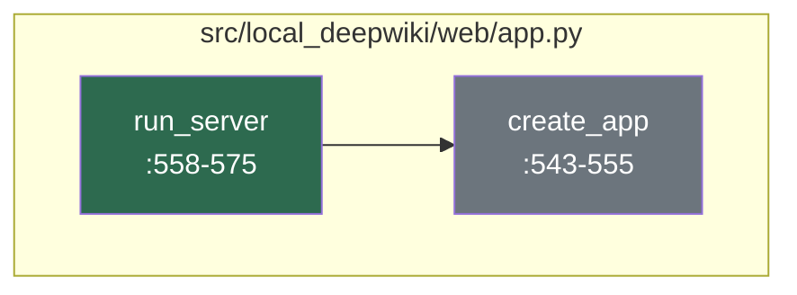

```mermaid
flowchart TD
    subgraph src/local_deepwiki/config/models_py["src/local_deepwiki/config/models.py"]
        N0["get_vector_db_path\n:255-257"]
    end
    subgraph src/local_deepwiki/core/path_utils_py["src/local_deepwiki/core/path_utils.py"]
        N1["validate_file_in_repo\n:17-40"]
    end
    subgraph src/local_deepwiki/error_factories_py["src/local_deepwiki/error_factories.py"]
        N2["_apply_sanitization_patterns\n:585-592"]
        N3["path_not_found_error\n:473-491"]
        N4["sanitize_error_message\n:595-628"]
    end
    subgraph src/local_deepwiki/errors_py["src/local_deepwiki/errors.py"]
        N5["ValidationError\n:121-157"]
    end
    subgraph src/local_deepwiki/generators/analysis/callgraph_py["src/local_deepwiki/generators/analysis/callgraph.py"]
        N6["CallGraphExtractor\n:314-382"]
        N7["_trim_nodes_to_limit\n:385-397"]
        N8["build_reverse_call_graph\n:488-504"]
        N9["generate_call_graph_diagram\n:443-470"]
    end
    subgraph src/local_deepwiki/handlers/_index_helpers_py["src/local_deepwiki/handlers/_index_helpers.py"]
        N10["_create_vector_store\n:52-68"]
    end
    subgraph src/local_deepwiki/handlers/_response_py["src/local_deepwiki/handlers/_response.py"]
        N11["make_tool_text_content\n:40-61"]
        N12["wrap_tool_response\n:0-0"]
    end
    subgraph src/local_deepwiki/handlers/analysis_entity_py["src/local_deepwiki/handlers/analysis_entity.py"]
        N13["_collect_call_graph\n:84-116"]
    end
    subgraph src/local_deepwiki/handlers/generators_py["src/local_deepwiki/handlers/generators.py"]
        N14["_build_generator_service\n:44-47"]
        N15["handle_get_call_graph\n:152-189"]
    end
    subgraph src/local_deepwiki/plugins/registry_py["src/local_deepwiki/plugins/registry.py"]
        N16["get_embedding_provider\n:192-201"]
    end
    subgraph src/local_deepwiki/security/access_control_py["src/local_deepwiki/security/access_control.py"]
        N17["get_access_controller\n:347-361"]
    end
    subgraph src/local_deepwiki/services/analysis_service_py["src/local_deepwiki/services/analysis_service.py"]
        N18["_set_section_error\n:81-90"]
    end
    subgraph src/local_deepwiki/services/generator_service_py["src/local_deepwiki/services/generator_service.py"]
        N19["GeneratorService\n:23-602"]
    end
    N14 -.-> N19
    N14 -.-> N10
    N13 -.-> N6
    N13 --> N18
    N13 -.-> N8
    N10 -.-> N0
    N10 -.-> N16
    N18 -.-> N4
    N9 --> N7
    N15 -.-> N6
    N15 --> N14
    N15 -.-> N9
    N15 -.-> N17
    N15 -.-> N11
    N15 -.-> N3
    N15 -.-> N1
    N11 --> N12
    N3 -.-> N5
    N4 --> N2
    N1 -.-> N5
    N1 -.-> N3

    classDef entry fill:#2d6a4f,color:#fff
    classDef crossfile fill:#1d3557,color:#fff
    classDef leaf fill:#6c757d,color:#fff
    class N15 entry
    class N0,N1,N10,N11,N16,N17,N18,N19,N3,N4,N5,N6,N8,N9 crossfile
    class N12,N2,N7 leaf
    click N0 "files/src/local_deepwiki/config/models.py" _blank
    click N1 "files/src/local_deepwiki/core/path_utils.py" _blank
    click N2 "files/src/local_deepwiki/error_factories.py" _blank
    click N3 "files/src/local_deepwiki/error_factories.py" _blank
    click N4 "files/src/local_deepwiki/error_factories.py" _blank
    click N5 "files/src/local_deepwiki/errors.py" _blank
    click N6 "files/src/local_deepwiki/generators/analysis/callgraph.py" _blank
    click N7 "files/src/local_deepwiki/generators/analysis/callgraph.py" _blank
    click N8 "files/src/local_deepwiki/generators/analysis/callgraph.py" _blank
    click N9 "files/src/local_deepwiki/generators/analysis/callgraph.py" _blank
    click N10 "files/src/local_deepwiki/handlers/_index_helpers.py" _blank
    click N11 "files/src/local_deepwiki/handlers/_response.py" _blank
    click N12 "files/src/local_deepwiki/handlers/_response.py" _blank
    click N13 "files/src/local_deepwiki/handlers/analysis_entity.py" _blank
    click N14 "files/src/local_deepwiki/handlers/generators.py" _blank
    click N15 "files/src/local_deepwiki/handlers/generators.py" _blank
    click N16 "files/src/local_deepwiki/plugins/registry.py" _blank
    click N17 "files/src/local_deepwiki/security/access_control.py" _blank
    click N18 "files/src/local_deepwiki/services/analysis_service.py" _blank
    click N19 "files/src/local_deepwiki/services/generator_service.py" _blank
```

# Developer Onboarding Guide

The **local-deepwiki** project is a local, private documentation server that enables developers to explore and understand code repositories using a DeepWiki-style interface. It's designed for teams who want to maintain comprehensive, AI-enhanced documentation for their internal projects without relying on external services. By leveraging local LLMs, vector databases, and code analysis tools, local-deepwiki transforms codebases into searchable knowledge graphs, allowing developers to quickly find answers to questions about how code works, where it's used, and how it relates to other parts of the system. This tool is especially valuable for large codebases where understanding code relationships and documentation is crucial for onboarding new team members or performing impact analysis.

At its core, the project integrates several technologies including Flask for the web server, LanceDB for vector storage, and various AI/ML libraries such as OpenAI, Anthropic, and Ollama for language processing. It supports multiple configuration modes, including local, hybrid, and cloud-based setups, making it flexible for different deployment scenarios. The system supports Markdown documentation, code analysis through call graph extraction, and semantic search capabilities powered by sentence transformers. It also provides a command-line interface for managing the documentation server, including tools for initialization, updating, configuration management, and status checks.

## Architecture at a Glance

```mermaid
componentDiagram
    direction LR
    component "CLI Layer" as cli
    component "Web Server" as web
    component "Core Services" as core
    component "Data Stores" as data
    component "AI/ML Providers" as ai

    cli --> web : HTTP Requests
    web --> core : API Calls
    core --> data : Vector DB Access
    core --> ai : LLM Embeddings
    ai --> core : Model Responses
    data --> core : Search Results
```

- **CLI Layer**: The command-line interface provides tools for managing the local-deepwiki server, including initialization, configuration, status checks, and updates. [CLI Components](files/src/local_deepwiki/cli/main.md)
- **Web Server**: The Flask-based web server exposes the API and web interface for querying documentation and code analysis. [Web Server](src/local_deepwiki/web/app.py)
- **Core Services**: Contains the business logic for processing documentation, generating call graphs, and managing vector stores. [Core Services](src/local_deepwiki/core)
- **Data Stores**: Uses LanceDB for vector storage and retrieval of code documentation embeddings. [LanceDB Integration](files/src/local_deepwiki/config/models.md)
- **AI/ML Providers**: Integrates with various LLM providers such as OpenAI, Anthropic, and Ollama for language processing and embeddings. [AI Providers](files/src/local_deepwiki/config/provider_models.md)

## How It Works

### Flow: Server Request Handling

Question: How does the core server handle incoming requests and route them to appropriate processing modules?

Files: src/local_deepwiki/web/app.py



This code flow demonstrates the initialization and setup of a wiki web server by creating a Flask application instance that is configured with a specific wiki path. The execution begins with the [`run_server`](files/src/local_deepwiki/web/app.md) function which serves as the entry point for starting the web server, and it delegates the actual Flask application creation to the [`create_app`](files/src/local_deepwiki/web/app.md) function.

1. **[run_server](files/src/local_deepwiki/web/app.md)** (`src/local_deepwiki/web/app.py:558-575`): This function serves as the main entry point for starting the wiki web server, accepting parameters for the wiki path and host configuration, and is responsible for initializing the server with the specified settings.
2. **[create_app](files/src/local_deepwiki/web/app.md)** (`src/local_deepwiki/web/app.py:543-555`): This function creates and returns a configured Flask application instance, setting up the global WIKI_PATH variable with the provided wiki path parameter to ensure the Flask app has access to the correct wiki data directory for processing requests.

The code follows a clear separation of concerns where [`run_server`](files/src/local_deepwiki/web/app.md) handles server initialization and configuration while [`create_app`](files/src/local_deepwiki/web/app.md) focuses specifically on Flask application creation and setup. The use of a global variable `WIKI_PATH` suggests a singleton pattern for wiki configuration, which may create challenges for testing or multiple server instances. The function signatures use type hints (`str | Path`) and proper documentation strings, indicating good code quality and maintainability practices.

### Flow: Documentation Retrieval

Question: How does the graph-based retrieval system search and return relevant documentation from the local repository?

Files: src/local_deepwiki/config/models.py, src/local_deepwiki/core/path_utils.py, src/local_deepwiki/error_factories.py, src/local_deepwiki/errors.py, src/local_deepwiki/generators/analysis/callgraph.py, src/local_deepwiki/handlers/_index_helpers.py, src/local_deepwiki/handlers/_response.py, src/local_deepwiki/handlers/analysis_entity.py, src/local_deepwiki/handlers/generators.py, src/local_deepwiki/plugins/registry.py



This code flow implements a graph-based retrieval system that searches and returns relevant documentation from a local repository by processing call graphs. It begins with a handler function that orchestrates access control, validates file paths, and extracts call graphs from source files. The system uses a generator service with vector storage to analyze code relationships and generate documentation diagrams, while maintaining security through role-based access control and proper error handling.

1. [`handle_get_call_graph`](files/src/local_deepwiki/handlers/generators.md) (`src/local_deepwiki/handlers/generators.py:152-189`) - Main handler function that processes the get_call_graph tool request and initializes the call graph extraction process
2. [`get_access_controller`](files/src/local_deepwiki/security/access_control.md) (`src/local_deepwiki/security/access_control.py:347-361`) - Retrieves the global access controller instance for authentication and authorization checks
3. [`validate_file_in_repo`](files/src/local_deepwiki/core/path_utils.md) (`src/local_deepwiki/core/path_utils.py:17-40`) - Validates that the requested file path is within the repository boundaries and exists
4. [`CallGraphExtractor`](files/src/local_deepwiki/generators/analysis/callgraph.md) (`src/local_deepwiki/generators/analysis/callgraph.py:314-382`) - Initializes the call graph extractor class to analyze source code relationships
5. `_build_generator_service` (`src/local_deepwiki/handlers/generators.py:44-47`) - Creates a [GeneratorService](files/src/local_deepwiki/services/generator_service.md) instance with vector store for the repository to enable semantic search capabilities
6. `_create_vector_store` (`src/local_deepwiki/handlers/_index_helpers.py:52-68`) - Initializes the vector store with configured embedding provider for storing and retrieving document embeddings
7. [`GeneratorService`](files/src/local_deepwiki/services/generator_service.md) (`src/local_deepwiki/services/generator_service.py:23-602`) - Encapsulates the business logic for generating various documentation artifacts including call graphs and diagrams
8. [`generate_call_graph_diagram`](files/src/local_deepwiki/generators/analysis/callgraph.md) (`src/local_deepwiki/generators/analysis/callgraph.py:443-470`) - Generates Mermaid flowchart representations of the call graph for visualization purposes
9. [`build_reverse_call_graph`](files/src/local_deepwiki/generators/analysis/callgraph.md) (`src/local_deepwiki/generators/analysis/callgraph.py:488-504`) - Creates a reverse mapping of callees to callers for bidirectional graph traversal
10. [`make_tool_text_content`](files/src/local_deepwiki/handlers/_response.md) (`src/local_deepwiki/handlers/_response.py:40-61`) - Wraps the generated call graph data in a standardized JSON response format for client consumption

The system employs a layered architecture where access control is enforced at the handler level before any processing occurs, ensuring security through RBAC mode configuration. Error handling is comprehensive with dedicated error factories that sanitize sensitive information from error messages and provide clear validation feedback. The retrieval system combines static code analysis (call graph extraction) with semantic search capabilities through vector stores, enabling both precise code relationship mapping and broader documentation relevance matching.

## Getting Started

To get started with local-deepwiki, you'll need Python 3.11 or higher installed on your system. The project uses a standard Python package setup with dependencies managed via `pyproject.toml`. Here's how to install and run the project:

1. Clone the repository
2. Install dependencies with `pip install -e .`
3. Initialize the documentation server with `local-deepwiki init`
4. Run the server with `local-deepwiki run`

Configuration files are located in the `examples/` directory and can be customized for your specific needs. The CLI provides several tools for managing the server, including status checks, updates, and configuration validation.

## Key Concepts

| Concept | What It Means |
|---------|---------------|
| **Vector Store** | A database that stores embeddings of documentation and code snippets for semantic search |
| **Call Graph** | A representation of how functions and methods in code call each other, used for code analysis |
| **Embedding Provider** | An AI service that converts text into numerical vectors for semantic similarity |
| **Access Control** | A system that restricts access to documentation based on user roles and permissions |
| **Generator Service** | A service that orchestrates the creation of documentation artifacts like call graphs and diagrams |
| **CLI Layer** | The command-line interface that provides tools for managing the documentation server |
| **Web Server** | The Flask-based web server that exposes API endpoints for querying documentation |
| **DeepWiki-style** | A documentation approach that allows for semantic search and exploration of code relationships |

## Development Workflow

The development workflow for local-deepwiki is based on standard Python practices with pre-commit hooks for code quality checks. To run tests, use `pytest` from the root directory. Linting and formatting are handled by pre-commit hooks defined in `.pre-commit-config.yaml`. Common development tasks include:

- Running tests: `pytest tests/`
- Formatting code: `pre-commit run --all-files`
- Updating dependencies: `pip install -e . --upgrade`
- Checking configuration: `local-deepwiki config validate`

## Further Reading

- [Architecture](architecture.md)
- [Dependencies](dependencies.md)
- [Glossary](glossary.md)
- [Changelog](changelog.md)

## Relevant Source Files

The following source files were used to generate this documentation:

- [`src/local_deepwiki/tool_defs/analysis.py`](files/src/local_deepwiki/tool_defs/analysis.md)
- [`src/local_deepwiki/generators/analysis/coupling.py:48-90`](files/src/local_deepwiki/generators/analysis/coupling.md)
- [`src/local_deepwiki/handlers/analysis_architecture.py:43-94`](files/src/local_deepwiki/handlers/analysis_architecture.md)
- [`src/local_deepwiki/models/tool_args.py:15-49`](files/src/local_deepwiki/models/tool_args.md)
- [`src/local_deepwiki/generators/analysis/design_smells.py:162-163`](files/src/local_deepwiki/generators/analysis/design_smells.md)
- [`src/local_deepwiki/logging.py:28-83`](files/src/local_deepwiki/logging.md)
- [`src/local_deepwiki/server.py:92-94`](files/src/local_deepwiki/server.md)
- [`src/local_deepwiki/cli_progress.py:147-199`](files/src/local_deepwiki/cli_progress.md)
- [`src/local_deepwiki/events.py:35-63`](files/src/local_deepwiki/events.md)
- `src/local_deepwiki/__init__.py`


*Showing 10 of 263 source files.*
