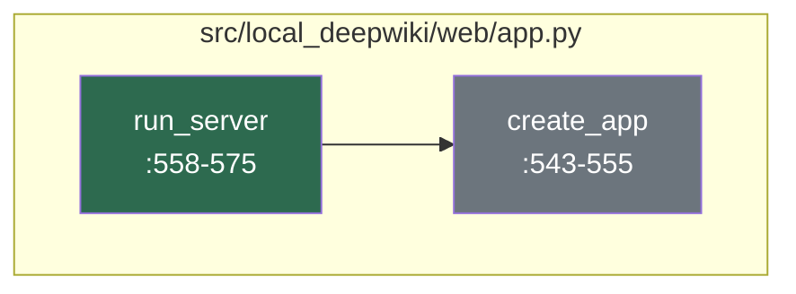

# Developer Onboarding Guide

Welcome to the **local-deepwiki** project — a powerful, local, and private documentation server that enables developers to explore and query their repository documentation using an AI-enhanced Model Context Protocol (MCP) interface. This tool is designed for teams or individuals who want to maintain rich, searchable documentation of their codebase without relying on external services, and it leverages the latest in AI and vector database technologies to provide intelligent search and context-aware responses.

The project is built with Python 3.11+, using Flask as the web framework, and integrates with various AI/ML models such as OpenAI, Anthropic, and Ollama, alongside `sentence-transformers` for embedding generation. It uses `LanceDB` as its vector database for fast, semantic search over documentation, and supports Markdown-based documentation input. This system is particularly useful for developers working in environments where data privacy is paramount and where rich, contextual documentation is essential for code understanding and collaboration.

This guide will walk you through the project's architecture, how it works, how to set it up, and how to contribute effectively. Whether you're a new team member or an external contributor, this document will help you get up and running quickly.

---

## Architecture at a Glance

This diagram illustrates the core architecture of the local-deepwiki system, showing how its main subsystems interact to deliver documentation and MCP services.

```mermaid
%%{init: {"theme": "default"}}%%
    componentDiagram
        component "CLI Layer" as CLI
        component "Web Server" as WebServer
        component "MCP Handler" as MCPHandler
        component "Documentation Processor" as DocProcessor
        component "Vector DB" as VectorDB
        component "LLM Interface" as LLMInterface

        CLI --> WebServer
        WebServer --> MCPHandler
        WebServer --> DocProcessor
        MCPHandler --> DocProcessor
        DocProcessor --> VectorDB
        DocProcessor --> LLMInterface
        LLMInterface --> VectorDB
```

### Subsystem Descriptions

- **[CLI Layer](files/src/local_deepwiki/cli/main.md)**  
  The command-line interface that allows users to initialize, configure, and manage the local documentation server. It includes commands for updating, checking, and profiling the repository.

- **[Web Server](files/src/local_deepwiki/web/app.md)**  
  The Flask-based web server that hosts the API and MCP endpoints, handling HTTP requests and routing them to appropriate handlers.

- **[MCP Handler](files/src/local_deepwiki/server.py)**  
  The core logic for handling Model Context Protocol (MCP) requests, enabling interaction with AI models for documentation queries.

- **[Documentation Processor](files/src/local_deepwiki/config/loader.md)**  
  Responsible for parsing, indexing, and embedding documentation files into the vector database for semantic search.

- **[Vector DB](https://LanceDB.com/)**  
  The vector database (LanceDB) used to store and retrieve embeddings for fast, semantic search over documentation.

- **[LLM Interface](files/src/local_deepwiki/config/models_llm.md)**  
  The abstraction layer that integrates with various LLM providers (OpenAI, Anthropic, Ollama) to process natural language queries and generate responses.

---

## How It Works

### Flow: Core Server Logic

This flow shows how the core server initializes and starts up to process repository documentation and respond to MCP requests.



#### Narrative Walkthrough

1. **[run_server](files/src/local_deepwiki/web/app.md)** at `src/local_deepwiki/web/app.py:567-584`  
   This function is the main entry point for starting the wiki web server. It sets up the Flask application by calling [`create_app`](files/src/local_deepwiki/web/app.md), initializing the server with the configured wiki path and ensuring all necessary components are ready to handle incoming requests.

2. **[create_app](files/src/local_deepwiki/web/app.md)** at `src/local_deepwiki/web/app.py:552-564`  
   This function creates and configures the Flask application instance. It initializes the global `WIKI_PATH` variable and returns the configured Flask app, which is responsible for handling HTTP requests and routing them to the appropriate endpoints.

This flow highlights a clean separation of concerns, where [`run_server`](files/src/local_deepwiki/web/app.md) handles server initialization and [`create_app`](files/src/local_deepwiki/web/app.md) handles Flask application configuration. The use of a factory pattern for [`create_app`](files/src/local_deepwiki/web/app.md) allows for easier testing and configuration management, while the global `WIKI_PATH` ensures that the application maintains state for processing documentation across different request handlers.

---

## Getting Started

### Prerequisites

- Python 3.11 or higher
- pip (Python package manager)
- A local clone of the repository

### Installation

To install and set up the project locally:

1. Clone the repository:
   ```bash
   git clone https://github.com/your-org/local-deepwiki.git
   cd local-deepwiki
   ```

2. Install dependencies:
   ```bash
   pip install -e .
   ```

3. Install pre-commit hooks for linting and formatting:
   ```bash
   pip install pre-commit
   pre-commit install
   ```

### Running the Server

To start the local DeepWiki server:

```bash
local-deepwiki --wiki-path /path/to/your/docs
```

This command will start the Flask web server and make the documentation available via MCP.

---

## Key Concepts

| Concept | What It Means |
|--------|----------------|
| **MCP** | Model Context Protocol, a standardized way for AI models to interact with documentation and codebases |
| **Wiki Path** | The directory where documentation files (Markdown, etc.) are stored and processed |
| **Vector Database** | A database optimized for storing and retrieving vector embeddings for semantic search |
| **LLM Interface** | The abstraction layer that allows integration with various language models like OpenAI, Anthropic, or Ollama |
| **CLI Layer** | The command-line interface for initializing, updating, and managing the documentation server |
| **Documentation Processor** | The module responsible for parsing, embedding, and indexing documentation for search |

---

## Development Workflow

### Running Tests

Tests are located in the `tests` directory and can be run using:

```bash
pytest
```

To run tests with coverage:

```bash
pytest --cov=src
```

### Linting and Formatting

This project uses `pre-commit` hooks for linting and formatting. Ensure you have installed them:

```bash
pre-commit install
```

You can manually run the hooks with:

```bash
pre-commit run --all-files
```

### Common Development Tasks

- Add a new CLI command: Create a new file in `src/local_deepwiki/cli/` and register it in `main.py`
- Extend documentation processing: Modify logic in `src/local_deepwiki/config/loader.py`
- Add new LLM provider support: Update `src/local_deepwiki/config/models_llm.py`
- Improve MCP responses: Edit handlers in `src/local_deepwiki/server.py`

---

## Further Reading

- [Architecture](architecture.md)
- [Dependencies](dependencies.md)
- [Glossary](glossary.md)
- [Changelog](changelog.md)

## Relevant Source Files

The following source files were used to generate this documentation:

- [`src/local_deepwiki/generators/analysis/cohesion.py:40-60`](files/src/local_deepwiki/generators/analysis/cohesion.md)
- [`src/local_deepwiki/logging.py:28-83`](files/src/local_deepwiki/logging.md)
- [`src/local_deepwiki/server.py:98-100`](files/src/local_deepwiki/server.md)
- [`src/local_deepwiki/cli_progress.py:147-199`](files/src/local_deepwiki/cli_progress.md)
- [`src/local_deepwiki/events.py:35-63`](files/src/local_deepwiki/events.md)
- `src/local_deepwiki/__init__.py`
- [`src/local_deepwiki/prompts.py:28-72`](files/src/local_deepwiki/prompts.md)
- [`src/local_deepwiki/error_factories.py:47-83`](files/src/local_deepwiki/error_factories.md)
- [`src/local_deepwiki/errors.py:53-118`](files/src/local_deepwiki/errors.md)
- [`src/local_deepwiki/watcher.py:40-46`](files/src/local_deepwiki/watcher.md)


*Showing 10 of 269 source files.*
